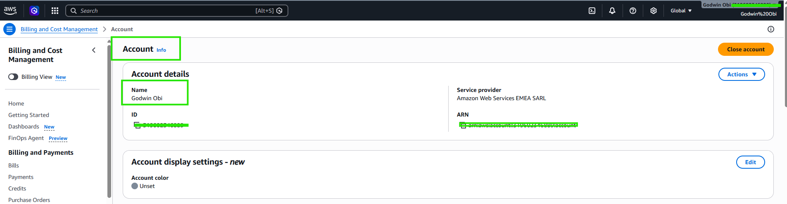

# Assignment 1 — AWS Free Tier Account Setup (EpicReads Cloud Onboarding)

Part of the DevOps Micro Internship (DMI) Cohort 3 with Agentic AI

---

## Purpose

In this assignment, you will create and verify an AWS Free Tier account as part of onboarding EpicReads — an online bookstore moving to the cloud. You will demonstrate an understanding of AWS fundamentals, Free Tier services, and account setup by answering conceptual questions and capturing proof of a working AWS Console login.

---

# Task 1 — Understanding AWS & Free Tier

## Goal

Demonstrate understanding of AWS basics and Free Tier usage by answering the following questions in your own words (3–4 lines each).

### Answers

#### Question 1 — What is an AWS account, and why do you need it at this stage?

An AWS account acts as a secure, isolated container used to create and manage AWS resources and identities. At this onboarding stage for EpicReads, having a dedicated account is critical to establish a structured environment where cloud services can be safely provisioned. It allows us to practice setting up foundational infrastructure, implement naming conventions across different environments, and isolate resources without interfering with production setups.

---

#### Question 2 — What is AWS Free Tier, and how long does it last?

AWS Free Tier is a complimentary offering designed to let new users explore the AWS Management Console and gain hands-on experience without incurring immediate costs. Its duration depends on the specific tier category of the service being used. It is split into Free Trials (short-term caps lasting days or months), 12-Months Free (available for a full year from the exact date of account creation), and Always Free (never expires, provided usage stays within monthly limits).

---

#### Question 3 — Name three AWS Free Tier services and their free usage limits.

Amazon EC2 (12-Month Free): Provides up to 750 hours of usage per month using a t2.micro (or t3.micro depending on region) instance type, allowing a virtual machine to run continuously all month.

Amazon S3 (12-Month Free): Offers up to 5 GB of standard object storage, which is highly effective for hosting static websites or storing assets.

Amazon DynamoDB: Is a fully managed NoSQL database service used to store and query data at scale. It's Free Tier is "Always Free" and never expires, offering 25 GB of storage plus 25 provisioned read and write capacity units per month, enough to handle roughly 200 million requests monthly.

---

# Task 2 — Create AWS Free Tier Account

## Goal

Create a valid AWS Free Tier account and sign in to the AWS Management Console.

> No screenshots required for this task. Completion is verified through Task 3.

---

# Task 3 — Verify AWS Account

## Goal

Confirm that your AWS account setup is complete by navigating to the Account section and capturing proof.

### Evidence

#### Screenshot 1 — AWS Account page showing account name (email may be blurred)

---

# Submission Instructions

- Add all required screenshots in your GitHub repository submission
- Full name must be visible in required screenshots
- Do not expose sensitive information (keys, passwords, account IDs)

---

# Completion Checklist

- [ ] Task 1 answers written in own words
- [ ] AWS Free Tier account created successfully
- [ ] Signed in to AWS Management Console
- [ ] Screenshot of AWS Account page captured (full name visible, no sensitive data)
- [ ] All required screenshots added to repository

---

## 📌 About DMI & CloudAdvisory

DevOps Micro Internship (DMI) is a project-based DevOps program run by Pravin Mishra (The CloudAdvisory) focused on real-world execution, systems thinking, and career readiness.

It helps learners build strong DevOps foundations with hands-on experience.

---

## 📌 Resources

- 🌐 DMI Official Website: https://dmi.pravinmishra.com?utm_source=github&utm_medium=readme  
- 🎓 University: https://university.pravinmishra.com?utm_source=github&utm_medium=readme  
- 💬 Discord Community: https://discord.pravinmishra.com?utm_source=github&utm_medium=readme  
- 📝 Blog: https://dmi.pravinmishra.com/blog?utm_source=github&utm_medium=readme  
- ▶️ YouTube Playlist: https://www.youtube.com/playlist?list=PLFeSNDtI4Cho  
- 🔗 Pravin Mishra (LinkedIn): https://www.linkedin.com/in/pravin-mishra-aws-trainer/  
- 🏢 CloudAdvisory (LinkedIn): https://www.linkedin.com/company/thecloudadvisory/

---

*This submission is part of DevOps Micro Internship (DMI) Cohort 3 — Agentic AI Track.*