# Assignment 3 — Production Maintenance Drill (OPS Checklist)

Part of the DevOps Micro Internship (DMI) Cohort 3 with Agentic AI

---

## Purpose

In this assignment, you will treat your already deployed React application (on Ubuntu VM with Nginx) as a live production system. You will perform structured operational checks covering network validation, service health, log analysis, resource monitoring, configuration verification, and incident simulation with recovery — mirroring real on-call DevOps responsibilities.

---

# Task 1 — Server Access & Networking Validation

## Goal

Verify that the deployed React application is reachable from the browser and confirm basic network connectivity of the Ubuntu VM.

### Evidence

#### Screenshot 1 — Browser showing the React app with your Full Name visible on the UI

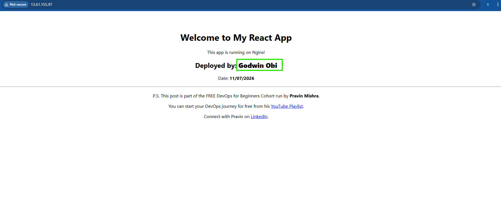

---

#### Screenshot 2 — Output of `ip a`

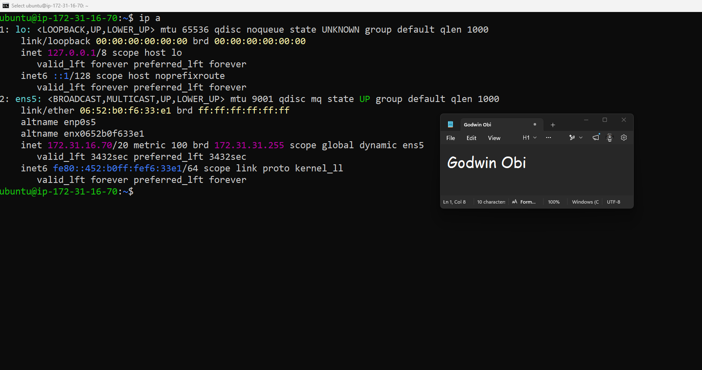

---

#### Screenshot 3 — Output of `sudo ss -tulpen`

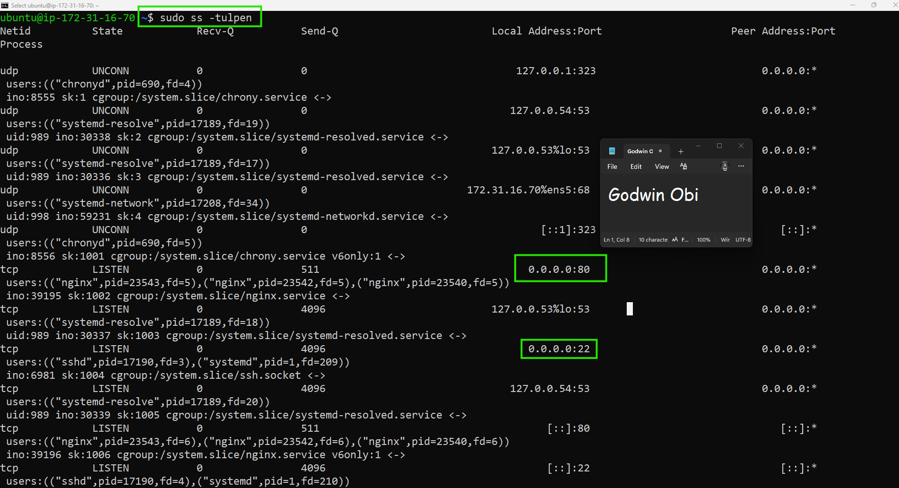

---

#### Screenshot 4 — Output of `sudo ufw status`

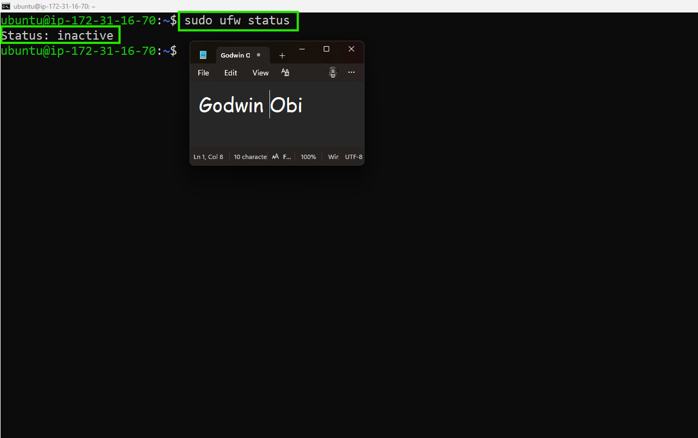

---

### Notes

Answer the following in your own words:

**1. What proves Nginx is listening on 0.0.0.0:80?**

The output explicitly displays a row with a netid of tcp, state of LISTEN, and local address mapping of 0.0.0.0:80 and [::]:80. Directly beneath these rows, the process attributes list users:(("nginx",pid=23543,...)), confirming the Nginx service is successfully bound to all IPv4 and IPv6 network interfaces on port 80.

---

**2. What proves SSH is active on port 22?**

The socket status output displays rows for tcp LISTEN at 0.0.0.0:22 and [::]:22. These lines are explicitly linked to users:(("sshd",pid=17190,...)), which proves that the Secure Shell daemon is running and actively listening for connection handshakes on the standard administration port.

---

**3. Did you find any unexpected open ports? Explain briefly.**

No unexpected or dangerous public-facing ports are open. The scan shows core local Linux utilities running, including systemd-resolved on port 53 (DNS) and chronyd on port 323 (NTP)—however, these are safely restricted to internal loopback addresses (127.0.0.53, 127.0.0.54, and [::1]). Port 68 is also safely handling internal DHCP network assignment via systemd-networkd. Because these system management services are completely isolated from the public interface, the only actual public ports exposed are our authorized web server (80) and management tunnel (22).

---

# Task 2 — Service Health & Systemd Validation (Nginx)

## Goal

Verify that Nginx is properly installed, running, enabled at boot, and safely configured.

### Evidence

#### Screenshot 1 — Output of `systemctl status nginx --no-pager`

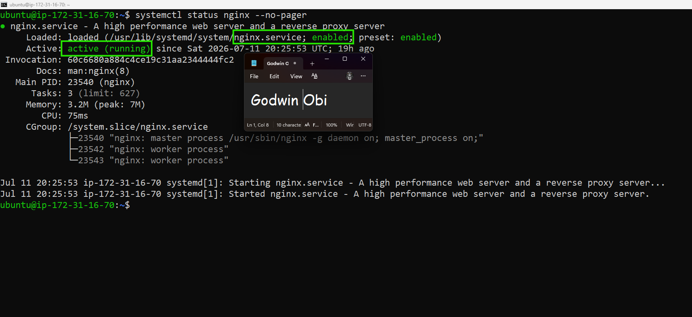

---

#### Screenshot 2 — Output of `sudo nginx -t`

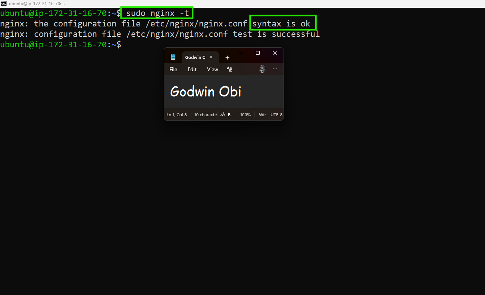

---

#### Screenshot 3 — Output of `sudo ss -lptn '( sport = :80 )'`

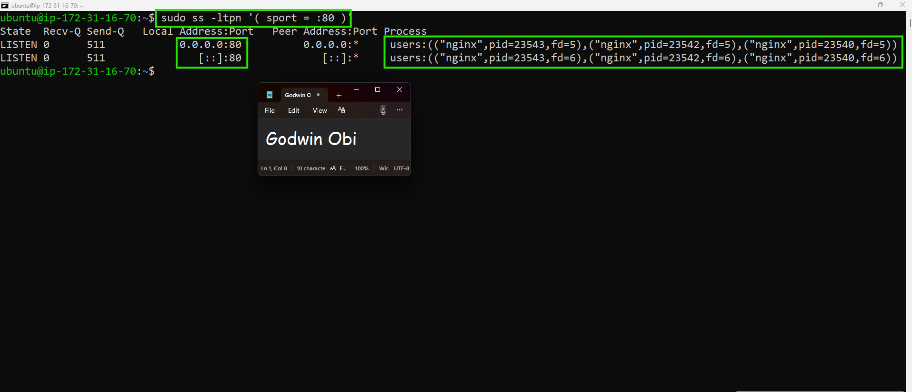

---

### Notes

Answer the following in your own words:

**1. What happens if Nginx fails to restart in production?**

If Nginx fails to restart during a production release or update, the web server process terminates and fails to bind back to the web port. This results in an immediate service outage, causing users to encounter browser errors such as "404 error", "502 Bad Gateway" or "Connection Refused," since nothing is listening to route the requests.

---

**2. What's your basic rollback plan?**

My primary rollback plan involves a quick sequence: running sudo nginx -t to identify configuration syntax mistakes, restoring the previous known-good backup configuration file from our repository history, and executing sudo systemctl restart nginx to bring the web server back to a stable operational state within seconds.

---

# Task 3 — Logs & Request Trace

## Goal

Verify real traffic flow and analyze logs to understand system behavior and errors.

### Evidence

#### Screenshot 1 — Output of `sudo tail -n 30 /var/log/nginx/access.log`

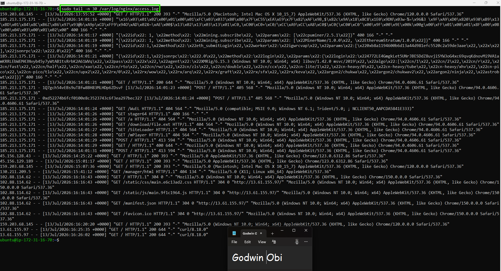

---

#### Screenshot 2 — Output of `sudo tail -n 30 /var/log/nginx/error.log`

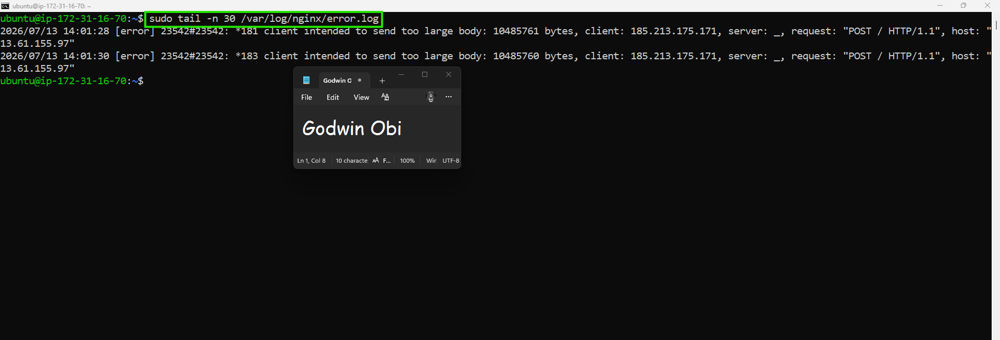

---

#### Screenshot 3 — Output of `sudo journalctl -u nginx --no-pager -n 50`

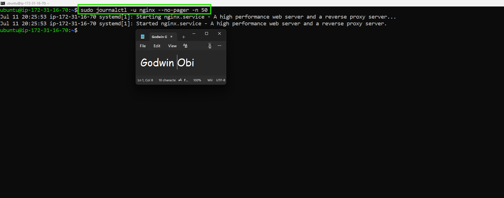

---

### Notes

Answer the following in your own words:

**1. Were there any errors in the logs?**

- If yes, mention 1–2 example error lines from the logs and explain what each one means in simple terms.
- If no, explain what it means if the error log is empty or shows no recent errors during your check.

Yes, the error logs captured explicit failure events.

Example line: 2026/07/13 14:01:28 [error] 23542#23542: *181 client intended to send too large body: 10485761 bytes, client: 185.213.175.171, server: _, request: "POST / HTTP/1.1"

Simple Explanation: This error means an external client attempted to upload a payload or file larger than Nginx's configured maximum allowed body size limit (governed by the client_max_body_size directive, which defaults to 1MB). Nginx automatically blocked the large request and responded with an HTTP 413 Request Entity Too Large error code.

---

**2. If there were no errors, what does that indicate about the system?**

If the error log had been completely empty or showed no recent errors, it would indicate a clean health state for the application infrastructure. Specifically, it proves that file permissions are set correctly (Nginx can read the React static files), all upstream configuration directives are syntactically sound, and the server has sufficient system resources (like disk space and memory) to process incoming traffic without dropping connections or failing behind the scenes.

---

**3. Based on the access logs, were your curl requests visible in the log entries? What does that prove about traffic flow?**

Yes, my curl requests are explicitly logged at the very bottom of the access log stream:
13.61.155.97 - - [13/Jul/2026:16:26:02 +0000] "GET / HTTP/1.1" 200 644 "-" "curl/8.18.0"

This proves that internal and external network connectivity is functioning perfectly. It shows that loopback or public web traffic passes cleanly through our infrastructure layers, reaches the Nginx worker processes successfully, and correctly triggers an immediate 200 OK index response code.

---

# Task 4 — System Resource Health Check (Capacity Red Flags)

## Goal

Assess server capacity and detect potential performance or failure risks.

### Evidence

#### Screenshot 1 — Output of `uptime`

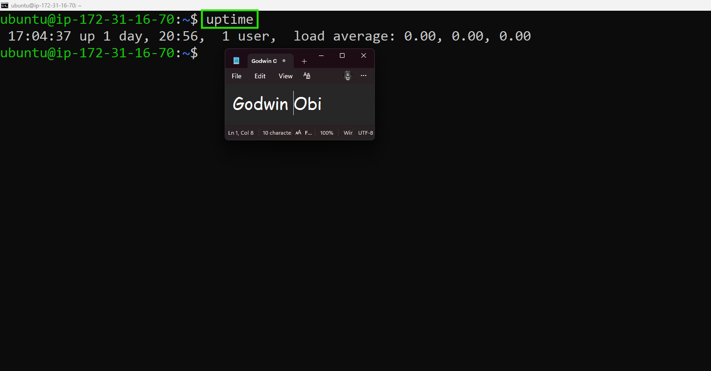

---

#### Screenshot 2 — Output of `free -h`

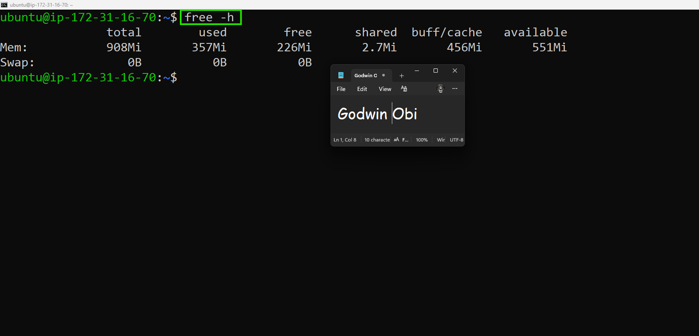

---

#### Screenshot 3 — Output of `df -h`

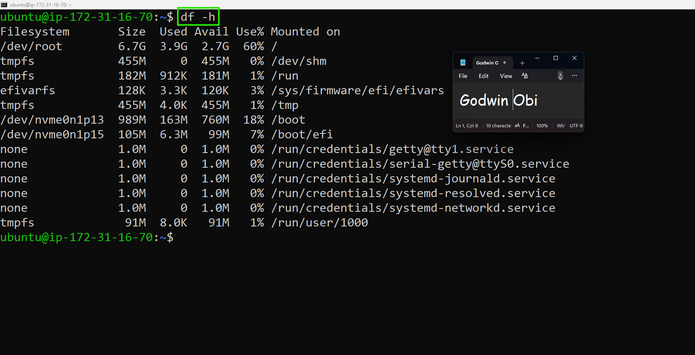

---

#### Screenshot 4 — Output of `sudo du -sh /var/* | sort -h`

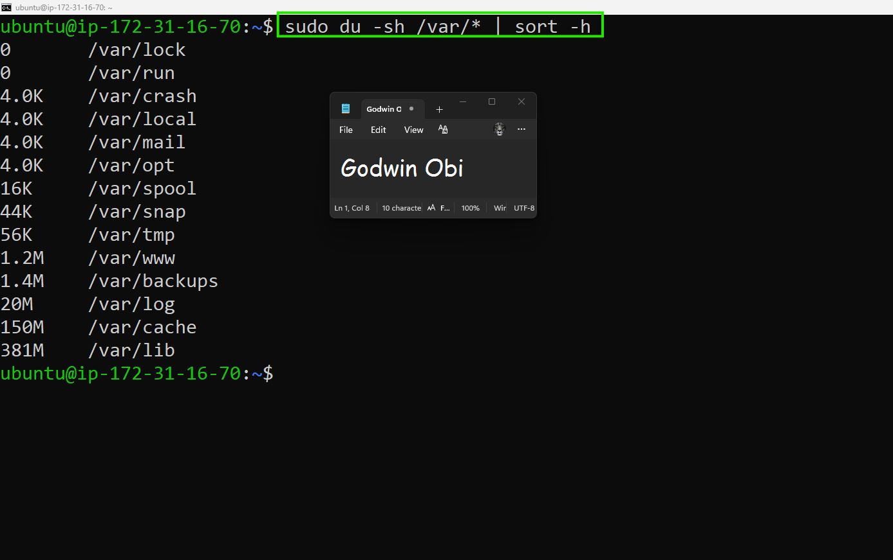

---

### Notes

Answer the following in your own words:

**1. Which resource looks most critical right now? (CPU/load, memory, or disk) Explain why.**

Disk utilization on the root partition (/dev/root) is currently the most critical metric. The df -h output reveals that the root file system has already reached 60% capacity, using 3.9G out of 6.7G total allocated space, leaving only 2.7G available.

By contrast, the system CPU is entirely idle (uptime shows load averages of 0.00, 0.00, 0.00), and system memory is in a completely stable state with 551Mi available out of 908Mi total RAM (free -h). The disk space is filling up primarily due to backend storage footprints inside /var/lib (381M) and /var/cache (150M), as shown by your directory usage breakdown. This space must be carefully monitored to avoid reaching capacity limits on this small cloud footprint.

---

**2. What happens if disk becomes 100% full in a production server?**

When a production server's disk space hits 100% capacity, severe operational degradation occurs immediately:

**Service Failures:** Nginx will fail to write to its access and error streams (/var/log/nginx/), blocking it from handling incoming client connections or buffering proxy requests.

**Process Freezes:** System sub-services (like systemd-resolved or packet managers utilizing /var/cache) will fail to create required lockfiles or temporary files inside /tmp and /var/tmp.

**System Instability:** Critical system logging via journald drops completely, and administrative access via SSH can freeze or fail if terminal sessions cannot create temporary user records or write updates to configuration spaces.

---

# Task 5 — Configuration & Deployment Verification

## Goal

Ensure the correct React build is deployed and Nginx is serving it properly.

### Evidence

#### Screenshot 1 — Output of `ls -lah /var/www/html | head -n 20`

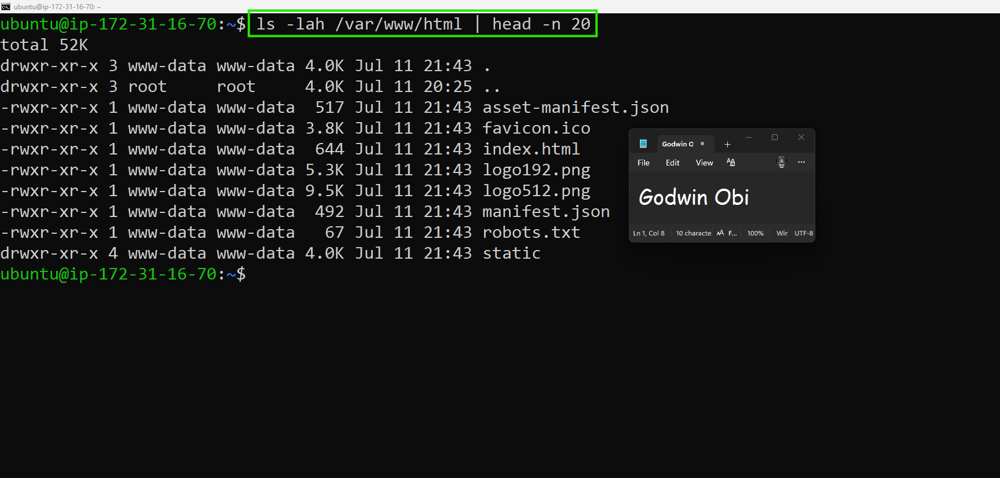

---

#### Screenshot 2 — Output of `grep -R "Deployed by" -n /var/www/html 2>/dev/null | head`

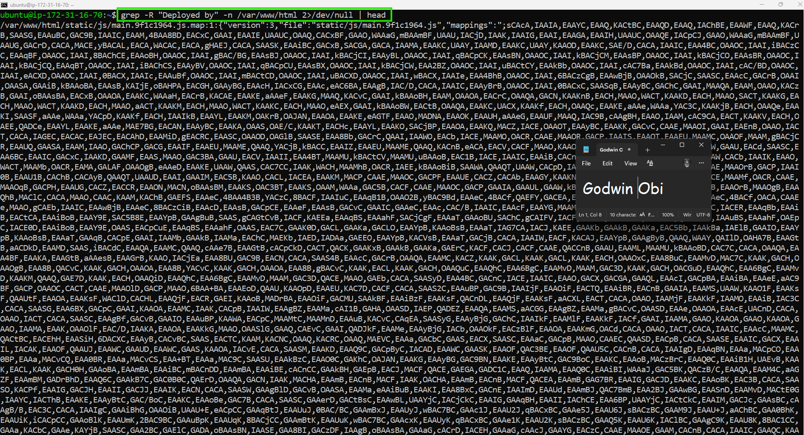

---

#### Screenshot 3 — Output of `grep -n "try_files" /etc/nginx/sites-available/default`

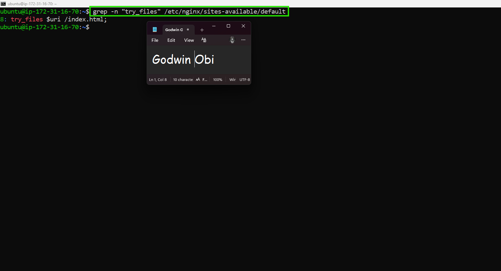

---

### Notes

Answer the following in your own words:

**1. How do you confirm that the correct version of the application is deployed?**

We confirm the validity and correct version of the deployment using three precise verification steps shown in the logs:

**Asset Integrity & Timestamping:** The ls -lah /var/www/html command shows a freshly updated directory structure populated by our React production assets (such as asset-manifest.json, index.html, and the static/ asset folder) with permissions securely assigned to the www-data user.

**Personalization Validation:** Running a recursive string matching scan via grep -R "Deployed by" -n /var/www/html directly locates our embedded UI initialization string inside the compiled JavaScript bundle. This guarantees that our active build contains the specific assignment personalization.

**Single-Page Application (SPA) Routing:** Checking the Nginx site configurations via grep -n "try_files" /etc/nginx/sites-available/default displays line 8 matching try_files $uri /index.html;. This fallback directive explicitly proves Nginx is configured to handle the client-side routing demands of a React application correctly without returning 404 page execution errors on sub-routes.

---

# Task 6 — Nginx Configuration Failure Simulation

## Goal

Simulate a real-world Nginx misconfiguration and recover the service safely.

### Evidence

#### Screenshot 1 — Output of `sudo nginx -t` showing the syntax error (broken config)

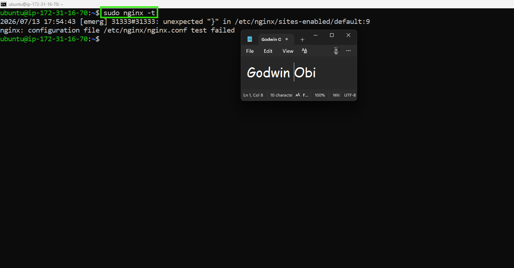

---

#### Screenshot 2 — Output of `sudo nginx -t` showing syntax ok (fixed config)

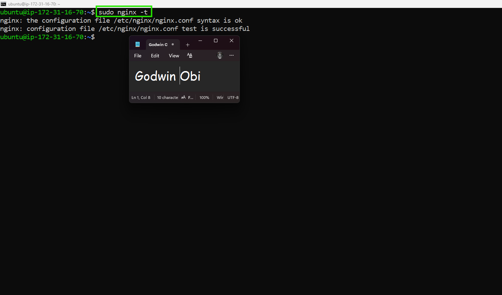

---

#### Screenshot 3 — Output of `curl -I http://<public-ip>` confirming recovery (200 OK)

---

### Notes

Answer the following in your own words:

**1. What caused the configuration failure?**

The failure was caused by removing the required semicolon (;) at the end of the try_files $uri /index.html directive on line 8 of our site configuration file (/etc/nginx/sites-enabled/default).

As seen in the output of sudo nginx -t, this caused Nginx to misinterpret the closing brace on line 9 as part of the statement parameter, throwing an explicit validation error:

[emerg] 31333#31333: unexpected "}" in /etc/nginx/sites-enabled/default:9

---

**2. How did you fix the issue?**

I resolved the issue by editing the /etc/nginx/sites-available/default configuration file, locating line 8, and re-adding the trailing semicolon (;) right after /index.html as outlined in the instructions.

After saving the file, I ran sudo nginx -t to verify that the syntax test successfully passed. Finally, I applied the corrected configuration to the running server using sudo systemctl restart nginx.

---

**3. How can you avoid this kind of issue in real production systems?**

In high-availability production environments, we prevent syntax errors from causing service downtime by using the following best practices:

**Pre-flight Testing Gates:** Always execute sudo nginx -t to validate the configuration file's structure before attempting to reload or restart the service.

**Safe Configuration Reloads:** Apply configuration changes using sudo systemctl reload nginx instead of a hard restart. A reload will seamlessly process configuration changes in memory while gracefully maintaining active client connections—and if the new configuration contains a syntax error, Nginx will safely reject it and continue running on the last-known stable configuration without interrupting service.

**CI/CD Linting and Validation:** Incorporate automated static configuration checking (like nginx -t inside a test container/runner) directly into development pipelines to block bad syntax configurations from reaching production servers.

---

# Task 7 — Web Application Failure Simulation

## Goal

Simulate missing deployment content and recover the application safely.

### Evidence

#### Screenshot 1 — Output of `curl -I http://<public-ip>` showing failure (non-200 response)

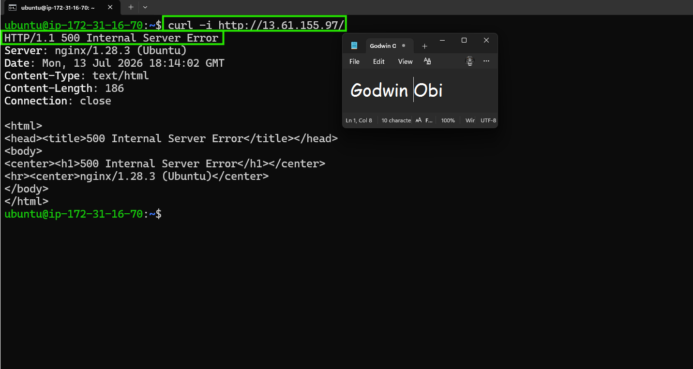

---

#### Screenshot 2 — Output of `curl -I http://<public-ip>` confirming recovery (200 OK)

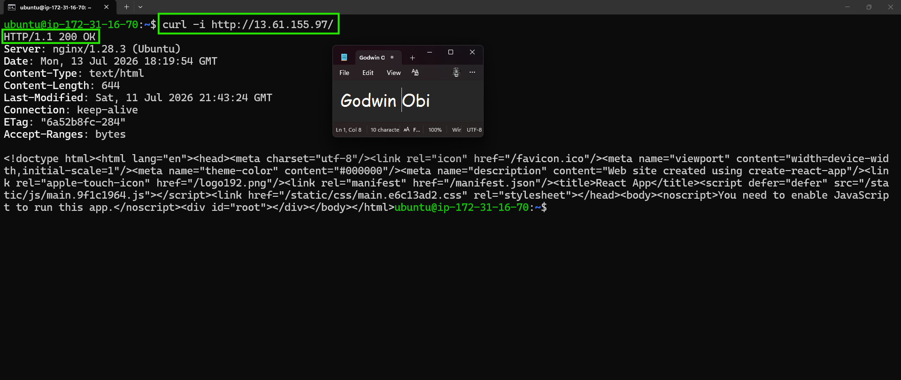

---

### Notes

Answer the following in your own words:

**1. What caused the application to break in this scenario?**

The application broke because we renamed the production asset directory /var/www/html to /var/www/html_backup and replaced it with a completely empty /var/www/html folder.

When a client sent a web request to the server, Nginx attempted to process it using the active routing directive try_files $uri /index.html;. Because the folder was completely empty, Nginx failed to locate the requested URI, fell back to /index.html (which was also missing), and hit an internal redirection loop. Since the fallback target itself did not exist, Nginx aborted the request cycle and returned an HTTP 500 Internal Server Error as captured in the terminal log.

---

**2. How did you fix the issue and restore the application?**

I restored the application by performing the following recovery steps:

1. I removed the empty mock directory using sudo rm -rf /var/www/html.

2. I restored the original compiled production build folder from our backup location using sudo mv /var/www/html_backup /var/www/html.

3. I restarted Nginx using sudo systemctl restart nginx to ensure the process safely picked up the restored file system structure.

---

**3. What steps would you take to prevent this kind of issue in real production systems?**

To protect a live web app from directory or deployment file deletion failures, we should implement these operational safeguards:

**Atomic Deployments via Symbolic Links:** Never modify, delete, or build within the live web root folder directly. Instead, build your React application in isolated, timestamped release folders (e.g., /var/www/releases/build-2026-07-13/) and update a symbolic link pointing from /var/www/html to the active release. This ensures updates and rollbacks are instantaneous (atomic), with zero risk of leaving the server in an empty or broken directory state.

**Strict Permissions and Directory Lockdowns:** Configure POSIX permissions so that only specialized deployment service accounts have write access to /var/www/. This stops developers or unauthorized processes from manually deleting or altering active deployment assets.

**Synthetic Health Monitoring & Alerting:** Configure automated external uptime checkers (like Pingdom, UptimeRobot, or CloudWatch Synthetics) to probe the server endpoint. Set alerts to immediately notify the on-call DevOps engineer if the server returns a 5xx series internal server error, allowing rapid automated or manual rollback.

---

# Task 8 — Security & Reliability Review

## Goal

Review and reflect on the security and reliability practices applied during this assignment.

### Security & Reliability Notes

Answer the following in your own words:

**1. Why is SSH key-based authentication more secure than sharing passwords?**

**Immunity to Brute-Force Attacks:** Passwords especially shared ones are vulnerable to automated dictionary and brute-force attacks. SSH keys rely on asymmetric cryptography (a public/private key pair); the private key is virtually impossible to guess or brute-force due to its massive key length (typically RSA 2048/4096-bit or Ed25519).

**Elimination of "Credential Leakage":** Sharing passwords increases the likelihood of them being written down, sent over unencrypted chat channels, or exposed via shoulder surfing. With SSH key-based authentication, the private key never leaves the client machine.

**Non-Repudiation and Access Control:** Unlike a shared password where it is impossible to identify which individual performed an action, SSH public keys are unique to each developer or administrator. This allows you to track and revoke access for specific individuals instantly without forcing everyone else to change their credentials.

---

**2. Why should only required ports be open on a production server?**

**Minimizing the Attack Surface:** Every open port is a potential gateway for malicious traffic. If a port is open, any software listening on that port (such as an unpatched database or an internal tool) is exposed to the internet. Keeping unused ports closed severely limits what an attacker can target.

**Preventing Unauthorized Reconnaissance:** Attackers use port scanning tools to map out a server's architecture. By locking down all ports except the bare essentials (like port 80/443 for web traffic and restricted port 22 for SSH), you make it much harder for scanners to find vulnerabilities.

**Defense in Depth:** Even if a service is accidentally left running or misconfigured on the server, it remains protected from external exploitation if the firewall blocks its port at the network layer.

---

**3. Why is it important for Nginx to be enabled on boot?**

**High Availability and Self-Healing:** Production servers can reboot unexpectedly due to automated cloud hypervisor maintenance, kernel panics, or power cycles. If Nginx is not enabled on boot, the web application will remain offline after a reboot until an administrator manually logs in to start the service, resulting in costly downtime.

**SLA Compliance:** Enabling Nginx (systemctl enable nginx) ensures that the web server automatically recovers alongside the OS, minimizing the Mean Time to Recovery (MTTR) and keeping system availability high without human intervention.

---

**4. What are the risks of sharing secrets, keys, or credentials publicly?**

**Automated Scrapers and Rapid Exploitation:** Malicious bots constantly crawl public platforms like GitHub, GitLab, and public paste bins looking for exposed API keys, PEM files, and database passwords. Once found, they exploit them within seconds to steal data or deploy crypto-miners.

**Severe Financial and Reputational Damage:** Exposed cloud credentials (like AWS IAM keys) are frequently hijacked to spin up massive, expensive resource clusters for unauthorized compute tasks, resulting in thousands of dollars in unexpected bills and devastating data breaches.

**Compromised System Integrity:** Publicly leaked secrets break the entire security boundary of your infrastructure, giving adversaries root-level access to manipulate code, delete backups, or inject malicious backdoors into your applications.

---

**5. Why should cloud resources be stopped or terminated when they are no longer needed?**

**Cost Optimization:** Cloud providers bill on a pay-as-you-go or per-second/per-hour resource allocation model. Leaving idle virtual machines, unattached storage volumes, or load balancers running when they are not in use directly inflated operational expenses.

**Eliminating "Shadow IT" Security Risks:** Abandoned, unmonitored servers quickly become outdated. Because they do not receive regular security patches or active monitoring, they easily turn into high-priority targets for attackers looking to establish a quiet foothold in your network.

**Resource Hygiene and Clean Architecture:** Systematically terminating unused infrastructure keeps your cloud account clean and prevents your team from hitting strict account resource limits (quotas) when deploying new projects.

---

# LinkedIn Post (Required)

## Evidence

#### LinkedIn Post URL

Paste your LinkedIn post URL here:

`https://www.linkedin.com/posts/godwin-obi-008a12177_devops-sre-nginx-activity-7482516236061347841-jmFh?utm_source=share&utm_medium=member_desktop&rcm=ACoAACn5hogBVyHnSR92cyBf5EzFBZEMSepEVPM`

---

#### Screenshot — Published LinkedIn post

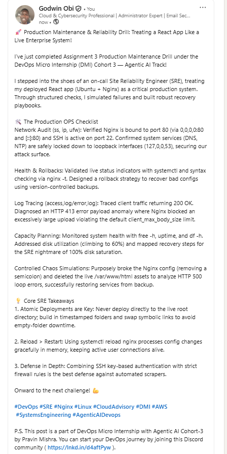

---

# Submission Instructions

- Add all required screenshots in your submission
- Full name must be visible in required screenshots
- Do not expose sensitive information (keys, passwords, account IDs)

---

# Completion Checklist

- [ ] Task 1: Screenshots (browser, ip a, ss -tulpen, ufw status) + Notes answered
- [ ] Task 2: Screenshots (nginx status, nginx -t, ss port 80) + Notes answered
- [ ] Task 3: Screenshots (access log, error log, journalctl) + Notes answered
- [ ] Task 4: Screenshots (uptime, free -h, df -h, du -sh) + Notes answered
- [ ] Task 5: Screenshots (ls html, grep deployed by, grep try_files) + Notes answered
- [ ] Task 6: Screenshots (nginx -t fail, nginx -t pass, curl recovery) + Notes answered
- [ ] Task 7: Screenshots (curl failure, curl recovery) + Notes answered
- [ ] Task 8: Security & Reliability Notes answered
- [ ] LinkedIn post published and URL submitted
- [ ] Full Name visible in all required screenshots
- [ ] No sensitive data exposed

---

## 📌 About DMI & CloudAdvisory

DevOps Micro Internship (DMI) is a project-based DevOps program run by Pravin Mishra (The CloudAdvisory) focused on real-world execution, systems thinking, and career readiness.

It helps learners build strong DevOps foundations with hands-on experience.

---

## 📌 Resources

- 🌐 DMI Official Website: https://dmi.pravinmishra.com?utm_source=github&utm_medium=readme  
- 🎓 University: https://university.pravinmishra.com?utm_source=github&utm_medium=readme  
- 💬 Discord Community: https://discord.pravinmishra.com?utm_source=github&utm_medium=readme  
- 📝 Blog: https://dmi.pravinmishra.com/blog?utm_source=github&utm_medium=readme  
- ▶️ YouTube Playlist: https://www.youtube.com/playlist?list=PLFeSNDtI4Cho  
- 🔗 Pravin Mishra (LinkedIn): https://www.linkedin.com/in/pravin-mishra-aws-trainer/  
- 🏢 CloudAdvisory (LinkedIn): https://www.linkedin.com/company/thecloudadvisory/

---

*This submission is part of DevOps Micro Internship (DMI) Cohort 3 — Agentic AI Track.*