# Assignment 5 — Bash Script Automation Drill (OPS Checklist)

Part of the DevOps Micro Internship (DMI) Cohort 3 with Agentic AI

---

## Purpose

In this assignment, you will practice Bash scripting by building a series of small automation scripts covering environment setup, variables, arrays, loops, file conditionals, if-else logic, and functions. These scripts form the foundation of real-world Linux automation used in DevOps, cloud, and production support environments.

---

# Task 1 — Bash Environment & Workspace Setup

## Goal

Verify that Bash is available on your system and create a clean workspace for this assignment.

### Evidence

#### Screenshot 1 — Output of `echo $SHELL` and `bash --version`

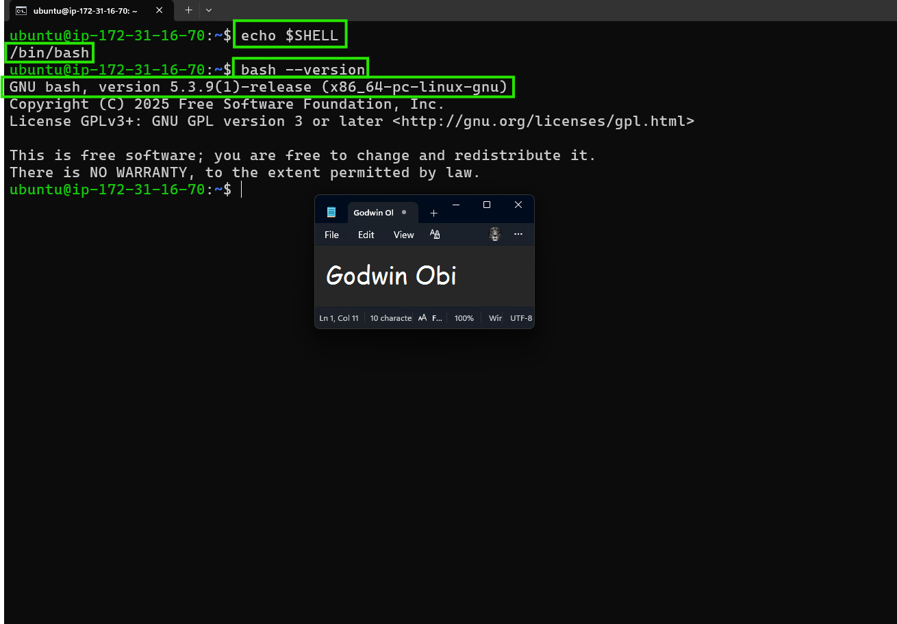

---

#### Screenshot 2 — Output of `pwd` and `ls -lah` showing the scripts directory

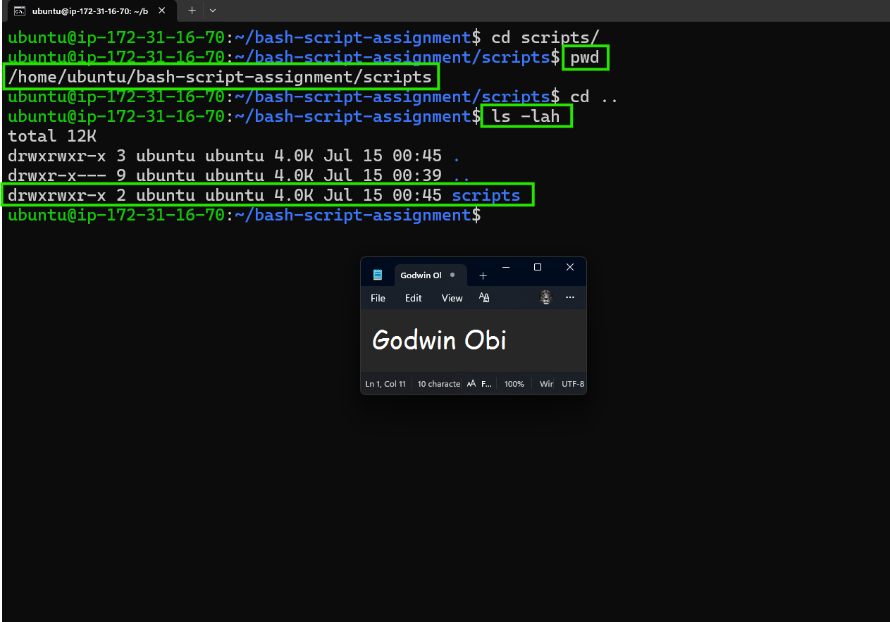

---

### Notes

Answer the following in your own words:

**1. What is Bash?**

Bash (Bourne Again SHell) is a command-line interpreter and scripting language widely used in Unix/Linux operating systems. It acts as a direct interface between the user and the operating system kernel, allowing us to execute commands, automate repetitive system tasks, and manage files and processes.

---

**2. What is the difference between shell and Bash?**

**Shell:** A general term for any command-line interface program that accepts keyboard commands and passes them to the operating system (e.g., Sh, Bash, Zsh, Fish).

**Bash:** A specific, highly popular implementation of a shell. It is an enhanced, backward-compatible evolution of the original Bourne shell (sh).

---

**3. Why is it important to confirm the Bash version before writing scripts?**

Different versions of Bash introduce new features and syntactic improvements (for example, associative arrays require Bash 4.0+). Confirming your Bash version ensures that the syntax and features you use in your script are fully supported by the target host environment, avoiding unexpected runtime errors during automation.

---

# Task 2 — Your First Bash Script

## Goal

Create your first Bash script, make it executable, and run it from the terminal.

### Evidence

#### Screenshot 1 — Content of `first-script.sh`

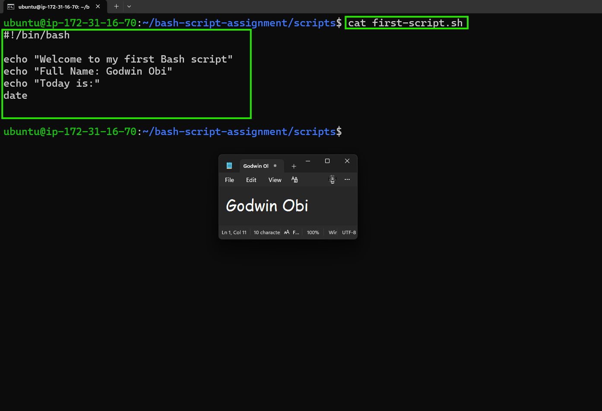

---

#### Screenshot 2 — Output of `./first-script.sh`

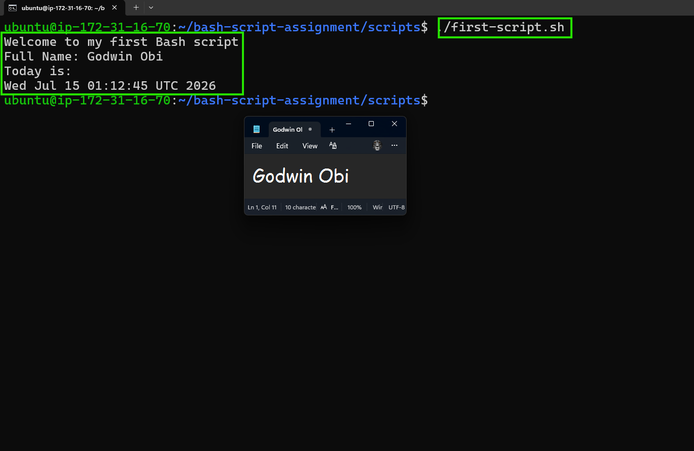

---

#### Screenshot 3 — Output of `ls -l first-script.sh` showing executable permission

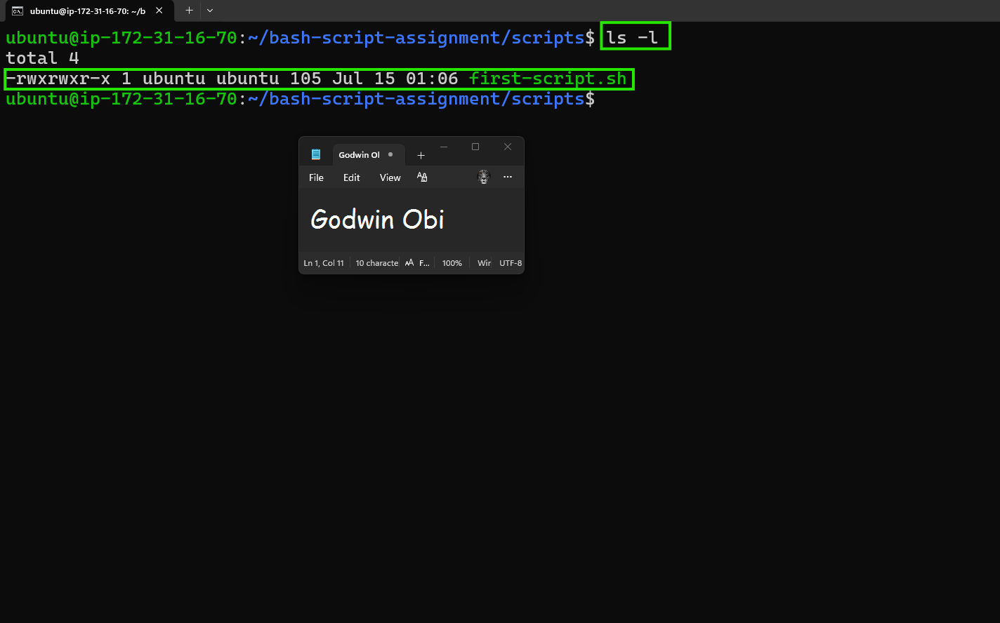

---

### Notes

Answer the following in your own words:

**1. What is the purpose of `#!/bin/bash`?**

Known as the shebang, this absolute path tells the operating system's loader which interpreter should be used to parse and execute the rest of the script. In this case, it explicitly designates the system's Bash shell.

---

**2. Why do we use `chmod +x` before running a script?**

By default, newly created files do not have execution permissions for security reasons. Running chmod +x changes the file's metadata, adding the executable flag (x) so the OS knows it is safe and allowed to run this file as a program.

---

**3. What is the difference between running a script using `./script.sh` and `bash script.sh`?**

**./script.sh:** Executes the script as a standalone executable. The OS reads the shebang line to figure out which shell to use. It requires the file to have execute (+x) permissions.

**bash script.sh:** Manually invokes the Bash interpreter and passes the script file as an argument. This bypasses the shebang line and works even if the script does not have executable permissions.

---

# Task 3 — Variables: User Information Script

## Goal

Use variables to store and display user-related information.

### Evidence

#### Screenshot 1 — Content of `user-info.sh`

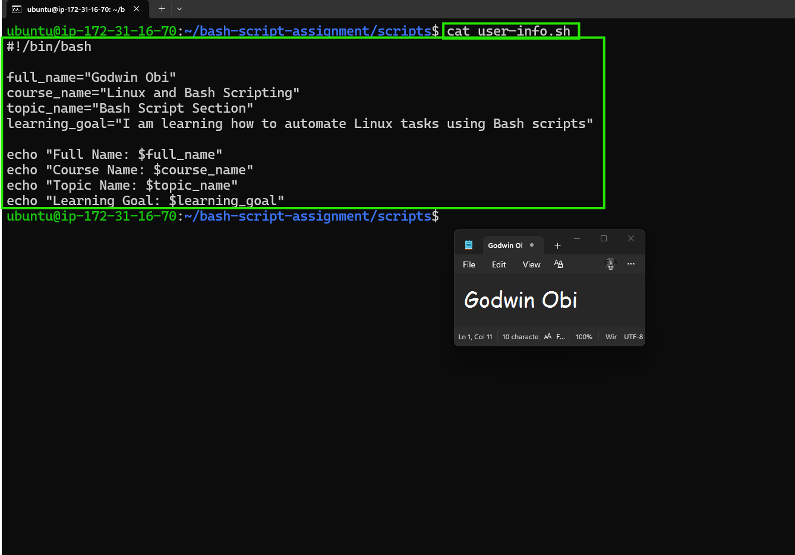

---

#### Screenshot 2 — Output of `./user-info.sh`

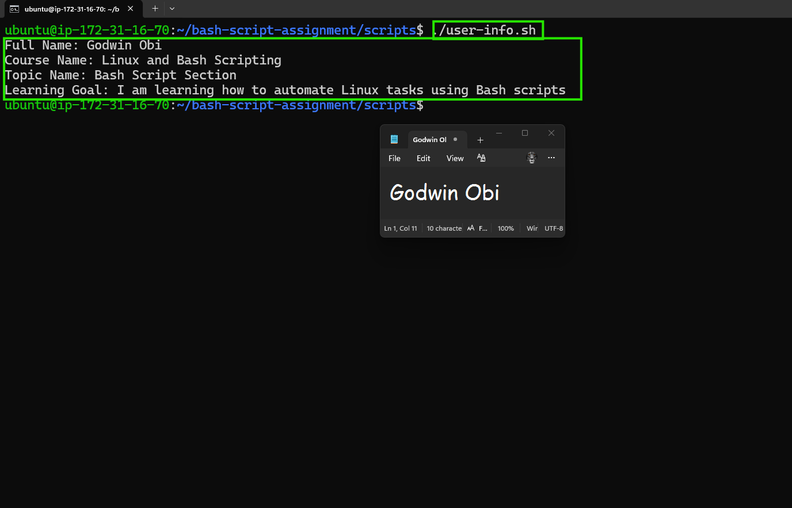

---

### Notes

Answer the following in your own words:

**1. What is a variable in Bash?**

A variable is a named storage location in memory used to hold temporary data (such as strings, integers, or command outputs) that can be referenced, modified, and reused throughout the execution of a script.

---

**2. Why should we avoid spaces around the `=` sign when creating variables?**

Bash relies on spaces to separate commands, options, and arguments. If you write name = "Godwin", Bash interprets name as an executable command, and = and "Godwin" as arguments to that command, resulting in a "command not found" syntax error.

---

**3. How do you access the value stored inside a Bash variable?**

You access a variables value by prefixing its name with a dollar sign ($), such as "$name" or, preferably, "${name}" with curly braces to protect the variable boundaries when embedded in other strings.

---

# Task 4 — Arrays & Loops: Tools Checklist Script

## Goal

Use arrays and loops to print a checklist of tools used in Bash scripting.

### Evidence

#### Screenshot 1 — Content of `tools-checklist.sh`

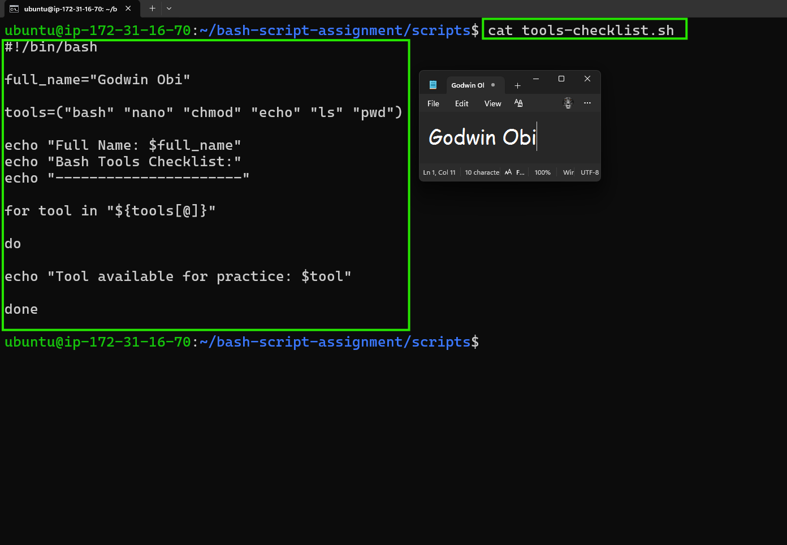

---

#### Screenshot 2 — Output of `./tools-checklist.sh`

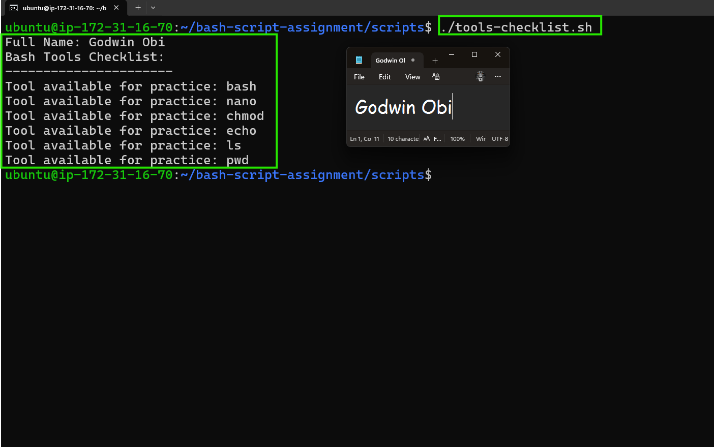

---

### Notes

Answer the following in your own words:

**1. What is an array in Bash?**

An array is a data structure that allows you to store multiple values (elements) under a single variable name. Each item in the array is indexed, starting from index 0.

---

**2. Why are arrays useful in scripts?**

They allow us to group related data sets such as server hostnames, package lists, file names, or tools together. Instead of writing separate blocks of code for each variable, we can easily loop through the entire group dynamically.

---

**3. What does `"${tools[@]}"` mean?**

**tools:** The name of our array.

**[@]:** This index wild card expands to select all elements in the array.

**Double Quotes "":** Ensure that elements containing spaces are evaluated safely as single, individual items during expansion, preventing word splitting.

---

**4. What is the purpose of the `for` loop in this script?**

The for loop automates repetition. It iterates over the expanded array element by element, temporarily assigning the active value to a loop variable so we can consistently print or process each item in sequence.

---

# Task 5 — Loops: Number Counter Script

## Goal

Use loops to repeat a task multiple times.

### Evidence

#### Screenshot 1 — Content of `counter.sh`

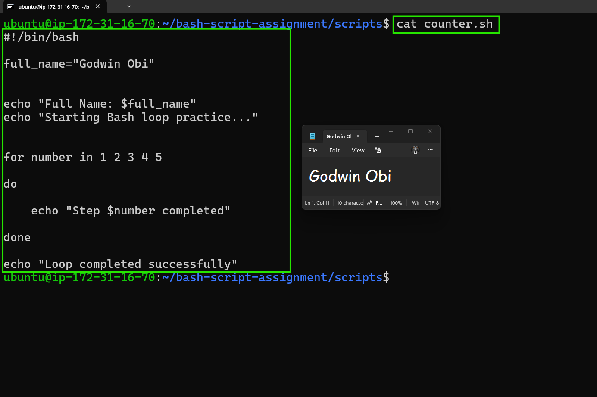

---

#### Screenshot 2 — Output of `./counter.sh`

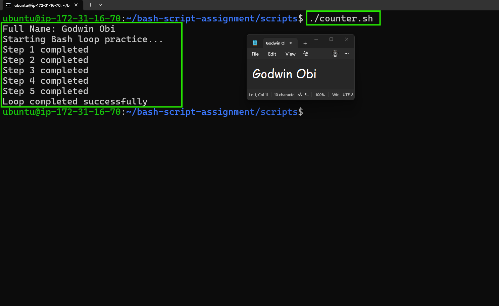

---

### Notes

Answer the following in your own words:

**1. What is a loop?**

A loop is a fundamental programming control flow structure that repeatedly executes a block of code or commands as long as a specified condition is met, or until a defined sequence runs out.

---

**2. Why do we use loops in Bash scripting?**

They are essential for eliminating manual repetition. Loops allow us to process repetitive actions like checking dozens of server ports, reading file lines, or generating backup logs using just a few clean, automated lines of code.

---

**3. How many times did the loop run in your script?**

The loop ran exactly 5 times (counting sequentially from 1 up to 5)

---

**4. What would you change if you wanted the loop to run 10 times?**

I would change the range boundary inside the loop expression from "for number in 1 2 3 4 5" to "for number in 1 2 3 4 5 6 7 8 9 10"

---

# Task 6 — Files & Conditionals: File Validation Script

## Goal

Use file checks and conditionals to verify whether files and directories exist.

### Evidence

#### Screenshot 1 — Output of `ls -lah ../test-folder`

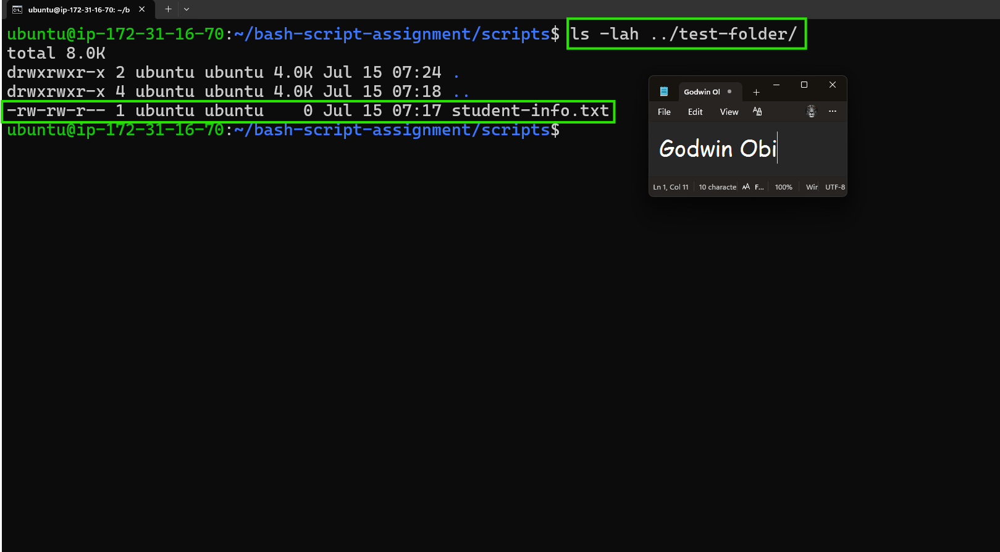

---

#### Screenshot 2 — Content of `file-check.sh`

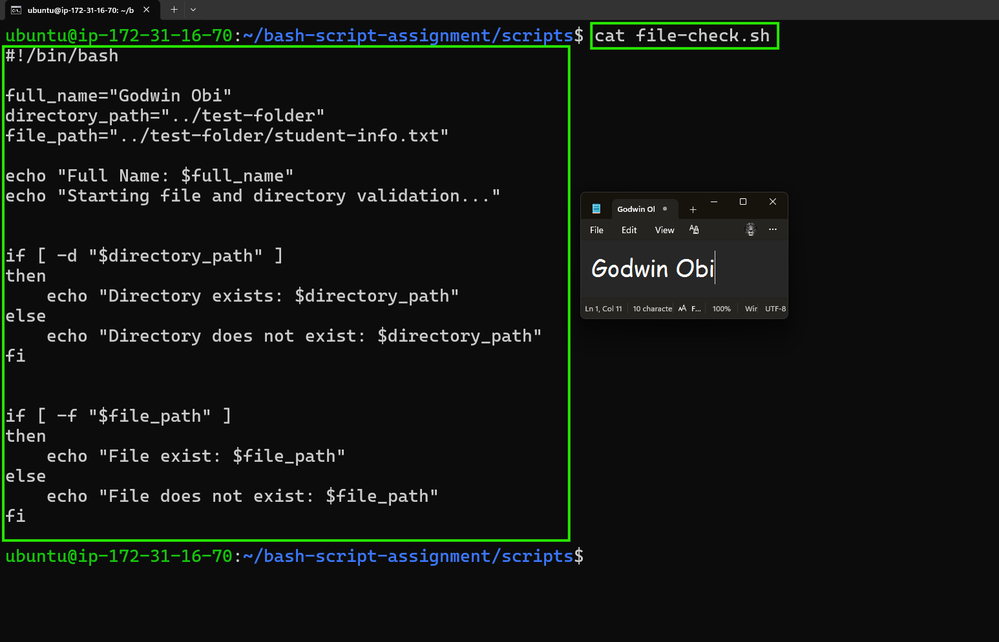

---

#### Screenshot 3 — Output of `./file-check.sh`

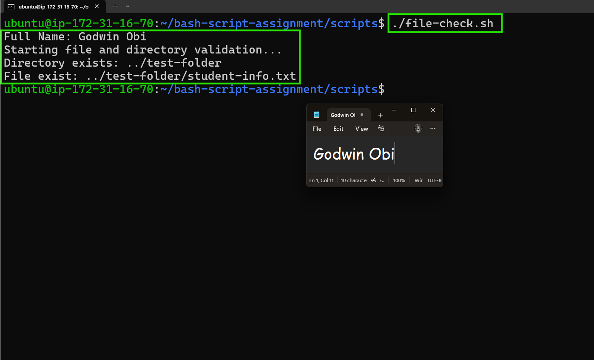

---

### Notes

Answer the following in your own words:

**1. What does `-d` check in Bash?**

The -d operator checks if a specified path exists and evaluates whether it is specifically a directory.

---

**2. What does `-f` check in Bash?**

The -f operator checks if a specified path exists and evaluates whether it is specifically a regular file (rather than a directory, socket, or device file).

---

**3. Why should file and directory paths be stored in variables?**

Storing paths in variables keeps the script dry (DRY - Don't Repeat Yourself), highly readable, and easy to maintain. If a file directory changes in production, you only need to update the path once at the top of your script instead of scouring every file interaction block.

---

**4. What happens if the file does not exist?**

The conditional evaluates to false. The script bypasses the if block, skips any operations targeting that file, and executes the fallback path specified in the else block (which usually logs a warning or gracefully handles the missing dependency).

---

# Task 7 — Conditionals: Pass or Retry Script

## Goal

Use if-else conditionals to make decisions based on a variable value.

### Evidence

#### Screenshot 1 — Content of `score-check.sh` with `score=85`

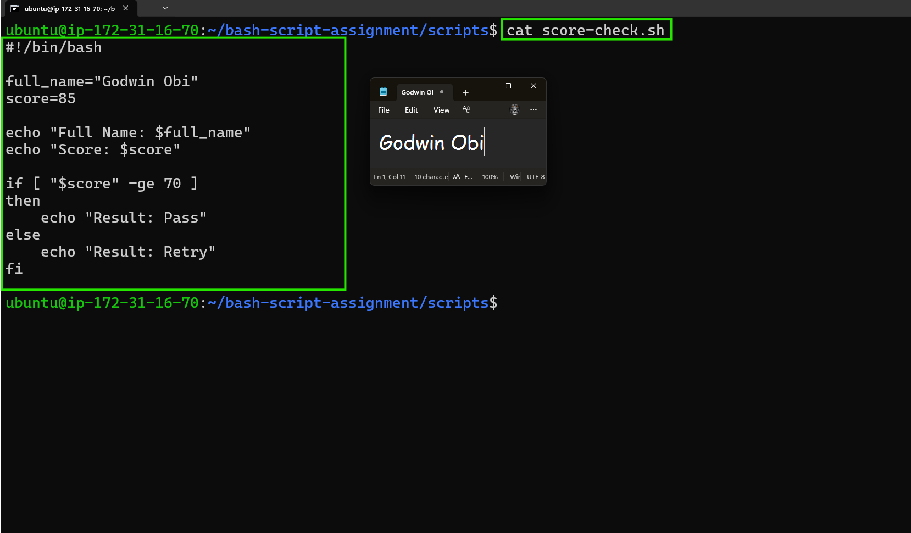

---

#### Screenshot 2 — Output showing `Result: Pass`

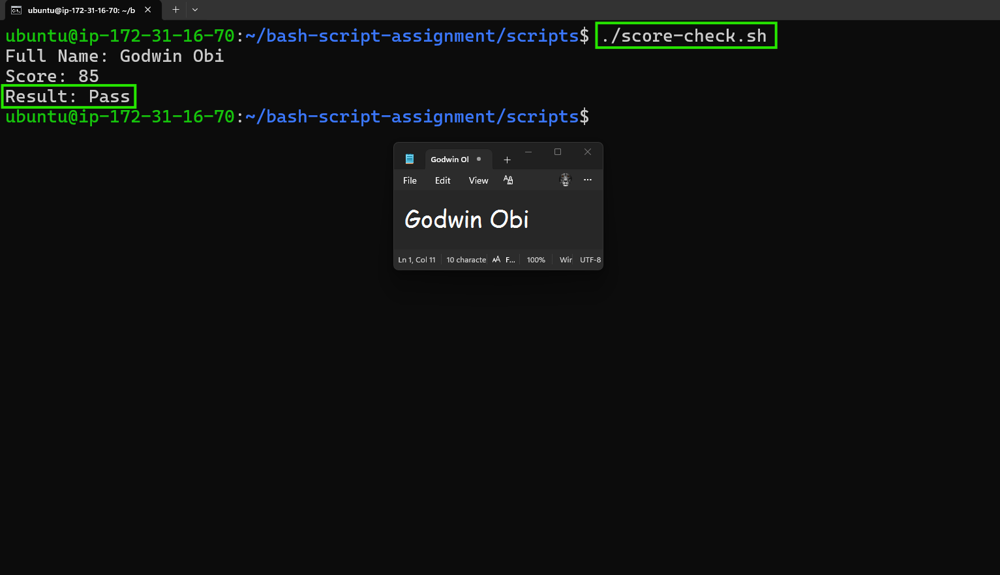

---

#### Screenshot 3 — Content of `score-check.sh` with `score=55`

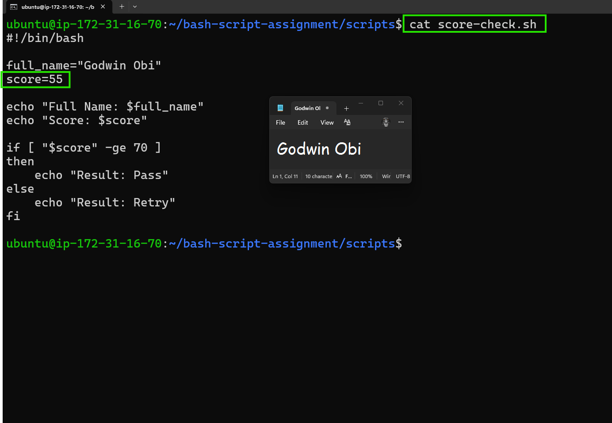

---

#### Screenshot 4 — Output showing `Result: Retry`

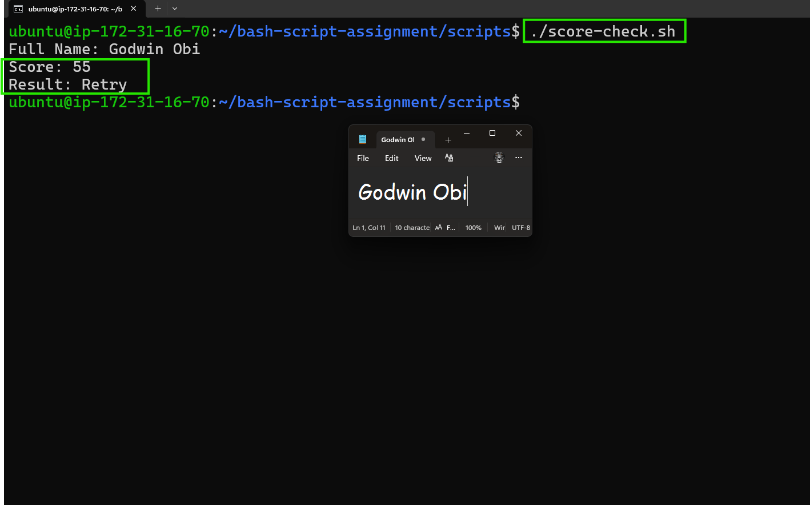

---

### Notes

Answer the following in your own words:

**1. What is the purpose of if-else in Bash?**

An if-else block implements decision-making logic. It evaluates a conditional expression (like checking a system status code or a score value) and branches script execution running one block of code if the statement is true, and a different block if it is false.

---

**2. What does `-ge` mean?**

It stands for Greater than or Equal to (>=). It is used exclusively for comparing integers in Bash.

---

**3. Why should conditions be tested with different values?**

Testing with different inputs (like boundary numbers, high values, and low values) is a form of unit testing. It ensures that your script correctly handles all logic paths and that the branching code acts exactly as expected under both passing and failing thresholds.

---

**4. How can conditionals help in automation scripts?**

They add intelligent error-handling and adaptive behavior to systems. For instance, you can use conditionals to verify if a service is down before restarting it, check if disk usage exceeds 90% before purging logs, or confirm an installer succeeded before moving to the next configuration step.

---

# Task 8 — Functions: Final Bash Automation Script

## Goal

Create a final Bash script using functions to organize reusable code.

### Evidence

#### Screenshot 1 — Content of `final-automation.sh`

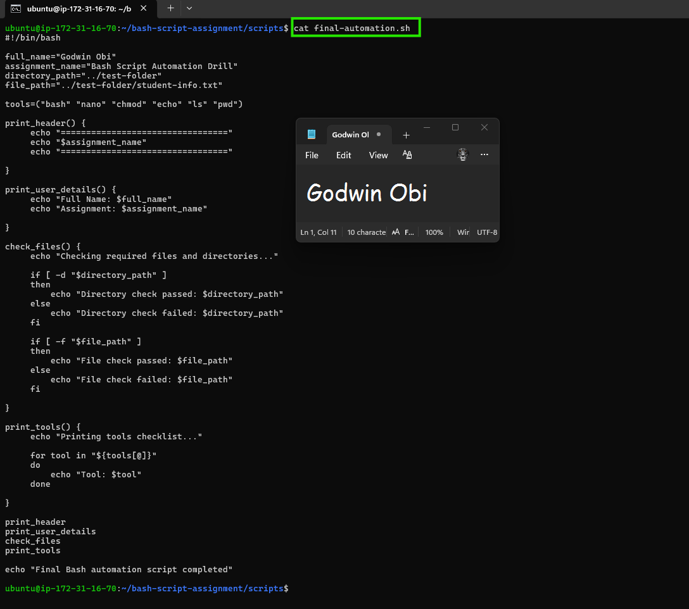

---

#### Screenshot 2 — Output of `./final-automation.sh`

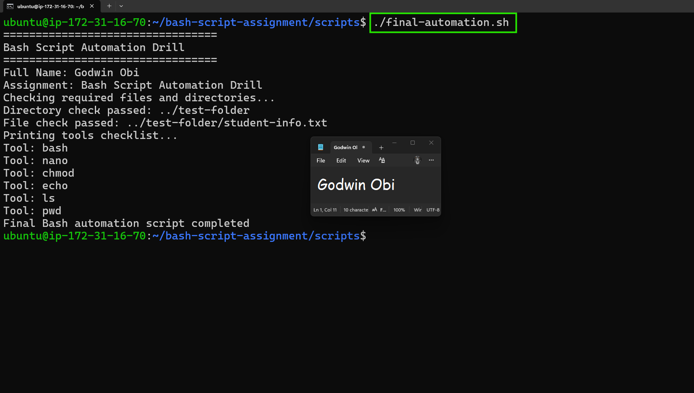

---

#### Screenshot 3 — Output of `ls -lah` showing all created scripts

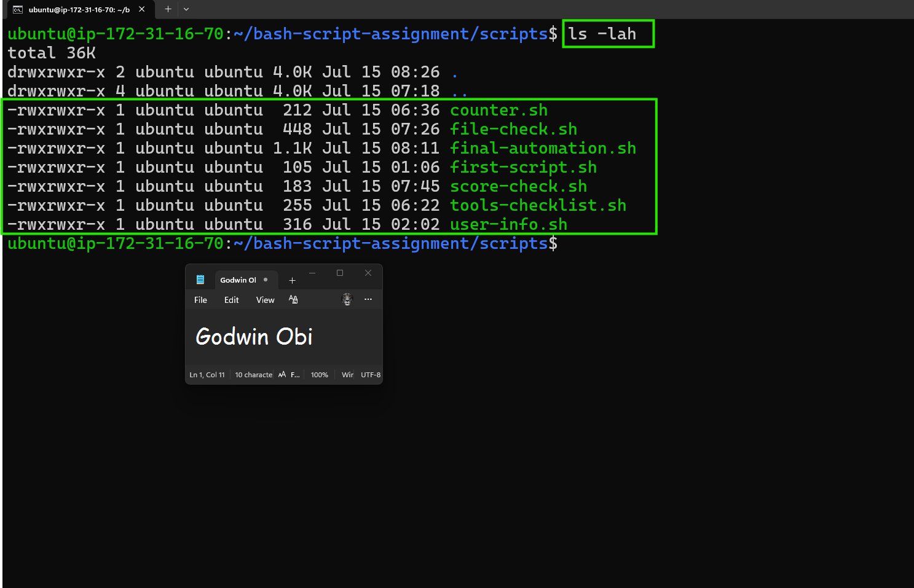

---

### Notes

Answer the following in your own words:

**1. What is a function in Bash?**

A function is a self-contained block of code designed to perform a specific task. Once defined, it can be called and executed by its name from anywhere else within the script.

---

**2. Why are functions useful in scripts?**

**Reusability:** Write once, run many times—eliminating duplicate code blocks.

**Readability:** Breaks down massive scripts into smaller, highly understandable, and named steps.

**Maintainability:** Makes bugs easy to isolate and repair in one localized block of code without risking the rest of the script.

---

**3. Which functions did you create in this script?**

I created four custom functions:

**print_header():** Outputs a clean, styled visual banner containing the assignment title.

**print_user_details():** Displays personal details including my full name and the assignment name.

**check_files():** Validates whether the designated directory (../test-folder) and file (../test-folder/student-info.txt) exist on the system.

**print_tools():** Iterates through the tools array and prints out each system utility on a new line.

---

**4. How does this final script combine variables, arrays, loops, conditionals, files, and functions?**

This script acts as a cohesive orchestrator of all the core scripting concepts learned throughout the drills:

**Variables:** Stores metadata like my full_name, assignment_name, and the target system paths so they can be easily referenced.

**Arrays:** Collects the command-line utilities into a single list variable called tools.

**Loops:** Uses a for loop inside print_tools() to dynamically iterate through the elements in the ${tools[@]} array.

**Conditionals & File Checks:** Leverages if-else blocks combined with file test operators (-d and -f) inside check_files() to check directory and file existence.

**Functions:** Wraps all these individual operations into distinct, reusable modules and executes them sequentially to output a structured, automated system checklist.

---

# LinkedIn Post (Required)

## Evidence

#### LinkedIn Post URL

Paste your LinkedIn post URL here:

<<<<<<< HEAD
`https://www.linkedin.com/posts/godwin-obi-008a12177_devops-linux-bashscripting-activity-7483088084256047104-gbND?utm_source=share&utm_medium=member_desktop&rcm=ACoAACn5hogBVyHnSR92cyBf5EzFBZEMSepEVPM`
=======
`Add your URL here`
>>>>>>> upstream/main

---

#### Screenshot — Published LinkedIn post

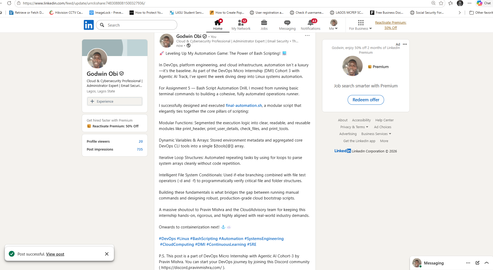

---

# Submission Instructions

- Add all required screenshots in your submission
- Full name must be visible in required screenshots
- All script files must be created and run successfully
- Required notes must be answered clearly for every task
- Do not expose sensitive information (keys, passwords, credentials)

---

# Completion Checklist

- [ ] Task 1: Environment setup verified, workspace created (Screenshots 1–2, Notes answered)
- [ ] Task 2: First script created, executed, permissions verified (Screenshots 1–3, Notes answered)
- [ ] Task 3: Variables script created and run (Screenshots 1–2, Notes answered)
- [ ] Task 4: Arrays and loops script created and run (Screenshots 1–2, Notes answered)
- [ ] Task 5: Counter loop script created and run (Screenshots 1–2, Notes answered)
- [ ] Task 6: File validation script created and run (Screenshots 1–3, Notes answered)
- [ ] Task 7: Pass/Retry conditional script tested with both values (Screenshots 1–4, Notes answered)
- [ ] Task 8: Final automation script created and run (Screenshots 1–3, Notes answered)
- [ ] All scripts run without errors
- [ ] Full Name visible in all required screenshots
- [ ] LinkedIn post published and URL submitted
- [ ] No sensitive data exposed

---

## 📌 About DMI & CloudAdvisory

DevOps Micro Internship (DMI) is a project-based DevOps program run by Pravin Mishra (The CloudAdvisory) focused on real-world execution, systems thinking, and career readiness.

It helps learners build strong DevOps foundations with hands-on experience.

---

## 📌 Resources

- 🌐 DMI Official Website: https://pravinmishra.com/dmi  
- 🎓 DevOps for Beginners (Udemy): https://www.udemy.com/course/devops-for-beginners-docker-k8s-cloud-cicd-4-projects/  
- 🎓 Agentic AI DevOps with Claude Code: https://www.udemy.com/course/ultimate-agentic-ai-devops-with-claude-code/  
- 🎓 DevOps with Claude Code: Terraform, EKS, ArgoCD & Helm: https://www.udemy.com/course/devops-with-claude-code-terraform-eks-argocd-helm/  
- ▶️ YouTube Playlist: https://www.youtube.com/playlist?list=PLFeSNDtI4Cho  
- 🔗 Pravin Mishra (LinkedIn): https://www.linkedin.com/in/pravin-mishra-aws-trainer/  
- 🏢 CloudAdvisory (LinkedIn): https://www.linkedin.com/company/thecloudadvisory/

---

*This submission is part of DevOps Micro Internship (DMI) Cohort 3 — Agentic AI Track.*