# Assignment 6 — Build an AI-Assisted Linux Health Check (AI-Assisted Linux Incident Triage)

Part of the DevOps Micro Internship (DMI) Cohort 3 with Agentic AI

---

## Purpose

In this assignment, you will build a read-only Bash triage script that checks the health of your Ubuntu server and Nginx application, connect it to Claude Code as a reusable `/linux-triage` skill, simulate a controlled Nginx incident, use the skill to gather and analyze evidence, recover the service manually, and verify recovery. The workflow follows the Agentic Loop: Gather → Analyze → Human Act → Verify.

---

# Task 1 — Confirm the Healthy Baseline and Create the Workspace

## Goal

Confirm that Nginx and the React application are healthy before building the automation.

### Evidence

#### Screenshot 1 — Output of `systemctl is-active nginx`, `ss -ltn | grep ':80'`, and `curl -I http://localhost`

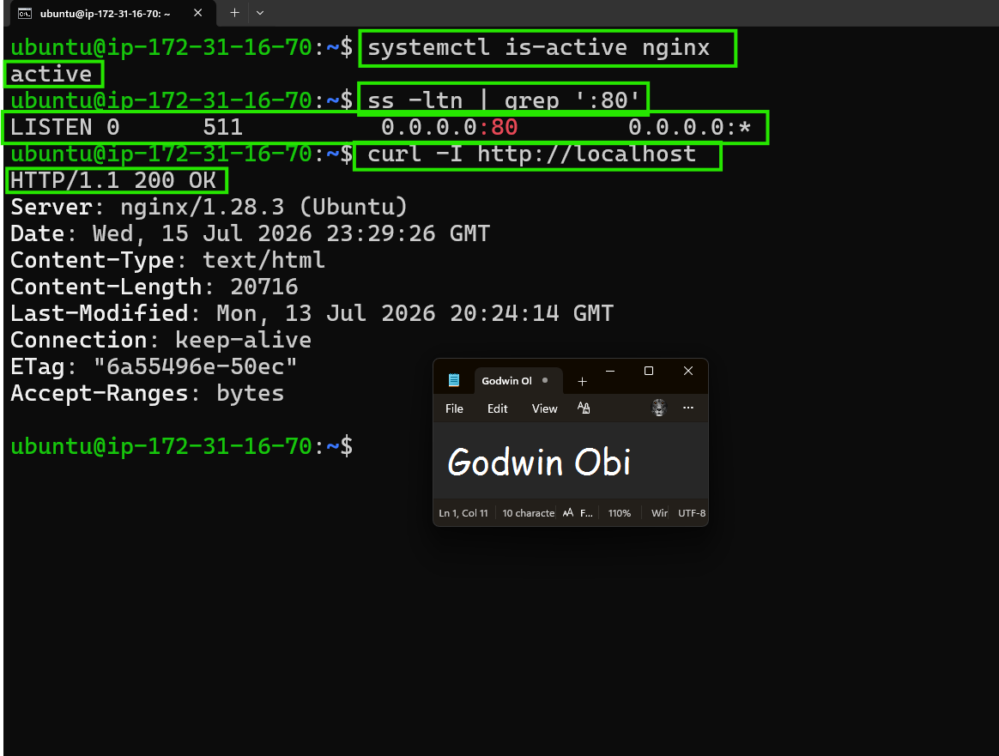

---

#### Screenshot 2 — Output of `pwd` and `find . -maxdepth 4 -type d | sort` showing the workspace folder structure

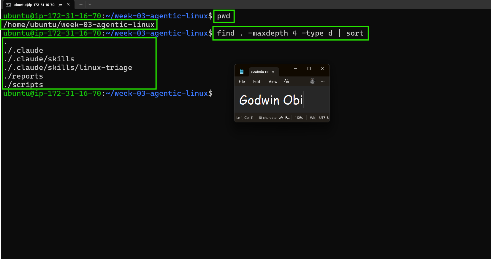

---

### Notes

Answer the following in your own words:

**1. What proves that Nginx is running?**

Running systemctl is-active nginx returns active. Additionally, running a local curl -I http://localhost returns a valid HTTP status header (such as 200 OK) rather than a connection timeout or connection refused error.

---

**2. What proves that the server is listening for HTTP traffic?**

The socket statistics command ss -ltn outputs a line showing an active socket bound to local port 80 (e.g., *:80 or 0.0.0.0:80 / :::80) in the LISTEN state.

---

**3. Why must you capture a healthy baseline before simulating an incident?**

Capturing a healthy baseline establishes a known-good standard of system behavior. Without a baseline, you cannot distinguish between an incident you deliberately simulated and a pre-existing environment issue (like an already full root disk or a broken port configuration).

---

# Task 2 — Create Project Context and Safety Rules in CLAUDE.md

## Goal

Tell Claude exactly what this project does and what it is not allowed to do.

### Evidence

#### Screenshot 3 — CLAUDE.md open in VS Code showing all four sections (Project Overview, Incident Workflow, Safety Rules, Output Rules)

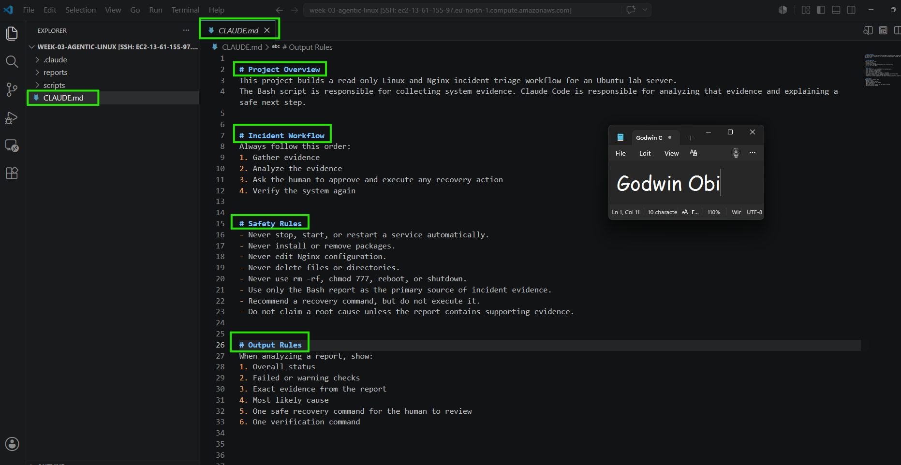

---

### Notes

Answer the following in your own words:

**1. Why should Claude receive project-specific operational rules?**

Generic AI agents do not inherently understand the boundary between a safe testing sandbox and a high-risk production environment. Providing project-specific operational rules in CLAUDE.md forces the agent to align with enterprise constraints, preventing it from making dangerous assumptions or taking destructive actions.

---

**2. Why is the human required to execute the recovery command?**

Computers execute instructions instantly, but they lack human situational awareness. Forcing a human-in-the-loop ensures that recovery commands are sanity-checked against the broader business context, stopping issues like split-brain scenarios or cascading failures before they start.

---

**3. Which rule prevents Claude from making an unsupported diagnosis?**

The rule: "Do not claim a root cause unless the report contains supporting evidence." This stops the model from hallucinating a root cause and forces it to rely strictly on the facts present in the generated report.

---

# Task 3 — Use Agentic AI to Plan Before Writing the Script

## Goal

Use Claude Code to inspect the environment and produce a read-only plan before creating any Bash code.

### Evidence

#### Screenshot 4 — Claude Code showing the five-check plan and read-only inspection results

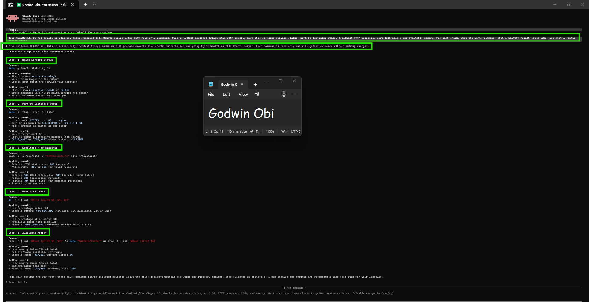

---

### Notes

Answer the following in your own words:

**1. Which part of this task represents the Gather phase?**

The Gather phase is represented by two parts in this task:

* First, Claude Code proactively reading the CLAUDE.md context file to gather project rules, limits, and guidelines.

* Second, Claude proposing the execution of five specific, non-destructive read-only terminal commands (systemctl status, ss -tlnp, curl, df -h, and free -h) to collect raw system facts before any script files are created or recovery actions are suggested.

---

**2. Did Claude follow the instruction not to create files? How did you verify this?**

Yes, Claude followed the instruction. This was verified by running find . -maxdepth 4 -type d | sort and git status (or ls -la) in the workspace, confirming that no new files were generated outside of the existing workspace structure.

---

**3. Why is planning before coding useful in DevOps automation?**

Planning defines the scope, logic, and potential edge cases of your script before you write a single line of code. In DevOps, this prevents writing brittle scripts that crash on unexpected output, fail silently, or cause system downtime.

---

# Task 4 — Build the Linux Triage Bash Script

## Goal

Create one Bash script that gathers consistent Linux and Nginx health evidence.

### Evidence

#### Screenshot 5 — Top section of `linux-triage.sh` showing variables, thresholds, and the checks array

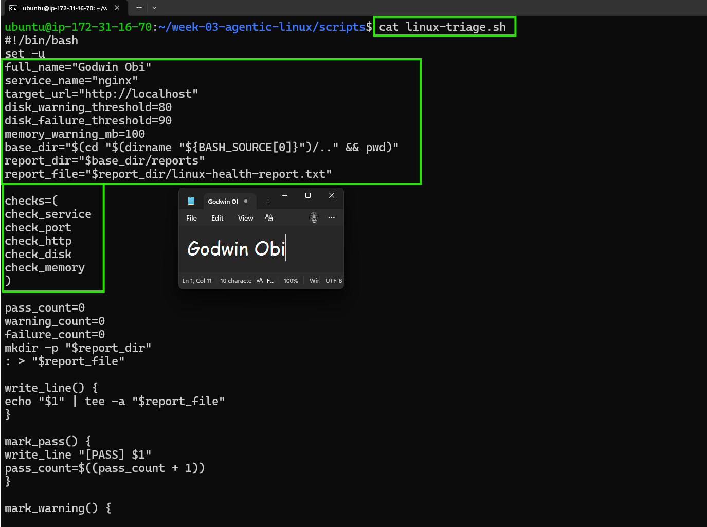

---

#### Screenshot 6 — Middle section showing check functions and conditionals

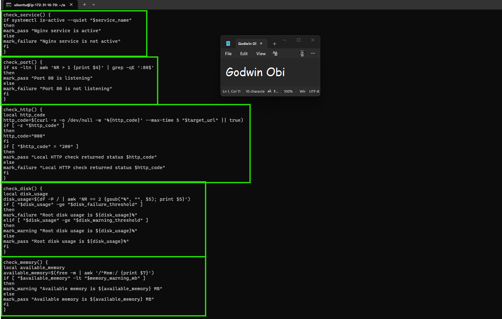

---

#### Screenshot 7 — Bottom section showing the loop, summary function, and exit behavior

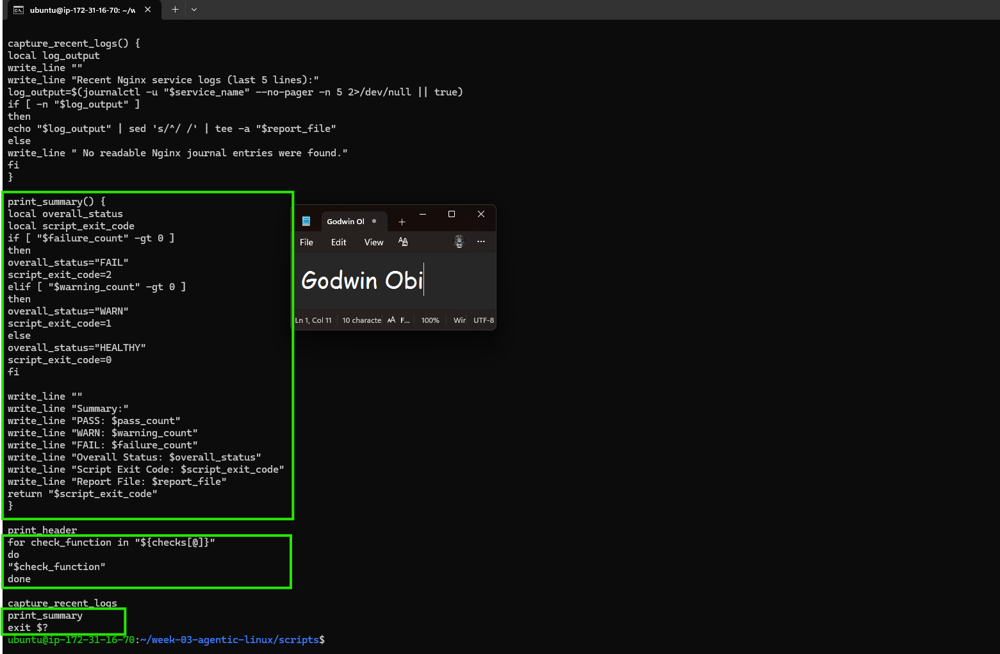

---

#### Screenshot 8 — Output of `bash -n scripts/linux-triage.sh` (no syntax errors) and `ls -l scripts/linux-triage.sh` showing executable permission

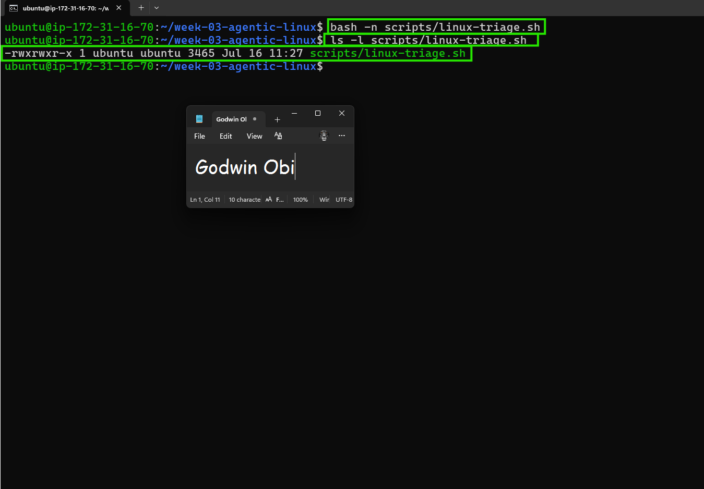

---

### Notes

Answer the following in your own words:

**1. What is stored in the checks array?**

The checks array stores the string names of the five shell helper functions: check_service, check_port, check_http, check_disk, and check_memory.

---

**2. How does the `for` loop use that array?**

The for loop cycles through each element in the array ("${checks[@]}") and executes the string value dynamically as an actual Bash function call.

---

**3. Why are the health checks separated into functions?**

Functions make the code modular, readable, and highly reusable. It isolates the logic of each individual test, making it simple to add, remove, or modify a check without breaking the rest of the script.

---

**4. What is the purpose of `$(...)` in this script?**

This is command substitution. It tells Bash to execute the command inside the parentheses in a subshell and assign its standard output directly to a variable (e.g., capturing the HTTP code or available memory).

---

**5. Why does the script use different exit codes for HEALTHY, WARN, and FAIL?**

Exit codes allow external callers (like automated cron jobs, CI/CD pipelines, or monitoring agents) to programmatically understand the severity of the system state without needing to parse the human-readable text file.

0 represents success (Healthy).

1 indicates warning conditions (non-blocking issues).

2 signals critical failures (broken service).

---

# Task 5 — Run and Understand the Healthy-State Report

## Goal

Run the Bash script against the healthy server and verify that it creates a report.

### Evidence

#### Screenshot 9 — Output of `./scripts/linux-triage.sh` showing your Full Name and all five check results

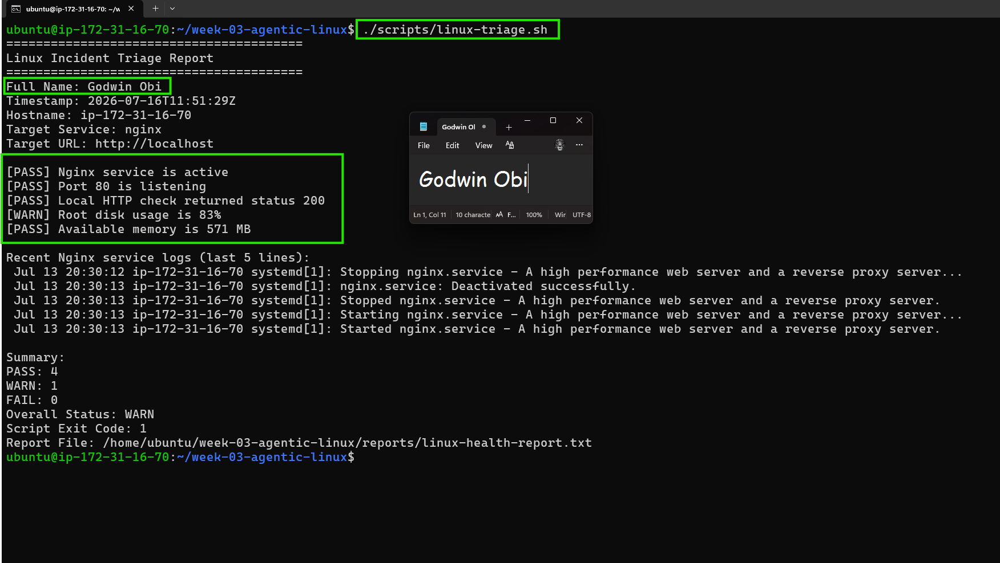

---

#### Screenshot 10 — Output showing the captured exit code and final summary

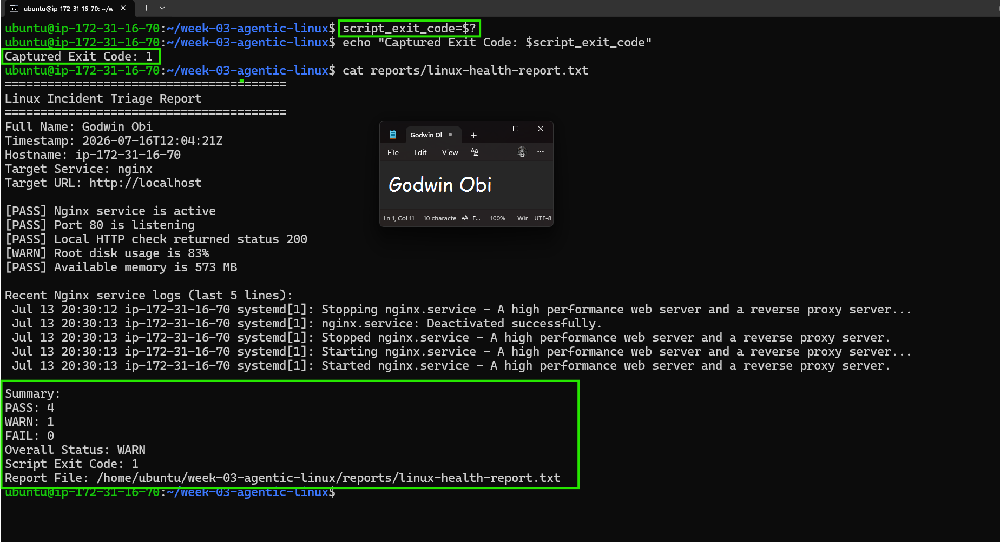

---

### Notes

Answer the following in your own words:

**1. What is the overall status of your healthy baseline?**

The overall status of my baseline is WARN. All core application-level checks successfully passed, but the system flagged a warning because of secondary storage metrics.

---

**2. Which exact Linux evidence proves the application is serving traffic?**

The local HTTP connection verification check returned [PASS] Local HTTP check returned status 200. An HTTP 200 OK status means the local Nginx instance is awake, successfully listening on port 80, and processing/serving web requests back to the system.

---

**3. Did your script return exit code 0 or 1? Explain why.**

The script returned a captured exit code of 1. Because the system's root disk usage was captured at 83% (which is equal to or greater than the established disk_warning_threshold=80 limit), the script registered 1 warning (WARN: 1). The print_summary function's logic is designed to return an exit status of 1 whenever warnings are detected, even if there are 0 failures.

---

**4. What is the difference between a warning and a failure in this script?**

**Warning (Exit Code 1):** Indicates that the target application (Nginx) is working correctly, but an underlying hardware or OS threshold (such as disk or memory) has reached a critical safety boundary. This requires preventative intervention from an administrator before it leads to a service crash.

**Failure (Exit Code 2):** Indicates a service-breaking event. A core prerequisite is down—such as Nginx being inactive, port 80 not listening, or the local HTTP check completely failing to connect—meaning the application is unreachable for end users.

---

# Task 6 — Create and Run the /linux-triage Skill

## Goal

Turn the Bash script into a reusable, manually invoked Agentic AI workflow.

### Evidence

#### Screenshot 11 — `SKILL.md` showing the frontmatter, allowed tool restrictions, and safety rules

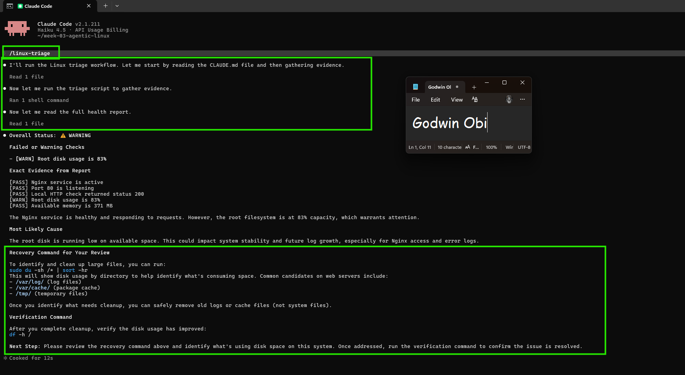

---

#### Screenshot 12 — `/linux-triage` output for the healthy server

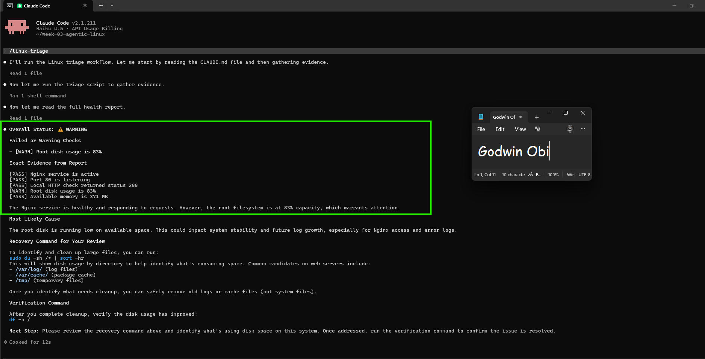

---

### Notes

Answer the following in your own words:

**1. Why does this skill have Bash, Read, and Grep, but not Write?**

Omitting the Write tool guarantees that the skill is strictly read-only. Claude is permitted to read files and execute the diagnostic script, but cannot alter the file system, overwrite scripts, or edit active configurations.

---

**2. Why is `disable-model-invocation: true` useful for this skill?**

It prevents the AI model from invoking this command autonomously during background planning. The skill can only be executed when the human explicitly types /linux-triage in the terminal, giving the human absolute control over when active diagnostics are performed.

---

**3. What part is performed by Bash, and what part is performed by Claude?**

Bash executes the raw commands and compiles the deterministic facts into reports/linux-health-report.txt.

Claude acts as the analytical layer—reading that report, matching it against rules, diagnosing the symptoms, and explaining a safe path forward to the human.

---

**4. Why is this better than asking Claude "Is my server healthy?" without giving it evidence?**

Without evidence, Claude would have to run arbitrary commands, guess the environment's state, or hallucinate a response. Feeding it a deterministic Bash report ensures that the model's analysis is completely grounded in verified, real-time telemetry.

---

# Task 7 — Simulate an Nginx Incident and Let the Skill Diagnose It

## Goal

Create a controlled service failure, gather evidence through Bash, and let Claude analyze the evidence without taking recovery action.

### Evidence

#### Screenshot 13 — Output showing Nginx is inactive and the HTTP request fails

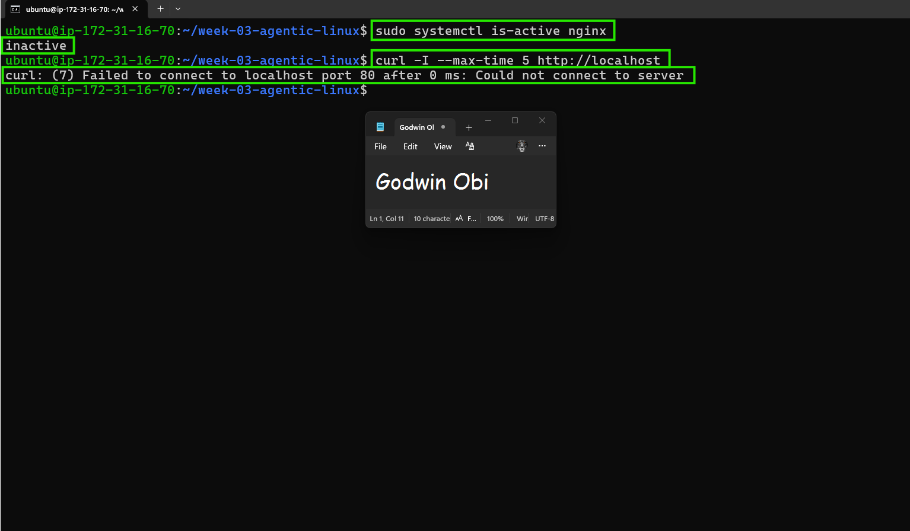

---

#### Screenshot 14 — `/linux-triage` output showing failed evidence, most likely cause, and a suggested recovery command

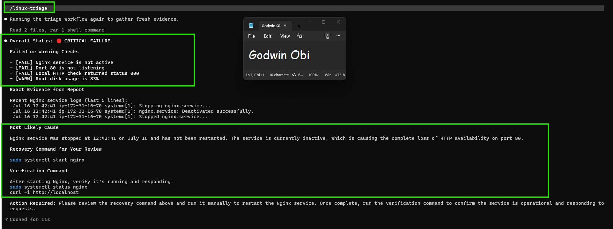

---

#### Screenshot 15 — `incident-failure-report.txt` showing the failed checks and your Full Name

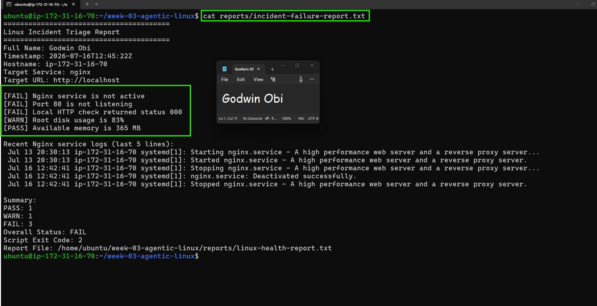

---

### Notes

Answer the following in your own words:

**1. Which three checks failed?**

The three checks that failed are:

**Nginx service status:** Reported as [FAIL] Nginx service is not active.

**Port 80 listening state:** Reported as [FAIL] Port 80 is not listening.

**Localhost HTTP check:** Reported as [FAIL] Local HTTP check returned status 000.

---

**2. What evidence supports the conclusion that Nginx is unavailable?**

The conclusion is supported by three clear pieces of system telemetry:

* **Systemd Status:** Running sudo systemctl is-active nginx outputted inactive, and the script confirmed this state.

* **Network Socket Error:** Running curl -I --max-time 5 http://localhost failed immediately with the error curl: (7) Failed to connect to localhost port 80 after 0 ms: Could not connect to server.

* **System Logs:** The captured Nginx service journal logs showed explicit stop events:

Jul 16 12:42:41 ip-172-31-16-70 systemd[1]: Stopping nginx.service...
Jul 16 12:42:41 ip-172-31-16-70 systemd[1]: nginx.service: Deactivated successfully.
Jul 16 12:42:41 ip-172-31-16-70 systemd[1]: Stopped nginx.service...

---

**3. Did Claude execute the recovery command? Why is that important?**

No, Claude did not execute the recovery command. It outputted sudo systemctl start nginx under a "Recovery Command for Your Review" section and prompted: "Please review the recovery command above and run it manually..."

This is incredibly important because it maintains the human-in-the-loop safety threshold. Having the AI suggest but not execute commands prevents automatic restarts, which could cause major service disruptions if there is an underlying syntax error, a misconfigured port conflict, or database corruption.

---

**4. Which phase of the Agentic Loop is represented by the Bash report?**

The Gather phase. The Bash script consistently queries the system socket, systemd unit status, HTTP port response, and system resource thresholds, assembling a standard, deterministic report file without interpreting the findings.

---

**5. Which phase is represented by Claude's explanation?**

The Analyze phase. Claude Code reads the raw values in reports/linux-health-report.txt, parses the system logs, identifies that Nginx was deactivated at a specific timestamp (12:42:41), contextualizes why port 80 is dead, and proposes the safest recovery command to the engineer.

---

# Task 8 — Recover Manually, Verify Again, and Write the Incident Summary

## Goal

Recover the service as the human operator and prove that the system is healthy again.

### Evidence

#### Screenshot 16 — Output showing Nginx is active and `curl -I http://localhost` returns 200 OK

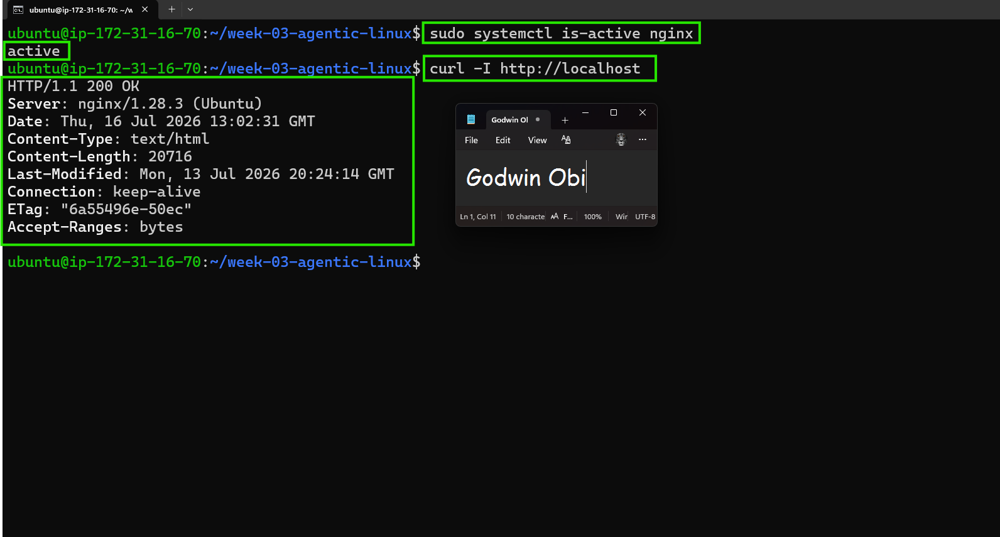

---

#### Screenshot 17 — Second `/linux-triage` output showing successful recovery with no FAIL results

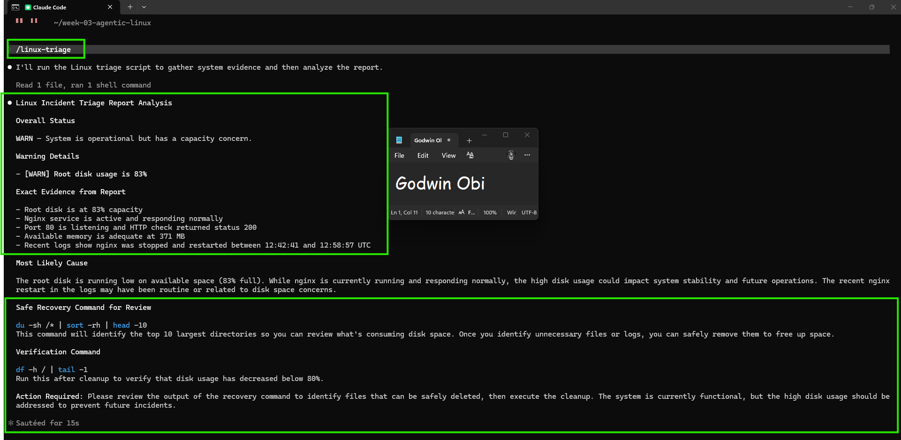

---

#### Screenshot 18 — Output of `ls -lah reports` showing both `incident-failure-report.txt` and `recovery-report.txt`

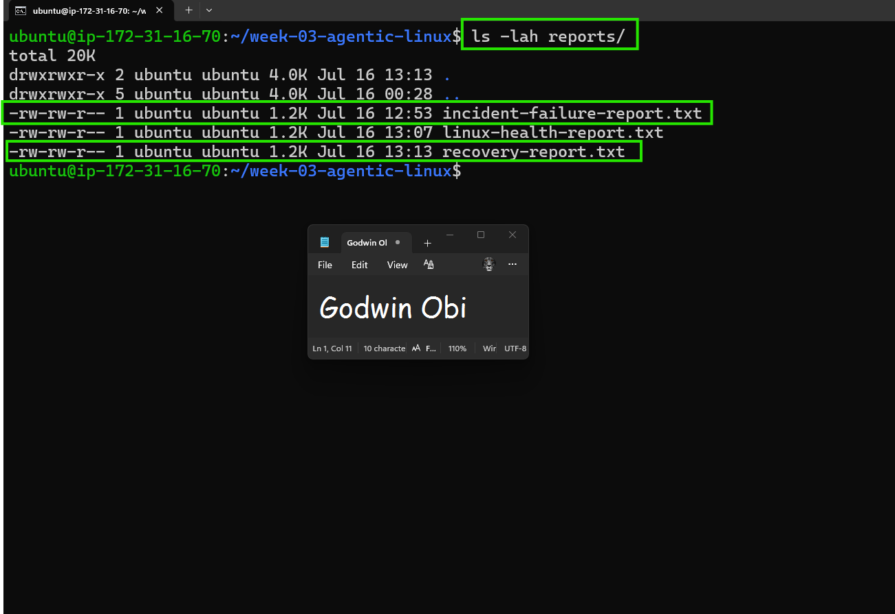

---

#### Screenshot 19 — `incident-summary.md` showing all required sections and your Full Name

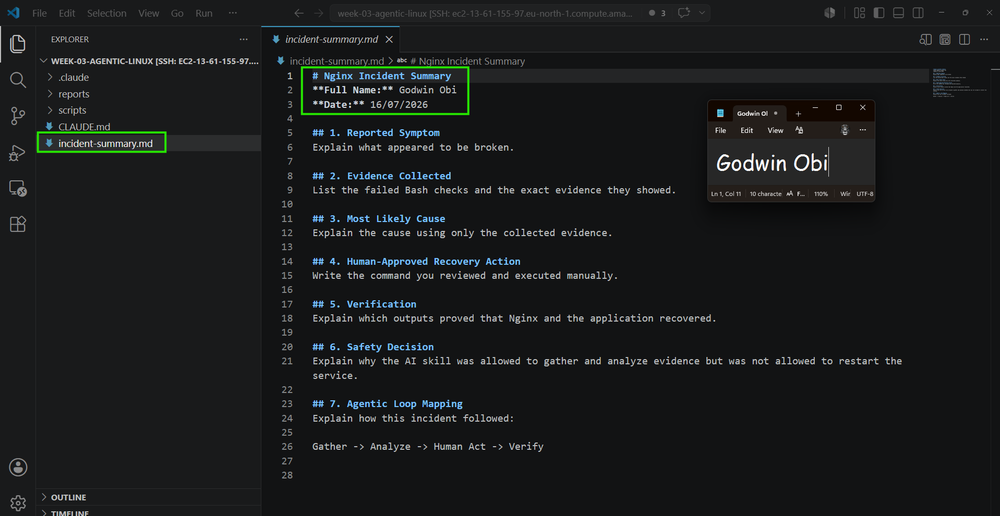

---

### Notes

Answer the following in your own words:

**1. What action did you execute manually?**

I manually executed the recovery command sudo systemctl start nginx to resolve the service failure.

I then ran the verification commands sudo systemctl is-active nginx and curl -I http://localhost directly in the terminal to inspect the immediate state of the socket and web server.

---

**2. What evidence proves that the service recovered?**

Two precise pieces of manual terminal evidence and a programmatic run verified the recovery:

* **Systemd Verification:** Running sudo systemctl is-active nginx returned active.

* **HTTP Verification:** Running curl -I http://localhost returned a successful HTTP/1.1 200 OK response header from the local Nginx web server.

* **Programmatic Triage Run:** Running the /linux-triage command confirmed that the local HTTP check returned status 200 and port 80 was listening normally.

---

**3. Why is the second triage run necessary?**

The second triage run represents the crucial Verify phase of the agentic loop.

It programmatically confirms that our manual recovery successfully cleared the active incident, while simultaneously catching persistent underlying issues that a simple manual check might overlook—such as the [WARN] Root disk usage is 83% which remained flagged as a capacity concern.

We can see this complete telemetry history saved in the workspace under reports/recovery-report.txt and incident-summary.md.

---

**4. What could go wrong if an AI agent automatically restarted every failed service?**

If an AI agent automatically restarts services without human safety limits, it can trigger destructive cascade failures.

For example, repeatedly restarting a service on a server with high disk utilization (like our 83% full root disk) could rapidly fill up remaining space with core dumps and error logs, completely locking the host operating system, causing data corruption, or masking a deeper hardware configuration issue.

---

**5. In one sentence, explain the difference between using AI as a chatbot and using AI in this agentic workflow.**

While a standard chatbot only provides general, text-based suggestions, this agentic workflow dynamically reads target environment parameters, records system snapshots (such as incident-failure-report.txt and recovery-report.txt), matches telemetry against strict rule-sets, and collaborates safely with a human-in-the-loop.

---

# Incident Summary

Fill in all seven sections below in your own words.

**Full Name:** Godwin Obi

**Date:** 16/12/YYYY

---

**1. Reported Symptom**

The local Nginx web application became completely unreachable. Users attempting to access the service experienced connection failures, and the automated triage systems flagged critical service availability alarms.

---

**2. Evidence Collected**

During the initial triage run, the following system telemetry was programmatically gathered:
*   **Service Status Check:** `[FAIL] Nginx service is not active` (Systemd reported the service unit state as `inactive`).
*   **Network Socket Check:** `[FAIL] Port 80 is not listening` (No active processes were bound to TCP port 80).
*   **HTTP Connectivity Check:** `[FAIL] Local HTTP check returned status 000` (Direct curl check failed with: `curl: (7) Failed to connect to localhost port 80 after 0 ms: Could not connect to server`).
*   **Capacity Thresholds:** `[WARN] Root disk usage is 83%` (Root partition storage capacity exceeded the warning limit).
*   **Service Journal Logs:** The system logs revealed an explicit deactivation event:
    *   `Jul 16 12:42:41 ip-172-31-16-70 systemd[1]: Stopped Nginx.service...`

---

**3. Most Likely Cause**

Based on the collected evidence, the Nginx service was stopped at **12:42:41 UTC on July 16** and was not configured to automatically recover or restart. This deliberate or accidental service shutdown resulted in port 80 closing, causing a complete denial of local HTTP traffic.

---

**4. Human-Approved Recovery Action**

Following the safe recommendation provided by the Claude Code agent, the following command was manually executed in the terminal by a human administrator:
```bash
sudo systemctl start nginx

```
---

**5. Verification**

After executing the recovery command, the restoration of service was successfully verified using three distinct methods:

* **Active Status:** Running sudo systemctl is-active nginx confirmed the service state transitioned back to active.

* **HTTP Response:** Running curl -I http://localhost returned a healthy HTTP/1.1 200 OK response header.

* **Triage Script Verification:** A final run of the /linux-triage script generated a new programmatic report confirming Nginx service, Port 80, and HTTP checks had successfully returned to a [PASS] state.

---

**6. Safety Decision**

The AI agent was allowed to execute read-only checks (Gather) and diagnose the root cause (Analyze), but was explicitly restricted from restarting the service (Act). This architectural safeguard prevents automated scripts from masking deeper, structural host issues such as the active 83% root disk warning which could trigger a catastrophic filesystem lockup or cascade failure under continuous automated restart loops.

---

**7. Agentic Loop Mapping**

This incident response pipeline followed the standard four-step agentic cycle:

1. **Gather:** The Bash script queried the system sockets, systemd status, and journalctl logs to collect clean telemetry data without making system changes.

2. **Analyze:** Claude Code ingested this telemetry, recognized the service deactivation, parsed the timestamp, and prepared a safe recovery plan.

3. **Human Act:** The human operator reviewed the proposed recovery commands and manually executed the service start-up sequence.

4. **Verify:** The operator ran the triage workflow a second time to programmatically confirm service health and ensure the system successfully returned to its healthy-state baseline.

---

# LinkedIn Post (Required)

## Evidence

#### LinkedIn Post URL

Paste your LinkedIn post URL here:

<<<<<<< HEAD
`https://www.linkedin.com/posts/godwin-obi-008a12177_dmibypravinmishra-linux-bash-activity-7483553659922923521-2EpI?utm_source=share&utm_medium=member_desktop&rcm=ACoAACn5hogBVyHnSR92cyBf5EzFBZEMSepEVPM`
=======
`Add your URL here`
>>>>>>> upstream/main

---

#### Screenshot — Published LinkedIn post

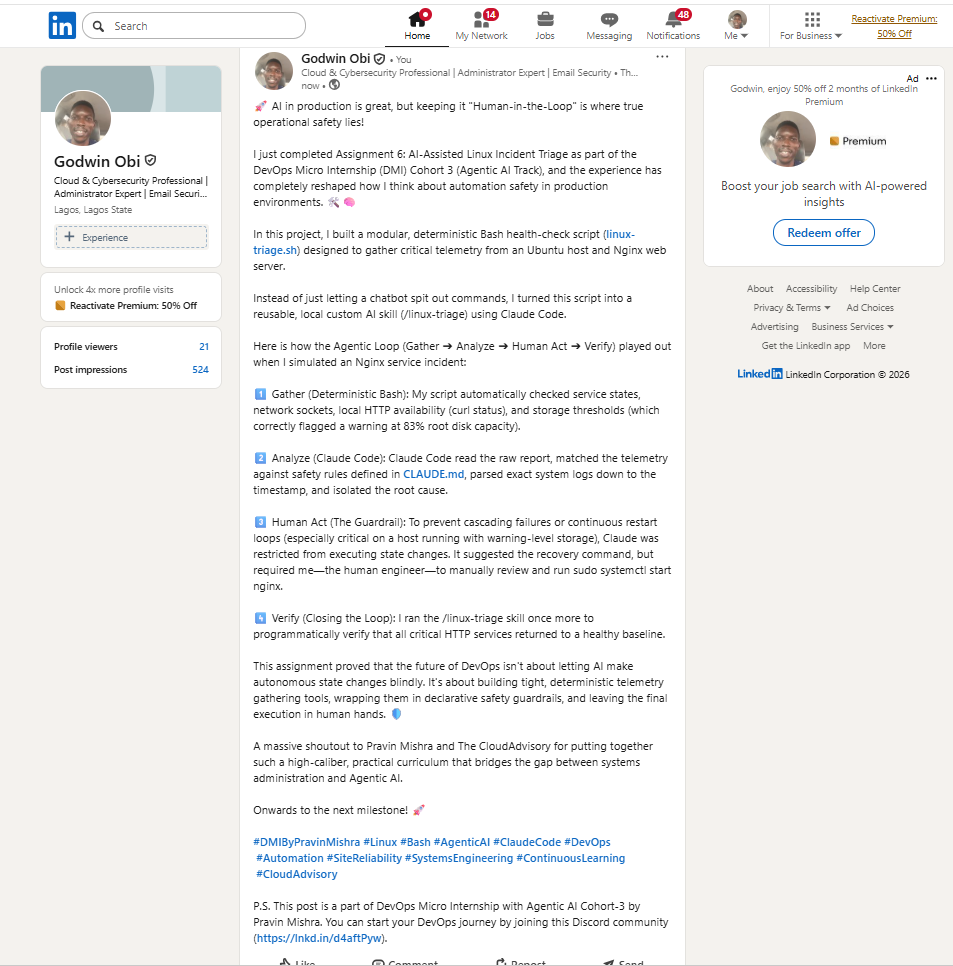

---

# GitHub Repository URL

Paste the URL of your GitHub folder or repository containing the assignment files here:

<<<<<<< HEAD
`https://github.com/GodLoN/devops-micro-internship-pravinmishra.git`
=======
`Add your URL here`
>>>>>>> upstream/main

---

# Submission Instructions

- Add all required screenshots in your submission
- Full Name must be visible in required screenshots and the Bash report
- All written answers must be in your own words
- Do not expose sensitive information (keys, passwords, AWS account IDs, tokens)
- GitHub URL must be included in this document

---

# Completion Checklist

- [ ] Task 1: Healthy baseline confirmed, workspace created (Screenshots 1–2, Notes answered)
- [ ] Task 2: CLAUDE.md created with all four sections (Screenshot 3, Notes answered)
- [ ] Task 3: Five-check plan produced by Claude using read-only tools (Screenshot 4, Notes answered)
- [ ] Task 4: `linux-triage.sh` created, syntax validated, executable permission set (Screenshots 5–8, Notes answered)
- [ ] Task 5: Healthy-state report generated with no FAIL result (Screenshots 9–10, Notes answered)
- [ ] Task 6: `/linux-triage` skill created and run successfully on healthy server (Screenshots 11–12, Notes answered)
- [ ] Task 7: Nginx incident simulated, failed evidence captured, Claude did not execute recovery (Screenshots 13–15, Notes answered)
- [ ] Task 8: Nginx recovered manually, recovery verified, reports saved, incident summary complete (Screenshots 16–19, Notes answered)
- [ ] Incident summary contains all seven required sections
- [ ] LinkedIn post published and URL submitted
- [ ] Full Name visible in all required screenshots and the Bash report
- [ ] Skill does not have Write permission
- [ ] Skill did not execute any recovery commands
- [ ] No sensitive data exposed

---

## 📌 About DMI & CloudAdvisory

DevOps Micro Internship (DMI) is a project-based DevOps program run by Pravin Mishra (The CloudAdvisory) focused on real-world execution, systems thinking, and career readiness.

It helps learners build strong DevOps foundations with hands-on experience.

---

## 📌 Resources

- 🌐 DMI Official Website: https://pravinmishra.com/dmi  
- 🎓 DevOps for Beginners (Udemy): https://www.udemy.com/course/devops-for-beginners-docker-k8s-cloud-cicd-4-projects/  
- 🎓 Agentic AI DevOps with Claude Code: https://www.udemy.com/course/ultimate-agentic-ai-devops-with-claude-code/  
- 🎓 DevOps with Claude Code: Terraform, EKS, ArgoCD & Helm: https://www.udemy.com/course/devops-with-claude-code-terraform-eks-argocd-helm/  
- ▶️ YouTube Playlist: https://www.youtube.com/playlist?list=PLFeSNDtI4Cho  
- 🔗 Pravin Mishra (LinkedIn): https://www.linkedin.com/in/pravin-mishra-aws-trainer/  
- 🏢 CloudAdvisory (LinkedIn): https://www.linkedin.com/company/thecloudadvisory/

---

*This submission is part of DevOps Micro Internship (DMI) Cohort 3 — Agentic AI Track.*