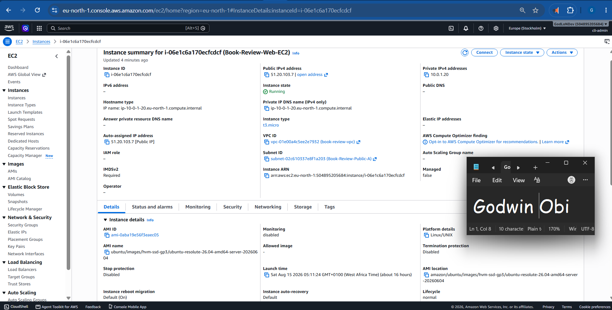
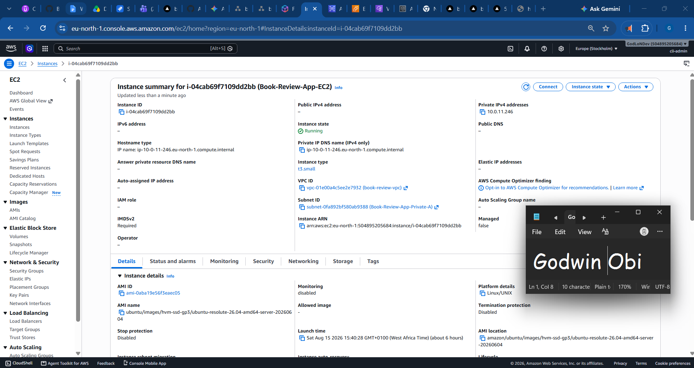
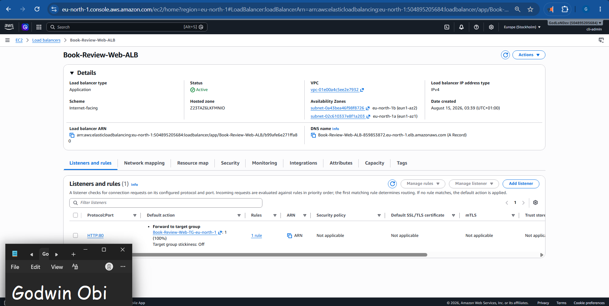
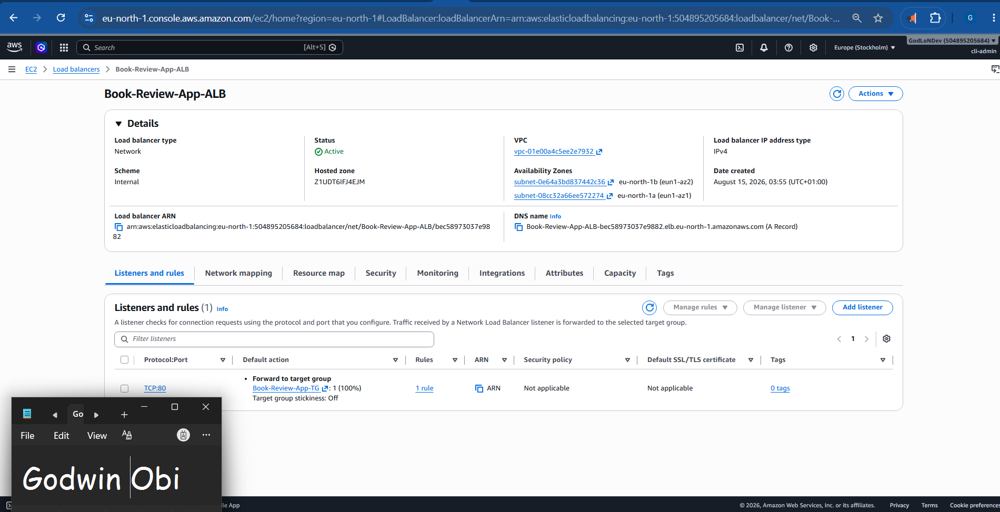
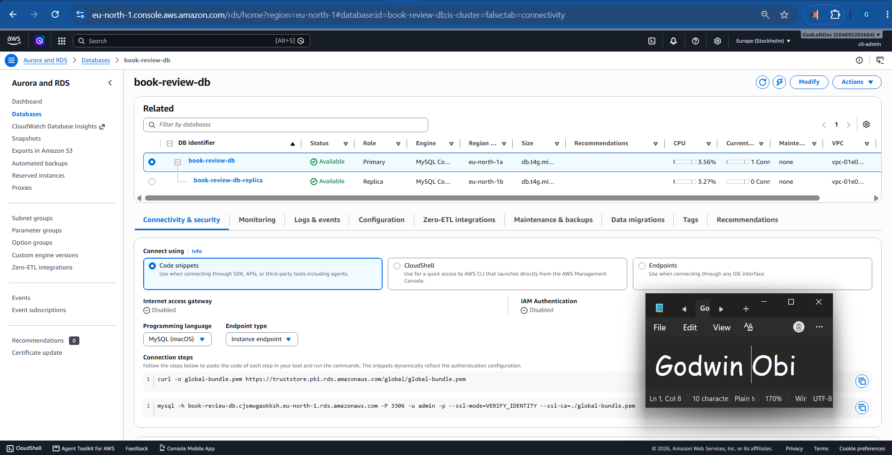
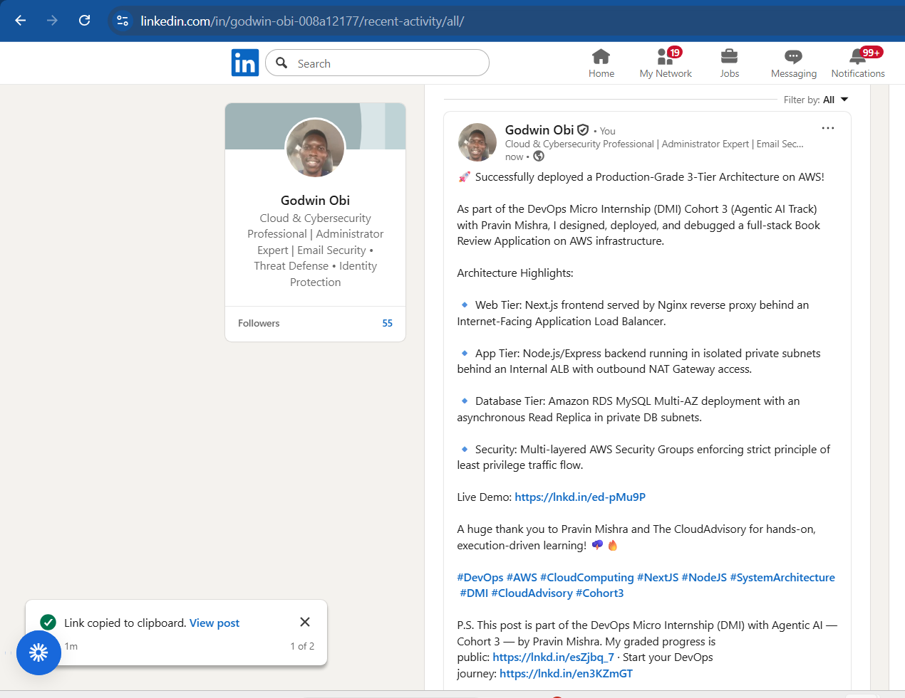
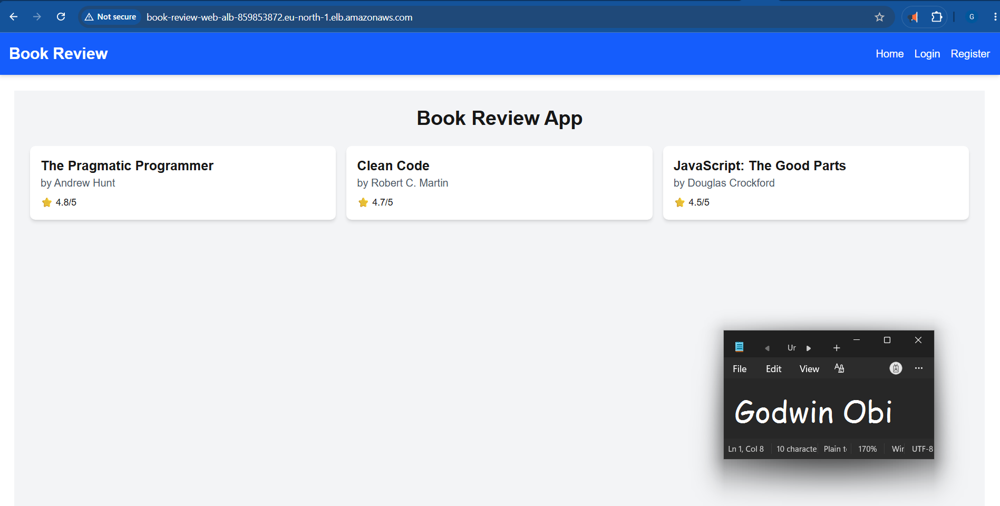

# Assignment 6 — Capstone Assignment — Deploy Book Review App (Three-Tier Architecture) on AWS

Part of the DevOps Micro Internship (DMI) Cohort 3 with Agentic AI

---

## Purpose

This is the most important assignment of the course. You will deploy the Book Review App in a fully production-style three-tier architecture on AWS: a Next.js Web Tier behind Nginx and a public ALB, a private Node.js/Express App Tier behind an internal ALB, and a private Multi-AZ MySQL RDS database with a read replica. You are expected to design, deploy, isolate, debug, and document the result independently.

---

# Task 1 — Architecture Diagram

## Goal

Create an architecture diagram showing the custom VPC (10.0.0.0/16), the six subnets across two Availability Zones (two public Web Tier, two private App Tier, two private Database Tier), the public ALB, Web Tier EC2/Nginx, internal ALB, private App Tier EC2, private Multi-AZ RDS with its read replica, and the permitted traffic flow.

### Evidence

#### Diagram image or link

'https://drive.google.com/file/d/1F_AesO0v7Mvvni5KR9SYfB8b54HVe1Eg/view?usp=sharing'

---

# Task 2 — AWS Region & Services Used

## Goal

Record the AWS Region used and list every AWS service used across networking, compute, load balancing, security, and the database.

### Notes

**Region:**

* eu-north-1 (Europe - Stockholm)

---

**Services:**

* **Networking & Content Delivery**

    * **Amazon VPC (Virtual Private Cloud):** Created a custom isolated network (10.0.0.0/16) to host the application infrastructure across two Availability Zones (eu-north-1a and eu-north-1b).  
    
    * **VPC Subnets:** Provisioned six dedicated subnets consisting of two Public Subnets, two Private Application Subnets, and two Private Database Subnets.  
    
    * **Internet Gateway (IGW):** Attached Book-Review-IGW to enable internet ingress and egress for the public Web tier.  
    
    * **Elastic IP (EIP):** Allocated a static public IPv4 address assigned to the NAT Gateway.  
    
    * **NAT Gateway:** Provisioned Book-Review-NAT-Gateway in a public subnet to allow outbound internet access for private App Tier instances (for package downloads and updates) while blocking inbound internet traffic.  
    
    * **Route Tables:** Configured three distinct route tables (Public-RT, App-Private-RT, and DB-Private-RT) to manage traffic routing rules across all subnets.  
    
* **Compute**

    * **Amazon EC2 (Elastic Compute Cloud):** Provisioned Ubuntu 24.04 LTS instances (t3.micro) to host the application components:

        * Book-Review-Web-EC2 running Nginx as a reverse proxy and Next.js frontend on Port 80/3000.  
        
        * Book-Review-App-EC2 running Node.js/Express backend on Port 3001 in a private subnet.  
        
* **Load Balancing**

    * **Elastic Load Balancing (ELB) / Application Load Balancers (ALB):**

        * **Book-Review-Web-ALB:** Internet-facing ALB distributing public incoming HTTP traffic across public web subnets. 

        * **Book-Review-App-ALB:** Internal ALB distributing traffic from the Web tier to the private Application tier.  

    * **Target Groups:** Configured HTTP target groups for the Web tier (Book-Review-Web-TG-eu-north-1 on Port 80) and Application tier (Book-Review-App-TG on Port 3001).  
    
* **Database**

    * **Amazon RDS (Relational Database Service) for MySQL:** Provisioned a managed MySQL 8.x database instance (book-review-db) running in a Multi-AZ DB Subnet Group across private subnets.  

    * **Amazon RDS Read Replica:** Configured an asynchronous read replica (book-review-db-replica) in a separate Availability Zone to offload read operations and increase availability.  
    
* **Security & Identity**

    * **AWS Security Groups:** Functioned as virtual stateful firewalls controlling inbound and outbound traffic at the resource level:

        * **Book-Review-Web-SG:** Allows inbound HTTP (80) and HTTPS (443) from the internet (0.0.0.0/0).  
        
        * **Book-Review-App-SG:** Restricts inbound traffic to custom TCP Port 3001 and HTTP Port 80 exclusively from the Web SG.  
        
        * **Book-Review-DB-SG:** Restricts inbound MySQL/Aurora Port 3306 traffic strictly to requests originating from the App SG.  
        
    * **AWS Key Pairs:** Used SSH key pairs for secure terminal access to instances.   

---

# Task 3 — Public Entry Point

## Goal

Confirm the Book Review App loads through the public ALB DNS name.

### Evidence

#### Public ALB DNS

Paste your public ALB DNS name here:

`http://book-review-web-alb-859853872.eu-north-1.elb.amazonaws.com/`

---

# Task 4 — Evidence Screenshots

## Goal

Capture visual proof of every tier and load balancer.

### Evidence

#### Web EC2

---

#### App EC2

---

#### Public ALB

---

#### Internal ALB

---

#### RDS + Replica

---

#### App UI proof

---

# Task 5 — Summary

## Goal

Summarize what worked in the final deployment, the issues encountered and how each was fixed, and the tools or sources used to research and debug.

### Notes

**What worked:**

* Successful deployment of a highly available, 3-tier AWS architecture across two Availability Zones in custom VPC (10.0.0.0/16).

* Next.js frontend running under Nginx reverse proxy on the Web EC2 instance, served publicly via an internet-facing Application Load Balancer (Book-Review-Web-ALB).

* Node.js/Express backend running under PM2 process manager on private App EC2 instances, isolated behind an Internal ALB (Book-Review-App-ALB) and accessible only via custom backend ports.

* MySQL database tier running on Amazon RDS in private subnets with an asynchronous Read Replica configured for database offloading and failover readiness.

* Strict Security Group tiering ensuring App and DB tiers are never exposed to the public internet.

---

**Issues + fixes:**

1. **Frontend Request Routing Errors (net::ERR_CONNECTION_REFUSED / Hardcoded localhost:3001):**

    * Issue: The Next.js client-side bundle was hardcoding localhost:3001 for API calls on user registration and login, causing connection failures in end-user browsers.

    * Fix: Updated src/services/api.js to route backend calls relative to /api, purged the Next.js build cache (rm -rf .next), re-compiled the Next.js application (npm run build), and restarted the PM2 process.

2. **Nginx Reverse Proxy API Forwarding:**

    * Issue: Frontend /api calls were failing to reach the private application tier.

    * Fix: Configured Nginx location block /api/ on the Web EC2 instance to proxy pass requests directly to the Internal ALB DNS name (http://Book-Review-App-ALB-bec58973037e9882.elb.eu-north-1.amazonaws.com/), stripping the prefix and passing valid JSON payloads to the Express backend.

3. **Backend Database Execution Errors (500 Internal Server Error):**

    * Issue: Express backend returned 500 errors during registration attempts due to environment configuration and missing database migrations.

    * Fix: Verified RDS MySQL security group ingress rules on port 3306, executed database schema setup scripts from the App EC2 instance, and ensured PM2 environment variables pointed correctly to the RDS endpoint.

---

**Tools/sources used:**

* AWS Console & CLI: VPC, EC2, Target Groups, Security Groups, Application Load Balancers, and RDS.

* Linux / Nginx Administration: Nginx proxy configuration, Systemd, and SSL/HTTP routing.

* Node.js Ecosystem: PM2 process manager, Next.js build tools, and Express.js logs.

* Debugging Tools: Browser Developer Tools (Console/Network tab), curl, pm2 logs, and MySQL CLI client.

---

# LinkedIn Post (Required)

## Goal

Publish a LinkedIn post sharing the capstone deployment, including the public ALB DNS (or a redacted screenshot), three to five lines on what you built and why it is production-style, and one proof screenshot.

## Evidence

#### LinkedIn Post URL

Paste your LinkedIn post URL here:

`https://www.linkedin.com/posts/godwin-obi-008a12177_devops-aws-cloudcomputing-activity-7494511583226667008-CU9G?utm_source=share&utm_medium=member_desktop&rcm=ACoAACn5hogBVyHnSR92cyBf5EzFBZEMSepEVPM`

---

#### Screenshot of LinkedIn post

---

# Submission Instructions

- Add all required screenshots and links in your submission
- Do not expose passwords, RDS credentials, connection strings, private keys, or account IDs

---

# Completion Checklist

- [ ] Task 1: Architecture diagram completed
- [ ] Task 2: AWS Region and services documented
- [ ] Task 3: Public ALB DNS confirmed working
- [ ] Task 4: All six evidence screenshots captured (Web Tier, App Tier, both ALBs, RDS + replica, app UI)
- [ ] Task 5: Deployment summary completed (what worked, issues/fixes, tools/sources)
- [ ] LinkedIn post published and URL submitted
- [ ] App Tier and Database Tier confirmed not publicly accessible
- [ ] No sensitive data exposed

---

## 📌 About DMI & CloudAdvisory

DevOps Micro Internship (DMI) is a project-based DevOps program run by Pravin Mishra (The CloudAdvisory) focused on real-world execution, systems thinking, and career readiness.

It helps learners build strong DevOps foundations with hands-on experience.

---

## 📌 Resources

- 🌐 DMI Official Website: https://dmi.pravinmishra.com?utm_source=github&utm_medium=readme  
- 🎓 University: https://university.pravinmishra.com?utm_source=github&utm_medium=readme  
- 💬 Discord Community: https://discord.pravinmishra.com?utm_source=github&utm_medium=readme  
- 📝 Blog: https://dmi.pravinmishra.com/blog?utm_source=github&utm_medium=readme  
- ▶️ YouTube Playlist: https://www.youtube.com/playlist?list=PLFeSNDtI4Cho  
- 🔗 Pravin Mishra (LinkedIn): https://www.linkedin.com/in/pravin-mishra-aws-trainer/  
- 🏢 CloudAdvisory (LinkedIn): https://www.linkedin.com/company/thecloudadvisory/

---

*This submission is part of DevOps Micro Internship (DMI) Cohort 3 — Agentic AI Track.*