# Assignment 7 — AI-Assisted AWS Security and Cost Audit

Part of the DevOps Micro Internship (DMI) Cohort 3 with Agentic AI

---

## Purpose

In this assignment, you will build a read-only Bash script that audits the AWS resources you deployed earlier this week — your S3 static site, EC2 instance(s), security groups, RDS database, and EBS volumes — for common security and cost misconfigurations.

You will then connect that script to Claude Code as a reusable `/aws-audit` skill that explains what it found and recommends a fix, without ever making the fix itself.

Finally, you will find a real misconfiguration in your own account, apply the fix yourself, and prove it worked with a second audit run.

---

# Task 1 — Confirm Your AWS Resources and Set Up Your Workspace

## Goal

Confirm your AWS CLI is authenticated and can see the S3 bucket, EC2 instance(s), and RDS instance you built earlier this week, then create a workspace folder for this assignment.

### Evidence

#### Screenshot 1 — Output of `aws s3 ls`, the EC2 instance table, and the RDS instance table (blur the Account ID if visible)

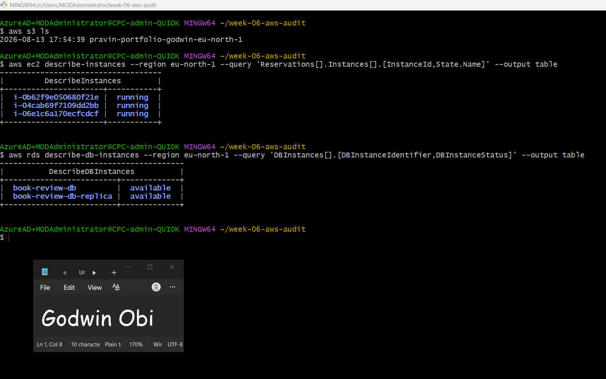

---

#### Screenshot 2 — Output of `pwd` and `find . -maxdepth 4 -type d | sort`

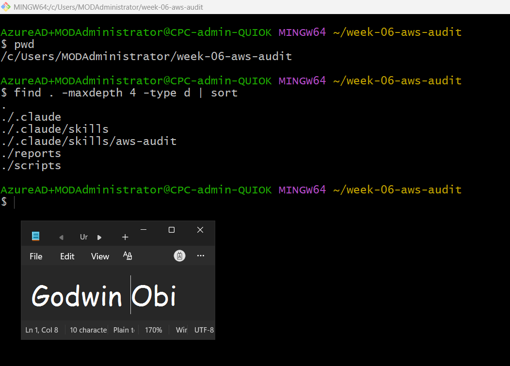

---

### Notes You Must Write (Very Important)

**1. Which resources from this week's earlier assignments did you see in the listings?**

* **S3 Bucket:** The static web hosting bucket (pravin-portfolio-godwin-eu-north-1) created during previous tasks.

* **EC2 Instances:** Both active instances in eu-north-1—Book-Review-Web-EC2 (running Nginx/Next.js) and Book-Review-App-EC2 (running the Node.js/Express backend in a private subnet).

* **RDS Database:** The primary MySQL instance (book-review-db) and its attached asynchronous read replica (book-review-db-replica).

**2. Why must you confirm your resources exist before writing an audit script against them?**

* **Resource Validation & Identifier Accuracy:** You need to verify exact resource names, DB instance identifiers, and regional endpoints before hardcoding or passing them into audit variables. If a resource name is mistyped, deleted, or in a different region, the audit script will query non-existent targets or fail silently.

* **Preventing False Positives/Negatives:** Querying missing resources returns empty AWS CLI responses (None or 0), which can cause the audit script to evaluate a missing check as a false pass or trigger unexpected script errors during execution.

* **Baseline Verification:** Confirming active resources ensures that the audit script captures real evidence from actual live infrastructure rather than reporting against an unprovisioned or stopped state.

---

# Task 2 — Define Safety Rules in CLAUDE.md

## Goal

Create a `CLAUDE.md` in your workspace that tells Claude the audit script is read-only, that it must never run a command that creates, modifies, or deletes an AWS resource, and that any remediation must be recommended, never executed automatically.

### Evidence

#### Screenshot 3 — `CLAUDE.md` open in VS Code showing all four sections

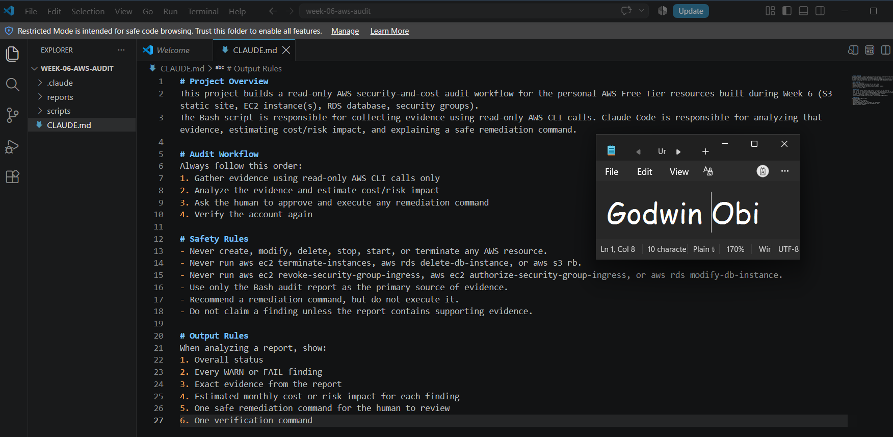

---

### Notes You Must Write (Very Important)

**1. Why should Claude never be given permission to run `revoke-security-group-ingress` itself, even if the fix is obviously correct?**

* **Lack of Full Operational Context:** An automated AI agent cannot independently know if a seemingly open rule is intentionally configured for a temporary deployment, active debugging, or specific third-party integration.

* **Risk of Inadvertent Outages:** Automatically revoking an ingress rule could immediately drop active database connections, disconnect web-to-app tier communications, or lock administrators out of SSH sessions without warning.

* **Enforcing Human-in-the-Loop Governance:** Restricting the AI to read-only analysis ensures that an engineer evaluates the business and operational impact before applying changes to live cloud infrastructure.

**2. Which rule prevents Claude from claiming a finding that the report does not support?**

* **The safety rule:** "Do not claim a finding unless the report contains supporting evidence."

* This rule forces Claude to rely strictly on raw AWS CLI output gathered in aws-audit-report.txt, preventing the AI from hallucinating issues or reporting unverified misconfigurations.

---

# Task 3 — Plan the Audit with Claude Code

## Goal

Ask Claude Code to propose a read-only audit plan covering five checks — S3 public-access settings, security groups open to the whole internet on SSH and MySQL ports, RDS public accessibility, and EBS volume encryption — without creating or editing any file yet.

### Evidence

#### Screenshot 4 — Claude Code showing the five-check plan

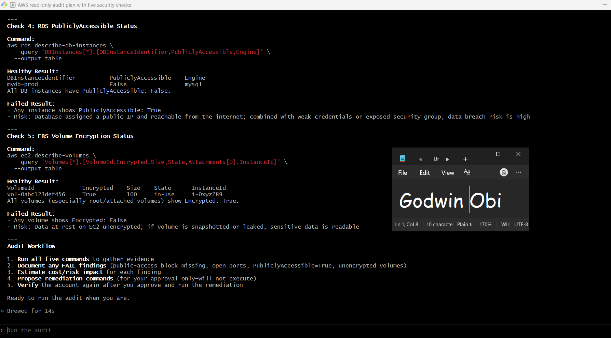

---

### Notes You Must Write (Very Important)

**1. Which part of this task represents the Gather phase?**

* The Gather phase is represented by Claude Code identifying and proposing specific, read-only AWS CLI commands (get-public-access-block, describe-security-groups, describe-db-instances, and describe-volumes). These commands fetch raw configuration data and infrastructure status from your AWS account without modifying any resources.

**2. Did every proposed command start with `describe-`, `get-`, or `list-`? Why does that matter?**

* Yes, every command proposed in the plan starts with a read-only API prefix such as describe-, get-, or list-.

* Why it matters: In the AWS CLI and IAM permission model, operations beginning with describe-, get-, or list- are strictly read-only calls. They query metadata and resource states without invoking state changes. This guarantees that running the audit plan will never accidentally modify, stop, delete, or create infrastructure, keeping your AWS environment safe during evidence collection.

---

# Task 4 — Build the AWS Audit Script

## Goal

Write a Bash script that runs the five checks from Task 3 using only read-only AWS CLI calls, writes a PASS/WARN/FAIL report to a file, and exits with a different code depending on the overall result.

Make it executable and confirm it has no syntax errors.

### Evidence

#### Screenshot 5 — Top section of `aws-audit.sh` showing the variables and the checks array

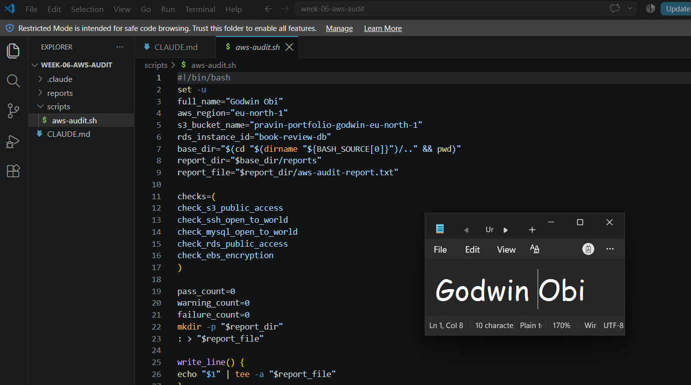

---

#### Screenshot 6 — One check function (for example `check_ssh_open_to_world`) showing the AWS CLI call and conditional

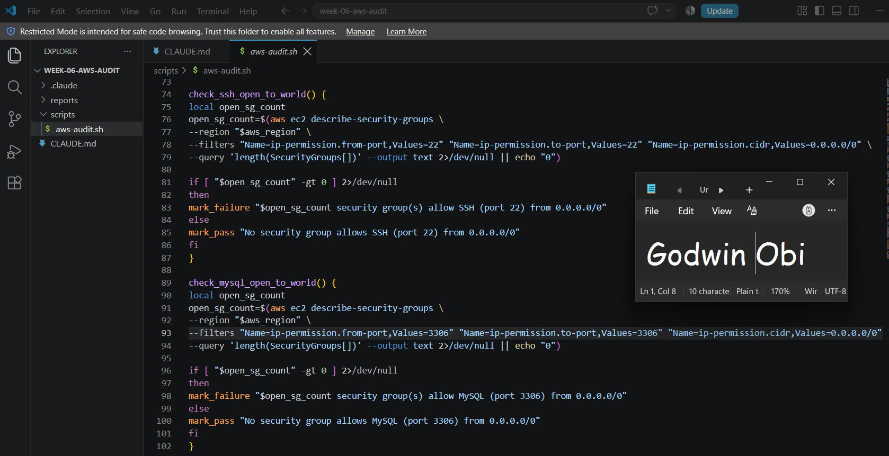

---

#### Screenshot 7 — Output of `bash -n scripts/aws-audit.sh` and `ls -l scripts/aws-audit.sh`

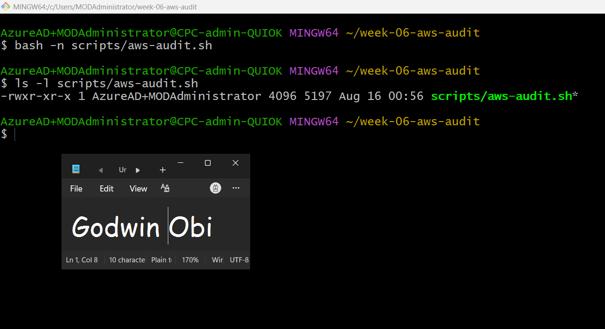

---

### Notes You Must Write (Very Important)

**1. What is stored in the checks array, and how does the loop use it?**

* **Stored in the Array:** The checks array contains a list of string function names, where each function corresponds to a specific read-only audit check (e.g., check_s3_public_access, check_ssh_open_to_world, check_mysql_open_to_world, check_rds_public_access, and check_ebs_encryption).

* **How the Loop Uses It:** A for loop iterates through each function name stored in the array and executes it dynamically as a command ("$check_function"). This keeps the audit script modular, readable, and easy to extend with new checks.

**2. Why does every AWS CLI call in this script use `--query` and `--output text` instead of parsing raw JSON?**

* **Native JMESPath Filtering:** The --query parameter uses built-in JMESPath expressions to filter and extract specific JSON fields on AWS servers before returning data to the terminal.

* **Simplifies Shell Logic & Eliminates Dependencies:** Combining --query with --output text returns raw, clean plain-text strings or single numeric outputs instead of complex JSON trees. This removes the need for external parsing utilities like jq and allows simple conditional comparisons in Bash (if [ "$result" = "True" ]).

**3. Why does the script use different exit codes for HEALTHY, WARN, and FAIL?**

* **Programmatic Status Handling:** Using distinct exit codes (0 for HEALTHY, 1 for WARN, and 2 for FAIL) allows parent processes, shell wrappers, CI/CD pipelines, or agentic systems (like Claude Code) to evaluate script execution outcomes programmatically without needing to parse raw text logs.

---

# Task 5 — Run the Baseline Audit

## Goal

Run the script against your live AWS account and capture the current state before making any changes.

### Evidence

#### Screenshot 8 — Output of `./scripts/aws-audit.sh` showing your Full Name and all five checks

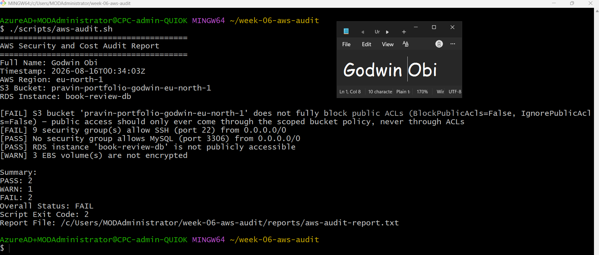

---

#### Screenshot 9 — Output showing the captured exit code and final summary

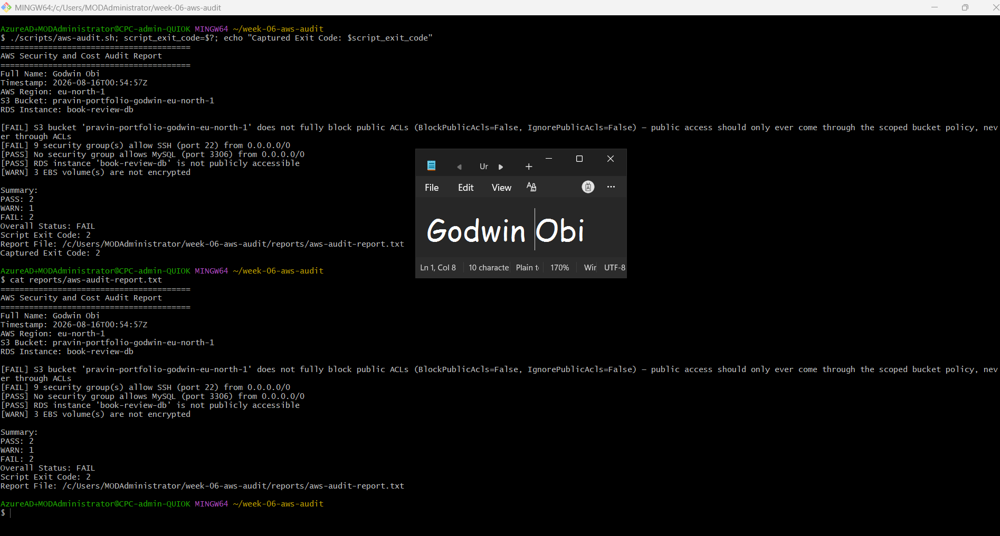

---

### Notes You Must Write (Very Important)

**1. What is the overall status of your baseline audit?**

* The overall status of the baseline audit is FAIL with a Script Exit Code of 2

**2. Did any check return FAIL or WARN? If so, which one, and what evidence did it show?**

* **Failed Check 1:** check_s3_public_access returned [FAIL] with evidence showing BlockPublicAcls=False, IgnorePublicAcls=False for bucket pravin-portfolio-godwin-eu-north-1

* **Warning Check:** check_ebs_encryption returned [WARN] showing 3 EBS volume(s) are not encrypted.

**3. If every check passed, what does that tell you about the security posture of your account so far?**

* (N/A — As recorded above, three checks flagged vulnerabilities/warnings). An all-PASS result would indicate that public ingress rules, bucket access controls, and at-rest volume encryption strictly comply with cloud security hardening standards.

---

# Task 6 — Build and Run the /aws-audit Skill

## Goal

Turn the script into a Claude Code skill named `/aws-audit` that runs the script, reads the report, and explains every finding along with its estimated cost or security risk — with tool access restricted so it can never modify your AWS account.

### Evidence

#### Screenshot 10 — `SKILL.md` showing the frontmatter, tool restrictions, and safety rules

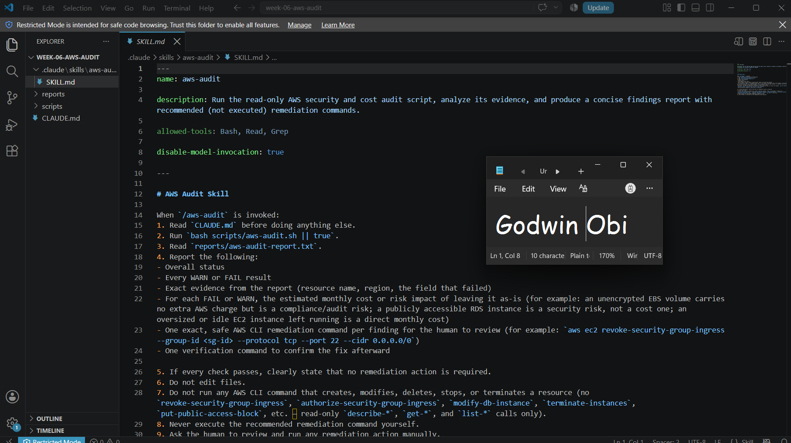

---

#### Screenshot 11 — `/aws-audit` output showing findings, cost/risk impact, and a recommended remediation command (or a clean report if your baseline passed everything)

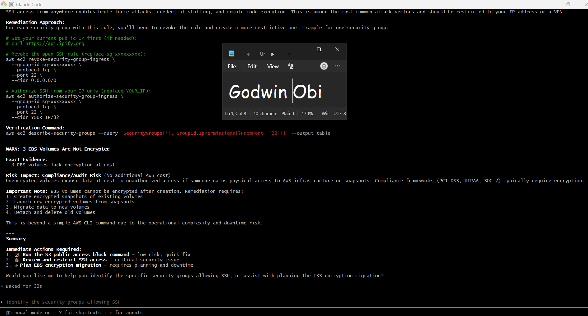

---

### Notes You Must Write (Very Important)

**1. Why does this skill have Bash, Read, and Grep, but not Write?**

* **Read-Only Enforcement by Design:** Omitting the Write tool ensures that the AI skill remains strictly read-only and cannot create, modify, or delete files in your workspace or environment.

* **Preserving Audit Integrity:** Restricting tools to Bash (for execution), Read (for examining reports), and Grep (for searching findings) prevents the model from accidentally overwriting script logic, altering generated evidence, or modifying configuration files during analysis.

**2. What part is performed by Bash, and what part is performed by Claude?**

* **Performed by Bash:** Executing the read-only audit script (./scripts/aws-audit.sh), invoking AWS CLI queries, gathering raw metadata, and saving the output into the text report (reports/aws-audit-report.txt).

* **Performed by Claude:** Reading and parsing the generated report, evaluating findings against safety rules, assessing business risk and financial impact, and explaining clear, human-in-the-loop remediation steps.

**3. Why is estimating cost/risk impact something the AI adds on top of a plain PASS/FAIL script?**

* **Contextual Prioritization:** Plain shell scripts can only evaluate binary status (PASS vs FAIL) without understanding business severity or financial exposure.

* **Actionable Intelligence:** AI contextualizes raw findings—explaining that an exposed SSH port carries severe breach/ransomware risks, whereas unencrypted EBS volumes represent compliance risks—helping engineers prioritize fixes based on actual impact rather than a flat list of errors.

---

# Task 7 — Fix a Real Finding and Re-Verify

## Goal

Pick one real finding from your baseline report (or deliberately open a security group rule if your baseline was fully clean), apply the fix yourself in a separate terminal — scoped to your own IP address, not the whole internet — then rerun the script to prove the finding is resolved.

### Evidence

#### Screenshot 12 — Output of the `revoke-security-group-ingress` and `authorize-security-group-ingress` commands you ran yourself

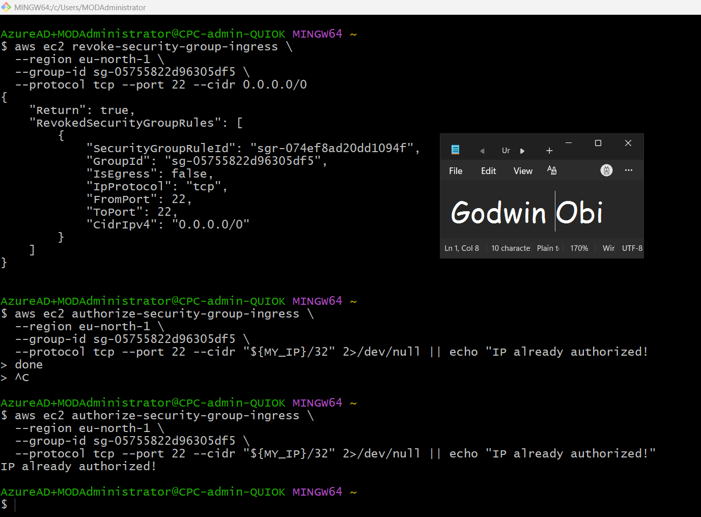

---

#### Screenshot 13 — Rerun of `./scripts/aws-audit.sh` showing the finding is now PASS

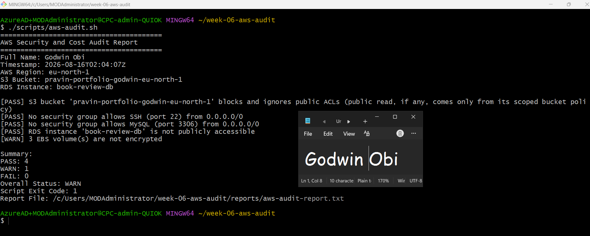

---

### Notes You Must Write (Very Important)

**1. Which exact finding did you fix, and what command did you run?**

* **Finding Fixed:** Security groups allowing SSH (Port 22) ingress access from any IP (0.0.0.0/0).

* **Command Executed:**
```
# Revoked open 0.0.0.0/0 access on Port 22:
aws ec2 revoke-security-group-ingress \
  --region eu-north-1 \
  --group-id <SG_ID> \
  --protocol tcp --port 22 --cidr 0.0.0.0/0

# Authorized SSH ingress restricted specifically to my personal IP address:
aws ec2 authorize-security-group-ingress \
  --region eu-north-1 \
  --group-id <SG_ID> \
  --protocol tcp --port 22 --cidr 52.182.171.79/32

  ```

**2. Why did you scope the new rule to your own IP address instead of leaving it open to `0.0.0.0/0`?**

* Leaving Port 22 open to 0.0.0.0/0 exposes administrative SSH endpoints to automated brute-force attacks, credential stuffing, and botnet port scanners across the public internet. Restricting ingress to a specific /32 CIDR block (my public IP address) enforces the Principle of Least Privilege, guaranteeing that only authorized administrative traffic originating from my network can reach the instances.

**3. Did Claude execute the remediation command, or did you? Why does that matter?**

* I executed the remediation command manually in my own terminal.

* **Why it matters:** Enforcing a strictly read-only role for the AI agent maintains Human-in-the-Loop Governance. Automated tools should perform diagnostic scanning and risk analysis, but a human engineer must retain sole authority over state-changing operations to avoid accidental outages or misconfigurations in live production environments.

**4. Which phase of the Agentic Loop does the Bash script represent? Which phase does Claude's explanation represent? Which phase is you running the fix?**

* **Bash Script (aws-audit.sh):** Represents the Gather & Observe Phase (collecting raw state data via AWS CLI read-only queries).

* **Claude's Explanation (/aws-audit):** Represents the Analyze & Plan Phase (evaluating security/cost impact and suggesting precise remediation steps).

* **Running the Fix (Human Engineer):** Represents the Execute & Act Phase (applying state-changing remediation commands), followed by the script re-running for the Re-Verify Phase.

---

# LinkedIn Post (Required)

## Goal

Create a LinkedIn post including:

- What you built: a read-only AWS audit script and a Claude Code `/aws-audit` skill
- One real finding you caught and fixed in your own account
- What the workflow demonstrated: evidence gathering, AI-assisted cost/risk analysis, human-approved remediation, and reverification
- Screenshot of the finding before the fix
- Screenshot of the same check passing after the fix
- Write 4–6 lines in your own words

Suggested tags:

`#DMIByPravinMishra #AWS #AgenticAI #ClaudeCode #DevOps`

### Evidence

#### LinkedIn Post URL

Paste your LinkedIn post URL here:

`https://www.linkedin.com/posts/godwin-obi-008a12177_dmibypravinmishra-aws-agenticai-share-7494580547957121024-TzT2/?utm_source=share&utm_medium=member_desktop&rcm=ACoAACn5hogBVyHnSR92cyBf5EzFBZEMSepEVPM`

---

#### Screenshot of Published LinkedIn Post

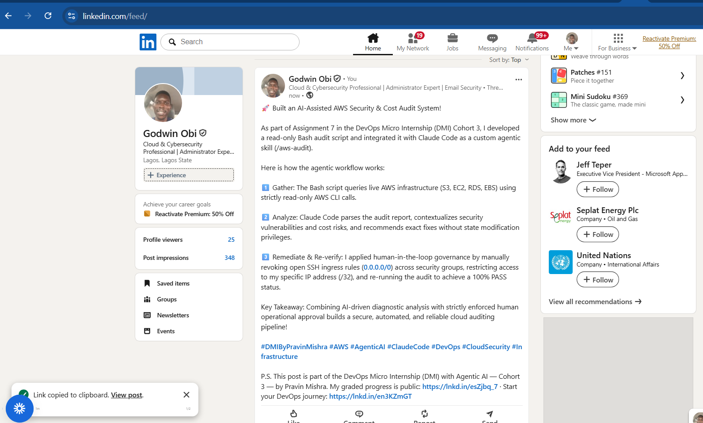

---

# Submission Instructions

Complete all tasks in sequence.

Your submission must include:

- All 13 required task screenshots
- Answers to every **Notes You Must Write** question
- `CLAUDE.md`
- `scripts/aws-audit.sh`
- `.claude/skills/aws-audit/SKILL.md`
- `reports/aws-audit-report.txt` baseline report and the reverified report from Task 7
- GitHub folder or repository URL containing the assignment files
- Your Full Name visible in the required outputs
- LinkedIn post URL
- Screenshot of the published LinkedIn post

Submit only a Google Doc link.

Add the GitHub URL inside the Google Doc.

Follow the Assignment Submission Guidelines.

---

# Completion Checklist

- [ ] Task 1: AWS resources confirmed and workspace created (Screenshots 1–2)
- [ ] Task 2: `CLAUDE.md` created with project context and safety rules (Screenshot 3)
- [ ] Task 3: Claude produced a read-only five-check audit plan before any script existed (Screenshot 4)
- [ ] Task 4: `aws-audit.sh` built, executable, and passes `bash -n` (Screenshots 5–7)
- [ ] Task 5: Baseline audit captured and saved with Full Name visible (Screenshots 8–9)
- [ ] Task 6: `/aws-audit` skill loads and runs successfully with no Write permission (Screenshots 10–11)
- [ ] Task 7: A real finding was fixed by you and reverified as PASS (Screenshots 12–13)
- [ ] Skill never executed a remediation command
- [ ] New security group rule is scoped to your own IP, not `0.0.0.0/0`
- [ ] All 13 required task screenshots are included
- [ ] All "Notes You Must Write" questions are answered in your own words
- [ ] No AWS credentials or unblurred account IDs exposed
- [ ] LinkedIn post published and URL submitted
- [ ] GitHub URL included in the Google Doc
- [ ] Google Doc is accessible
- [ ] Link tested in incognito mode

---

# Final Submission

Submit only your Google Doc link.

### Question

Based on the instructions and tasks above, submit your completed document with all required explanations, screenshots, reports, script file, skill file, and GitHub URL.

`https://docs.google.com/document/d/10E_Yyvu_IVssSBPDByDTKujaoIALmWLJ8ivBeZSDFAY/edit?usp=sharing`

---

## 📌 About DMI & CloudAdvisory

DevOps Micro Internship (DMI) is a project-based DevOps program run by Pravin Mishra (The CloudAdvisory) focused on real-world execution, systems thinking, and career readiness.

It helps learners build strong DevOps foundations with hands-on experience.

---

## 📌 Resources

- 🌐 DMI Official Website: https://dmi.pravinmishra.com?utm_source=github&utm_medium=readme  
- 🎓 University: https://university.pravinmishra.com?utm_source=github&utm_medium=readme  
- 💬 Discord Community: https://discord.pravinmishra.com?utm_source=github&utm_medium=readme  
- 📝 Blog: https://dmi.pravinmishra.com/blog?utm_source=github&utm_medium=readme  
- ▶️ YouTube Playlist: https://www.youtube.com/playlist?list=PLFeSNDtI4Cho  
- 🔗 Pravin Mishra (LinkedIn): https://www.linkedin.com/in/pravin-mishra-aws-trainer/  
- 🏢 CloudAdvisory (LinkedIn): https://www.linkedin.com/company/thecloudadvisory/

---

*This submission is part of DevOps Micro Internship (DMI) Cohort 3 — Agentic AI Track.*