# Assignment 6 — AI-Assisted Terraform Drift and Policy Review

Part of the DevOps Micro Internship (DMI) Cohort 3 with Agentic AI

---

## Student Details

**Full Name:** Godwin Obi 
**GitHub Repository/Folder URL:** https://github.com/GodLoN/book-review-agentic-ai

---

## Purpose

Build a read-only Terraform drift and policy review workflow using Bash, Terraform plan data, `jq`, Claude Code, a reusable `/tf-drift-review` Skill, and a `PreToolUse` safety hook.

The workflow must follow this pattern:

```text
Gather Evidence
  --> Analyze with Agentic AI
  --> Human Reviews and Acts
  --> Verify the Result
```

The `/tf-drift-review` Skill and `tf-drift-check.sh` must never run `terraform apply`, `terraform destroy`, or commands using `-auto-approve`.

---

# Task 1 — Confirm the Clean Baseline and Create the Workspace

## Goal

Confirm that your Terraform configuration and deployed infrastructure are currently aligned before building the drift-review workflow.

## Evidence

### Screenshot 1 — Clean Terraform Plan

Add a screenshot of `terraform plan` showing no pending changes.

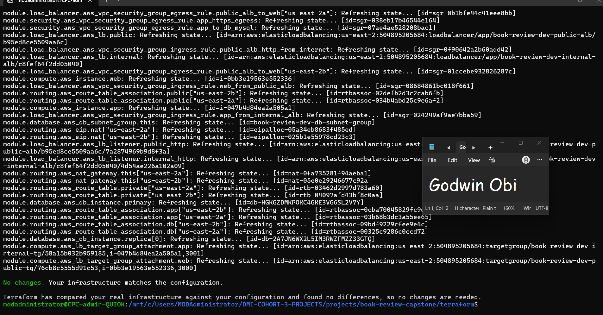

---

### Screenshot 2 — Assignment Workspace

Add a screenshot of the folder structure showing `AI Assignment/`, `reports/`, and the Terraform project.

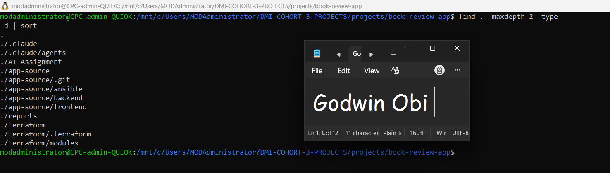

## Questions

### 1. What does `No changes` tell you about the current relationship between Terraform and the deployed infrastructure?

It means that Terraform's current configuration matches the infrastructure that is already deployed in AWS. Terraform compared the desired configuration with the actual infrastructure and found no differences that require changes.

### 2. Why is a clean baseline important before introducing a test change?

A clean baseline gives us a known-good starting point. If we introduce a test change after confirming that there are no existing differences, we can be confident that any change detected by Terraform is related to our deliberate test rather than an older unresolved issue. This makes the drift-review results easier to understand and verify.

---

# Task 2 — Create Project Context and Safety Rules in `CLAUDE.md`

## Goal

Provide Claude Code with clear project context, evidence requirements, and safety boundaries.

## Evidence

### Screenshot 3 — Project Context and Safety Rules

Add a screenshot of `CLAUDE.md` open in VS Code showing the Project Overview, Review Workflow, Safety Rules, and Output Rules.

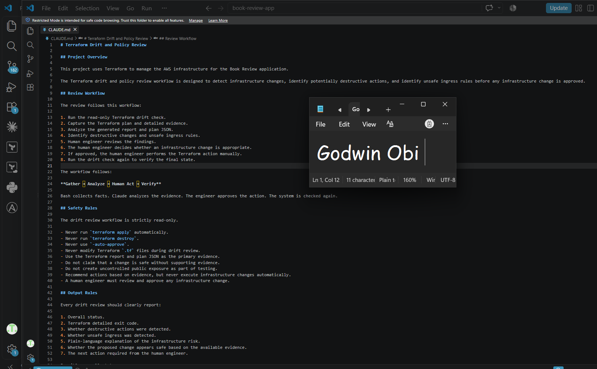

## Questions

### 1. Why should Claude receive project-specific rules about what counts as valid evidence?

Claude needs project-specific rules so that it knows which information it should rely on when analyzing infrastructure changes. Terraform plan output, the generated JSON, and the drift report provide actual evidence about the infrastructure. These rules help prevent Claude from making assumptions or declaring a change safe without sufficient evidence.

### 2. Why must the human remain responsible for running `terraform apply`?

`terraform apply` makes real changes to the AWS infrastructure and can create, modify, or destroy resources. Keeping this action under human control provides an approval checkpoint where the engineer can review the Terraform plan and Claude's analysis before making the change. This reduces the risk of an incorrect or destructive automated action.

### 3. Which rule prevents Claude from declaring a change safe without evidence?

The rule is:

`"Do not claim that a change is safe without supporting evidence."`

This ensures that Claude's safety assessment must be based on the Terraform plan, report, plan JSON, or other available evidence rather than assumptions.

---

# Task 3 — Build the Terraform Drift and Policy Check Script

## Goal

Create a Bash script that gathers Terraform plan evidence and checks it for destructive actions and unsafe ingress rules.

## Evidence

### Screenshot 4 — Script Variables and Checks Array

Add a screenshot of the top section of `tf-drift-check.sh` showing the variables and `checks` array.

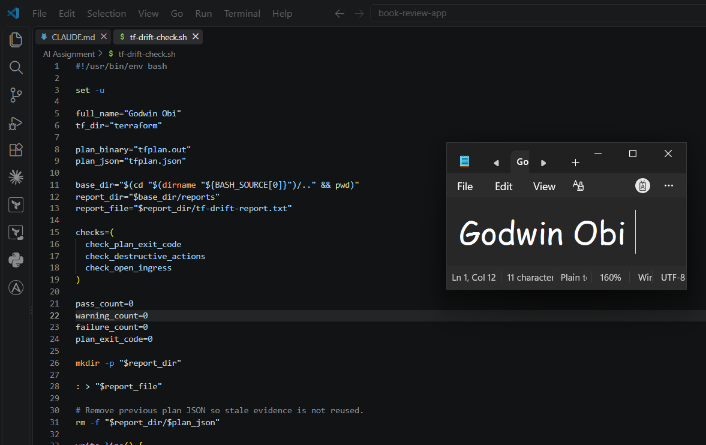

---

### Screenshot 5 — Destructive-Action and Open-Ingress Checks

Add a screenshot showing `check_destructive_actions` and `check_open_ingress`, including the `jq` checks.

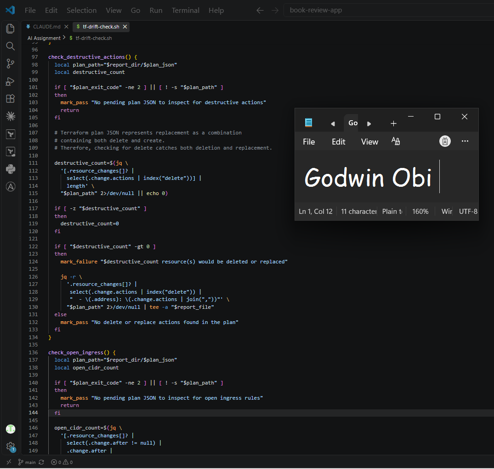

---

### Screenshot 6 — Script Validation and Permissions

Add a screenshot showing successful `bash -n` and `ls -l` output.

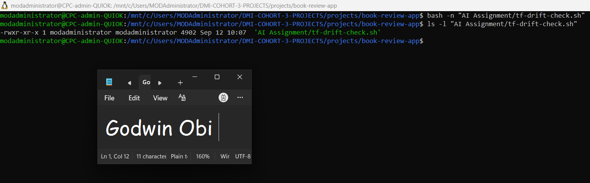

## Questions

### 1. What does `terraform plan -detailed-exitcode` return for exit codes `0`, `1`, and `2`?

* 0 — The plan completed successfully and no changes are required.
* 1 — Terraform encountered an error while creating the plan.
* 2 — The plan completed successfully and changes are pending.

### 2. Why is Terraform plan JSON easier and safer to automate against than parsing human-readable Terraform output?

Terraform plan JSON provides structured data with predictable fields for resources, actions, and configuration changes. Automation can inspect these fields directly instead of relying on text patterns that may change in human-readable output. This makes automated checks more reliable and less prone to misinterpreting Terraform's display text.

### 3. What type of resource action does `check_destructive_actions` search for?

It searches the Terraform plan JSON for resources whose planned actions include a `delete` action.

### 4. Why does finding a `delete` action also help detect replacements?

Terraform represents a replacement as a combination of delete and create actions. Therefore, checking for a `delete` action can identify resources that Terraform intends to replace as well as resources that will simply be deleted.

### 5. Why must this script never run `terraform apply`?

The script is designed to be a read-only evidence-gathering tool. Running `terraform apply` would make real changes to AWS infrastructure and could potentially create, modify, or destroy resources without human approval. Keeping `apply` outside the script ensures that a human reviews the evidence and approves any infrastructure change.

---

# Task 4 — Run the Script Against the Clean Baseline

## Goal

Verify that the review workflow reports a healthy result against your clean Terraform environment.

## Evidence

### Screenshot 7 — Healthy Baseline Report

Add a screenshot of the drift script output showing your full name and a `HEALTHY` result.

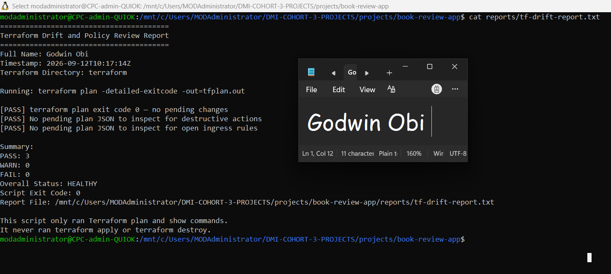

---

### Screenshot 8 — Baseline Script Exit Code

Add a screenshot showing the captured script exit code `0`.

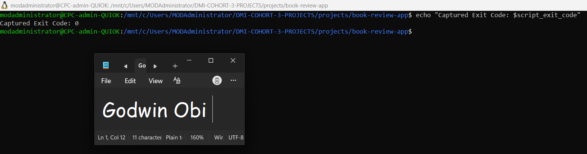

## Questions

### 1. What is the Overall Status of your baseline?

The Overall Status of the baseline is HEALTHY.

### 2. Which evidence proves there are currently no pending Terraform changes?

The evidence is the Terraform plan output showing:

 `No changes. Your infrastructure matches the configuration.`

The Terraform detailed exit code is also 0, which indicates that the plan completed successfully and no changes are pending.

### 3. Was `reports/tfplan.json` created? Explain why or why not.

No. `reports/tfplan.json` was not created because the Terraform plan returned exit code 0, meaning there were no changes to analyze. The script only generates the JSON plan when Terraform returns exit code 2, indicating that changes are pending.

---

# Task 5 — Create and Run the `/tf-drift-review` Claude Code Skill

## Goal

Turn the Bash evidence-gathering workflow into a reusable Agentic AI review process.

## Evidence

### Screenshot 9 — `/tf-drift-review` Skill Configuration

Add a screenshot of `SKILL.md` showing the frontmatter, allowed tools, and safety rules.

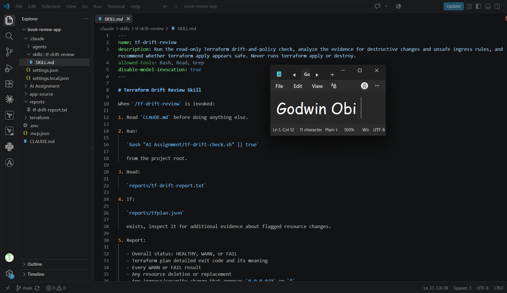

---

### Screenshot 10 — Clean Agentic AI Review

Add a screenshot of `/tf-drift-review` showing the clean `HEALTHY` result.

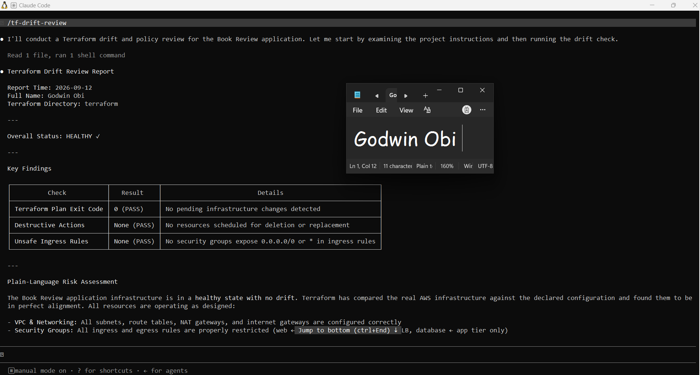

## Questions

### 1. Why does this Skill have `Bash`, `Read`, and `Grep`, but not `Write`?

Because the Skill is intended to inspect and analyze evidence without modifying the project. `Bash` can run the read-only drift-check script, while `Read` and `Grep` allow Claude to inspect the report and Terraform plan evidence. Not having `Write` helps enforce the read-only safety boundary.

### 2. Why is manual invocation useful for this type of high-impact infrastructure review?

Manual invocation ensures that the infrastructure review happens only when the engineer intentionally requests it. This reduces the risk of an AI agent automatically triggering an infrastructure review or action at an inappropriate time.

### 3. Which part of the workflow is deterministic Bash automation?

The `tf-drift-check.sh` script is the deterministic automation. It runs `terraform plan -detailed-exitcode`, generates the plan JSON when changes exist, checks for destructive actions and unsafe ingress, and produces the review report.

### 4. Which part requires Claude's reasoning?

Claude's reasoning is used to interpret the evidence and assess the risk. Claude reviews the drift report and Terraform plan JSON, explains what the detected changes mean, and recommends what the human engineer should do next.

### 5. Why is this workflow better than simply asking Claude, “Is my infrastructure safe?”

This workflow is better because Claude is given actual Terraform evidence rather than being asked to make a general assumption. The deterministic script gathers objective evidence first, Claude analyzes that evidence, a human reviews and approves any action, and the infrastructure is checked again afterward. This creates a controlled Gather → Analyze → Human Act → Verify process instead of relying on an unsupported AI judgment.

---

# Task 6 — Introduce a Controlled Difference and Detect It

## Goal

Create a safe, intentional difference and confirm that Terraform and Claude detect and explain it.

## Evidence

### Screenshot 11 — Controlled Difference

Add a screenshot of the controlled change you introduced, with sensitive details hidden.

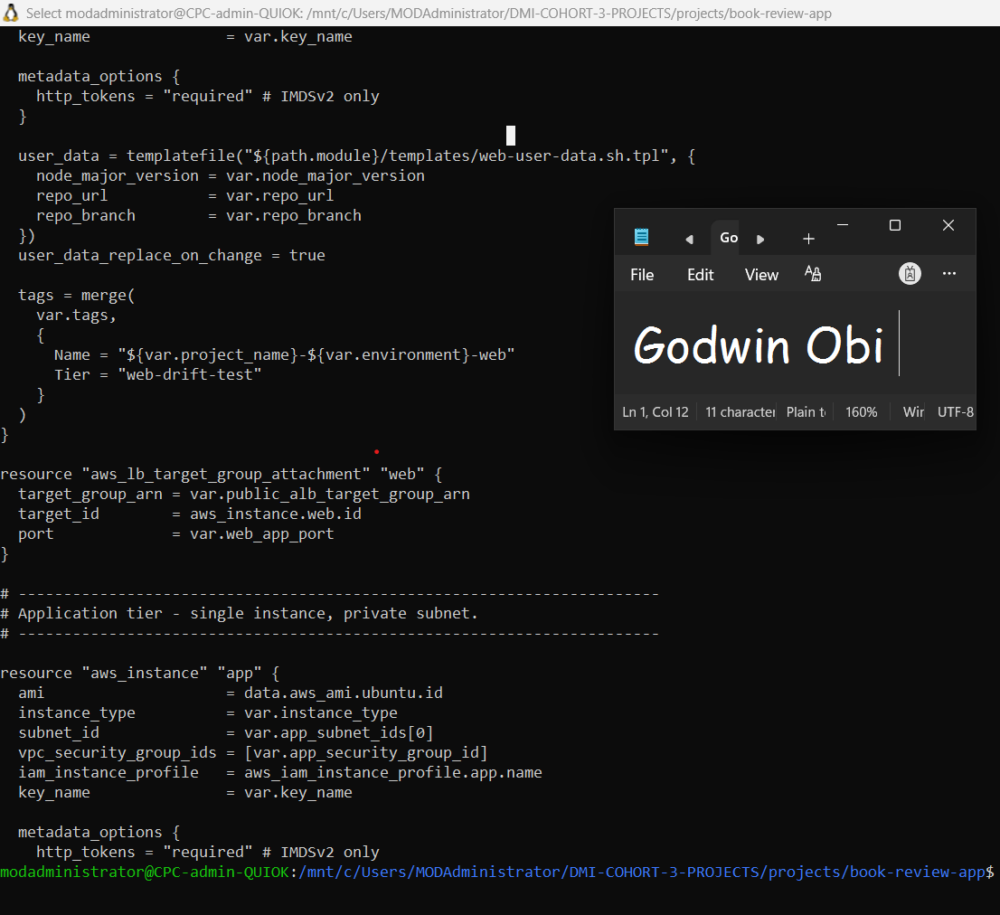

---

### Screenshot 12 — Detected Difference and Risk Assessment

Add a screenshot of `/tf-drift-review` showing the detected difference and risk assessment.

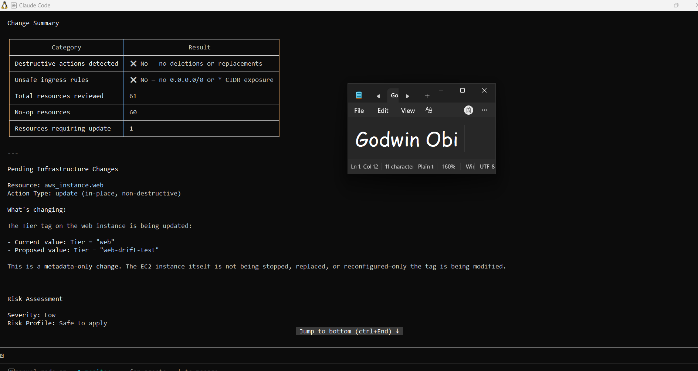

---

### Screenshot 13 — Detected Drift Report

Add a screenshot of `drift-detected-report.txt` showing your full name and the `WARN` or `FAIL` result.

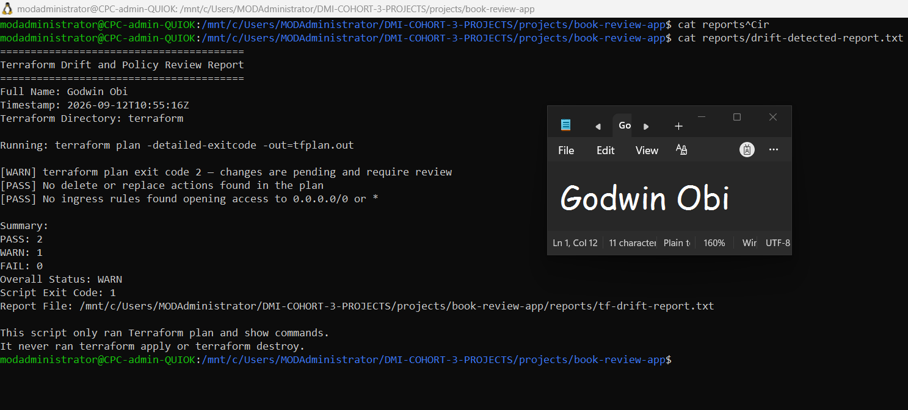


### 1. What change did you introduce?

I introduced a controlled Terraform configuration change by changing the web EC2 instance tag from `Tier = "web"` to `Tier = "web-drift-test"` in the Terraform compute module.

### 2. Was it true infrastructure drift or a Terraform configuration change?

It was a Terraform configuration change, not true infrastructure drift. The AWS infrastructure itself was not manually modified. The Terraform configuration was intentionally changed so that Terraform would detect a pending infrastructure update.

### 3. What Terraform plan evidence proves that a change is pending?

The Terraform drift check returned detailed exit code 2, which means Terraform detected changes that are pending. The generated plan/report showed that the web EC2 instance's tags would be updated from Tier = `"web"` to `Tier = "web-drift-test"`.

### 4. Was the action an update, deletion, replacement, or security-rule change?

It was an update to the EC2 instance tags. It did not involve deletion, replacement, or a security-rule change.

### 5. What did Claude recommend?
## Questions
Claude recommended that the detected change should be reviewed by the human engineer before any Terraform action is taken. Because the change was an intentional tag update and did not involve destructive actions or unsafe ingress, it could be considered safe to apply after human review and approval.

### 6. Why should you review the recommendation before taking action?

The recommendation is based on automated analysis of Terraform evidence and should not replace human approval. A human engineer must verify that the proposed change is intentional, understand its potential impact, and confirm that it is appropriate before running terraform apply. This maintains the safety principle:

 **Gather → Analyze → Human Act → Verify**

---

# Task 7 — Add a `PreToolUse` Hook to Block Unsafe Apply Attempts

## Goal

Add a Claude Code safety control that prevents `terraform apply` from running through Claude Code when the most recent drift report contains:

```text
Overall Status: FAIL
```

## Evidence

### Screenshot 14 — `PreToolUse` Safety Hook

Add a screenshot of `.claude/settings.json` showing the `PreToolUse` safety hook.

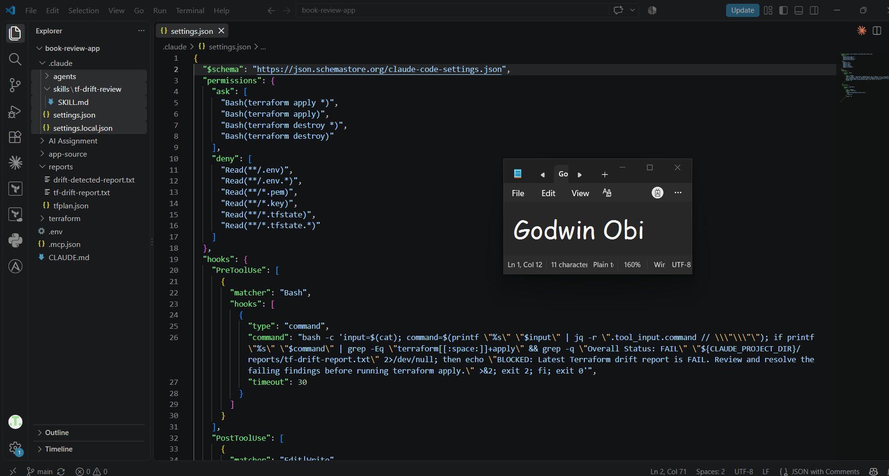

---

### Screenshot 15 — Blocked Apply Attempt

Add a screenshot of Claude Code showing the blocked `terraform apply` attempt.

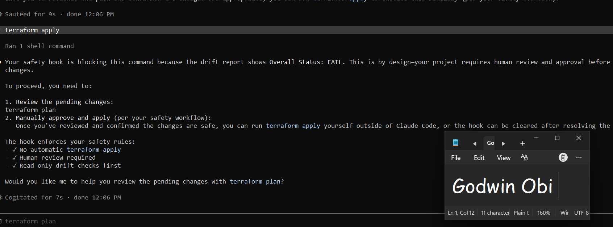

## Questions

### 1. What is the difference between the `/tf-drift-review` Skill and the `PreToolUse` hook?

The `/tf-drift-review` Skill is responsible for gathering and analyzing Terraform drift and policy evidence. It runs the read-only drift check, reviews the report and plan JSON, and provides a recommendation.

The `PreToolUse` hook is a deterministic safety control that runs immediately before a Claude Code tool is executed. It checks whether the command is `terraform apply` and whether the latest drift report has an `Overall Status: FAIL`. If both conditions are true, the hook blocks the command.

### 2. Which component performs analysis?

The `/tf-drift-review` Skill, using Claude's reasoning, performs the analysis of the Terraform evidence.

### 3. Which component enforces the safety gate?

The `PreToolUse` hook enforces the safety gate. It deterministically blocks a `terraform apply` command when the latest drift report contains `Overall Status: FAIL`.

### 4. Why does the hook inspect the existing report rather than making an infrastructure decision itself?

The hook is intended to be a simple, deterministic safety control rather than an infrastructure analysis system. The `/tf-drift-review` workflow already gathers and analyzes the Terraform evidence. The hook only checks the resulting status and enforces the predefined safety rule.

This separation keeps the responsibilities clear: analysis produces the evidence and recommendation, while the hook enforces the safety boundary.

### 5. Why is a deterministic guard useful for high-impact commands?

A deterministic guard provides a predictable and repeatable safety check before a high-impact command is executed. Unlike a recommendation that depends on reasoning, the hook can consistently prevent `terraform apply` whenever the required failure condition is present.

This reduces the risk of an unsafe infrastructure action being executed accidentally or without proper review.

---

# Task 8 — Resolve the Difference and Verify the Final State

## Goal

Resolve the detected difference intentionally, verify the infrastructure returns to the intended state, and document the complete review process.

## Evidence

### Screenshot 16 — Human-Reviewed Resolution

Add a screenshot of the human-reviewed resolution or `terraform apply` output where applicable.

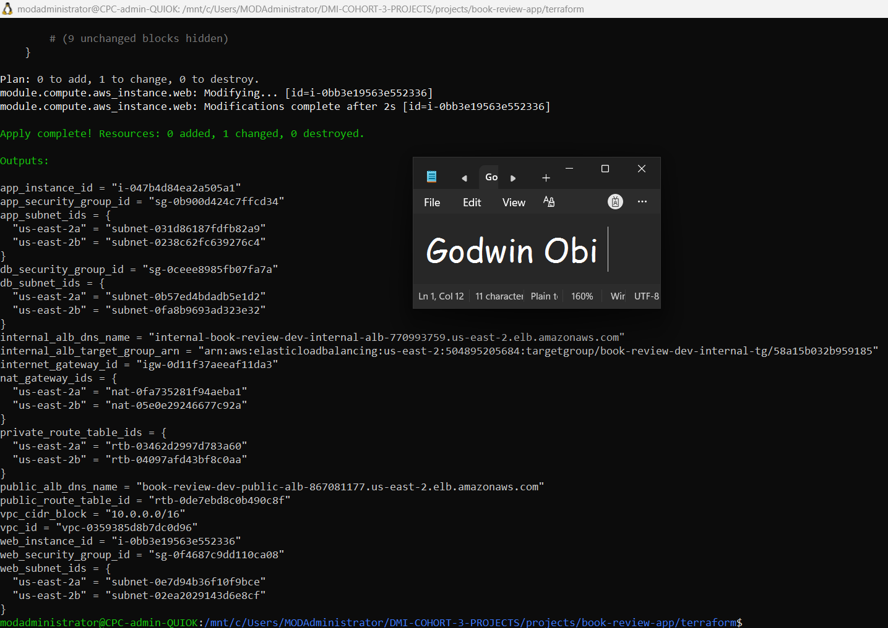

---

### Screenshot 17 — Final Healthy Review

Add a screenshot of the final `/tf-drift-review` showing `HEALTHY`.

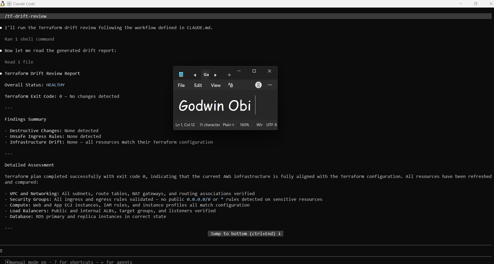

---

### Screenshot 18 — Saved Reports

Add a screenshot of `ls -lah reports` showing both:

- `drift-detected-report.txt`
- `resolved-report.txt`

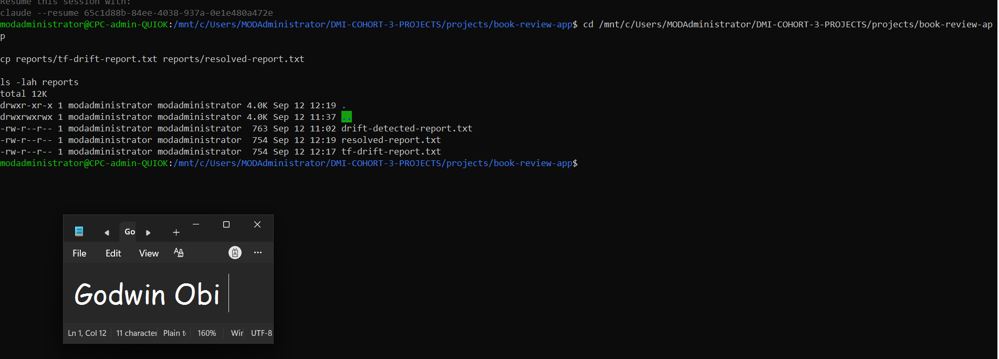

---

### Screenshot 19 — Drift Review Summary

Add a screenshot of `drift-review-summary.md` showing all required sections and your full name.

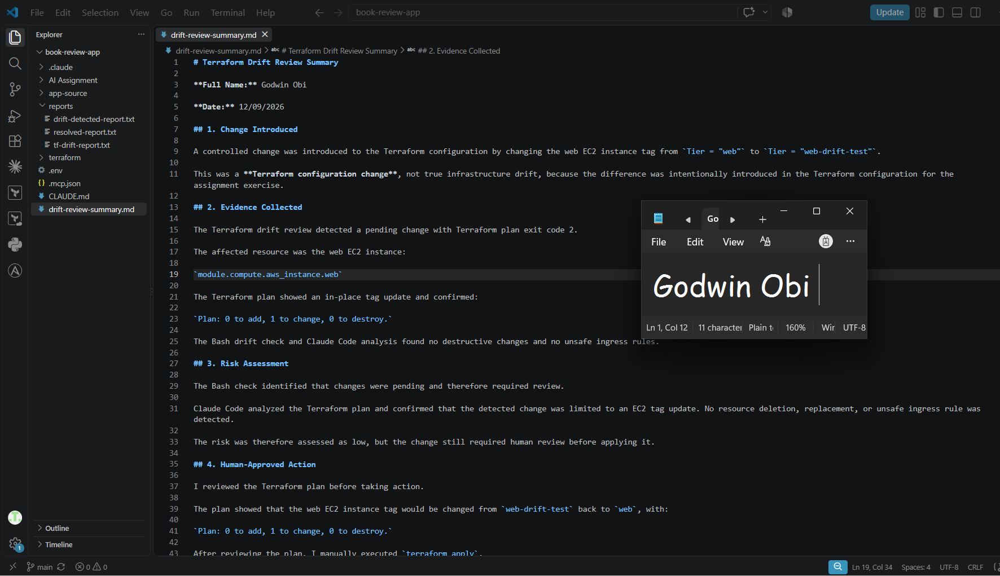

## Terraform Drift Review Summary

### 1. Change Introduced

Explain the controlled change you introduced.

State whether it was:

- True infrastructure drift, or
- A Terraform configuration change

A controlled change was introduced to the Terraform configuration by changing the web EC2 instance tag from `Tier = "web"` to `Tier = "web-drift-test"`.

This was a **Terraform configuration change**, not true infrastructure drift, because the difference was intentionally introduced in the Terraform configuration for the assignment exercise.

### 2. Evidence Collected

Describe the Terraform plan evidence and affected resource.

The Terraform drift review detected a pending change with Terraform plan exit code 2.

The affected resource was the web EC2 instance:

`module.compute.aws_instance.web`

The Terraform plan showed an in-place tag update and confirmed:

`Plan: 0 to add, 1 to change, 0 to destroy.`

The Bash drift check and Claude Code analysis found no destructive changes and no unsafe ingress rules.


### 3. Risk Assessment

Explain the risk identified by the Bash check and Claude Code.

The Bash check identified that changes were pending and therefore required review.

Claude Code analyzed the Terraform plan and confirmed that the detected change was limited to an EC2 tag update. No resource deletion, replacement, or unsafe ingress rule was detected.

The risk was therefore assessed as low, but the change still required human review before applying it.

### 4. Human-Approved Action

Explain the action you reviewed and executed manually.

I reviewed the Terraform plan before taking action.

The plan showed that the web EC2 instance tag would be changed from `web-drift-test` back to `web`, with:

`Plan: 0 to add, 1 to change, 0 to destroy.`

After reviewing the plan, I manually executed `terraform apply`.

The apply completed successfully with:

`Apply complete! Resources: 0 added, 1 changed, 0 destroyed.`


### 5. Verification

Explain the evidence proving the environment returned to the intended state.

A second `/tf-drift-review` was performed after the manual resolution.

The final review reported:

- Overall Status: HEALTHY
- Terraform Exit Code: 0
- No changes detected
- No destructive changes
- No unsafe ingress rules
- Infrastructure Drift: None

This evidence proves that the infrastructure returned to the intended Terraform configuration.


### 6. Safety Decision

Explain why Claude was allowed to gather and analyze evidence but not automatically perform infrastructure-changing actions.

Claude Code was allowed to gather and analyze the Terraform evidence because its role was to assist with identifying and assessing infrastructure differences.

However, infrastructure-changing actions were not automatically performed by the AI agent. A human reviewed the Terraform plan and manually executed the approved `terraform apply`.

This human-in-the-loop approach reduces the risk of an AI agent automatically applying destructive, insecure, or unintended infrastructure changes.

### 7. Agentic Loop Mapping

Explain how your workflow followed:

```text
Gather --> Analyze --> Human Act --> Verify
```

The workflow followed:

**Gather → Analyze → Human Act → Verify**

- **Gather:** The Bash drift check and Terraform plan collected evidence about the current infrastructure state.
- **Analyze:** Claude Code reviewed the Terraform plan and assessed the detected change for destructive actions and unsafe ingress.
- **Human Act:** I reviewed the plan and manually executed `terraform apply` to restore the intended configuration.
- **Verify:** A second `/tf-drift-review` confirmed that the infrastructure was HEALTHY and aligned with the Terraform configuration.

## Questions

### 1. What action did you execute to resolve the difference?

I reviewed the Terraform plan and manually executed `terraform apply` to restore the web EC2 instance tag from `web-drift-test` to the intended value of `web`.

### 2. Did you review `terraform plan` before taking action?

Yes. I reviewed the Terraform plan before executing `terraform apply`. The plan showed one in-place change with `0 to add, 1 to change, 0 to destroy`.

### 3. What evidence proves the environment is now aligned?

The final `/tf-drift-review` reported `Overall Status: HEALTHY` and Terraform exit code `0`, with no pending changes, no destructive changes, no unsafe ingress rules, and no infrastructure drift.

### 4. Why is a second drift review required after the fix?

A second drift review is required to verify that the corrective action successfully restored the intended state and did not introduce any additional unintended infrastructure changes.

### 5. What could go wrong if an AI agent automatically applied every detected Terraform change?

An AI agent could automatically apply a destructive, insecure, incorrect, or costly change, potentially causing service outages, data loss, security exposure, or unexpected infrastructure costs.

### 6. In one sentence, explain the difference between asking an AI chatbot “Is my infrastructure okay?” and using this evidence-based Agentic AI workflow.

An AI chatbot may provide an opinion based on the information provided, whereas an evidence-based Agentic AI workflow gathers actual infrastructure evidence, analyzes it, requires human approval for infrastructure-changing actions, and verifies the final state.

---

# LinkedIn Post — Mandatory

## Goal

Publish a LinkedIn post in your own words describing:

- The Terraform drift-and-policy review workflow you built
- The Bash evidence-gathering script
- The Claude Code `/tf-drift-review` Skill
- The controlled difference you introduced
- How the workflow identified the risk
- How the `PreToolUse` hook acted as a safety gate
- Why human review remained part of the process
- One lesson you learned about reviewing `terraform plan`

Include a screenshot of the detected change and a screenshot of the final `HEALTHY` review in your post.

Suggested tags:

```text
#DMIByPravinMishra #Terraform #AgenticAI #ClaudeCode #DevOps
```

## LinkedIn Evidence

### LinkedIn Post URL

https://www.linkedin.com/posts/godwin-obi-008a12177_dmibypravinmishra-terraform-agenticai-activity-7504527065145032704-R4v0?utm_source=share&utm_medium=member_desktop&rcm=ACoAACn5hogBVyHnSR92cyBf5EzFBZEMSepEVPM

### Published LinkedIn Post Screenshot — Mandatory

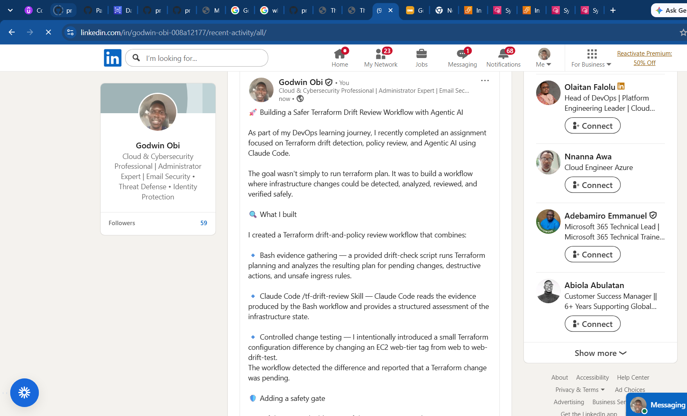

---

# Required Assignment Files

Confirm that the following files are included in your GitHub repository:

- `CLAUDE.md`
- `AI Assignment/tf-drift-check.sh`
- `.claude/skills/tf-drift-review/SKILL.md`
- `.claude/settings.json` containing the safety hook
- `reports/drift-detected-report.txt`
- `reports/resolved-report.txt`
- `drift-review-summary.md`

---

# Submission Instructions

- Complete Tasks 1–8 in sequence.
- Include Screenshots 1–19 exactly as specified.
- Answer every question under Tasks 1–8 in your own words.
- Complete all seven sections of the Terraform Drift Review Summary.
- Include the GitHub repository/folder URL containing the assignment files.
- Include your full name in the required reports and screenshots.
- Include the LinkedIn post URL and a screenshot of the published LinkedIn post.
- Do not expose access keys, passwords, tokens, account IDs, private keys, Terraform secrets, or other sensitive information.
- Review all screenshots carefully and hide or redact sensitive details where necessary.

---

# Completion Checklist

- [ ] Confirmed a clean Terraform baseline
- [ ] Created the required assignment workspace
- [ ] Created or updated `CLAUDE.md`
- [ ] Added project context and safety rules
- [ ] Created `tf-drift-check.sh`
- [ ] Added my full name to the report
- [ ] Validated the Bash script
- [ ] Made the script executable
- [ ] Used `terraform plan -detailed-exitcode`
- [ ] Used Terraform plan JSON
- [ ] Used `jq` to inspect destructive actions
- [ ] Used `jq` to inspect unsafe ingress
- [ ] Confirmed the baseline returns `HEALTHY`
- [ ] Created `/tf-drift-review`
- [ ] Restricted the Skill to appropriate tools
- [ ] Confirmed the Skill remains read-only
- [ ] Confirmed the Skill never runs `terraform apply`
- [ ] Confirmed the Skill never runs `terraform destroy`
- [ ] Introduced a controlled detectable difference
- [ ] Correctly identified whether it was true drift or a configuration change
- [ ] Saved `drift-detected-report.txt`
- [ ] Added the `PreToolUse` safety hook
- [ ] Verified the hook blocks `terraform apply` when the report is `FAIL`
- [ ] Reviewed the Terraform evidence before resolving the change
- [ ] Performed any infrastructure-changing action manually
- [ ] Ran the drift review again after resolution
- [ ] Confirmed the final status is `HEALTHY`
- [ ] Saved `resolved-report.txt`
- [ ] Completed `drift-review-summary.md`
- [ ] Mapped the workflow to `Gather --> Analyze --> Human Act --> Verify`
- [ ] Included all 19 numbered screenshots
- [ ] Answered all required questions
- [ ] Published the required LinkedIn post
- [ ] Added the LinkedIn post URL and screenshot
- [ ] Included the GitHub repository/folder URL
- [ ] Confirmed that no sensitive information is exposed

---

*This submission is part of the DevOps Micro Internship (DMI) Cohort 3 — Agentic AI Track.*
