# Assignment 02 — Provision Linux VMs with Terraform and Run Ansible Ad-Hoc Commands

Part of the DevOps Micro Internship (DMI) Cohort 3 with Agentic AI

---

## Purpose

In this assignment, you will use Terraform to provision three or four Ubuntu Linux Virtual Machines on either Microsoft Azure or Amazon Web Services.

You will configure SSH key-based authentication, organize the servers using a custom Ansible inventory, and run Ansible ad-hoc commands across individual hosts and inventory groups.

---

# Task 1 — Create the Multi-Host Lab Structure

## Goal

Create a separate project directory for the multi-host lab and prepare the Terraform, Ansible, and documentation files.

This project will use the Git repository and Ansible controller prepared in Assignment 01.

### Evidence

#### Screenshot 1 — Terminal showing the complete `ansible-adhoc-lab` project structure

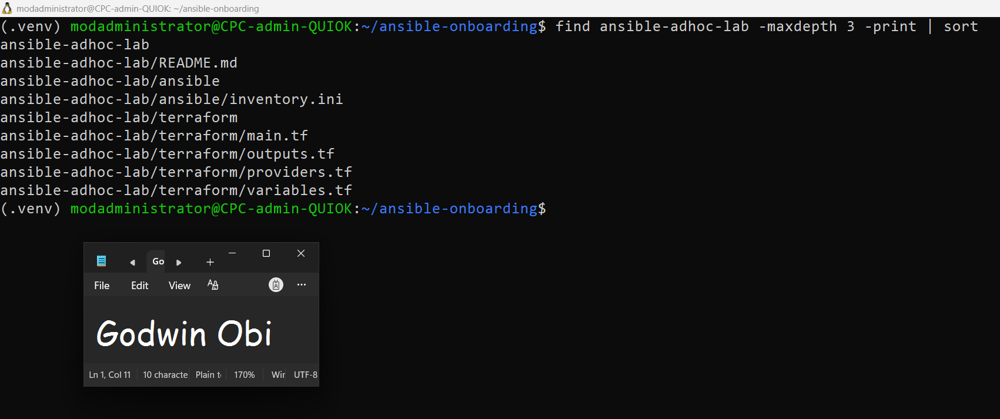

---

#### Screenshot 2 — Terminal showing `git status --short` with the new project files and updated `.gitignore`

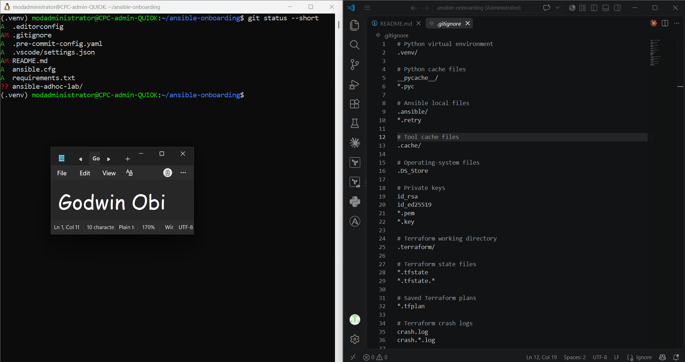

---

### Notes

* **Environment Activation:** Activated the existing Python virtual environment (`source .venv/bin/activate`) within the `~/ansible-onboarding` workspace prepared in Assignment 01.

* **Directory & File Hierarchy:** Successfully initialized the `ansible-adhoc-lab` directory structure using `mkdir -p` and provisioned all necessary configuration files:

*   `terraform/`: `providers.tf`, `main.tf`, `variables.tf`, and `outputs.tf` for infrastructure provisioning.

*   `ansible/`: `inventory.ini` for host grouping and SSH connection variables.

*   `README.md`: Documentation root for the multi-host ad-hoc lab.

* **Version Control Security:** Updated the top-level `.gitignore` file to explicitly exclude Terraform working directories (`.terraform/`), state files (`*.tfstate`, `*.tfstate.*`), plan files (`*.tfplan`), and runtime crash logs (`crash.log`).

* **Dependency Locking:** Kept `.terraform.lock.hcl` unignored to ensure deterministic provider version pinning across environments.

* **Single Repository Architecture:** Verified with `git status --short` that no nested Git repository was initialized. All new files remain tracked under the primary `ansible-onboarding` repository without exposing credentials or state files.

---

# Task 2 — Create the Terraform Configuration

## Goal

Create the Terraform configuration required to provision three or four Ubuntu Linux VMs on your selected cloud platform.

Complete only one option:

- Option A — Microsoft Azure
- Option B — Amazon Web Services

Do not configure both providers for this assignment.

### Evidence

#### Screenshot 3 — Terraform configuration showing the three or four server roles and the `for_each` or `count` implementation

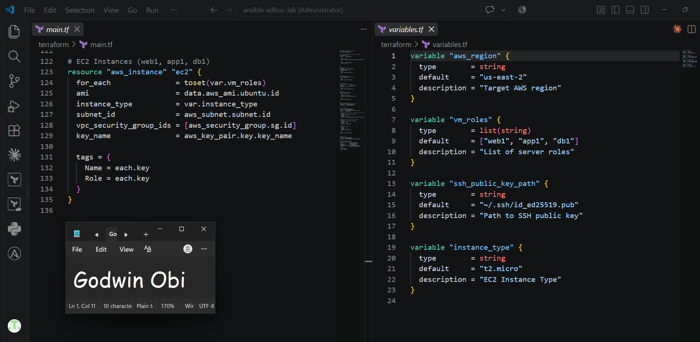

---

#### Screenshot 4 — Terraform configuration showing SSH restricted to the controller IP and HTTP allowed only for web hosts

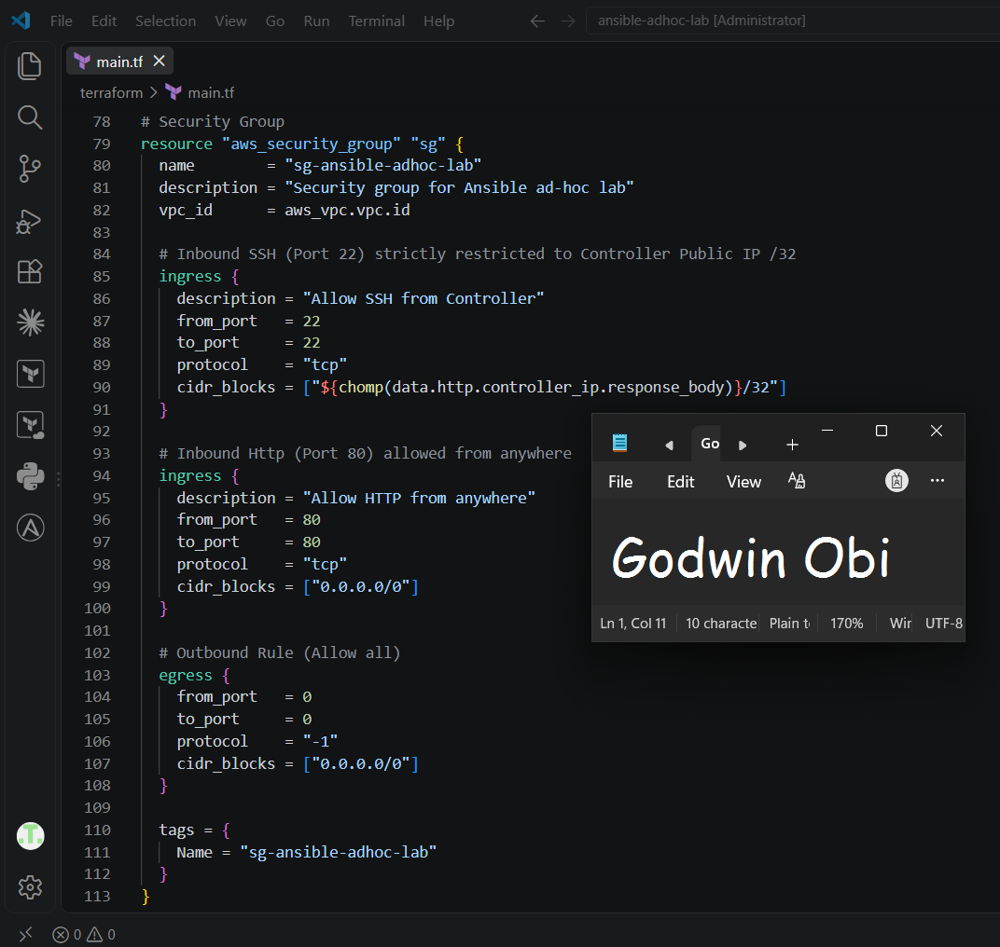

---

#### Screenshot 5 — Terraform output configuration showing how public IP addresses are associated with the server roles

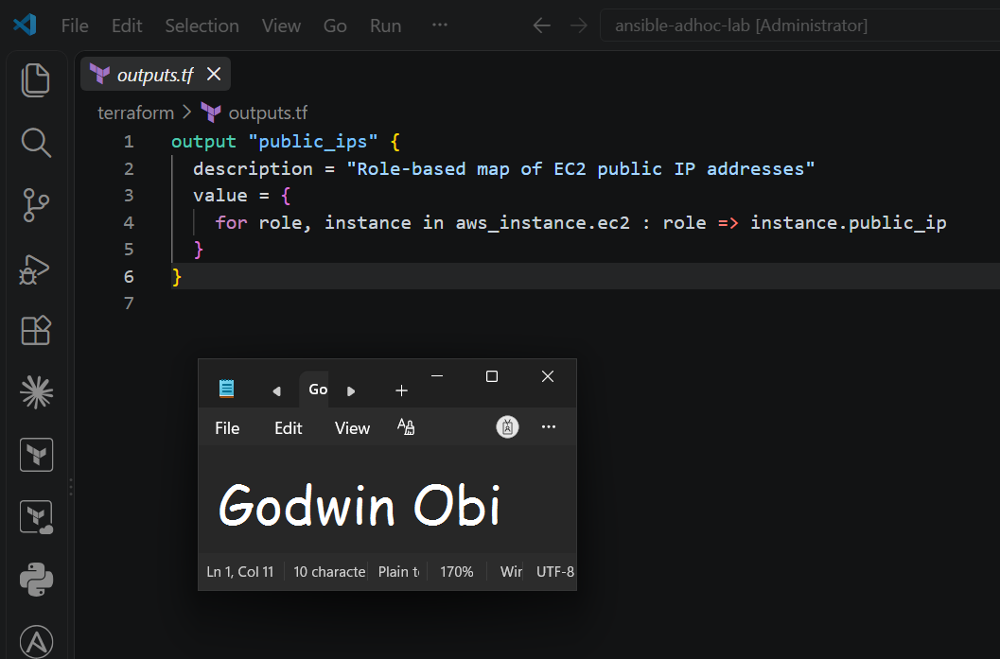

---

### Notes

* **Cloud Provider Selection:** Selected Amazon Web Services (AWS) as the primary cloud infrastructure provider, declaring provider specifications within `providers.tf`.

* **Dynamic IP Resolution:** Integrated the http provider data source (`[https://api.ipify.org](https://api.ipify.org)`) in `main.tf` to programmatically extract the Ansible controller's public IP address, eliminating hardcoded local credentials.

* **Declarative Networking & Security:** Provisioned a custom VPC (`vpc-ansible-adhoc-lab`, `10.0.0.0/16`), public subnet (`10.0.1.0/24`), Internet Gateway, route table, and dedicated security group (`sg-ansible-adhoc-lab`). Strictly restricted inbound SSH access (Port 22) to the controller's `/32` IP and permitted public HTTP access (Port 80).

* **Role-Based Iteration:** Configured `variables.tf` with `var.vm_roles` set to `["web1", "app1", "db1"]`. Deployed Ubuntu 22.04 LTS EC2 instances (`t2.micro`) efficiently via `for_each = toset(var.vm_roles)` without repetitive resource definitions.

* **Authentication & Key Management:** Associated the instances with `ansible-adhoc-key` referencing the controller's existing SSH public key (`~/.ssh/id_ed25519.pub`) using `file(pathexpand(...))`.

* **Structured Output Mapping:** Formatted `outputs.tf` to generate a `public_ips` map (`role => instance.public_ip`), enabling streamlined inventory management for Ansible ad-hoc tasks.

---

# Task 3 — Provision the Infrastructure with Terraform

## Goal

Initialize and validate the Terraform configuration, review the execution plan, provision the selected three or four VMs, and retrieve their public IP addresses.

### Evidence

#### Screenshot 6 — Final `terraform apply` output showing `Apply complete`

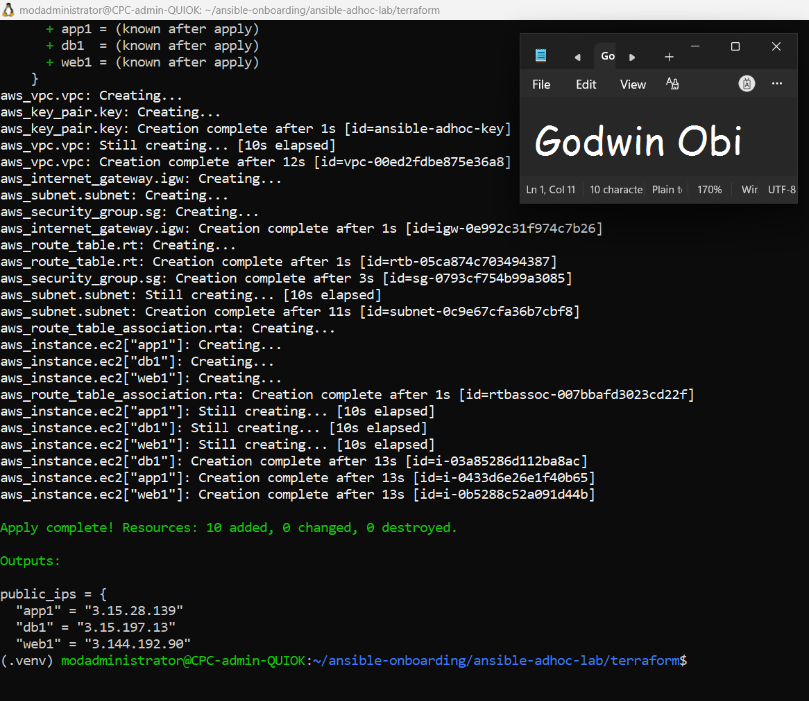

---

#### Screenshot 7 — `terraform output public_ips` showing the role-to-IP mapping for all three or four VMs

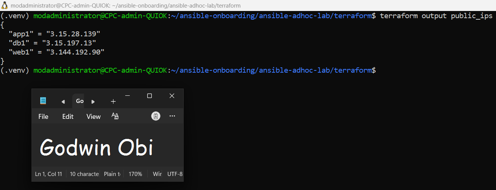

---

#### Screenshot 8 — Azure Portal or AWS Management Console showing all three or four VMs in the `Running` state, with their role-based names visible

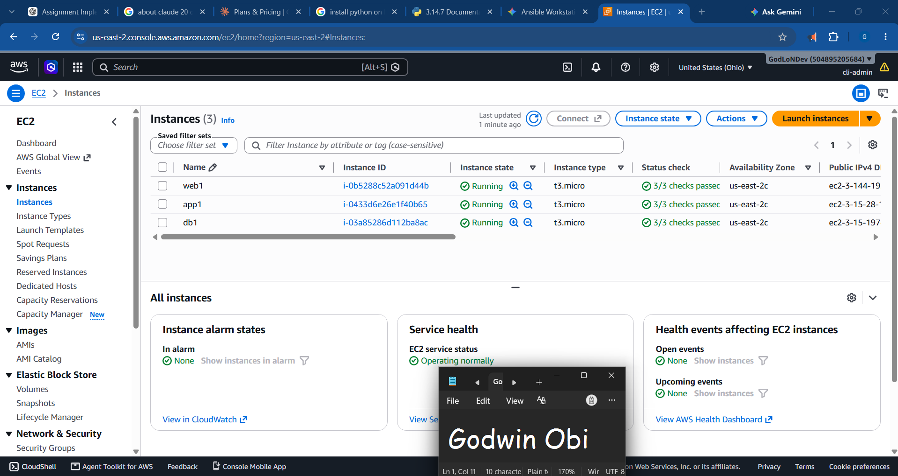

---

### Notes

**Provision Infrastructure**

* **Execution & Provisioning:** Successfully ran `terraform init`, `terraform validate`, and `terraform apply -auto-approve` to provision all required cloud infrastructure resources in AWS (`us-east-2`).

* **Resource Count:** Successfully instantiated 10 resources including 1 VPC, 1 Subnet, 1 Internet Gateway, 1 Route Table, 1 Route Table Association, 1 Security Group, 1 Key Pair, and 3 EC2 Instances (`web1`, `app1`, `db1`).

* **Instance Specification Adjustment:** Configured instance types to `t3.micro` to maintain alignment with AWS regional free-tier resource requirements in `us-east-2`.

* **Output Verification:** Executed `terraform output public_ips` to extract assigned dynamic IPv4 addresses (`app1 = 3.15.28.139`, `db1 = 3.15.197.13`, `web1 = 3.144.192.90`).

* **Cloud Console Audit:** Validated in the AWS EC2 Management Console that all instances passed initial status checks and entered the `Running` state.

---

# Task 4 — Verify SSH Key-Based Access

## Goal

Verify that each managed VM can be accessed from the Ansible controller using SSH key-based authentication.

### Evidence

#### Screenshot 9 — Terminal showing successful SSH hostname output from all VMs

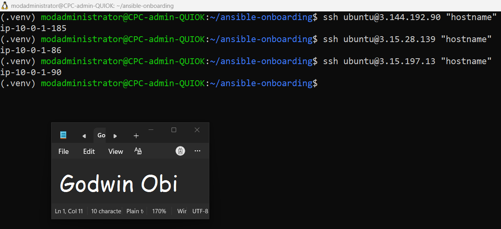

---

### Notes

* **Public IP Identification:** Queryed the Terraform deployment outputs using `terraform output public_ips` to obtain the assigned IPv4 addresses for the provisioned infrastructure (`web1`, `app1`, `db1`).

* **SSH Authentication Verification:** Verified key-based, passwordless SSH connectivity from the Ansible controller to each remote target using the default AWS Ubuntu user (`ubuntu`) and specified private key (`~/.ssh/id_ed25519`).

* **Remote Hostname Resolution:** Successfully executed non-interactive remote commands (`ssh ubuntu@<IP> "hostname"`) against all three EC2 instances, confirming valid SSH fingerprint acceptance and active instance availability.

* **Instance Hostname Mapping:** Confirmed proper host identification across the topology, returning internal instance hostnames for each deployed node:

*   `web1` (`3.144.192.90`): `ip-10-0-1-185`

*   `app1` (`3.15.28.139`): `ip-10-0-1-86`

*   `db1` (`3.15.197.13`): `ip-10-0-1-90`

* **Access Validation:** Confirmed that network security group rules, public routing, and SSH key pairs functioned properly without encountering `Permission denied (publickey)` or password authentication prompts.

---

# Task 5 — Create the Custom Ansible Inventory

## Goal

Create an Ansible inventory file that groups the managed VMs by role.

The inventory allows Ansible to run commands against all servers, or only specific groups such as `web`, `app`, or `db`.

### Evidence

#### Screenshot 10 — `inventory.ini` showing the `web`, `app`, and `db` groups

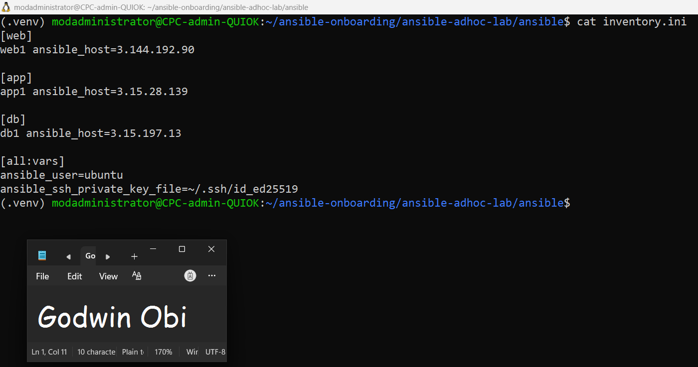

---

#### Screenshot 11 — Output of `ansible-inventory -i inventory.ini --graph`

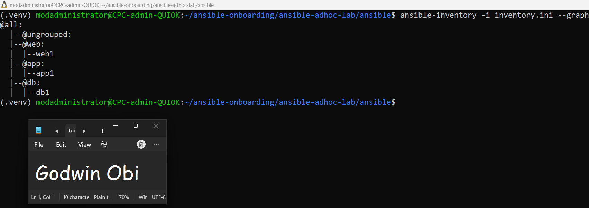

---

### Notes

* **Inventory Configuration:** Created `inventory.ini` in `~/ansible-onboarding/ansible-adhoc-lab/ansible` mapping target hosts by infrastructure role:

*   `web1`: `3.144.192.90`

*   `app1`: `3.15.28.139`

*   `db1`: `3.15.197.13`

* **Global Connection Variables:** Configured `[all:vars]` to standardize remote authentication across all groups using `ansible_user=ubuntu` and `ansible_ssh_private_key_file=~/.ssh/id_ed25519`.

* **Local Configuration Setup:** Provisioned a local `ansible.cfg` file with `host_key_checking = False` to prevent interactive SSH key fingerprint prompts during lab automation turns.

* **Graph Structure Verification:** Ran `ansible-inventory -i inventory.ini --graph` to validate structure parsing, verifying that host groups and parent-child hierarchy parsed cleanly under the `@all` root node.

---

# Task 6 — Run Ansible Ad-Hoc Commands

## Goal

Run Ansible ad-hoc commands from the controller to verify connectivity, check server information, and manage packages and services across inventory groups.

This task proves that the inventory is working and that Ansible can control multiple managed VMs without writing a playbook.

### Evidence

#### Screenshot 12 — Output of `ansible all -i inventory.ini -m ping`

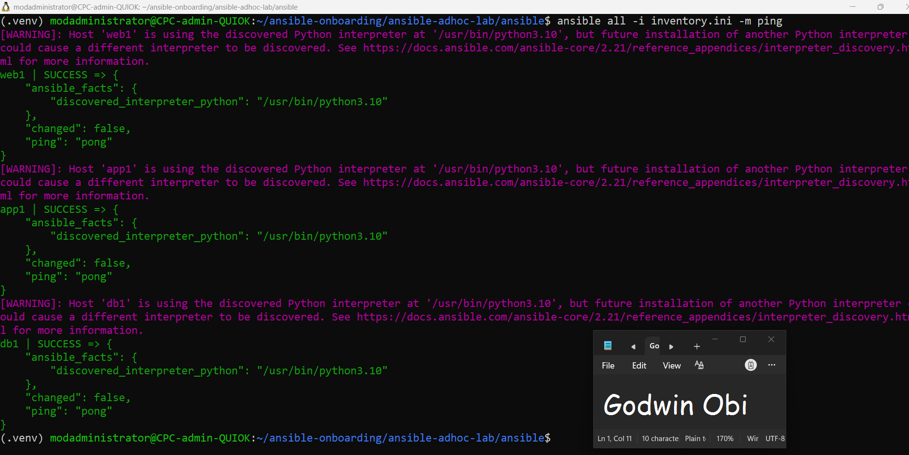

---

#### Screenshot 13 — Output of `ansible all -i inventory.ini -m command -a "uptime"`

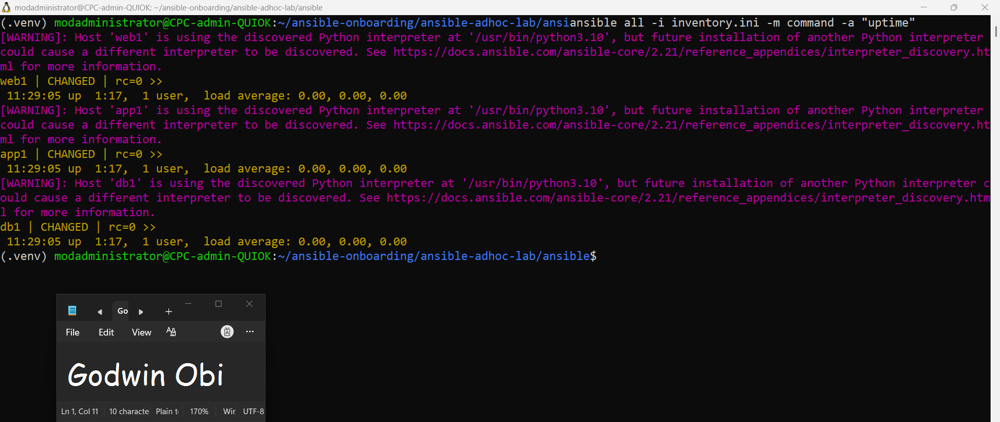

---

#### Screenshot 14 — Output of `ansible web -i inventory.ini -m apt -a "name=nginx state=present update_cache=yes" --become`

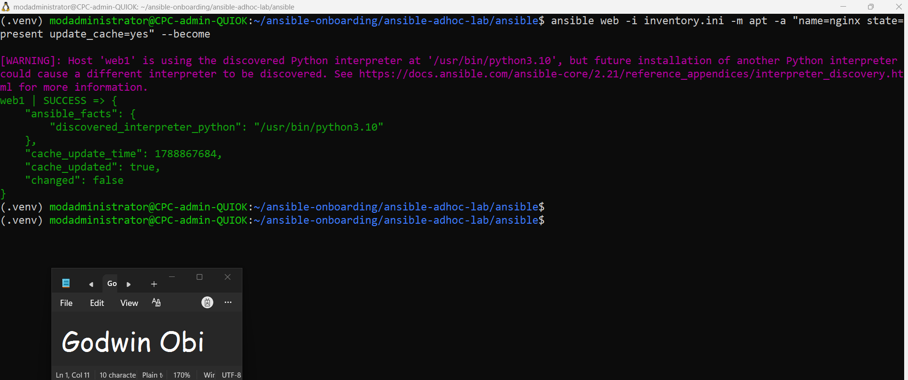

---

#### Screenshot 15 — Output of `ansible web -i inventory.ini -m service -a "name=nginx state=started enabled=yes" --become`

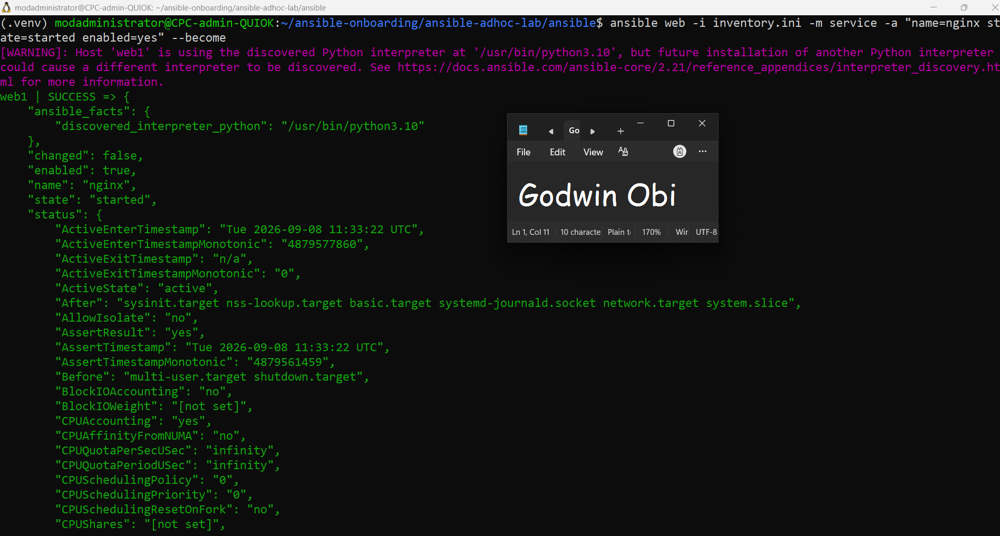

---

#### Screenshot 16 — Output of `ansible all -i inventory.ini -m apt -a "name=htop state=present update_cache=yes" --become`

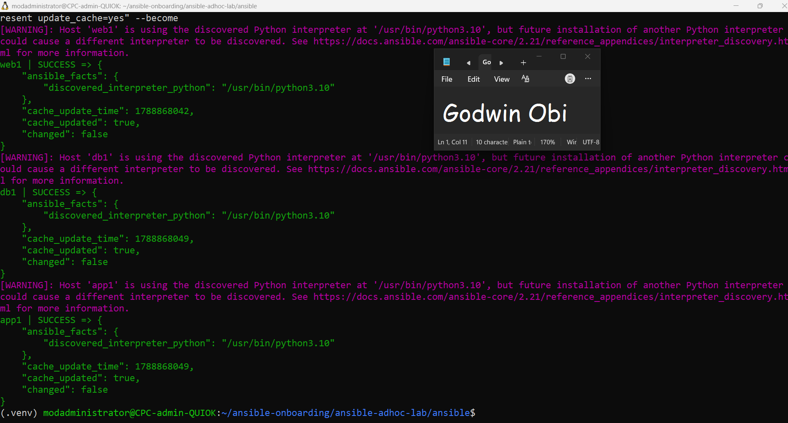

---

#### Screenshot 17 — Output of `ansible web -i inventory.ini -m command -a "systemctl is-active nginx"`

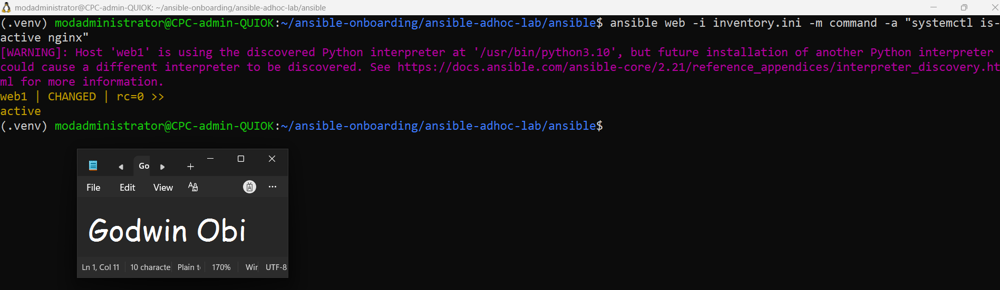

---

### Notes

* **Ansible Ping Verification:** Executed `ansible all -i inventory.ini -m ping` to confirm Python environment readiness and SSH connection status across all managed inventory targets (`web1`, `app1`, `db1`).

* **System Inspection:** Utilized the `command` module (`ansible all -i inventory.ini -m command -a "uptime"`) to gather operational runtime statistics from all instances without needing local agent installations.

* **Targeted Package Management:** Provisioned Nginx on the dedicated web host using `ansible web -i inventory.ini -m apt -a "name=nginx state=present update_cache=yes" --become`, demonstrating group-targeted configuration management.

* **Service Lifecycle Management:** Ensured service persistence and active execution for Nginx using `ansible web -i inventory.ini -m service -a "name=nginx state=started enabled=yes" --become`.

* **Fleet-Wide Provisioning:** Installed system monitoring tools across the entire fleet (`web1`, `app1`, `db1`) using `ansible all -i inventory.ini -m apt -a "name=htop state=present update_cache=yes" --become`.

* **State Verification:** Verified active systemd service state on `web1` via `ansible web -i inventory.ini -m command -a "systemctl is-active nginx"`, receiving the expected `active` response (`rc=0`).

---

# LinkedIn Post Required

## Evidence

#### LinkedIn Post URL

Paste your LinkedIn post URL here:

`https://www.linkedin.com/posts/godwin-obi-008a12177_devops-terraform-ansible-activity-7503071384940515328-PMgd?utm_source=share&utm_medium=member_desktop&rcm=ACoAACn5hogBVyHnSR92cyBf5EzFBZEMSepEVPM`

---

#### Screenshot — Published LinkedIn post

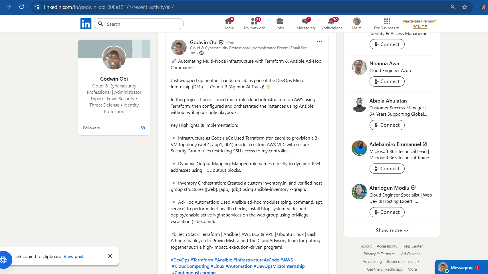

---

# Assignment Questions

Answer the following in your own words:

**1. What is the purpose of an Ansible inventory file?**

The Ansible inventory file acts as a database/manifest that defines the target hosts and nodes Ansible manages. It maps friendly host names to IP addresses or domain names, organizes servers into logical role-based groups (e.g., `web`, `app`, `db`), and defines global or group-level connection parameters (such as `ansible_user` and `ansible_ssh_private_key_file`).

---

**2. What is the difference between the `web`, `app`, and `db` groups in your inventory?**

The groups separate servers by their architectural responsibilities in a typical 3-tier architecture:

*   [`web`]: Contains frontend servers (e.g., `web1`) responsible for handling external HTTP client traffic and serving Nginx reverse proxies.

*   [`app`]: Contains application servers (e.g., `app1`) hosting business logic and backend application microservices.

*   [`db`]: Contains database nodes (e.g., `db1`) hosting persistence stores and relational database engines.

Grouping servers allows Ansible commands and playbooks to target specific tiers independently (for example, installing Nginx only on the `web` group).

---

**3. What does the Ansible `ping` module verify?**

Unlike standard network ICMP ping commands, the Ansible `ping` module verifies:

1.  Valid SSH connectivity between the controller and the remote node using the specified private key.

2.  Successful user login/authentication with the target user (`ubuntu`).

3.  The presence and functioning of a valid Python interpreter on the remote machine required to execute Ansible modules.

Returning `"ping": "pong"` confirms that the node is ready to accept further Ansible orchestration.

---

**4. Why do package installation commands require `--become`?**

Package management tools (such as `apt` on Ubuntu) interact with system-level directories (e.g., `/var/lib/dpkg/`, `/etc/nginx/`) that require root privileges. The non-root default SSH user (`ubuntu`) does not have write access to these system directories. Using `--become` tells Ansible to escalate privileges using sudo on the remote host to complete administrative operations.

---

**5. When would you use an ad-hoc command instead of a playbook?**

* **Ad-Hoc Commands:** Best for quick, one-time tasks, rapid operational checks, or immediate troubleshooting across multiple hosts (e.g., checking uptime, rebooting a server, inspecting disk space with `df -h`, or quickly gathering process statuses).

* **Playbooks:** Best for complex, multi-step configurations, repeatable deployments, automated CI/CD workflows, and maintaining declarative state configuration across infrastructure.

---

**6. What is one challenge you faced while setting up SSH or inventory, and how did you fix it?**

When applying the Terraform configuration in AWS region `us-east-2`, the deployment threw an `InvalidParameterCombination` error indicating that `t2.micro` was not supported under the standard Free Tier in that region.

**Fix:** Updated the `default` value of the `instance_type` variable in `variables.tf` from `t2.micro` to `t3.micro`. After saving the file, running `terraform apply` resolved the issue and successfully launched all three EC2 instances.

---

# Required Files

Confirm that the following files are included in your assignment workspace:

- [ ] `ansible-adhoc-lab/README.md`
- [ ] `ansible-adhoc-lab/terraform/providers.tf`
- [ ] `ansible-adhoc-lab/terraform/main.tf`
- [ ] `ansible-adhoc-lab/terraform/variables.tf`
- [ ] `ansible-adhoc-lab/terraform/outputs.tf`
- [ ] `ansible-adhoc-lab/ansible/inventory.ini`
- [ ] Updated `.gitignore`

---

# Submission Instructions

- Add all required screenshots from the tasks.
- Full Name must be visible in required screenshots.
- Mention whether you used Azure or AWS.
- Mention whether you used the three-VM option or four-VM option.
- Add the public IP addresses of the VMs, redacted if preferred.
- Add your `inventory.ini` proof.
- Add a short explanation of what you learned.
- Answer all assignment questions clearly in your own words.
- Add your LinkedIn post URL.
- Do not expose SSH private keys, Terraform state files, cloud credentials, passwords, access keys, secret keys, account IDs, or subscription IDs.
- Submit only one Google Doc link.

---

# Completion Checklist

- [ ] Task 1: `ansible-adhoc-lab` project structure created
- [ ] Task 1: `.gitignore` updated for Terraform files
- [ ] Task 2: Terraform configuration created
- [ ] Task 2: Server roles defined for either three or four VMs
- [ ] Task 2: `count` or `for_each` used
- [ ] Task 2: SSH restricted to the controller public IP
- [ ] Task 2: HTTP allowed only for web hosts
- [ ] Task 2: Terraform output maps roles to public IPs
- [ ] Task 3: Terraform initialized successfully
- [ ] Task 3: Terraform configuration validated
- [ ] Task 3: Terraform apply completed successfully
- [ ] Task 3: All selected VMs are running
- [ ] Task 4: SSH key-based access works for every VM
- [ ] Task 5: `inventory.ini` contains `web`, `app`, and `db` groups
- [ ] Task 5: `ansible-inventory -i inventory.ini --graph` shows the correct groups
- [ ] Task 6: `ansible all -i inventory.ini -m ping` returns `SUCCESS`
- [ ] Task 6: Ad-hoc commands run successfully
- [ ] Task 6: `--become` was used for package and service tasks
- [ ] Task 6: Nginx is active on the `web` group
- [ ] Screenshots 1–17 are included
- [ ] Assignment questions are answered
- [ ] LinkedIn post published
- [ ] LinkedIn post URL added
- [ ] No sensitive information is exposed
- [ ] Google Doc is accessible

---

## About DMI & CloudAdvisory

DevOps Micro Internship (DMI) is a project-based DevOps program run by Pravin Mishra and The CloudAdvisory, focused on real-world execution, systems thinking, and career readiness.

It helps learners build strong DevOps foundations with hands-on experience.

---

## Resources

- DMI Official Website: [https://dmi.pravinmishra.com?utm_source=github&utm_medium=readme](https://dmi.pravinmishra.com?utm_source=github&utm_medium=readme)
- University: [https://university.pravinmishra.com?utm_source=github&utm_medium=readme](https://university.pravinmishra.com?utm_source=github&utm_medium=readme)
- Discord Community: [https://discord.pravinmishra.com?utm_source=github&utm_medium=readme](https://discord.pravinmishra.com?utm_source=github&utm_medium=readme)
- Blog: [https://dmi.pravinmishra.com/blog?utm_source=github&utm_medium=readme](https://dmi.pravinmishra.com/blog?utm_source=github&utm_medium=readme)
- YouTube Playlist: [https://www.youtube.com/playlist?list=PLFeSNDtI4Cho](https://www.youtube.com/playlist?list=PLFeSNDtI4Cho)
- Pravin Mishra LinkedIn: [https://www.linkedin.com/in/pravin-mishra-aws-trainer/](https://www.linkedin.com/in/pravin-mishra-aws-trainer/)
- CloudAdvisory LinkedIn: [https://www.linkedin.com/company/thecloudadvisory/](https://www.linkedin.com/company/thecloudadvisory/)

---

*This submission is part of DevOps Micro Internship (DMI) Cohort 3 — Agentic AI Track.*