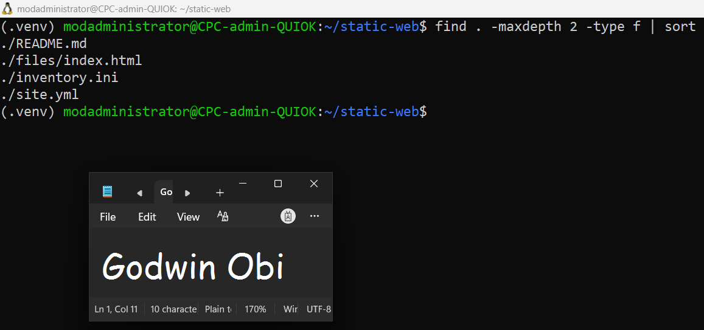
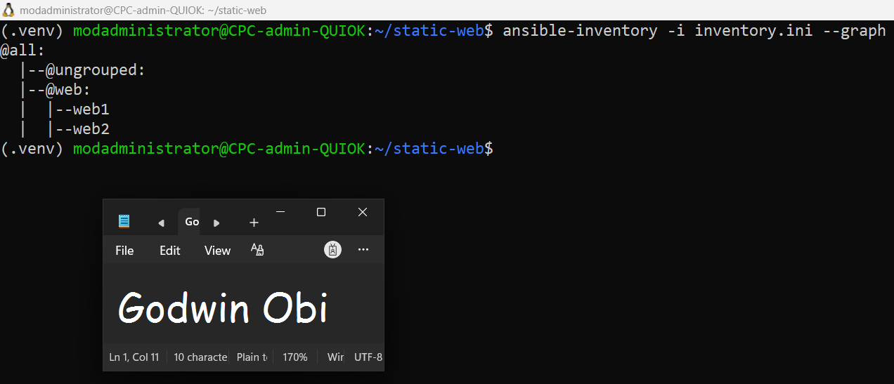

# Assignment 03 — Deploy a Static Website to Multiple Servers Using a Multi-Play Ansible Playbook

Part of the DevOps Micro Internship (DMI) Cohort 3 with Agentic AI

---

## Purpose

In this assignment, you will create a multi-play Ansible playbook to install Nginx, deploy a static website to two Ubuntu servers, and verify that the website is accessible from both servers.

You may use either AWS EC2 instances or Azure Virtual Machines as your managed servers.

---

# Task 1 — Create the Project Structure

## Goal

Create the required folders and files for the Ansible project.

### Evidence

#### Screenshot 1 — Terminal or VS Code showing the complete `static-web` project structure



---

# Task 2 — Configure the Ansible Inventory

## Goal

Add both Ubuntu servers to the Ansible inventory.

### Evidence

#### Screenshot 2 — Output of `ansible-inventory -i inventory.ini --graph` showing `web1` and `web2`



---

### Configuration File

Copy and paste the complete contents of your `inventory.ini` file below:

```ini
[web]
web1 ansible_host=3.145.80.194
web2 ansible_host=18.227.114.216

[web:vars]
ansible_user=ubuntu
ansible_ssh_private_key_file=~/.ssh/id_ed25519

```