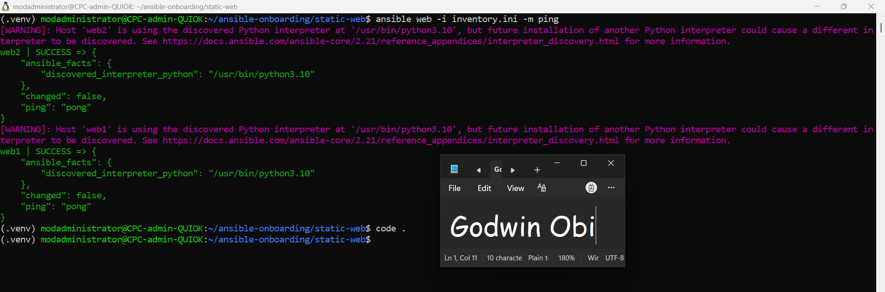
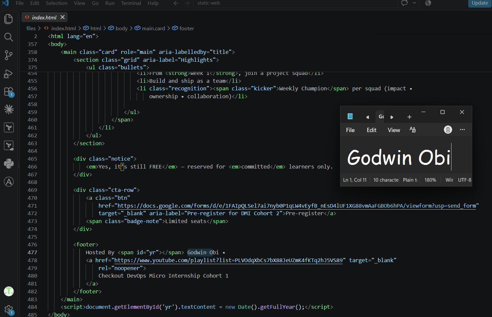
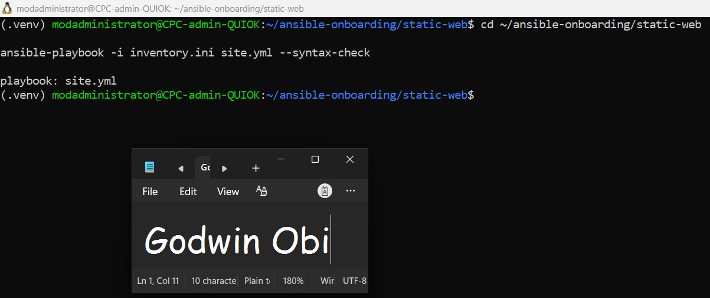
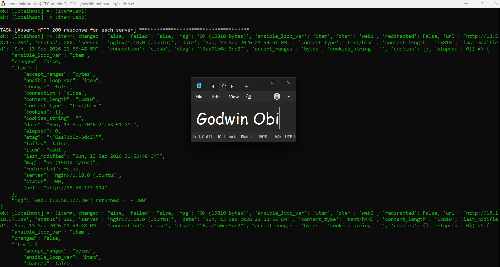
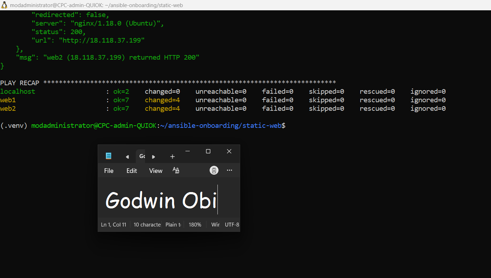
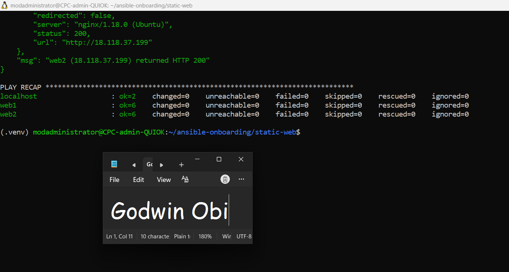
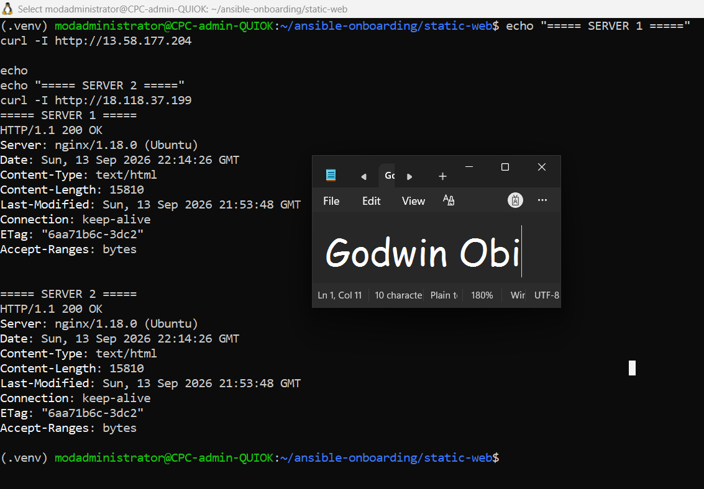
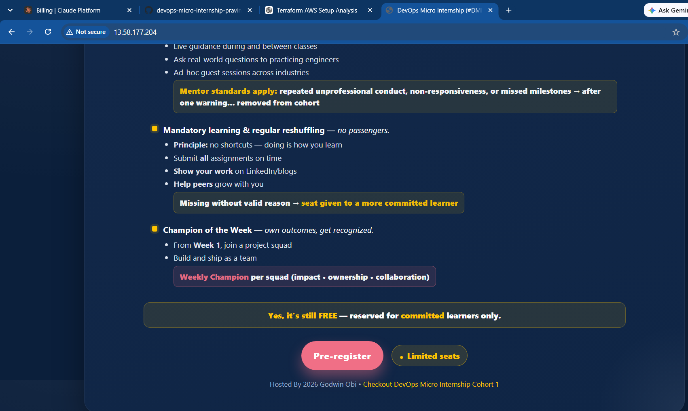
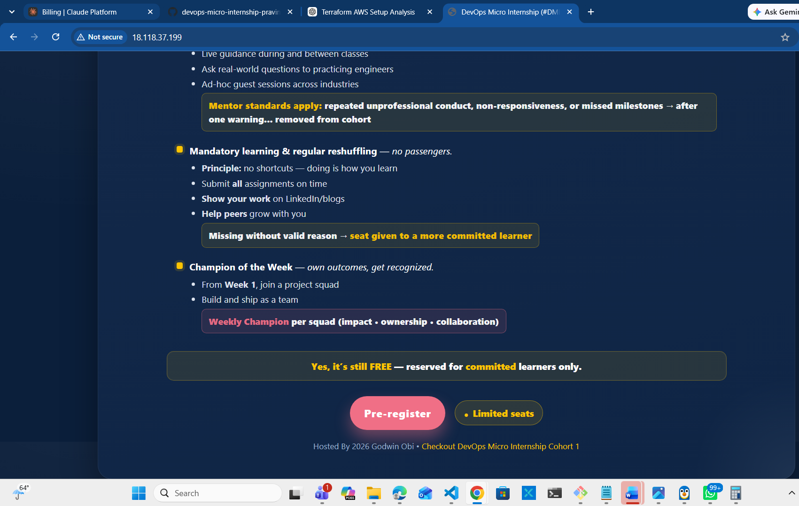
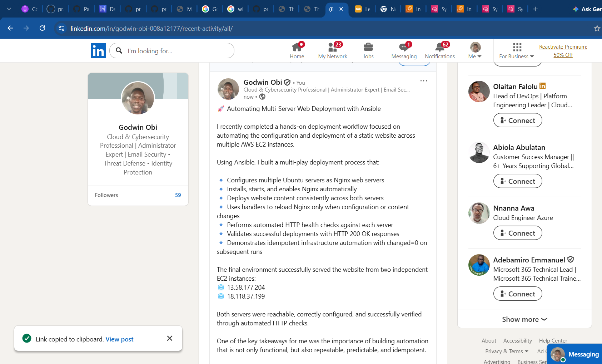

# Assignment 03 — Deploy a Static Website to Multiple Servers Using a Multi-Play Ansible Playbook

Part of the DevOps Micro Internship (DMI) Cohort 3 with Agentic AI

---

## Student Details

**Full Name:** Godwin Obi
**Cloud Platform Used:** AWS
**Server 1 URL:** `http://13.58.177.204`
**Server 2 URL:** `http://18.118.37.199`

---

## Purpose

In this assignment, you will create a multi-play Ansible playbook to install Nginx, deploy a static website to two Ubuntu servers, and verify that the website is accessible from both servers.

You may use either AWS EC2 instances or Azure Virtual Machines as your managed servers.

---

# Task 1 — Create the Project Structure

## Goal

Create the required folders and files for the Ansible project.

## Evidence

### Screenshot 1 — Terminal or VS Code showing the complete `static-web` project structure


---

# Task 2 — Configure the Ansible Inventory

## Goal

Add both Ubuntu servers to the Ansible inventory.

## Evidence

### Screenshot 2 — Output of `ansible-inventory -i inventory.ini --graph` showing `web1` and `web2`


---

## Configuration File

Copy and paste the complete contents of your `inventory.ini` file below:

```ini
[web]
web1 ansible_host=13.58.177.204
web2 ansible_host=18.118.37.199

[web:vars]
ansible_user=ubuntu
ansible_ssh_private_key_file=/home/modadministrator/.ssh/id_ed25519

```

---

# Task 3 — Verify Ansible Connectivity

## Goal

Confirm that the Ansible controller can connect to both servers.

## Evidence

### Screenshot 3 — Ansible ping output showing `SUCCESS` and `pong` for both servers



---

# Task 4 — Download and Personalize the Static Website

## Goal

Download `index.html` to the Ansible controller and personalize the website with your full name.

## Evidence

### Screenshot 4 — Edited `files/index.html` showing the footer line with your full name



---

# Task 5 — Create the Multi-Play Ansible Playbook

## Goal

Create a single Ansible playbook containing separate plays for installation, deployment, and verification.

## Configuration File

Copy and paste the complete contents of your `site.yml` file below:

```yaml
---
- name: Play 1 - Install and Configure Nginx
  hosts: web
  become: true
  tasks:
    - name: Update APT package cache
      ansible.builtin.apt:
        update_cache: yes
        cache_valid_time: 3600

    - name: Install Nginx package
      ansible.builtin.apt:
        name: nginx
        state: present

    - name: Ensure Nginx service is started and enabled
      ansible.builtin.service:
        name: nginx
        state: started
        enabled: yes

- name: Play 2 - Deploy Static Website
  hosts: web
  become: true
  handlers:
    - name: reload nginx
      ansible.builtin.service:
        name: nginx
        state: reloaded
  tasks:
    - name: Deploy index.html to web root
      ansible.builtin.copy:
        src: files/index.html
        dest: /var/www/html/index.html
        owner: www-data
        group: www-data
        mode: "0644"
      notify: reload nginx

- name: Play 3 - Verify Both Websites from Controller
  hosts: localhost
  connection: local
  gather_facts: false
  become: false
  tasks:
    - name: Send HTTP GET request to web servers
      ansible.builtin.uri:
        url: "http://{{ hostvars[item].ansible_host }}"
        status_code: 200
      loop: "{{ groups['web'] }}"
      register: website_checks

    - name: Assert HTTP 200 response for each server
      ansible.builtin.assert:
        that:
          - item.status == 200
        success_msg: "{{ item.item }} ({{ hostvars[item.item].ansible_host }}) returned HTTP {{ item.status }}"
        fail_msg: "{{ item.item }} failed HTTP verification with status {{ item.status }}"
      loop: "{{ website_checks.results }}"

```

---

# Task 6 — Validate the Playbook Syntax

## Goal

Check the playbook for YAML or Ansible syntax errors before running it.

## Evidence

### Screenshot 5 — Successful syntax-check output showing `playbook: site.yml`



---

# Task 7 — Run the Multi-Play Playbook

## Goal

Install Nginx, deploy the website, and verify both servers in one playbook run.

## Evidence

### Screenshot 6 — Play 3 verification showing HTTP `200` for both servers



---

### Screenshot 7 — Final play recap showing `unreachable=0` and `failed=0` for `web1`, `web2`, and `localhost`



---

# Task 8 — Verify Idempotency

## Goal

Run the playbook again and confirm that it does not make unnecessary changes.

## Evidence

### Screenshot 8 — Second playbook run showing the play recap with `changed=0`, `unreachable=0`, and `failed=0` for both web servers



---

# Task 9 — Test Both Websites Manually

## Goal

Confirm that the static website is accessible from both public IP addresses.

## Evidence

### Screenshot 9 — `curl -I` output showing HTTP `200 OK` from both servers



---

### Screenshot 10 — Browser showing the website from Server 1 with the public IP and your full name visible



---

### Screenshot 11 — Browser showing the website from Server 2 with the public IP and your full name visible



---

## Website URLs

Add both deployed website URLs below:

```text
Server 1: http://13.58.177.204
Server 2: http://18.118.37.199
```

---

# Task 10 — Complete the Project README

## Goal

Document how the project works and record what you learned.

## README Content

Copy and paste the complete contents of your `README.md` file below:

```markdown
# Multi-Play Ansible Static Website Deployment

## Project Overview

This project demonstrates the deployment of a static website to multiple AWS EC2 servers using Ansible.

A multi-play Ansible playbook was created to install and configure Nginx, deploy a personalized `index.html` file to the web servers, and verify that both websites are accessible over HTTP.

The website was deployed to two Ubuntu EC2 instances and personalized with my name, **Godwin Obi**.

## Environment

- Cloud platform: AWS
- Operating system: Ubuntu
- Number of managed servers: 2
- Web server: Nginx
- Configuration management tool: Ansible

### Managed Servers

- web1: `13.58.177.204`
- web2: `18.118.37.199`

## How to Run the Playbook

First, test connectivity to the managed servers:

```bash
ansible web -i inventory.ini -m ping
```

---

# LinkedIn Post Required

## Evidence

### LinkedIn Post URL

Paste your LinkedIn post URL here:

`https://www.linkedin.com/posts/godwin-obi-008a12177_godwin-obi-dmi-cohort-3-live-activity-7505037212737200128-4JPk?utm_source=share&utm_medium=member_desktop&rcm=ACoAACn5hogBVyHnSR92cyBf5EzFBZEMSepEVPM`

---

### Screenshot — Published LinkedIn post



---

# Assignment Questions

Answer the following in your own words:

**1. What issue did you face while completing this assignment, and how did you fix it?**

One issue I faced was an SSH authentication problem when I first tried to connect to the EC2 servers using Ansible. Ansible could not access the SSH private key through the SSH authentication agent.

I fixed this by starting the SSH agent and adding my SSH private key to it. After that, I ran the Ansible ping command again and both servers returned `SUCCESS` and `pong`.

I also encountered an issue during the idempotency test where the APT package cache task reported a change when the playbook was run again. I fixed this by adding `cache_valid_time: 3600` to the APT task. After the change, the second execution returned `changed=0` for both web servers.

---

**2. What did you learn from this assignment?**

I learned how to use Ansible to automate the configuration and deployment of a website across multiple AWS EC2 servers.

I learned how to create an inventory, test server connectivity, install and configure Nginx, deploy files using the `copy` module, use handlers, and automatically verify the website using the `uri` module.

I also learned the importance of idempotency. A good automation script should be safe to run multiple times without making unnecessary changes.

Most importantly, I gained practical experience troubleshooting SSH authentication and understanding how separate stages of an automated deployment can work together.

---

**3. Why is it useful to split installation, deployment, and verification into separate plays?**

Splitting installation, deployment, and verification into separate plays makes the playbook easier to understand, maintain, and troubleshoot.

The installation play prepares the servers by installing and configuring Nginx. The deployment play manages the website content, while the verification play checks from the Ansible controller that the websites are actually responding correctly.

Each play therefore has a clear responsibility. If something goes wrong, it is easier to identify which stage of the deployment caused the problem.

It also makes the automation easier to extend or modify in the future.

---

**4. What is one benefit of using the Ansible `copy` module instead of cloning the website directly from Git on every managed server?**

One major benefit is simplicity.

The `copy` module allows the website file to be transferred directly from the Ansible controller to the managed servers without requiring Git to be installed or the repository to be cloned on every server.

It is also idempotent because Ansible can detect whether the destination file already contains the correct content and avoid making an unnecessary change.

For this assignment, using copy was appropriate because the deployment involved a static `index.html` file.

---

**5. What does idempotency mean in this assignment?**

Idempotency means that running the same Ansible playbook multiple times produces the same desired state without making unnecessary changes.

In this assignment, after the website and Nginx configuration were already correct, I ran the playbook again.

The final recap showed:

`web1 changed=0`

and

`web2 changed=0`

This demonstrated that Ansible recognized that the servers were already in the desired state and did not make unnecessary changes.

Idempotency is important because DevOps automation should be safe and predictable to run repeatedly.

---

**6. What does the Ansible `uri` module verify in Play 3?**

The Ansible `uri` module in Play 3 verifies that the deployed websites are accessible over HTTP from the Ansible controller.

It sends HTTP requests to both web servers and checks that they return an HTTP status code of `200`.

In this assignment, Play 3 successfully verified:

`web1 (13.58.177.204)` returned HTTP `200`
`web2 (18.118.37.199)` returned HTTP `200`

This provides automated evidence that the Nginx web servers are running and that the deployed websites are accessible.

---

# Required Files

Confirm that the following files are included in your assignment folder:

- [ ] `inventory.ini`
- [ ] `site.yml`
- [ ] `files/index.html`
- [ ] `README.md`

---

# Submission Instructions

- Add all required screenshots in the correct order.
- Full Name must be visible in required screenshots.
- Include both deployed website URLs.
- Paste `inventory.ini`, `site.yml`, and `README.md` as editable text.
- Answer all assignment questions clearly in your own words.
- Add your LinkedIn post URL.
- Do not expose SSH private keys, passwords, cloud account IDs, or other sensitive information.

---

# Completion Checklist

- [ ] Task 1: `static-web` folder structure is complete
- [ ] Task 2: Both servers are listed under the `[web]` group in `inventory.ini`
- [ ] Task 2: Inventory graph shows `web1` and `web2`
- [ ] Task 3: Ansible ping returns `SUCCESS` and `pong` for both servers
- [ ] Task 4: `files/index.html` contains your full name
- [ ] Task 5: `site.yml` contains three separate plays
- [ ] Task 5: Play 1 installs, starts, and enables Nginx
- [ ] Task 5: Play 2 deploys `index.html` using the `copy` module
- [ ] Task 5: Nginx reload handler is included
- [ ] Task 5: Play 3 verifies both web servers from the controller
- [ ] Task 6: Playbook syntax check passes
- [ ] Task 7: First playbook run completes with `unreachable=0` and `failed=0`
- [ ] Task 7: URI verification returns HTTP `200` for both servers
- [ ] Task 8: Second playbook run demonstrates idempotency
- [ ] Task 8: Second run shows `changed=0` for both web servers
- [ ] Task 9: Both `curl -I` commands return HTTP `200 OK`
- [ ] Task 9: Website loads from Server 1
- [ ] Task 9: Website loads from Server 2
- [ ] Task 9: Full name is visible on both deployed websites
- [ ] Task 10: `README.md` contains all required explanations
- [ ] Screenshots 1–11 are included
- [ ] `inventory.ini`, `site.yml`, and `README.md` are pasted as editable text
- [ ] Both website URLs are included
- [ ] Assignment questions are answered
- [ ] LinkedIn post published
- [ ] LinkedIn post URL added
- [ ] No sensitive information is exposed

---

## About DMI & CloudAdvisory

DevOps Micro Internship (DMI) is a project-based DevOps program run by Pravin Mishra and The CloudAdvisory, focused on real-world execution, systems thinking, and career readiness.

It helps learners build strong DevOps foundations with hands-on experience.

---

## Resources

- DMI Official Website: [https://dmi.pravinmishra.com?utm_source=github&utm_medium=readme](https://dmi.pravinmishra.com?utm_source=github&utm_medium=readme)
- University: [https://university.pravinmishra.com?utm_source=github&utm_medium=readme](https://university.pravinmishra.com?utm_source=github&utm_medium=readme)
- Discord Community: [https://discord.pravinmishra.com?utm_source=github&utm_medium=readme](https://discord.pravinmishra.com?utm_source=github&utm_medium=readme)
- Blog: [https://dmi.pravinmishra.com/blog?utm_source=github&utm_medium=readme](https://dmi.pravinmishra.com/blog?utm_source=github&utm_medium=readme)
- YouTube Playlist: [https://www.youtube.com/playlist?list=PLFeSNDtI4Cho](https://www.youtube.com/playlist?list=PLFeSNDtI4Cho)
- Pravin Mishra LinkedIn: [https://www.linkedin.com/in/pravin-mishra-aws-trainer/](https://www.linkedin.com/in/pravin-mishra-aws-trainer/)
- CloudAdvisory LinkedIn: [https://www.linkedin.com/company/thecloudadvisory/](https://www.linkedin.com/company/thecloudadvisory/)

---

*This submission is part of DevOps Micro Internship (DMI) Cohort 3 — Agentic AI Track.*
