# Assignment 04 — Deploy Mini Finance on Azure Using Terraform and Ansible

Part of the DevOps Micro Internship (DMI) Cohort 3 with Agentic AI

---

## Purpose

In this assignment, you will provision Azure infrastructure using Terraform and deploy the Mini Finance website using an Ansible multi-play playbook.

Terraform will create the Azure Virtual Machine and networking resources. Ansible will install Nginx, clone the Mini Finance repository, deploy the website, and verify the deployment.

---

# Task 1 — Create the Project Structure

## Goal

Create separate directories and files for the Terraform infrastructure and Ansible configuration.

### Evidence

#### Screenshot 1 — Terminal or VS Code showing the complete `mini-finance` project structure

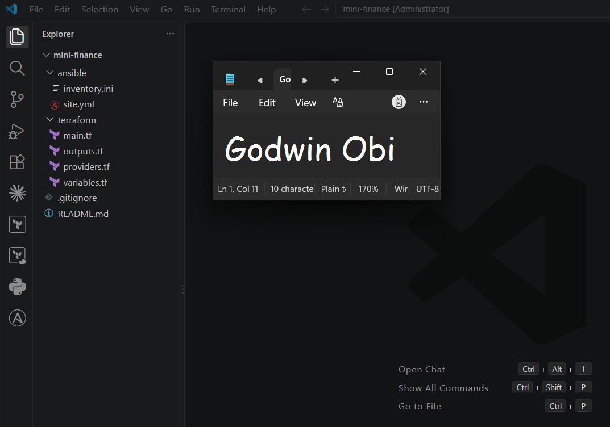

---

### Notes

Created the complete project directory structure for the Mini Finance deployment, keeping infrastructure (Terraform) and configuration management (Ansible) isolated in separate dedicated folders:

* **Directory Setup:** Initialized `mini-finance/` containing `terraform/` and `ansible/` subdirectories.

* **Terraform Configuration Files:** Provisioned `providers.tf`, `main.tf`, `variables.tf`, and `outputs.tf` under `terraform/` for Azure infrastructure provisioning.

* **Ansible Configuration Files:** Created `inventory.ini` and `site.yml` under `ansible/` for host inventory definition and play execution.

* **Root Documentation & Version Control:** Added `README.md` and `.gitignore` to prevent Terraform state files, plan files, and private SSH keys from being tracked. Verified the completed layout in VS Code.

---

# Task 2 — Create the Azure Infrastructure Using Terraform

## Goal

Use Terraform to provision an Ubuntu Virtual Machine with the required Azure networking and security resources.

### Evidence

#### Screenshot 2 — Terraform code showing the `Allow-SSH` rule for port `22` and the `Allow-HTTP` rule for port `80`

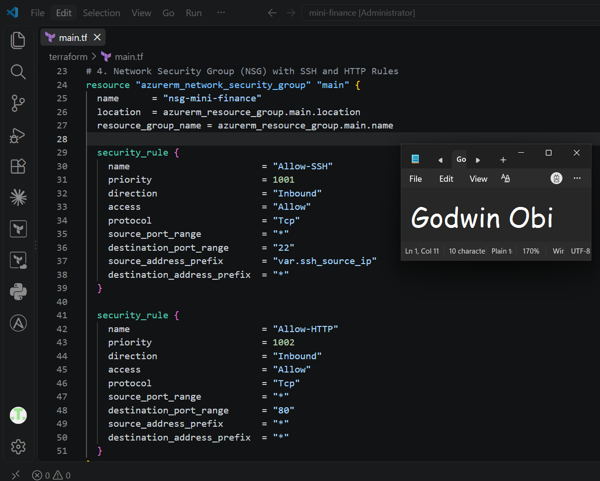

---

#### Screenshot 3 — Terraform code showing the association between `nsg-mini-finance` and `nic-mini-finance`

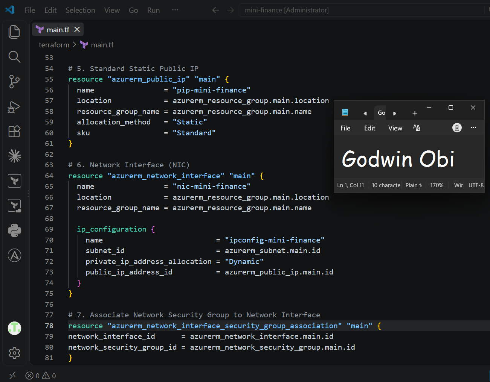

---

### Notes

Configured the Azure Infrastructure using Terraform with all required networking, security, and compute components:

* **Resource Group & Networking:** Created `rg-mini-finance` containing `vnet-mini-finance` (10.0.0.0/16) and `subnet-mini-finance` (10.0.1.0/24).

* **Security Group Rules:** Defined `nsg-mini-finance` with `Allow-SSH` (Port 22, restricted to the controller IP) and `Allow-HTTP` (Port 80, open to public traffic).

* **Interface & Public IP:** Provisioned a Standard Static Public IP (`pip-mini-finance`) bound to `nic-mini-finance` (`ipconfig-mini-finance`), and explicitly attached `nsg-mini-finance` via `azurerm_network_interface_security_group_association`.

* **Compute & SSH Setup:** Configured `vm-mini-finance` using Ubuntu 22.04 LTS and attached the SSH public key from `~/.ssh/id_ed25519.pub` for passwordless access by `azureuser`. Exposed the public IP through `outputs.tf`.

---

# Task 3 — Initialize and Apply the Terraform Configuration

## Goal

Format and validate the Terraform configuration, review the execution plan, and provision the Azure infrastructure.

### Evidence

#### Screenshot 4 — End of the `terraform apply` output showing `Apply complete!` with no errors

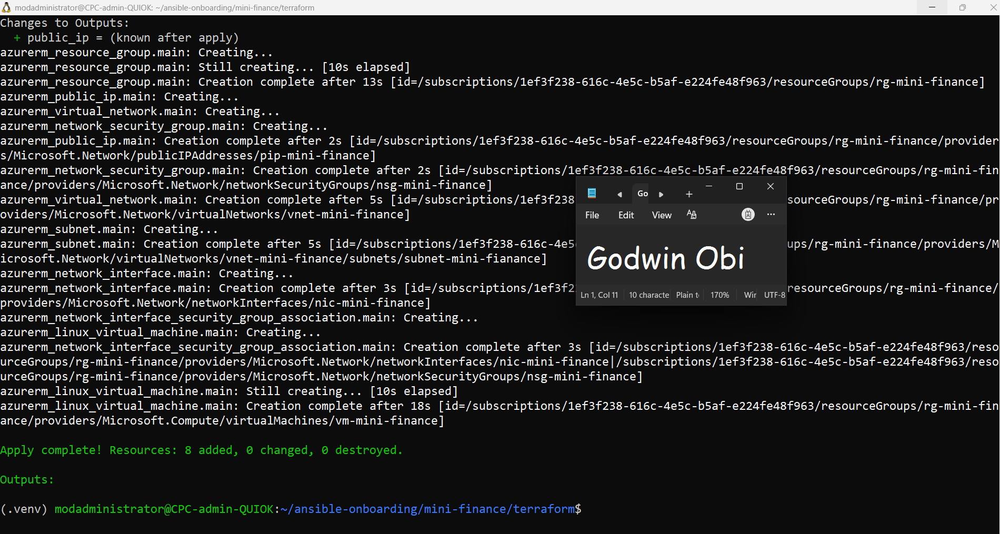

---

#### Screenshot 5 — Output of `terraform output public_ip` showing the VM’s public IP address

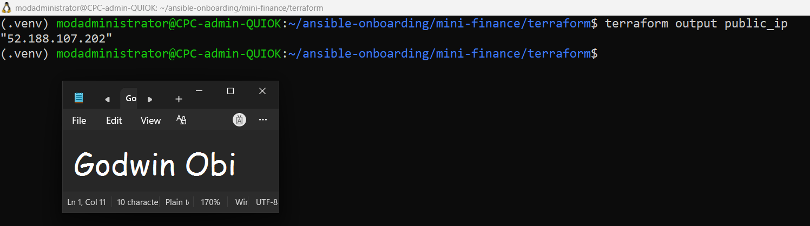

---

### Notes

* Successfully provisioned Azure infrastructure for the `mini-finance` environment using Terraform.

* Resolved VM SKU subscription availability constraints by targeting the Gen2-compatible `Standard_D2s_v7` instance in `eastus`.

* Deployed 8 total resources including Resource Group (`rg-mini-finance`), Virtual Network, Subnet, Network Security Group, Network Interface, Public IP, and Linux VM (`vm-mini-finance`).

* Verified terraform output generation with assigned Public IP: `52.188.107.202`.

---

# Task 4 — Verify Passwordless SSH Access

## Goal

Confirm that the Ansible controller can connect to the Terraform-provisioned Azure VM using SSH key authentication.

### Evidence

#### Screenshot 6 — Passwordless SSH command and the returned `mini-finance` hostname

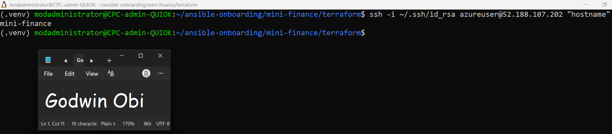

---

### Notes

* Executed remote SSH verification command using key `~/.ssh/id_rsa`: `ssh -i ~/.ssh/id_rsa azureuser@52.188.107.202 "hostname"`.

* Verified successful SSH authentication and connectivity to the provisioned Azure virtual machine.

* Confirmed the target remote host returned the expected system hostname: `mini-finance`.

---

# Task 5 — Create the Ansible Inventory and Verify Connectivity

## Goal

Add the Terraform-provisioned Azure VM to the Ansible inventory and confirm that Ansible can connect to it.

### Evidence

#### Screenshot 7 — Ansible ping output showing `SUCCESS` and `pong` from the Azure VM

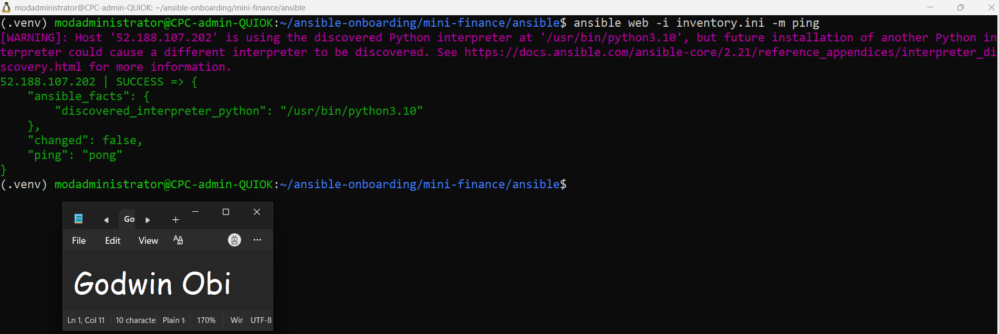

---

### Configuration File

Copy and paste the complete contents of your `ansible/inventory.ini` file below:

```ini
[web]
52.188.107.202
 
[web:vars]
ansible_user=azureuser
ansible_ssh_private_key_file=~/.ssh/id_rsa

```

---

# Task 6 — Create the Multi-Play Ansible Playbook

## Goal

Create one Ansible playbook containing separate plays to install Nginx, deploy the Mini Finance website, and verify the deployment.

### Evidence

#### Screenshot 8 — `site.yml` showing Play 1 and the beginning of Play 2

Screenshot must show:

- Play 1 targeting the `web` group
- Installation of `nginx`, `git`, and `rsync`
- Nginx service configured as started and enabled
- Beginning of Play 2 with the Git repository URL and synchronization task

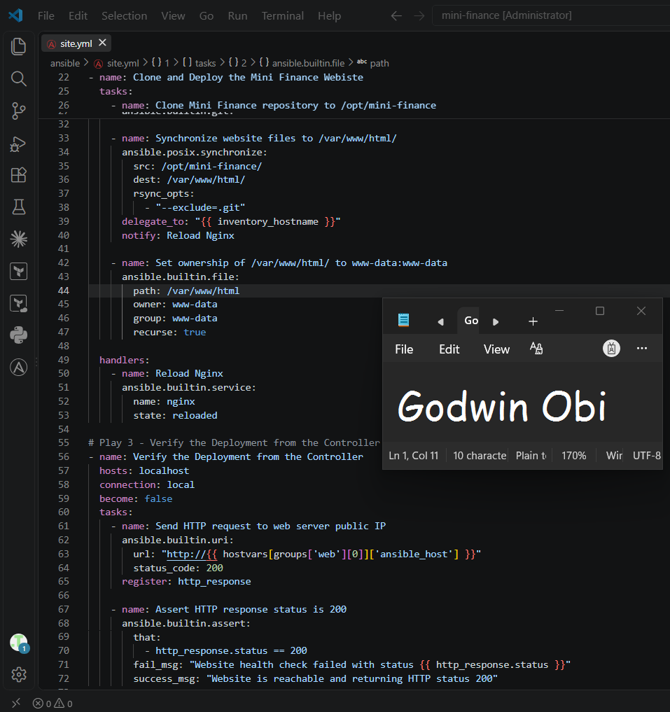

---

#### Screenshot 9 — `site.yml` showing the deployment destination, handler, and Play 3 verification

Screenshot must show:

- Website destination `/var/www/html/`
- Ownership set to `www-data:www-data`
- Nginx reload handler
- Play 3 targeting `localhost`
- The `uri` verification and `assert` condition


---

### Configuration File

Copy and paste the complete contents of your `ansible/site.yml` file below:

```yaml

# Play 1 - Install and Configure Nginx
- name: Install and Configure Nginx
  hosts: web
  become: true
  tasks:
    - name: Update apt cache and install required packages
      ansible.builtin.apt:
        name:
          - nginx
          - git
          - rsync
        state: present
        update_cache: true

    - name: Ensure Nginx service is started and enabled
      ansible.builtin.service:
        name: nginx
        state: started
        enabled: true

# Play 2 - Clone and Deploy the Mini Finance Website
- name: Clone and Deploy the Mini Finance Webiste
  hosts: web
  become: true
  tasks:
    - name: Clone Mini Finance repository to /opt/mini-finance
      ansible.builtin.git:
        repo: 'https://github.com/pravinmishraaws/mini_finance.git'
        dest: /opt/mini-finance
        single_branch: yes
        version: main

    - name: Synchronize website files to /var/www/html/
      ansible.posix.synchronize:
        src: /opt/mini-finance/
        dest: /var/www/html/
        rsync_opts:
          - "--exclude=.git"
      delegate_to: "{{ inventory_hostname }}"
      notify: Reload Nginx

    - name: Set ownership of /var/www/html/ to www-data:www-data
      ansible.builtin.file:
        path: /var/www/html
        owner: www-data
        group: www-data
        recurse: true

  handlers:
    - name: Reload Nginx
      ansible.builtin.service:
        name: nginx
        state: reloaded

# Play 3 - Verify the Deployment from the Controller
- name: Verify the Deployment from the Controller
  hosts: localhost
  connection: local
  become: false
  tasks:
    - name: Send HTTP request to web server public IP
      ansible.builtin.uri:
        url: "http://{{ groups['web'][0] }}"
        status_code: 200
      register: http_response

    - name: Assert HTTP response status is 200
      ansible.builtin.assert:
        that:
          - http_response.status == 200
        fail_msg: "Website health check failed with status {{ http_response.status }}"
        success_msg: "Website is reachable and returning HTTP status 200"

```

---

# Task 7 — Validate and Run the Ansible Playbook

## Goal

Validate the syntax of the multi-play Ansible playbook and run it to install Nginx, deploy the Mini Finance website, and verify the deployment.

### Evidence

#### Screenshot 10 — Successful playbook syntax check showing `playbook: site.yml`

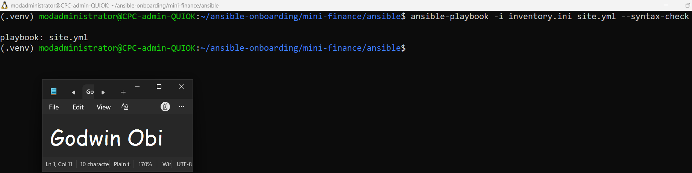

---

#### Screenshot 11 — Play 3 output showing the successful HTTP verification and assertion

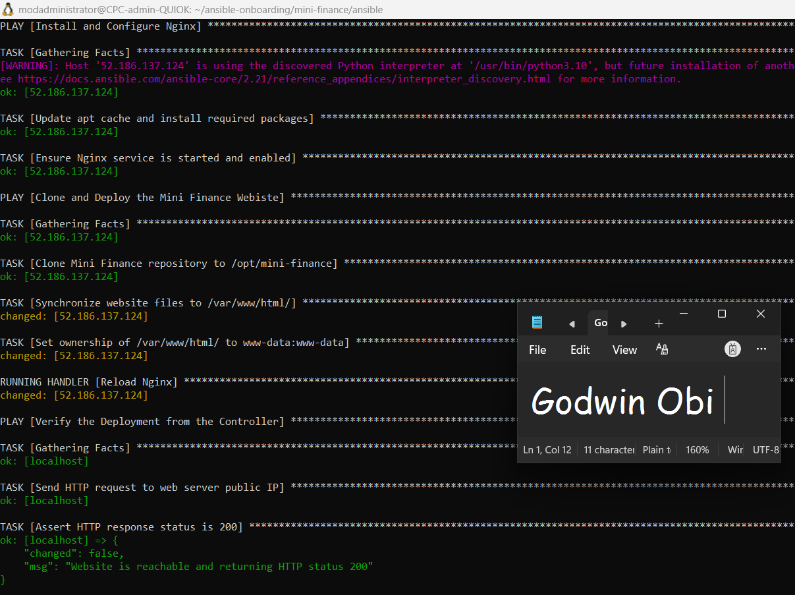

---

#### Screenshot 12 — Final `PLAY RECAP` showing `failed=0` and `unreachable=0`

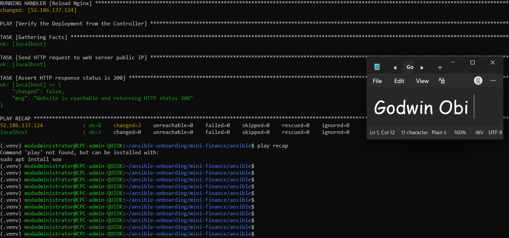

---

### Notes

* Executed syntax validation using `ansible-playbook -i inventory.ini site.yml --syntax-check`, confirming zero YAML or module syntax errors.

* Executed multi-play playbook `site.yml` against target host `52.186.137.124` and controller `localhost`.

* Verified Play 1 installed Nginx, Git, and Rsync and ensured Nginx was started and enabled on boot.

* Verified Play 2 cloned the Mini Finance repository to `/opt/mini-finance`, synchronized web contents to `/var/www/html/`, set recursive `www-data:www-data` ownership, and reloaded Nginx.

* Verified Play 3 performed a local HTTP health check against the target host public IP (`52.186.137.124`), asserting an HTTP status code 200 OK.

---

# Task 8 — Test the Mini Finance Website in a Browser

## Goal

Confirm that the Mini Finance website is publicly accessible through the Azure VM’s public IP address.

### Evidence

#### Screenshot 13 — Mini Finance website successfully loading in the browser, with the Azure VM’s public IP address visible in the address bar

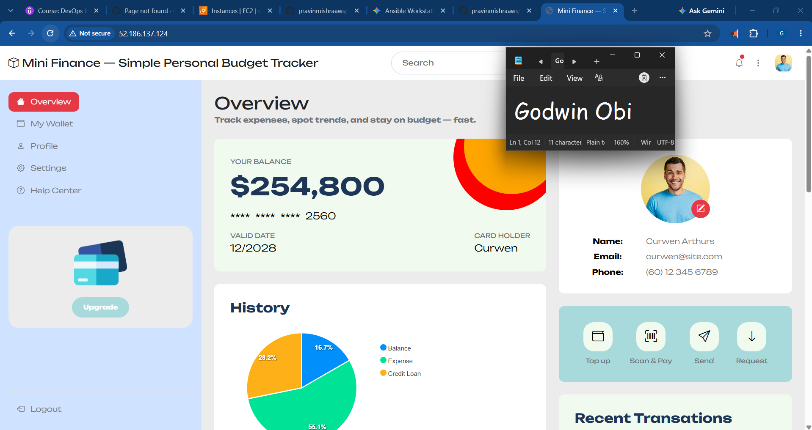

---

### Website URL

Add your deployed website URL below:

```text
http://52.186.137.124

```

---

# Task 9 — Create the Project README

## Goal

Create a `README.md` file to document the Mini Finance infrastructure and deployment project.

### Evidence

#### Screenshot 14 — Completed `README.md` displayed in the VS Code Markdown preview or terminal

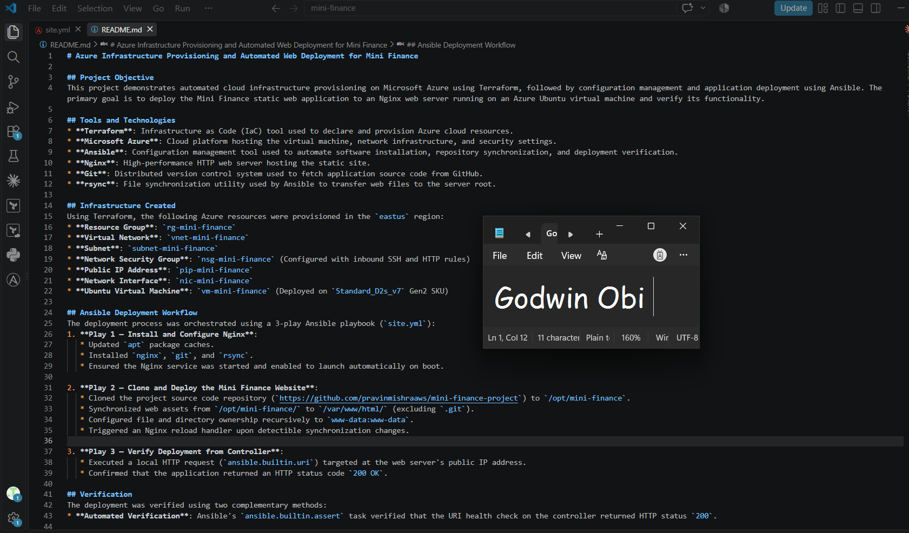

---

### README Content

Copy and paste the complete contents of your `README.md` file below:

```markdown
# Azure Infrastructure Provisioning and Automated Web Deployment for Mini Finance

## Project Objective
This project demonstrates automated cloud infrastructure provisioning on Microsoft Azure using Terraform, followed by configuration management and application deployment using Ansible. The primary goal is to deploy the Mini Finance static web application to an Nginx web server running on an Azure Ubuntu virtual machine and verify its functionality.

## Tools and Technologies
* **Terraform**: Infrastructure as Code (IaC) tool used to declare and provision Azure cloud resources.
* **Microsoft Azure**: Cloud platform hosting the virtual machine, network infrastructure, and security settings.
* **Ansible**: Configuration management tool used to automate software installation, repository synchronization, and deployment verification.
* **Nginx**: High-performance HTTP web server hosting the static site.
* **Git**: Distributed version control system used to fetch application source code from GitHub.
* **rsync**: File synchronization utility used by Ansible to transfer web files to the server root.

## Infrastructure Created
Using Terraform, the following Azure resources were provisioned in the `eastus` region:
* **Resource Group**: `rg-mini-finance`
* **Virtual Network**: `vnet-mini-finance`
* **Subnet**: `subnet-mini-finance`
* **Network Security Group**: `nsg-mini-finance` (Configured with inbound SSH and HTTP rules)
* **Public IP Address**: `pip-mini-finance`
* **Network Interface**: `nic-mini-finance`
* **Ubuntu Virtual Machine**: `vm-mini-finance` (Deployed on `Standard_D2s_v7` Gen2 SKU)

## Ansible Deployment Workflow
The deployment process was orchestrated using a 3-play Ansible playbook (`site.yml`):
1. **Play 1 — Install and Configure Nginx**:
   * Updated `apt` package caches.
   * Installed `nginx`, `git`, and `rsync`.
   * Ensured the Nginx service was started and enabled to launch automatically on boot.

2. **Play 2 — Clone and Deploy the Mini Finance Website**:
   * Cloned the project source code repository (`https://github.com/pravinmishraaws/mini-finance-project`) to `/opt/mini-finance`.
   * Synchronized web assets from `/opt/mini-finance/` to `/var/www/html/` (excluding `.git`).
   * Configured file and directory ownership recursively to `www-data:www-data`.
   * Triggered an Nginx reload handler upon detectible synchronization changes.

3. **Play 3 — Verify Deployment from Controller**:
   * Executed a local HTTP request (`ansible.builtin.uri`) targeted at the web server's public IP address.
   * Confirmed that the application returned an HTTP status code `200 OK`.

## Verification
The deployment was verified using two complementary methods:
* **Automated Verification**: Ansible's `ansible.builtin.assert` task verified that the URI health check on the controller returned HTTP status `200`.

* **Manual Verification**: SSH connectivity was confirmed via key-based authentication (`ssh -i ~/.ssh/id_rsa azureuser@<PUBLIC_IP> "hostname"`), returning `mini-finance`. The web page was also loaded in a web browser using the assigned public IP.

## Challenge and Solution
* **Challenge**: Encountered an Azure provisioning deployment error (`unexpected status 400 Bad Request`) stating that the selected VM size `Standard_D2s_v7` could not boot Hypervisor Generation 1.

* **Solution**: Updated the `source_image_reference` configuration block in Terraform's `main.tf` to explicitly select a Hyper-V Generation 2 (Gen2) image SKU (`22_04-lts-gen2` / `server-gen2`), aligning the operating system image with the v7 instance architecture.

## What You Learned
* How to combine Terraform and Ansible in a unified DevOps pipeline to seamlessly transition from infrastructure provisioning to application deployment.

* Understanding Azure compute architecture constraints, specifically matching VM generation requirements (Gen1 vs Gen2) with instance types.

* Writing modular, multi-play Ansible playbooks using handlers, delegating tasks, and performing automated post-deployment assertions.

```

---

# LinkedIn Post Required

## Evidence

#### Screenshot 15 — Published LinkedIn post showing the text and at least one deployment screenshot

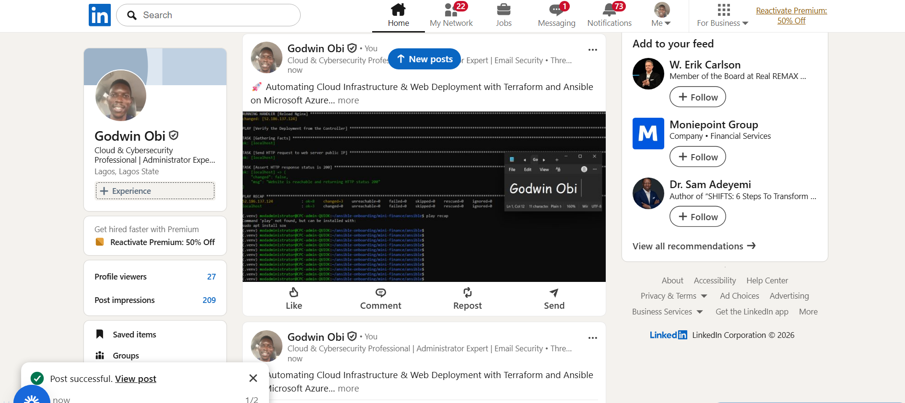

---

#### LinkedIn Post URL

Paste your LinkedIn post URL here:

`https://www.linkedin.com/posts/godwin-obi-008a12177_devops-terraform-ansible-activity-7503455760207650816-PXPX?utm_source=share&utm_medium=member_desktop&rcm=ACoAACn5hogBVyHnSR92cyBf5EzFBZEMSepEVPM`

---

### LinkedIn Submission Notes

**One challenge you faced and how you fixed it:**

During Terraform provisioning, the VM creation failed with an Azure `400 Bad Request` because the `Standard_D2s_v7` SKU requires a Hypervisor Generation 2 (Gen2) image, but the default image configuration was set to Gen1. I resolved this by updating the `source_image_reference` SKU in `main.tf` to point to `22_04-lts-gen2` (Ubuntu 22.04 LTS Gen2).

---

**One real-world example where you can use this learning:**

Setting up automated, repeatable staging and production environments for web applications. By pairing Terraform (for cloud infrastructure creation) with Ansible (for OS configuration and software deployment), entire application environments can be stood up from scratch in minutes via CI/CD pipelines without manual server configuration.

---

# Assignment Questions

Answer the following in your own words:

**1. What did you provision using Terraform in this assignment?**

A complete Azure infrastructure stack, including a Resource Group (`rg-mini-finance`), Virtual Network (`vnet-mini-finance`), Subnet (`subnet-mini-finance`), Network Security Group (`nsg-mini-finance`), Public IP (`pip-mini-finance`), Network Interface (`nic-mini-finance`), and an Ubuntu Linux VM (`vm-mini-finance` using `Standard_D2s_v7`).

---

**2. What did Ansible configure and deploy in this assignment?**

Ansible installed Nginx, Git, and rsync, ensured Nginx was started and enabled on boot, cloned the Mini Finance repository to `/opt/mini-finance`, synchronized web files to `/var/www/html/` with proper `www-data:www-data` permissions, reloaded Nginx, and performed an automated HTTP health check.

---

**3. Why is SSH access on port `22` restricted to your public IP address?**

To enforce the principle of least privilege and protect the Virtual Machine from brute-force login attacks, unauthorized access attempts, and malicious scanning across the public internet.

---

**4. Why is HTTP port `80` open to the internet?**

Port 80 handles standard HTTP web traffic, which needs to be publicly accessible so external web browsers and HTTP health checks can access the hosted Mini Finance application.

---

**5. What is the purpose of the Ansible inventory file?**

It defines the target host IP addresses or domain names, groups them logically (e.g., `[web]`), and stores connection settings (such as SSH user and private key paths) so Ansible knows where and how to execute tasks.

---

**6. Why does the playbook use separate plays for install, deploy, and verify?**

Using separate plays organizes tasks by operational phase, isolates scope and privilege levels (e.g., running administrative tasks with `become: true` on target hosts versus unprivileged validation tasks on `localhost`), and makes the playbook easier to maintain and troubleshoot.

---

**7. Why is `rsync` useful when deploying website files?**

`rsync` efficiently transfers only changed or updated files rather than copying everything every time, preserves file attributes/permissions, and allows easy exclusion of unnecessary administrative folders like `.git`.

---

**8. What does the Ansible `uri` module verify in this assignment?**

It sends an HTTP GET request from the controller host to the public IP of the deployed web server and verifies that the application is running and responding with an HTTP status code of `200 OK`.

---

**9. What issue did you face during this assignment, and how did you fix it?**

A `400 Bad Request` error occurred during `terraform apply` because `Standard_D2s_v7` does not support Hypervisor Gen1 images. I fixed it by updating `main.tf` to use the Gen2 Ubuntu SKU (`22_04-lts-gen2`). Additionally, in Ansible, I updated the URI verification task target from `hostvars` to `groups['web'][0]` to ensure proper IP resolution.

---

**10. What did you learn from using Terraform and Ansible together?**

I learned how to separate infrastructure provisioning from configuration management: Terraform handles the lifecycle of hardware/cloud resources (IaC), while Ansible handles OS configuration, application setup, and deployment verification (Config as Code). Combining them enables reliable, end-to-end automated deployment pipelines.

---

# Required Files

Confirm that the following files are included in your assignment folder:

- [ ] `.gitignore`
- [ ] `README.md`
- [ ] `terraform/providers.tf`
- [ ] `terraform/main.tf`
- [ ] `terraform/variables.tf`
- [ ] `terraform/outputs.tf`
- [ ] `ansible/inventory.ini`
- [ ] `ansible/site.yml`

---

# Submission Instructions

- Add all required screenshots in the correct order.
- Full Name must be visible in required screenshots.
- Add the Azure VM public IP address.
- Add the final Mini Finance website URL.
- Paste `inventory.ini`, `site.yml`, and `README.md` as editable text.
- Answer all assignment questions clearly in your own words.
- Add your LinkedIn post URL.
- Do not expose SSH private keys, passwords, Azure credentials, subscription IDs, Terraform state contents, or other sensitive information.
- Submit only one Google Doc link.
- Ensure that anyone with the link can view the document.
- Test the Google Doc link in an incognito or private browser window before submitting.

---

# Completion Checklist

- [ ] Task 1: `mini-finance` project structure created
- [ ] Task 1: `.gitignore` created
- [ ] Task 2: Terraform Azure infrastructure code created
- [ ] Task 2: `Allow-SSH` rule configured for port `22`
- [ ] Task 2: `Allow-HTTP` rule configured for port `80`
- [ ] Task 2: NSG associated with the Network Interface
- [ ] Task 3: `terraform fmt` completed
- [ ] Task 3: `terraform init` completed
- [ ] Task 3: `terraform validate` completed successfully
- [ ] Task 3: `terraform apply` completed successfully
- [ ] Task 3: `terraform output public_ip` displayed the VM public IP
- [ ] Task 4: Passwordless SSH works from the Ansible controller
- [ ] Task 5: `inventory.ini` created
- [ ] Task 5: Ansible ping returns `SUCCESS` and `pong`
- [ ] Task 6: `site.yml` contains three separate plays
- [ ] Task 6: Play 1 installs Nginx, Git, and rsync
- [ ] Task 6: Play 2 clones and deploys the Mini Finance website
- [ ] Task 6: Play 3 verifies HTTP status code `200`
- [ ] Task 7: Playbook syntax check passes
- [ ] Task 7: Ansible playbook completes successfully
- [ ] Task 7: Final recap shows `failed=0` and `unreachable=0`
- [ ] Task 8: Mini Finance website loads in the browser
- [ ] Task 8: Azure VM public IP is visible in the browser screenshot
- [ ] Task 9: `README.md` completed
- [ ] Screenshots 1–15 are included
- [ ] `inventory.ini`, `site.yml`, and `README.md` are pasted as editable text
- [ ] Assignment questions are answered
- [ ] LinkedIn post published with Anyone visibility
- [ ] LinkedIn post URL added
- [ ] No sensitive information is exposed
- [ ] Google Doc is accessible

---

## About DMI & CloudAdvisory

DevOps Micro Internship (DMI) is a project-based DevOps program run by Pravin Mishra and The CloudAdvisory, focused on real-world execution, systems thinking, and career readiness.

It helps learners build strong DevOps foundations with hands-on experience.

---

## Resources

- DMI Official Website: [https://dmi.pravinmishra.com?utm_source=github&utm_medium=readme](https://dmi.pravinmishra.com?utm_source=github&utm_medium=readme)
- University: [https://university.pravinmishra.com?utm_source=github&utm_medium=readme](https://university.pravinmishra.com?utm_source=github&utm_medium=readme)
- Discord Community: [https://discord.pravinmishra.com?utm_source=github&utm_medium=readme](https://discord.pravinmishra.com?utm_source=github&utm_medium=readme)
- Blog: [https://dmi.pravinmishra.com/blog?utm_source=github&utm_medium=readme](https://dmi.pravinmishra.com/blog?utm_source=github&utm_medium=readme)
- YouTube Playlist: [https://www.youtube.com/playlist?list=PLFeSNDtI4Cho](https://www.youtube.com/playlist?list=PLFeSNDtI4Cho)
- Pravin Mishra LinkedIn: [https://www.linkedin.com/in/pravin-mishra-aws-trainer/](https://www.linkedin.com/in/pravin-mishra-aws-trainer/)
- CloudAdvisory LinkedIn: [https://www.linkedin.com/company/thecloudadvisory/](https://www.linkedin.com/company/thecloudadvisory/)

---

*This submission is part of DevOps Micro Internship (DMI) Cohort 3 — Agentic AI Track.*