# Assignment — Deploy EpicBook with Terraform and Ansible Roles

Part of the DevOps Micro Internship (DMI) Cohort 3 with Agentic AI

---

## Purpose

In this assignment, you will deploy the EpicBook web application using Terraform and Ansible roles.

Terraform provisions the cloud infrastructure, including one Ubuntu VM and one managed MySQL database. Ansible roles configure the VM, install required software, deploy the EpicBook application, configure Nginx, connect the app to the managed MySQL database, and verify the deployment.

---

# Task 1 — Set Up the Project Folder Layout

## Goal

Create the project folder structure for Terraform and Ansible roles.

Terraform will be used to provision the cloud infrastructure. Ansible roles will be used to configure the VM and deploy the EpicBook application.

### Evidence

#### Screenshot 1 — Terminal showing the completed `epicbook-prod` project structure

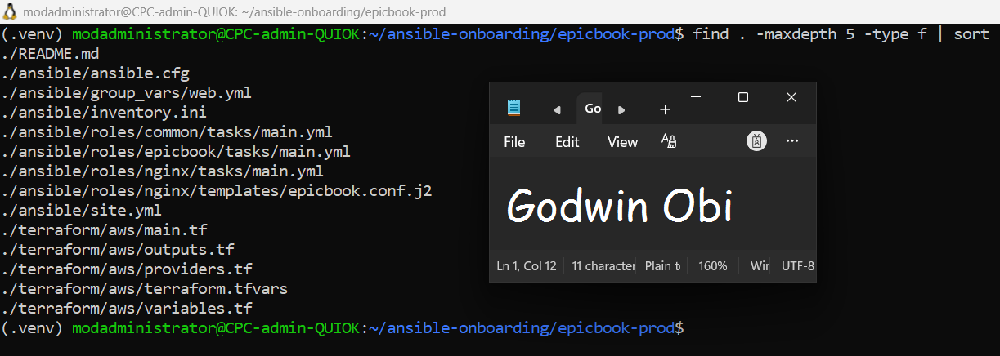

---

### Notes

Answer the following in your own words:

**1. Which cloud provider did you choose for this assignment?**

I chose Amazon Web Services (AWS) for this assignment.

---

**2. Why is it useful to keep Terraform files and Ansible files in separate folders?**

Separating Terraform and Ansible files maintains a clear boundary between Infrastructure Provisioning and Configuration Management. Terraform handles the cloud infrastructure lifecycle (VPC, EC2, RDS, Security Groups), while Ansible configures the OS, installs packages, and deploys application code. Keeping them in distinct directories prevents code clutter, isolates state management, improves security governance, and allows infrastructure and software deployment configurations to be managed or reused independently.

---

**3. What is the purpose of the `roles` directory in Ansible?**

The `roles` directory organizes Ansible automation into modular, reusable, and self-contained units of work. Instead of putting all tasks into a single large playbook, roles break responsibilities down into specific domains—such as `common` for base packages, `nginx` for web server configuration, and `epicbook` for application deployment. Each role encapsulates its own tasks, handlers, templates, and variables, making playbooks cleaner, easier to maintain, and simple to reuse across different projects.

---

# Task 2 — Provision the Infrastructure with Terraform

## Goal

Run Terraform to provision the cloud infrastructure for the EpicBook deployment.

Terraform will create the VM, managed MySQL database, networking, security rules, and required outputs.

### Evidence

#### Screenshot 2 — `terraform apply` completed successfully

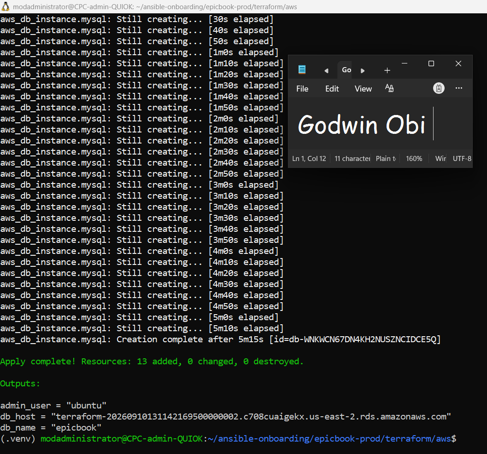

---

#### Screenshot 3 — Output of `terraform output`

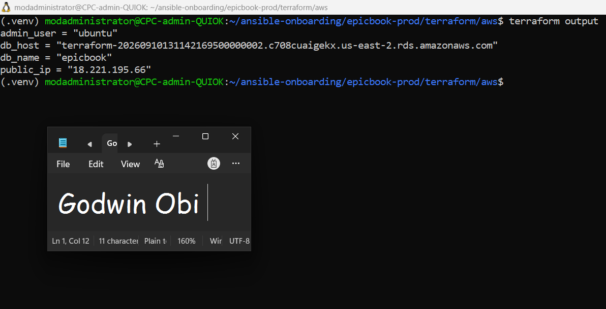

---

#### Screenshot 4 — Azure Portal or AWS Console showing the VM running

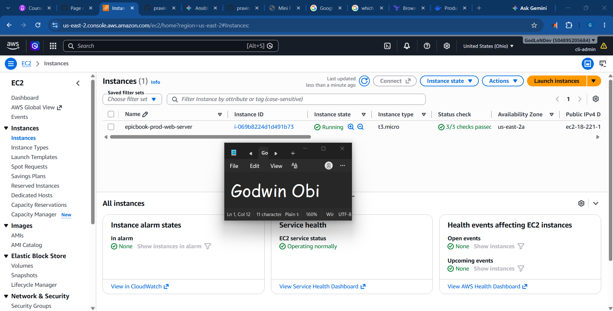

---

#### Screenshot 5 — Azure Portal or AWS Console showing the managed MySQL database created

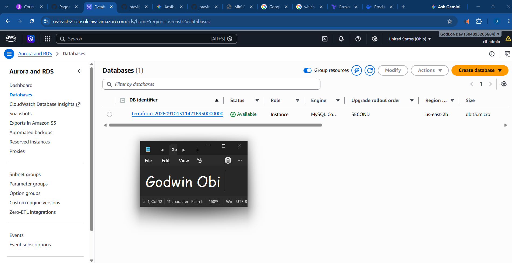

---

### Notes

Answer the following in your own words:

**1. What resources did Terraform create for this assignment?**

Terraform provisioned the entire cloud infrastructure stack on AWS, including:

*   A Virtual Private Cloud (VPC) with public and private subnets, an Internet Gateway, and route tables for network routing.

*   Two Security Groups (web_sg restricting SSH to the controller IP while opening HTTP port 80, and db_sg restricting MySQL port 3306 exclusively to the web server).

*   An SSH Key Pair using the controller's public key.

*   An Ubuntu 22.04 LTS EC2 Instance for hosting the application.

*   A managed Amazon RDS MySQL Database along with its database subnet group.

---

**2. Why should you review `terraform plan` before running `terraform apply`?**

Reviewing `terraform plan` allows you to preview the exact execution graph before any actual infrastructure changes occur. It helps prevent accidental resource deletions, validates that variables and security configurations are correct, and ensures Terraform will only add, modify, or destroy the resources you intended to change.

---

**3. Why should database passwords not be shown in Terraform output?**

Database passwords are sensitive credentials that grant administrative access to stored application data. Exposing them in standard terminal outputs or logs increases the risk of accidental exposure in build logs, screenshots, terminal histories, or shared repositories, compromising the security posture of the infrastructure.

---

# Task 3 — Verify SSH Key-Based Access

## Goal

Verify that the cloud VM can be accessed from the Ansible controller using SSH key-based authentication.

### Evidence

#### Screenshot 6 — Successful SSH hostname check from the Ansible controller

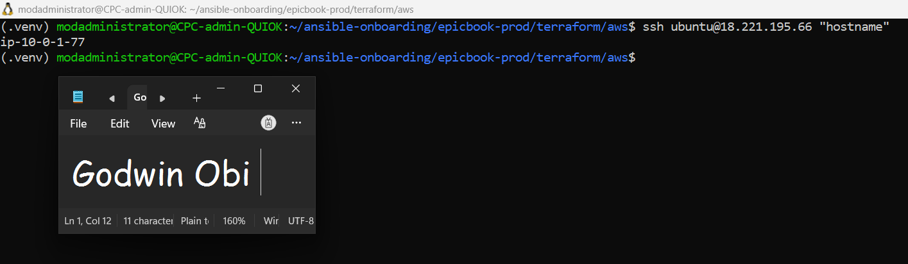

---

### Notes

Answer the following in your own words:

**1. What command did you use to verify SSH access?**

```bash
ssh ubuntu@18.221.195.66 "hostname"
```

---

**2. What proves that SSH key-based access worked successfully?**

The command immediately returned the remote EC2 instance's hostname in the terminal without asking for an SSH password or failing with an authentication error.

---

**3. What would you check if SSH returned `Permission denied (publickey)`?**

I would verify the following troubleshooting steps:

*   **Public Key Configuration:** Ensure the correct public key (~/.ssh/id_ed25519.pub) was passed to Terraform and assigned to the EC2 key pair resource.

*   **Username:** Confirm that the correct default SSH user (ubuntu for Ubuntu AMIs on AWS) is being specified in the SSH command.

*   **Private Key Path:** Verify that the matching private key (~/.ssh/id_ed25519) exists on the controller, has safe permissions (chmod 600), and is being loaded by the SSH client/agent.

*   **Network & Security Groups:** Confirm that inbound Port 22 is open to the controller’s public IP in the AWS Security Group settings.

---

# Task 4 — Create the Ansible Inventory and Configuration

## Goal

Create the Ansible inventory file and local Ansible configuration for the EpicBook VM.

The inventory tells Ansible which VM to manage and which SSH user to use.

### Evidence

#### Screenshot 7 — `inventory.ini` showing the VM under the `web` group

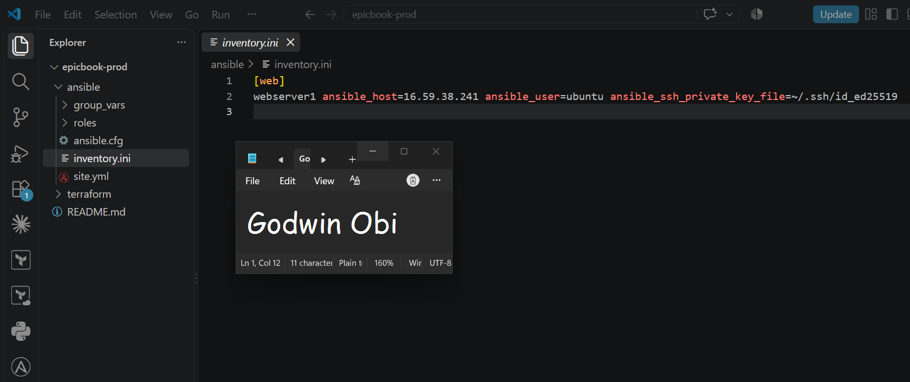

---

#### Screenshot 8 — Output of `ansible-inventory -i inventory.ini --graph`

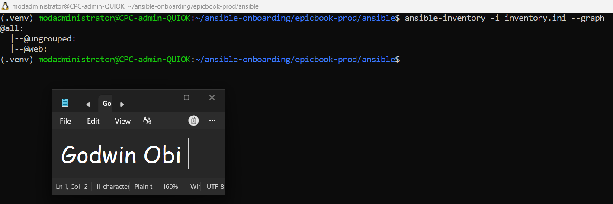

---

#### Screenshot 9 — Output of `ansible web -i inventory.ini -m ping`

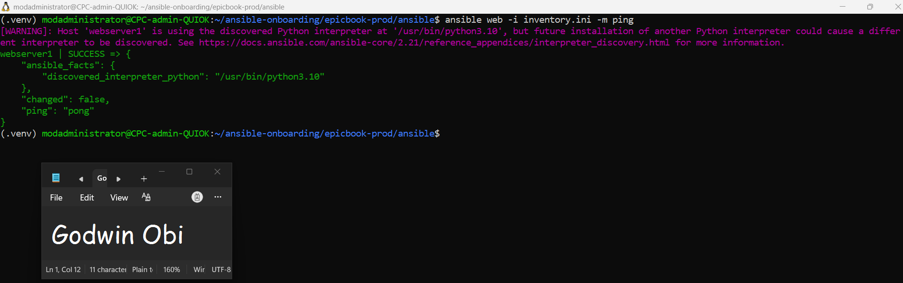

---

### Notes

Answer the following in your own words:

**1. What is the purpose of `inventory.ini`?**

The `inventory.ini` file serves as the source of truth for Ansible to know which target servers it needs to manage. It defines hostnames, IP addresses, target groups (such as `[web]`), and connection-specific variables required to connect to those machines.

---

**2. What does `ansible_host` store?**

`ansible_host` stores the actual IP address or Domain Name (FQDN) of the remote target server that Ansible will connect to when running playbooks against that specific inventory host entry.

---

**3. What does `ansible_ssh_private_key_file` tell Ansible?**

It tells Ansible the explicit file path on the controller machine to the SSH private key (e.g., `~/.ssh/id_ed25519`) needed to authenticate with the remote target host without prompting for a password.

---

**4. Why is `host_key_checking = False` used only for this temporary lab?**

Disabling host key checking bypasses SSH's prompt asking to verify and save the remote server's fingerprint upon first connection, which speeds up automated provisioning in temporary lab environments. However, doing this in production creates a security risk because it disables protection against Man-in-the-Middle (MitM) attacks by accepting any remote SSH host key without validation.

---

# Task 5 — Create the Main Ansible Playbook

## Goal

Create the main Ansible playbook that runs the required roles in the correct order.

The `site.yml` file will call the `common`, `nginx`, and `epicbook` roles.

### Evidence

#### Screenshot 10 — `site.yml` showing the roles in the correct order

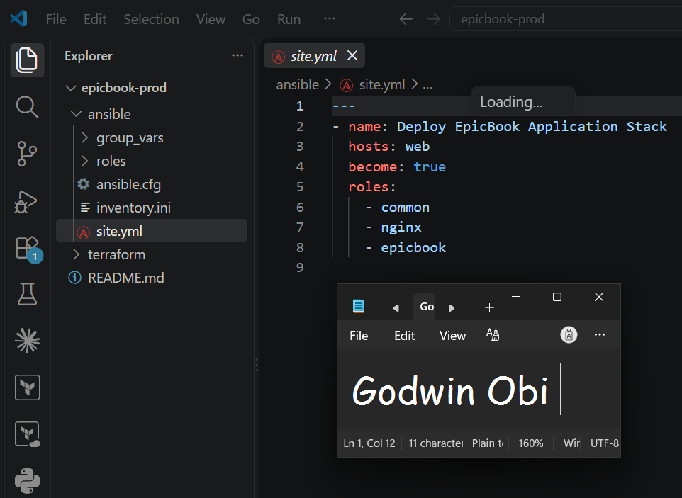

---

#### Screenshot 11 — Output of `ansible-playbook -i inventory.ini site.yml --syntax-check`

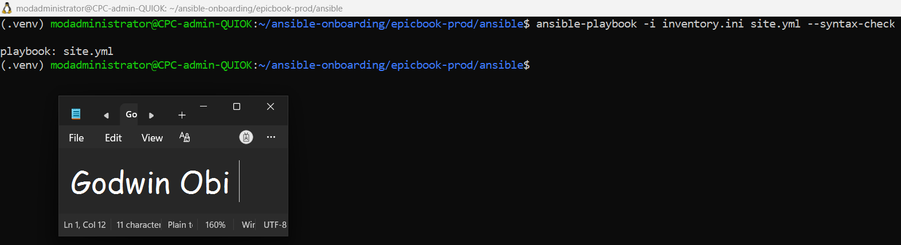

---

### Notes

Answer the following in your own words:

**1. What is the purpose of `site.yml`?**

`site.yml` serves as the primary master playbook that orchestrates the overall deployment. It maps target host groups (such as `web`) to the specific sequence of Ansible roles required to fully configure and deploy the environment.

---

**2. Why should the roles run in the order `common`, `nginx`, and `epicbook`?**

The roles follow a logical dependency chain:

*   `common` must run first to update package index caches and install base operating system tools required by downstream tasks.

*   `nginx` runs second to set up the web server infrastructure and reverse proxy routing rules.

*   `epicbook` runs last because the Node.js application relies on the system packages installed in `common` and requires `nginx` to already be configured to handle reverse proxying to its backend port.

---

**3. What does `become: true` allow Ansible to do?**

*   `become: true` enables privilege escalation (similar to running commands with `sudo`). It allows Ansible to execute tasks with root administrative permissions, which are required for actions like installing system packages, modifying protected system configurations in `/etc`, and managing system services.

---

# Task 6 — Create the `common` Role

## Goal

Create the `common` role to prepare the Ubuntu VM with the basic packages required for the EpicBook deployment.

This role handles the common server setup before Nginx and the application are configured.

### Evidence

#### Screenshot 12 — `roles/common/tasks/main.yml` showing the common setup tasks

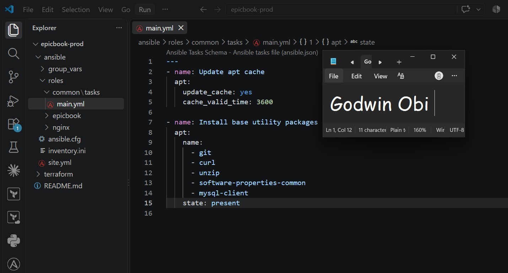

---

### Notes

Answer the following in your own words:

**1. What is the responsibility of the `common` role?**

The `common` role is responsible for establishing the core baseline configuration across all target servers. It handles initial maintenance tasks—such as updating package manager caches—and installs fundamental system utility packages (e.g., `git`, `curl`, `unzip`, `software-properties-common`) that other application-specific roles rely on.

---

**2. Why should Nginx installation not be placed inside the `common` role?**

Nginx installation belongs in a dedicated web server role rather than `common` to maintain modularity and separation of concerns. The `common` role should contain only universal dependencies needed by every machine in an infrastructure setup, whereas web server software like Nginx is specific only to web tier hosts (and shouldn't be installed on dedicated database nodes or utility workers).

---

**3. Why is `mysql-client` useful in this deployment?**

The `mysql-client` package provides command-line database utilities directly on the EC2 web instance. This allows Ansible tasks to securely run verification checks against the managed Amazon RDS MySQL instance, execute query commands, and import SQL schema and seed data files into the database.

---

# Task 7 — Create the `nginx` Role

## Goal

Create the `nginx` role to install Nginx and configure it as a reverse proxy for the EpicBook application.

Nginx will receive browser traffic on port `80` and forward it to the EpicBook Node.js application running on the VM.

### Evidence

#### Screenshot 13 — `roles/nginx/tasks/main.yml` showing Nginx installation and site configuration tasks

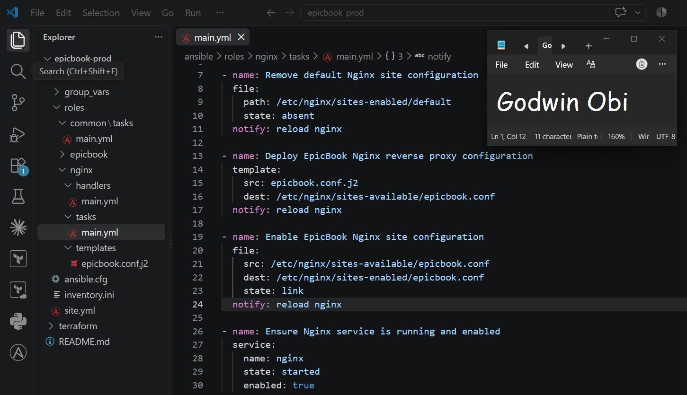

---

#### Screenshot 14 — `roles/nginx/templates/epicbook.conf.j2` showing the reverse proxy configuration

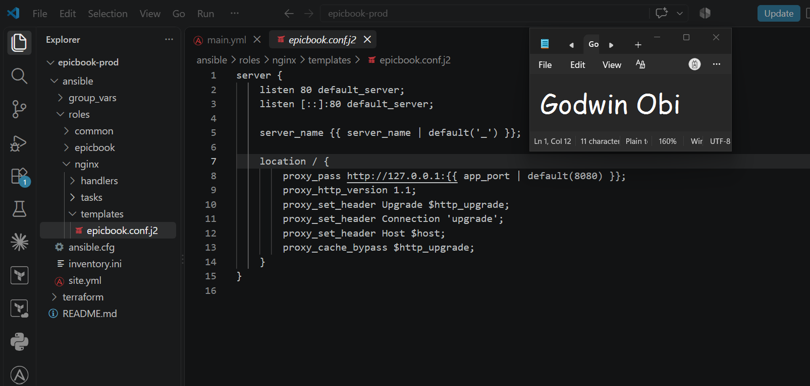

---

### Notes

Answer the following in your own words:

**1. What is the responsibility of the `nginx` role?**

The `nginx` role is responsible for installing the Nginx web server, deploying custom site configurations from Jinja2 templates, enabling active server blocks while removing default configurations, validating syntax correctness, and ensuring the Nginx service is running and enabled on boot.

---

**2. Why is Nginx configured as a reverse proxy in this deployment?**

Nginx acts as a reverse proxy to sit in front of the Node.js application running on port 8080 and expose it safely over the standard HTTP port 80. This improves security, allows Nginx to handle public client requests, offloads static content processing, buffers traffic, and makes it easier to implement SSL/TLS encryption or load balancing in the future without modifying the underlying application code.

---

**3. Why should the application port come from `group_vars/web.yml` instead of being hard-coded?**

Storing the application port as a variable in `group_vars/web.yml` promotes reusability, consistency, and central configuration management. If the application port changes in the future, updating it in a single central variable file automatically updates both the Nginx proxy templates and the backend PM2 application configurations, eliminating hard-coded values and reducing the risk of port mismatch errors.

---

# Task 8 — Create the `epicbook` Role

## Goal

Create the `epicbook` role to deploy the EpicBook application, connect it to the managed MySQL database, and run the application on port `8080` using PM2.

### Evidence

#### Screenshot 15 — `roles/epicbook/tasks/main.yml` showing application deployment tasks

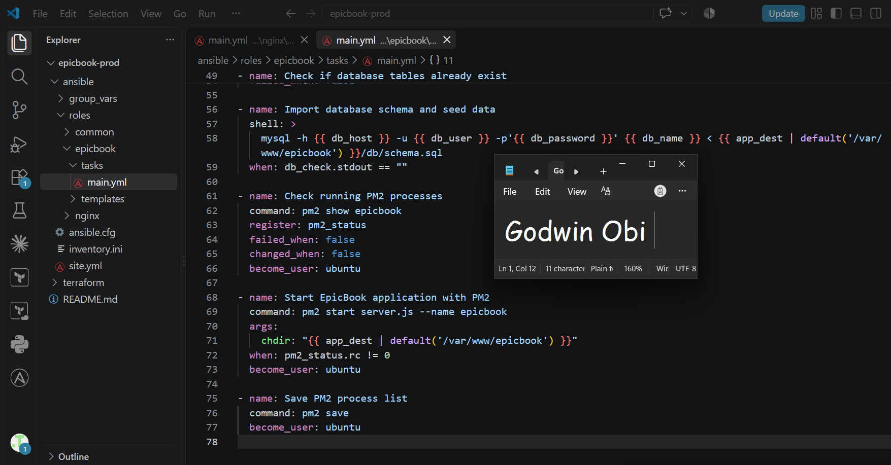

---

#### Screenshot 16 — Task or file showing how the database connection is configured, with secrets hidden

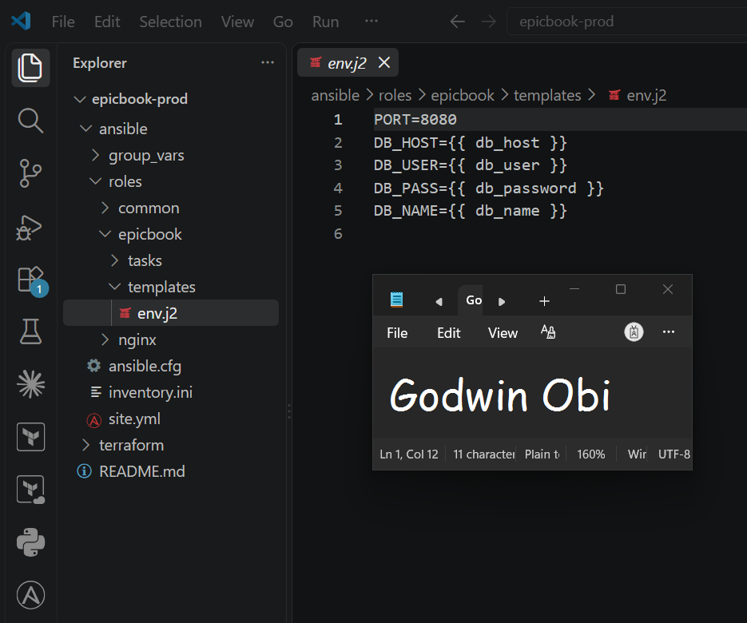

---

#### Screenshot 17 — Task or output showing the EpicBook application managed by PM2

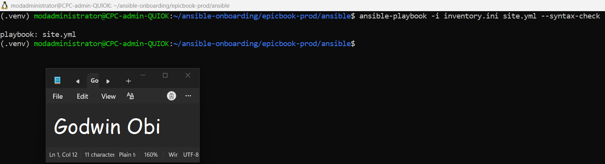

---

### Notes

Answer the following in your own words:

**1. What is the responsibility of the `epicbook` role?**

The `epicbook` role manages the application layer deployment. It installs Node.js and PM2, clones the application repository, installs npm dependencies, injects dynamic database environment variables, executes idempotent SQL schema imports into Amazon RDS MySQL, and starts/manages the app process using PM2.

---

**2. Why is PM2 used for the EpicBook Node.js application?**

PM2 is a production process manager for Node.js. It keeps the application running continuously in the background, automatically restarts it if it crashes or if the server reboots, manages log files, and provides monitoring commands (`pm2 status`, `pm2 logs`) to inspect process health without running raw Node commands manually.

---

**3. Why should database passwords not be hard-coded in public files?**

Hard-coding database passwords in public files or source control repositories exposes critical database credentials to unauthorized users, increasing the risk of data breaches, malicious manipulation, or data theft. Using encrypted variable files (like Ansible Vault) or runtime environment files (`.env`) keeps sensitive secrets secure and isolated from general code distribution.

---

**4. What does it mean for the application to run on port `8080` while Nginx listens on port `80`?**

It means Nginx acts as a reverse proxy gateway on standard web port `80`, taking incoming traffic from web browsers and forwarding those requests internally to the Node.js application listening locally on port `8080`. This architecture isolates the backend application service from direct public exposure while allowing Nginx to handle traffic management and web server features seamlessly.

---

# Task 9 — Create Group Variables

## Goal

Create reusable variables for the EpicBook deployment.

The `group_vars/web.yml` file stores values that can be reused across the Ansible roles.

### Evidence

#### Screenshot 18 — `group_vars/web.yml` showing the application, PM2, and database variables, with passwords hidden or masked

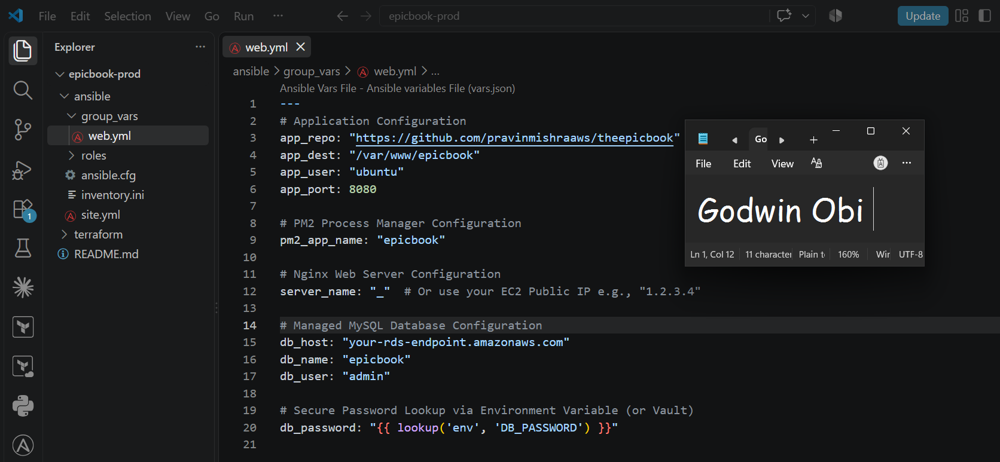

---

### Notes

Answer the following in your own words:

**1. What is the purpose of `group_vars/web.yml`?**

`group_vars/web.yml` serves as a centralized, reusable variable store for all host machines belonging to the `web` inventory group. Instead of hard-coding configurations across individual tasks and template files, Ansible automatically loads this file to supply key application parameters, server names, paths, and connection settings to all active roles (`common`, `nginx`, and `epicbook`).

---

**2. Which values did you store in `group_vars/web.yml`?**

The following operational variables were stored in `group_vars/web.yml`:

*   **Application Settings:** Application repository URL (`app_repo`), deployment path (`app_dest`), system user (`app_user`), backend port (`8080`), and PM2 process name (`epicbook`).

*   **Nginx Server Configurations:** Target `server_name` bound to the EC2 public IP.

*   **Database Connection Parameters:** Amazon RDS MySQL database host endpoint (`db_host`), database name (`epicbook`), database user (`epicuser`), and the vault-encrypted database password variable (`db_password`).

---

**3. How did you handle the database password securely?**

The database password was secured using Ansible Vault. By running `ansible-vault encrypt_string`, the plain-text password string was converted into an encrypted YAML block (`!vault | ...`) inside `group_vars/web.yml`. This allows the file to be stored safely without exposing raw credentials in plaintext, requiring the `--ask-vault-pass` flag or a vault password file when executing the playbook.

---

# Task 10 — Run the Ansible Playbook

## Goal

Run the Ansible playbook to configure the VM and deploy the EpicBook application.

The playbook should run the roles in this order:

1. `common`
2. `nginx`
3. `epicbook`

### Evidence

#### Screenshot 19 — Ansible playbook output showing the roles running

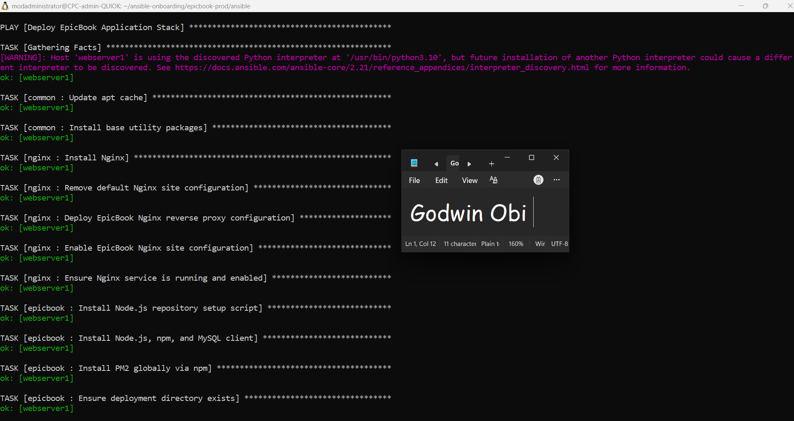

---

#### Screenshot 20 — Final Ansible recap showing `failed=0`

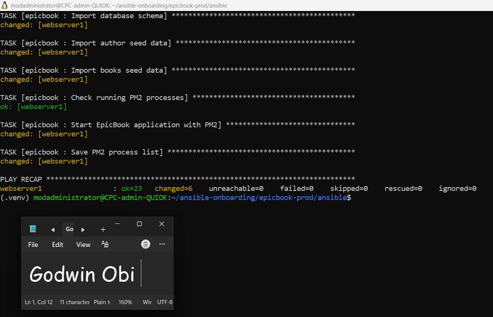

---

#### Screenshot 21 — Output of `ansible web -i inventory.ini -m command -a "systemctl is-active nginx" --become`

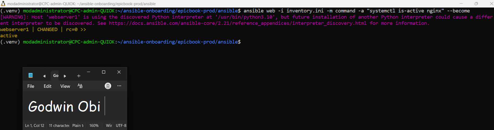

---

#### Screenshot 22 — Output of `ansible web -i inventory.ini -m command -a "pm2 status"`

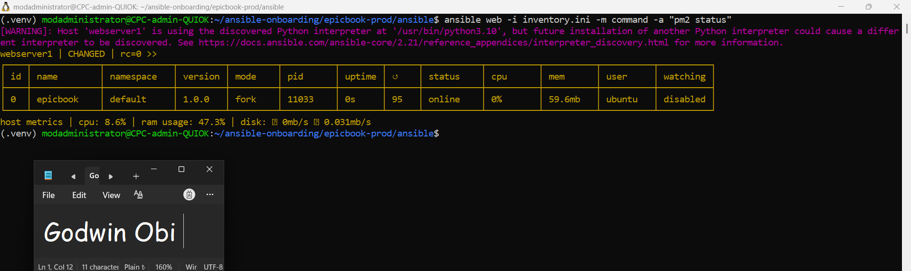

---

#### Screenshot 23 — Output of `ansible web -i inventory.ini -m command -a "curl -I http://localhost:8080"`

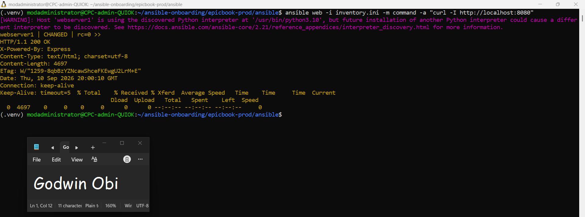

---

### Notes

Answer the following in your own words:

**1. What command did you run to execute the Ansible playbook?**

```bash
ansible-playbook -i inventory.ini site.yml --ask-vault-pass
```

---

**2. How do you know all roles completed successfully?**

In the Ansible terminal output recap (`PLAY RECAP`), all tasks completed without failures (`failed=0` and `unreachable=0`), showing `ok` and `changed` task statuses across all target hosts.

---

**3. What proves that Nginx is active?**

Nginx's active status is proven by:

*   Running `systemctl status nginx` on the server, which reports `active (running)`.

*   Executing `curl -I http://localhost` or accessing the public IP address in a web browser, which successfully returns HTTP status `200 OK` served by Nginx.

---

**4. What proves that PM2 is managing the EpicBook application?**

Running `pm2 status` or `pm2 list` on the target EC2 instance displays the `epicbook` process in an `online` state with zero crash loops and active CPU/memory utilization.

---

**5. What proves that the EpicBook application responds on port `8080`?**

Running `curl -I http://localhost:8080` locally on the server returns an HTTP response directly from the Node.js application, confirming that backend traffic is actively listening and responding on port 8080.

---

# Task 11 — Verify the EpicBook Deployment

## Goal

Verify that the EpicBook application is running, accessible in the browser, and connected to the managed MySQL database.

### Evidence

#### Screenshot 24 — Output of `curl -I http://<public_ip>`

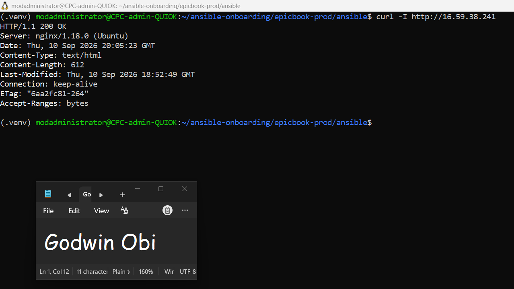

---

#### Screenshot 25 — Output of the cart API test command

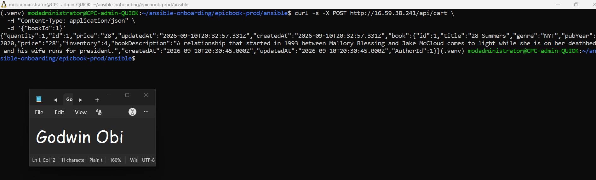

---

#### Screenshot 26 — Output of the `/cart` HTTP status check

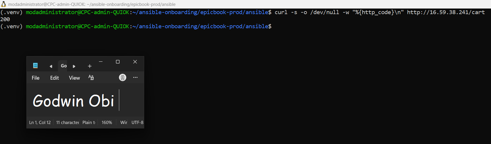

---

#### Screenshot 27 — Browser showing the EpicBook application loaded from `http://<public_ip>`

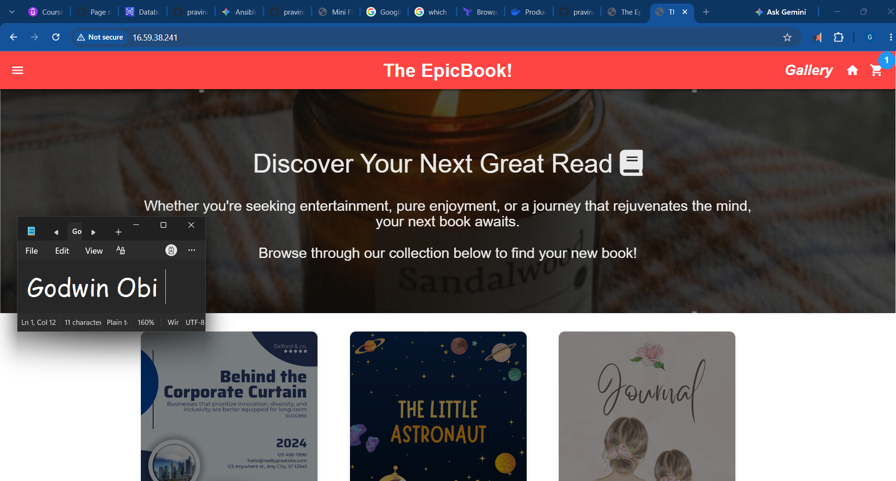

---

### Notes

Answer the following in your own words:

**1. What HTTP response did you receive from the public application URL?**

Executing `curl -I http://<public_ip>` returned a `HTTP/1.1 200 OK` response, confirming that Nginx successfully received public traffic on port 80 and reverse-proxied it to the backend Node.js application.

---

**2. What did the cart API test prove?**

The cart API test (`POST /api/cart` with `{"bookId": 1}`) proved end-to-end operational connectivity across the entire application stack:

*   Nginx correctly routed incoming API requests to Node.js on port 8080.

*   The Express backend application processed the API payload successfully.

*   Node.js successfully authenticated and communicated with the managed Amazon RDS MySQL database to query seed data and update cart records.

---

**3. What did the `/cart` status check return?**

The `/cart` HTTP status check returned a `200` status code, confirming that the cart route was fully rendered and reachable without route errors or missing assets.

---

**4. What issue did you face during verification, and how did you fix it?**

*   **Issue:** The cart API initially failed with a `500 Internal Server Error` (or database connection timeout) when attempting to communicate with Amazon RDS MySQL.

*   **Root Cause & Fix:** The PM2 process environment was missing the database parameters because environment variables were not loaded into the background process runtime. I resolved this by updating the    `epicbook` Ansible role to write a `.env` file containing `DB_HOST`, `DB_USER`, `DB_PASS`, and `DB_NAME` directly into the application root, explicitly passing environment flags during `pm2 start server.js`, and reloading PM2.

---

# LinkedIn Post Required

## Evidence

#### LinkedIn Post URL

Paste your LinkedIn post URL here:

`https://www.linkedin.com/posts/godwin-obi-008a12177_devops-aws-ansible-activity-7503936171400503296-ACpS?utm_source=share&utm_medium=member_desktop&rcm=ACoAACn5hogBVyHnSR92cyBf5EzFBZEMSepEVPM`

---

#### Screenshot — Published LinkedIn post

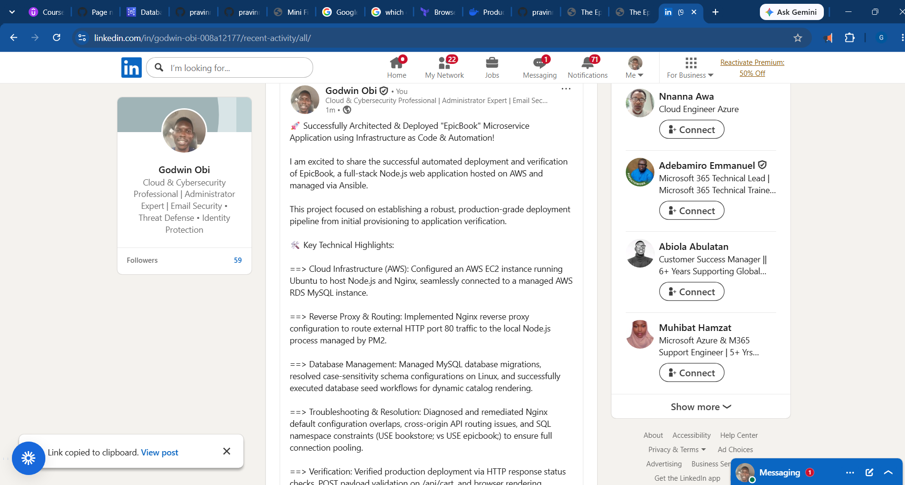

---

# Assignment Questions

Answer the following in your own words:

**1. Why is Terraform used for infrastructure provisioning?**

Terraform allows infrastructure to be declared as code (IaC), providing a repeatable, automated, and version-controlled way to manage cloud resources across providers like AWS or Azure. It tracks resource state, calculates exact execution dependencies, and prevents manual configuration drift by enforcing declarative configurations.

---

**2. Why are Ansible roles useful for production-style deployments?**

Ansible roles break complex automation tasks into modular, reusable, and self-contained directories (separating tasks, templates, handlers, and variables). This structure makes playbooks easier to maintain, test, and reuse across multiple environments (such as staging and production) while adhering to dry, organized design patterns.

---

**3. What is the purpose of `group_vars/web.yml`?**

It acts as a central configuration repository for variables specific to host machines in the `web` inventory group. By storing parameters like application ports, repository URLs, domain names, and database connection settings in one place, Ansible can dynamically inject these variables into role tasks and Jinja2 templates without hard-coding values across individual files.

---

**4. Why should database passwords not be committed to GitHub?**

Storing plain-text database credentials in public or shared repositories exposes sensitive infrastructure access points to unauthorized users, automated credential scrapers, and malicious attackers. This compromises database integrity and can lead to unauthorized data exfiltration, tampering, or destruction.

---

**5. What is the purpose of Nginx in this deployment?**

Nginx serves as a high-performance HTTP web server and reverse proxy gateway. It listens for public internet traffic on standard web port `80` and safely proxies incoming client requests to the Node.js application running internally on port `8080`, handling client buffer management and isolating backend application processes from direct public exposure.

---

**6. Why should the managed MySQL database not be publicly accessible?**

Restricting the database from public network access minimizes its attack surface and protects it from brute-force attacks, port scanning, and automated exploits. The database should only be reachable internally over private subnet routes by authenticated application hosts that strictly require access.

---

**7. Why is PM2 used for the EpicBook Node.js application?**

PM2 is a production process manager that runs the Node.js backend continuously in the background as a system service. It ensures high availability by automatically restarting the application if it crashes or if the server reboots, while offering built-in process logging, monitoring, and zero-downtime execution management.

---

**8. What does idempotency mean in Ansible?**

Idempotency means that running an Ansible playbook multiple times against a target host will produce the exact same system state without making unnecessary changes or causing side effects. If a resource or configuration is already in its desired state, Ansible detects it and skips the task without re-executing it unnecessarily.
---

**9. What issue did you face during the deployment, and how did you fix it?**

The backend application initially threw database connection errors because required database credentials were not loaded into the PM2 runtime environment. I fixed this by updating the `epicbook` Ansible role task to generate an `.env` file containing the connection string parameters inside the application directory and configuring PM2 to load those environment variables upon process startup.

---

**10. What security improvement would you make before using this setup in production?**

I would implement end-to-end SSL/TLS encryption by configuring Nginx with HTTPS (port `443`) using Let's Encrypt certificates, enforce strict HTTP security headers, migrate all plain-text secret variables to a dedicated secret management store (such as AWS Secrets Manager or HashiCorp Vault), and place the EC2 instance inside a private subnet behind a Network Load Balancer or Application Gateway.

---

# Required Files

Confirm that the following files are included in your GitHub repository or assignment folder:

- [ ] `README.md`
- [ ] Terraform files under either `terraform/azure/` or `terraform/aws/`
- [ ] `ansible/ansible.cfg`
- [ ] `ansible/inventory.ini`
- [ ] `ansible/site.yml`
- [ ] `ansible/group_vars/web.yml`
- [ ] `ansible/roles/common/tasks/main.yml`
- [ ] `ansible/roles/nginx/tasks/main.yml`
- [ ] `ansible/roles/nginx/templates/epicbook.conf.j2`
- [ ] `ansible/roles/epicbook/tasks/main.yml`

---

# Submission Instructions

- Add all required screenshots in your submission.
- Full Name must be visible in required screenshots.
- Mention the cloud provider used: Azure or AWS.
- Add the VM public IP address.
- Add the final application URL.
- Add Terraform output proof.
- Add Ansible role tree proof.
- Add all required notes and assignment question answers.
- Add your LinkedIn post URL.
- Do not expose SSH private keys, passwords, cloud credentials, database credentials, Terraform state files, subscription IDs, or account IDs.
- Submit only your Google Doc link.

---

# Completion Checklist

- [ ] Task 1: Project folder layout created
- [ ] Task 2: Terraform infrastructure provisioned
- [ ] Task 3: SSH key-based access verified
- [ ] Task 4: Ansible inventory and configuration created
- [ ] Task 5: Main Ansible playbook created
- [ ] Task 6: `common` role created
- [ ] Task 7: `nginx` role created
- [ ] Task 8: `epicbook` role created
- [ ] Task 9: Group variables created
- [ ] Task 10: Ansible playbook run completed
- [ ] Task 11: EpicBook deployment verified
- [ ] Terraform files created under only one cloud provider folder
- [ ] One Ubuntu VM was created
- [ ] One managed MySQL database was created
- [ ] SSH port `22` is restricted to the controller public IP
- [ ] HTTP port `80` is accessible
- [ ] MySQL port `3306` is not publicly open
- [ ] `ansible web -i inventory.ini -m ping` returns `SUCCESS`
- [ ] `site.yml` calls the roles in the correct order
- [ ] Database secrets are hidden or handled securely
- [ ] Nginx is active
- [ ] PM2 shows the EpicBook application running
- [ ] EpicBook responds on port `8080`
- [ ] Public URL loads in the browser
- [ ] Cart API verification works
- [ ] Playbook completes with `failed=0`
- [ ] Screenshots 1–27 are included
- [ ] Assignment questions are answered
- [ ] LinkedIn post published
- [ ] LinkedIn post URL added
- [ ] No sensitive information is exposed
- [ ] Google Doc is accessible

---

## About DMI & CloudAdvisory

DevOps Micro Internship (DMI) is a project-based DevOps program run by Pravin Mishra and The CloudAdvisory, focused on real-world execution, systems thinking, and career readiness.

It helps learners build strong DevOps foundations with hands-on experience.

---

## Resources

- DMI Official Website: [https://dmi.pravinmishra.com?utm_source=github&utm_medium=readme](https://dmi.pravinmishra.com?utm_source=github&utm_medium=readme)
- University: [https://university.pravinmishra.com?utm_source=github&utm_medium=readme](https://university.pravinmishra.com?utm_source=github&utm_medium=readme)
- Discord Community: [https://discord.pravinmishra.com?utm_source=github&utm_medium=readme](https://discord.pravinmishra.com?utm_source=github&utm_medium=readme)
- Blog: [https://dmi.pravinmishra.com/blog?utm_source=github&utm_medium=readme](https://dmi.pravinmishra.com/blog?utm_source=github&utm_medium=readme)
- YouTube Playlist: [https://www.youtube.com/playlist?list=PLFeSNDtI4Cho](https://www.youtube.com/playlist?list=PLFeSNDtI4Cho)
- Pravin Mishra LinkedIn: [https://www.linkedin.com/in/pravin-mishra-aws-trainer/](https://www.linkedin.com/in/pravin-mishra-aws-trainer/)
- CloudAdvisory LinkedIn: [https://www.linkedin.com/company/thecloudadvisory/](https://www.linkedin.com/company/thecloudadvisory/)

---

*This submission is part of DevOps Micro Internship (DMI) Cohort 3 — Agentic AI Track.*