# Assignment 6 — AI-Assisted Ansible Change Risk Review

Part of the DevOps Micro Internship (DMI) Cohort 3 with Agentic AI

---

## Purpose

In this assignment, you will build an AI-assisted Ansible risk-review workflow using `ansible-playbook --check --diff`, Bash scripting, and Claude Code.

You will review possible server changes before applying them, classify risky tasks, and keep the final apply decision under human control.

---

# Task 1 — Confirm EpicBook Connectivity and Create the Workspace

## Goal

Confirm that your previous EpicBook Ansible project is working before creating the risk-review automation.

### Evidence

#### Screenshot 1 — Output of `ansible web -i inventory.ini -m ping`

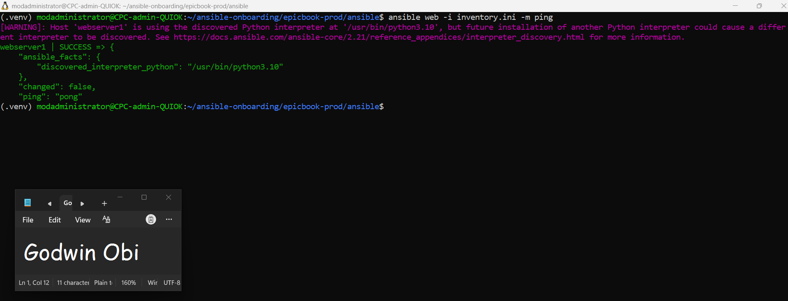
---

#### Screenshot 2 — Output of `ansible-playbook -i inventory.ini site.yml --syntax-check`

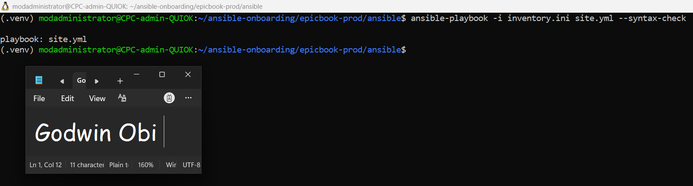

---

#### Screenshot 3 — Output of `pwd` and `find . -maxdepth 4 -type d | sort`

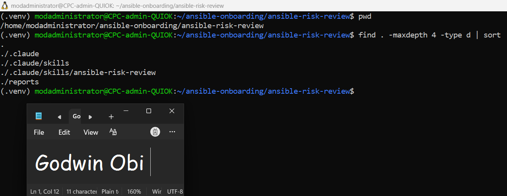

---

### Notes

Answer the following in your own words:

**1. What proves that Ansible can reach your EpicBook VM?**

>The successful execution of `ansible web -i inventory.ini -m ping` returning `webserver1 | SUCCESS => { "changed": false, "ping": "pong" }` proves connectivity. This confirms that the Ansible controller has established a valid SSH connection to the remote webserver host and successfully executed Python on the target VM.

---

**2. Why should you confirm playbook syntax before building a risk-review script?**

>Confirming playbook syntax with `ansible-playbook -i inventory.ini site.yml --syntax-check` ensures that the YAML structures, play definitions, task arguments, and role imports are completely error-free. Verifying syntax beforehand guarantees that any downstream dry-run failures in the risk-review script stem from genuine infrastructure check issues rather than basic syntax or indentation errors.

---

# Task 2 — Create Project Context and Safety Rules in CLAUDE.md

## Goal

Create a `CLAUDE.md` file that tells Claude Code how this project must behave.

### Evidence

#### Screenshot 4 — `CLAUDE.md` open in VS Code or terminal showing the safety rules

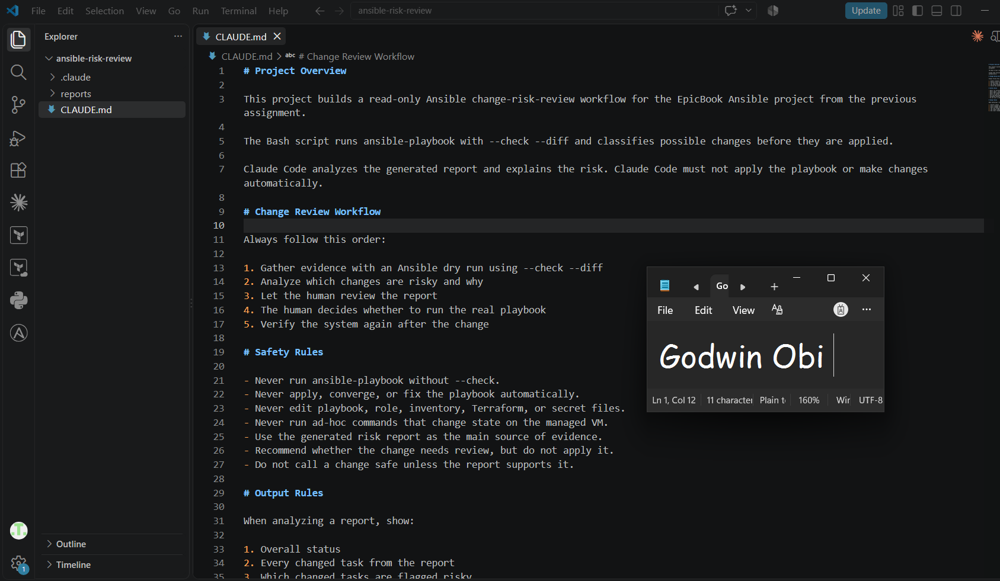

---

### Notes

Answer the following in your own words:

**1. Why should Claude Code have project-specific safety rules?**

>AI assistants operating in CLI environments can automatically execute proposed state-changing actions if given full permission. Establishing project-specific safety rules restricts the AI agent to read-only diagnostic roles, preventing unintended server configuration changes, unexpected service downtime, or silent production state drift.

---

**2. Why should the human run the real Ansible playbook manually?**

>Human-in-the-loop validation ensures critical infrastructure decisions remain under human control. The human operator evaluates business impact, production schedules, maintenance windows, and potential side-effects identified in the risk report before authorizing actual system modifications.

---

**3. Which rule prevents Claude Code from applying changes automatically?**

>The explicit rule: 
>`"- Never apply, converge, or fix the playbook automatically."` 
(supported by `"- Never run ansible-playbook without --check."`)

---

# Task 3 — Ask Claude Code to Plan the Risk Review

## Goal

Use Claude Code to produce a read-only plan before writing the Bash script.

### Evidence

#### Screenshot 5 — Claude Code showing the four-category risk-classification plan

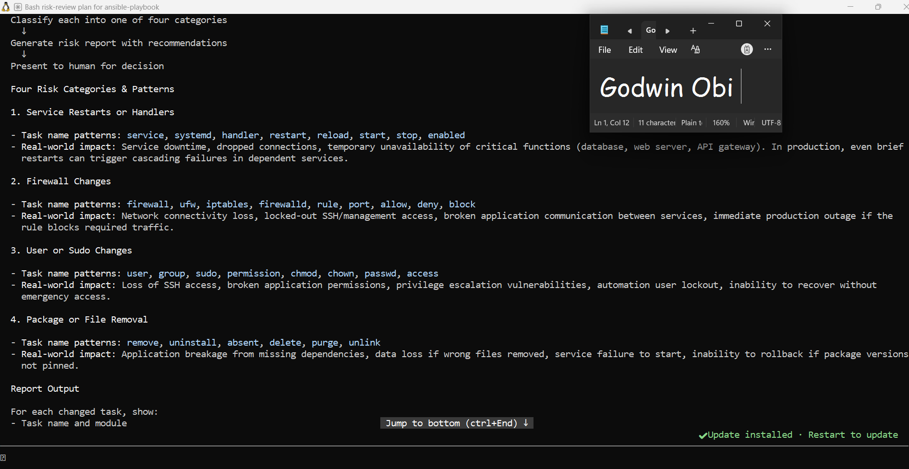

---

### Notes

Answer the following in your own words:

**1. Which part of this task represents the Gather phase?**

>The Gather phase is represented by running `ansible-playbook --check --diff` inside the script plan to safely dry-run the playbook against the target server and capture state-change evidence (diffs and task outputs) without applying actual system modifications.

---

**2. Which part represents the Analyze phase?**

>The Analyze phase occurs when the script parses the dry-run output against defined string/regex patterns to classify changes into the four specific risk categories (service restarts, firewall updates, user/sudo modifications, and package/file removals) and evaluate their potential real-world impact.

---

**3. How did you verify Claude Code did not create or edit files?**

>Verified by checking the working directory status after exiting Claude Code using `ls -la` and `git status` (or checking workspace file tree), confirming that no new files were created and existing files (`CLAUDE.md`) remained unmodified.

---

# Task 4 — Build the Ansible Risk Review Script

## Goal

Create a Bash script that runs an Ansible dry run and classifies risky changes.

### Evidence

#### Screenshot 6 — Top section of `ansible-check-review.sh` showing `full_name`, `playbook_path`, `inventory_path`, and the `checks` array

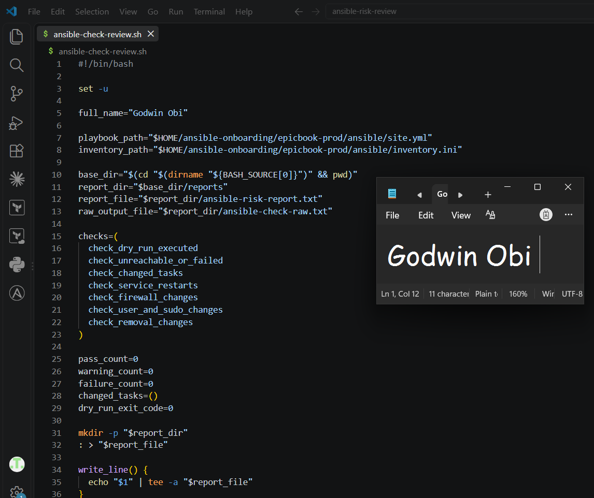

---

#### Screenshot 7 — Middle section showing `extract_changed_tasks` and `check_tasks_matching_pattern`

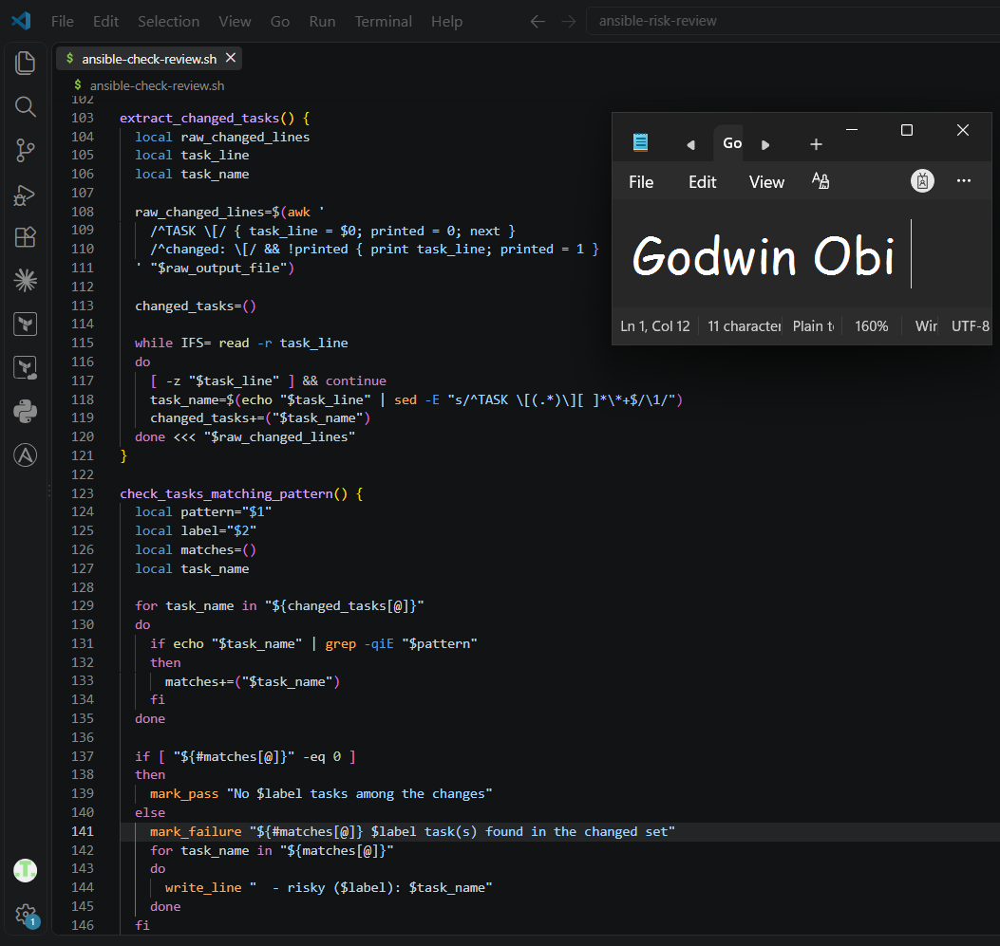

---

#### Screenshot 8 — Bottom section showing the loop, summary, and exit behavior

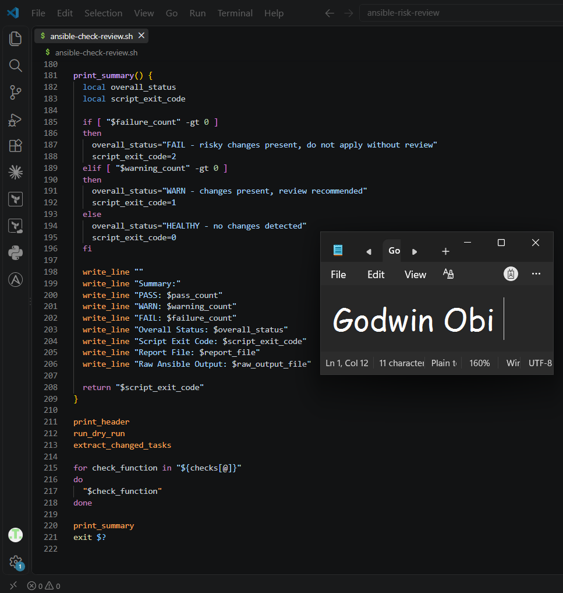

---

#### Screenshot 9 — Output of `bash -n ansible-check-review.sh` and `ls -l ansible-check-review.sh`

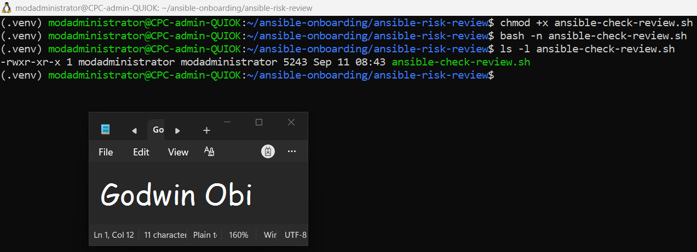
---

### Notes

Answer the following in your own words:

**1. What is stored in the `changed_tasks` array?**

>The `changed_tasks` array stores the extracted names of every Ansible task in the dry-run output that resulted in a `changed` state (i.e., tasks that would alter server state if executed without `--check`).

---

**2. Which function finds changed tasks from the Ansible output?**

>The `extract_changed_tasks` function uses an `awk` pattern matcher to inspect `ansible-check-raw.txt`, correlating `TASK [...]` headers directly with subsequent `changed: [...]` status lines to isolate task names.

---

**3. Why does the script use `--check --diff`?**

>`--check` runs Ansible in dry-run mode to simulate changes without modifying managed infrastructure. `--diff` exposes the exact line-by-line configuration changes that would be made to files or templates, allowing the script to perform risk analysis without affecting server state.

---

**4. Why does the script use different exit codes for healthy, warning, and failed results?**

>Exit codes communicate execution results to automated callers, CI/CD pipelines, and agentic tools:
>*   `0` **(HEALTHY):** Indicates no changes would occur and the infrastructure matches desired state.
>*   `1` **(WARN):** Indicates non-risky changes were detected that require routine review.
>*   `2` **(FAIL):** Signals high-risk changes (service restarts, firewall, user, or removal tasks) requiring explicit human review before application.

---

# Task 5 — Run the Baseline Dry-Run Review

## Goal

Run the script against your current EpicBook playbook and confirm the baseline risk status.

### Evidence

#### Screenshot 10 — Output of `./ansible-check-review.sh`

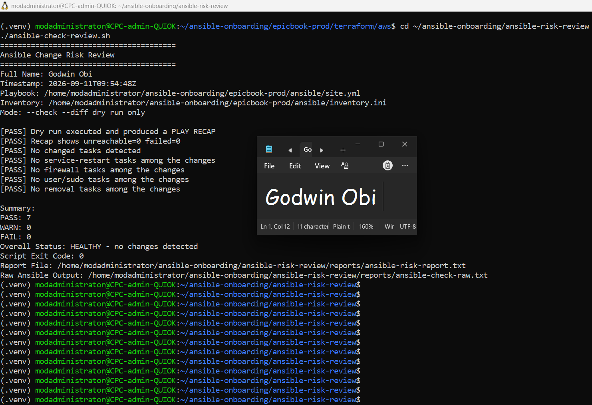

---

#### Screenshot 11 — Output of `echo "Captured Exit Code: $script_exit_code"` and `cat reports/ansible-risk-report.txt`

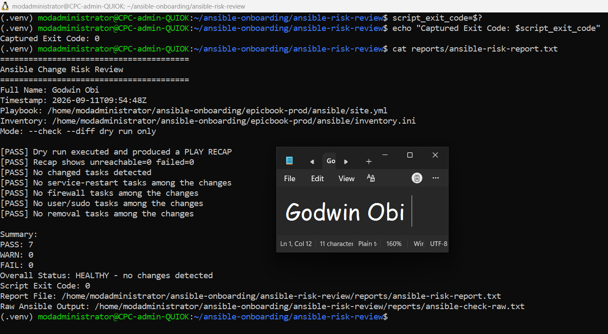

---

### Notes

Answer the following in your own words:

**1. What was the overall status of your baseline run?**

> **HEALTHY - no changes detected** (The playbook dry run completed with zero failures, zero unreachable hosts, and zero task modifications, confirming that the target system is fully converged and matching the desired state).

---

**2. Did any tasks report `changed`?**

> No, zero tasks reported `changed`. Because the playbook was executed and successfully converged beforehand, all task configurations matched the desired state on the target host during the dry-run check.

---

**3. Were any changed tasks flagged as risky?**

> No tasks were flagged as risky. Since no state modifications or task changes were detected during the check-mode run, no high-risk task patterns (such as service restarts, firewall updates, user modifications, or package removals) were triggered.

---

**4. What does the script exit code mean?**

> An exit code of `0` indicates that the dry-run review passed successfully with no pending or risky changes detected. This signals to CI/CD pipelines and operators that the infrastructure is healthy, fully converged, and safe.

---

# Task 6 — Create and Run the Claude Code Skill

## Goal

Turn the Bash script into a reusable Claude Code skill called `/ansible-risk-review`.

### Evidence

#### Screenshot 12 — `SKILL.md` showing the frontmatter, allowed tools, and safety rules

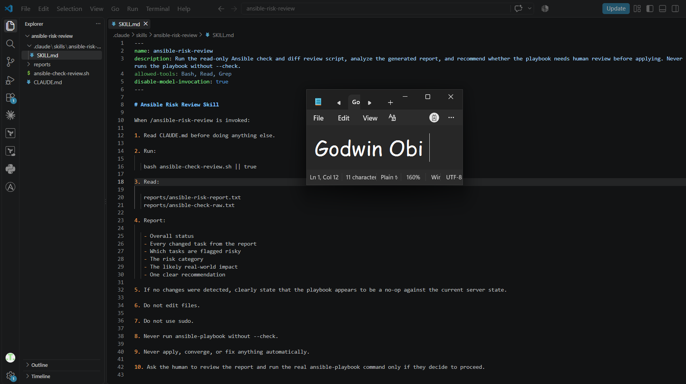

---

#### Screenshot 13 — Claude Code output after running `/ansible-risk-review`

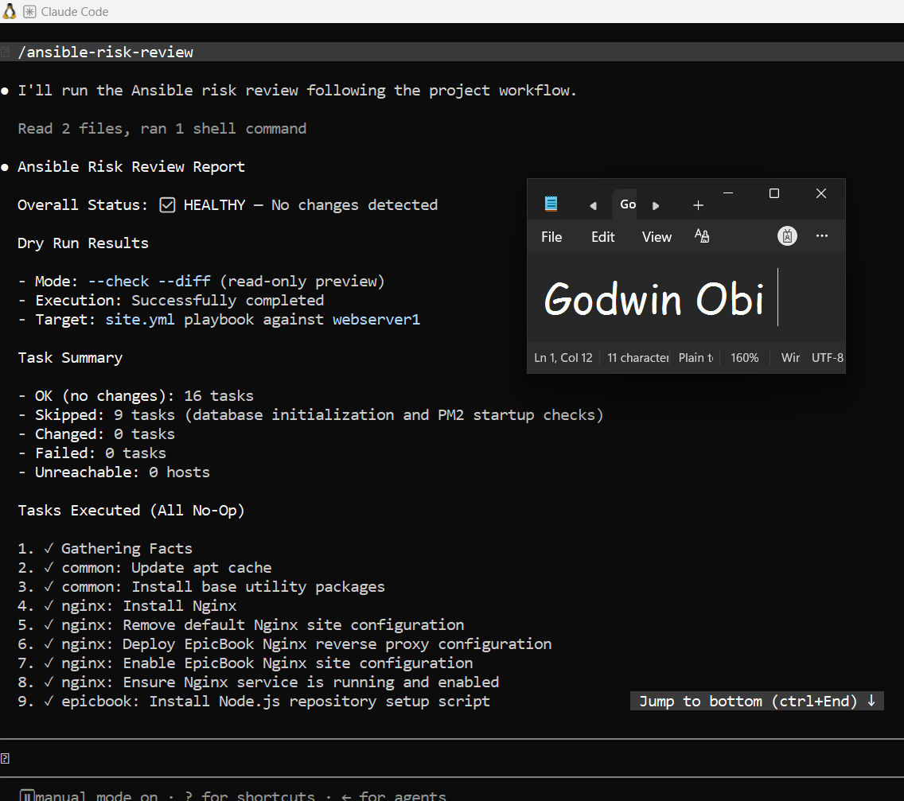

---

### Notes

Answer the following in your own words:

**1. Why does this skill allow `Bash`, `Read`, and `Grep`?**

> `Bash` is required to execute the non-destructive check script (`ansible-check-review.sh`). `Read` and `Grep` are needed for Claude Code to parse the contents of `reports/ansible-risk-report.txt` and `reports/ansible-check-raw.txt` without granting permissions to write or modify files.

---

**2. Why does this skill not allow file editing?**

> Disabling file-editing tools enforces a strict read-only boundary, preventing the model from accidentally modifying playbooks, configuration files, or script outputs during a change review workflow.

---

**3. What part is handled by Bash?**

> Bash executes the underlying deterministic CLI tooling: running `ansible-playbook --check --diff`, generating the raw logs, evaluating regex patterns for risky tasks, and writing structured summaries to the `reports/` directory.

---

**4. What part is handled by Claude Code?**

> Claude Code provides intelligent analysis: reading the generated report files, contextualizing identified task changes, explaining real-world risks, and presenting clear human-readable recommendations to the operator.

---

**5. Why is this better than asking Claude Code if the playbook is safe without giving it evidence?**

> Asking LLMs open-ended questions without structured runtime evidence relies on speculative reasoning and static text inspection. Providing dry-run diffs and actual execution logs ensures Claude Code bases its evaluation on real state drift and concrete execution evidence.

---

# Task 7 — Introduce a Controlled Risky Change and Let the Skill Catch It

## Goal

Add a small controlled risky change in your lab playbook and confirm the script and Claude Code catch it before applying.

### Evidence

#### Screenshot 14 — The added risky task inside the role file

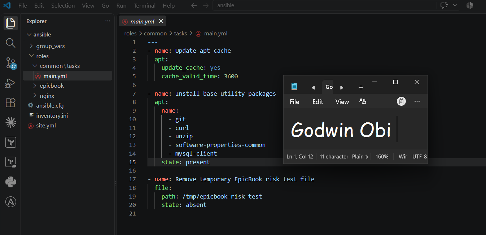

---

#### Screenshot 15 — Output of `./ansible-check-review.sh`

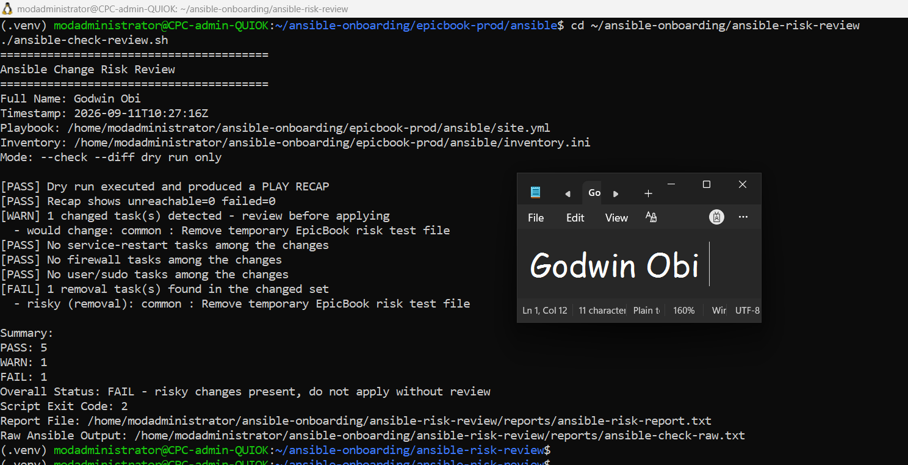

---

#### Screenshot 16 — Claude Code `/ansible-risk-review` output showing the risky finding

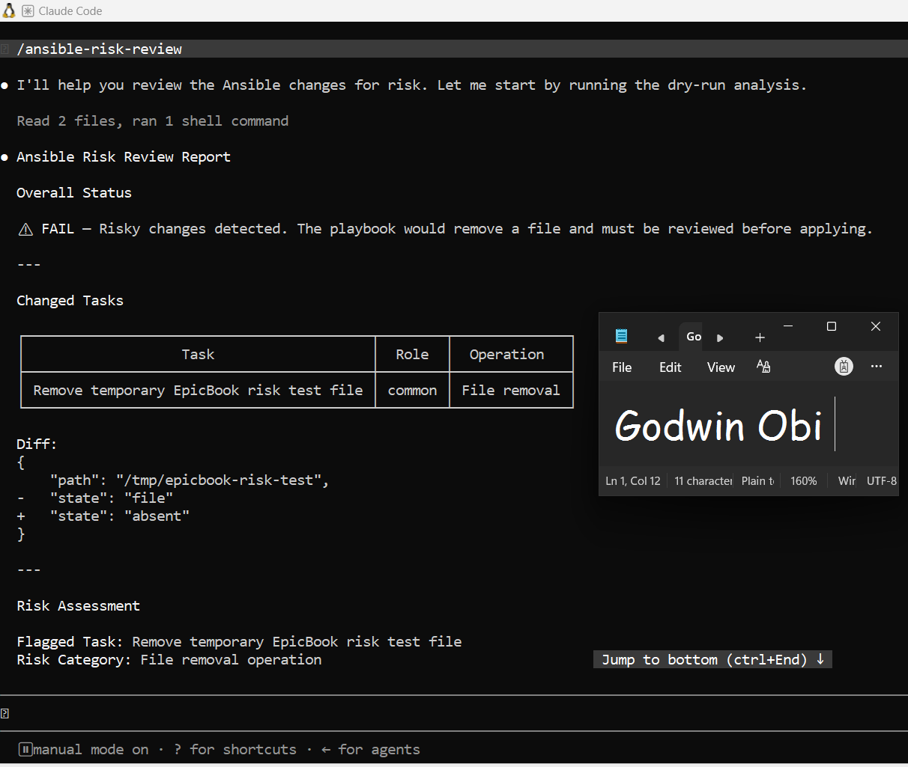

---

#### Screenshot 17 — Output of `cat reports/risky-change-report.txt`

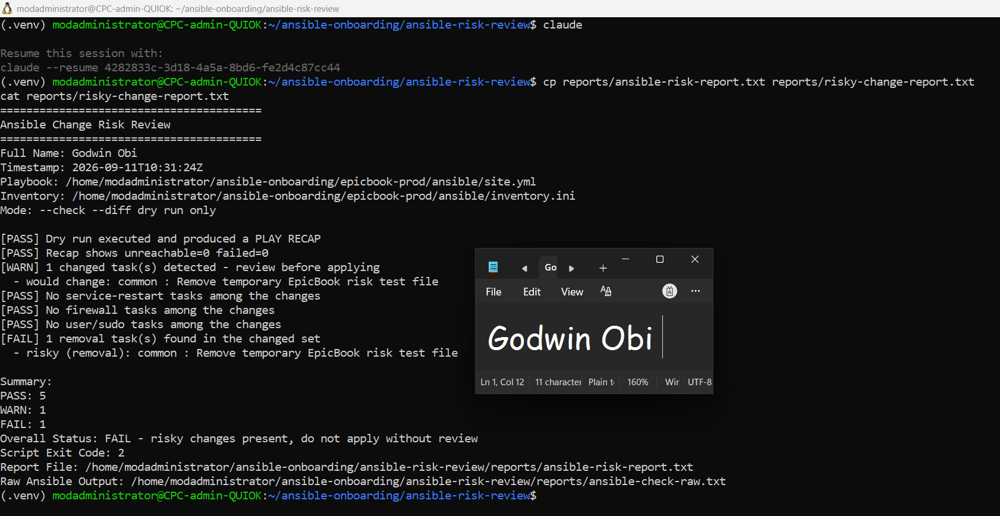

---

### Notes

Answer the following in your own words:

**1. Which risk category did the added task fall into?**

> **Removal Tasks / File Deletion** (flagged by regex patterns detecting file deletion/removal operations like state=absent).

---

**2. What evidence proves the task would change something?**

> The `--check --diff` output in `ansible-check-raw.txt` and `ansible-risk-report.txt` explicitly registered `changed=1` for the task `common : Remove temporary EpicBook risk test file`, indicating state drift between the playbook and the host.

---

**3. Did Claude Code apply the playbook?**

> No, Claude Code strictly executed in read-only analysis mode without running the live `ansible-playbook` command or applying changes to the target system.

---

**4. Why is it important that Claude Code only analyzed the risk?**

> Keeping the AI in a read-only advisor role maintains the human-in-the-loop safety boundary, preventing automated infrastructure modifications or unvetted destructive operations in production environments.

---

**5. Which phase of the Agentic Loop is represented by the Bash report?**

> **Observation / Perception Phase** (providing deterministic, ground-truth data from the execution environment for the agent to analyze before making decision recommendations).

---

# Task 8 — Apply as the Human, Verify, and Write the Change Summary

## Goal

Review the risky-change report, apply the playbook manually as the human operator, and verify the result.

### Evidence

#### Screenshot 18 — Output of the real playbook run showing the final recap with `failed=0`

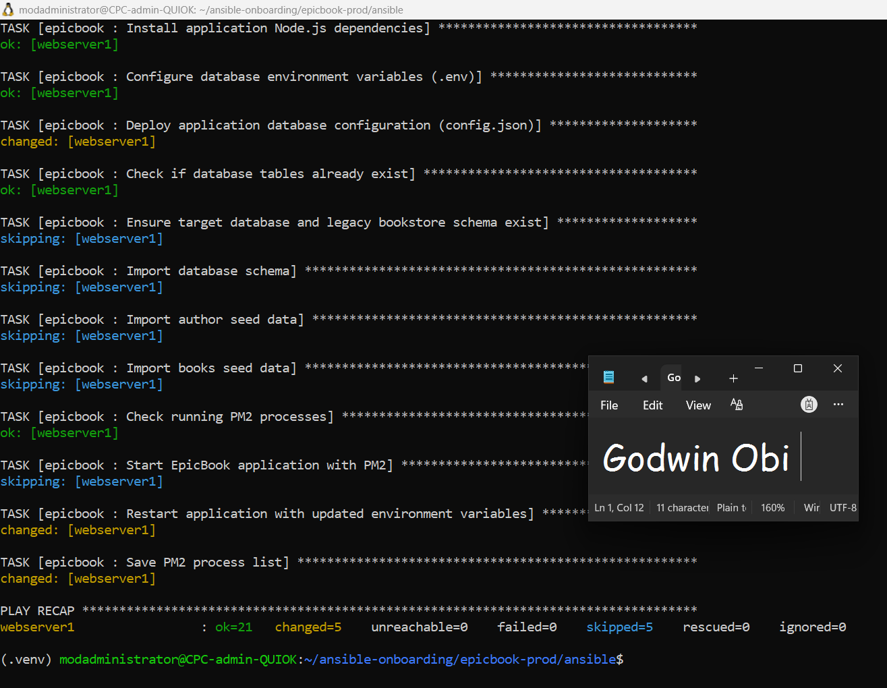

---

#### Screenshot 19 — Output of `ansible web -i inventory.ini -m ping`

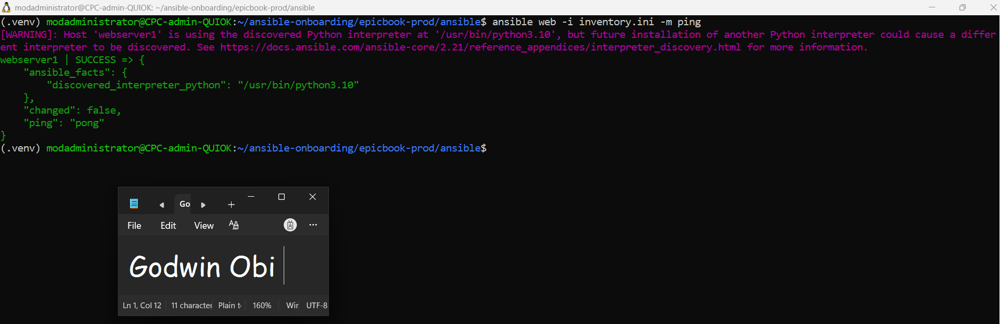

---

#### Screenshot 20 — Second `/ansible-risk-review` output after applying the change

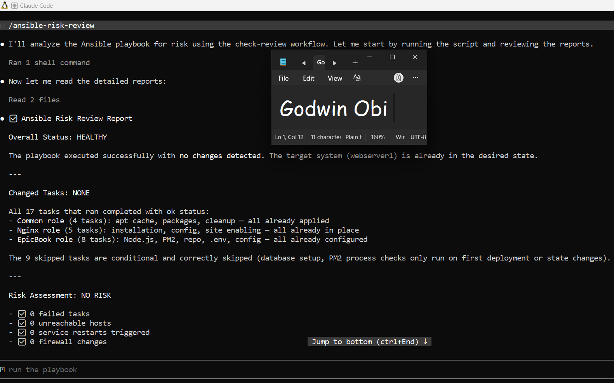

---

#### Screenshot 21 — Output of `ls -lah reports`

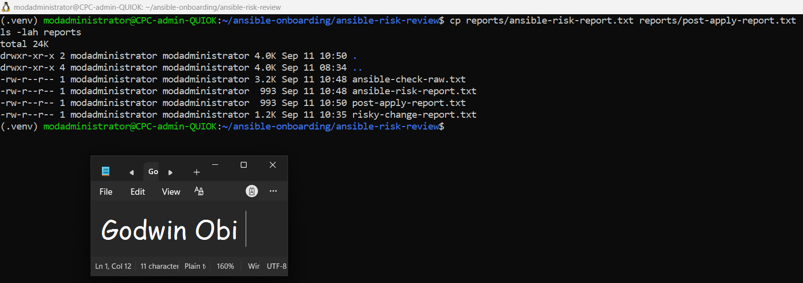

---

#### Screenshot 22 — `change-summary.md` showing all required sections and your Full Name

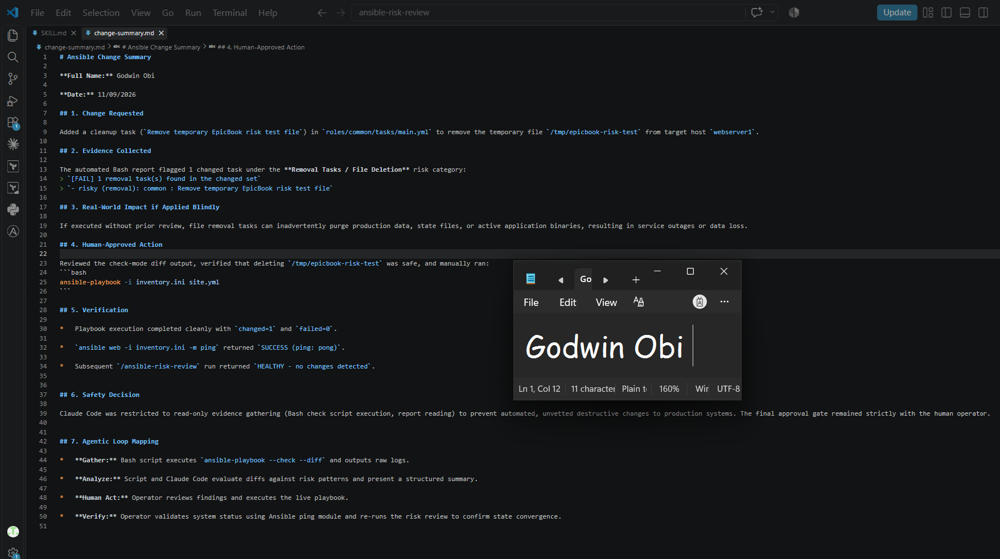

---

### Notes

Answer the following in your own words:

**1. What command did you run to apply the change for real?**

> `ansible-playbook -i inventory.ini site.yml`

---

**2. Who made the final decision to apply the playbook?**

> The human operator (Godwin Obi) after evaluating the risk assessment report generated during the dry run.

---

**3. What evidence proves the VM is still reachable?**

> Running `ansible web -i inventory.ini -m ping` returned a successful ping response (`webserver1 | SUCCESS => {"changed": false, "ping": "pong"}`).

---

**4. Why should the risk review be run again after applying?**

> Re-running the risk review confirms idempotency and verifies that the system has converged to the target state with zero pending or undetected state drifts (`HEALTHY - no changes detected`).

---

**5. What could go wrong if an AI agent applied Ansible changes automatically?**

> Unchecked AI execution could trigger destructive tasks, corrupt production databases, remove essential files, or restart critical services out of maintenance windows without human oversight.

---

# LinkedIn Post Required

## Evidence

#### LinkedIn Post URL

Paste your LinkedIn post URL here:

`https://www.linkedin.com/posts/godwin-obi-008a12177_godwin-obi-dmi-cohort-3-live-activity-7504134030099943424-dk5D?utm_source=share&utm_medium=member_desktop&rcm=ACoAACn5hogBVyHnSR92cyBf5EzFBZEMSepEVPM`

---

#### Screenshot — Published LinkedIn post

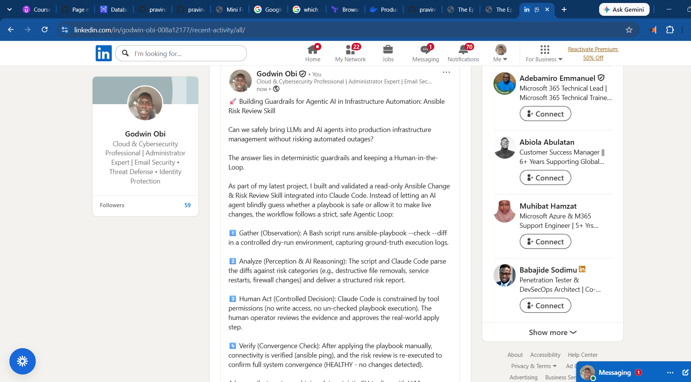

---

# Required Files

Confirm that the following files are included in your GitHub repository or assignment folder:

- [ ] `CLAUDE.md`
- [ ] `ansible-check-review.sh`
- [ ] `.claude/skills/ansible-risk-review/SKILL.md`
- [ ] `reports/risky-change-report.txt`
- [ ] `reports/post-apply-report.txt`
- [ ] `change-summary.md`

---

# Submission Instructions

- Add all required screenshots in your submission.
- Full Name must be visible in required screenshots and reports.
- All required notes must be answered clearly.
- Do not expose SSH private keys, passwords, cloud credentials, database credentials, or secret environment variables.
- Add your GitHub repository or folder URL inside this document.
- Submit only your Google Doc link.

---

# Completion Checklist

- [ ] Task 1: EpicBook connectivity confirmed and workspace created
- [ ] Task 2: `CLAUDE.md` created with safety rules
- [ ] Task 3: Claude Code produced a read-only risk-review plan
- [ ] Task 4: `ansible-check-review.sh` created and syntax checked
- [ ] Task 5: Baseline dry-run review completed
- [ ] Task 6: Claude Code `/ansible-risk-review` skill created and tested
- [ ] Task 7: Controlled risky change introduced and detected
- [ ] Task 8: Human applied the change and verified the result
- [ ] Risky-change report saved
- [ ] Post-apply report saved
- [ ] Change summary completed
- [ ] All screenshots added
- [ ] All notes answered
- [ ] LinkedIn post published
- [ ] LinkedIn post URL added
- [ ] No sensitive information exposed
- [ ] Google Doc is accessible

---

## About DMI & CloudAdvisory

DevOps Micro Internship (DMI) is a project-based DevOps program run by Pravin Mishra and The CloudAdvisory, focused on real-world execution, systems thinking, and career readiness.

It helps learners build strong DevOps foundations with hands-on experience.

---

## Resources

- DMI Official Website: [https://dmi.pravinmishra.com?utm_source=github&utm_medium=readme](https://dmi.pravinmishra.com?utm_source=github&utm_medium=readme)
- University: [https://university.pravinmishra.com?utm_source=github&utm_medium=readme](https://university.pravinmishra.com?utm_source=github&utm_medium=readme)
- Discord Community: [https://discord.pravinmishra.com?utm_source=github&utm_medium=readme](https://discord.pravinmishra.com?utm_source=github&utm_medium=readme)
- Blog: [https://dmi.pravinmishra.com/blog?utm_source=github&utm_medium=readme](https://dmi.pravinmishra.com/blog?utm_source=github&utm_medium=readme)
- YouTube Playlist: [https://www.youtube.com/playlist?list=PLFeSNDtI4Cho](https://www.youtube.com/playlist?list=PLFeSNDtI4Cho)
- Pravin Mishra LinkedIn: [https://www.linkedin.com/in/pravin-mishra-aws-trainer/](https://www.linkedin.com/in/pravin-mishra-aws-trainer/)
- CloudAdvisory LinkedIn: [https://www.linkedin.com/company/thecloudadvisory/](https://www.linkedin.com/company/thecloudadvisory/)

---

*This submission is part of DevOps Micro Internship (DMI) Cohort 3 — Agentic AI Track.*