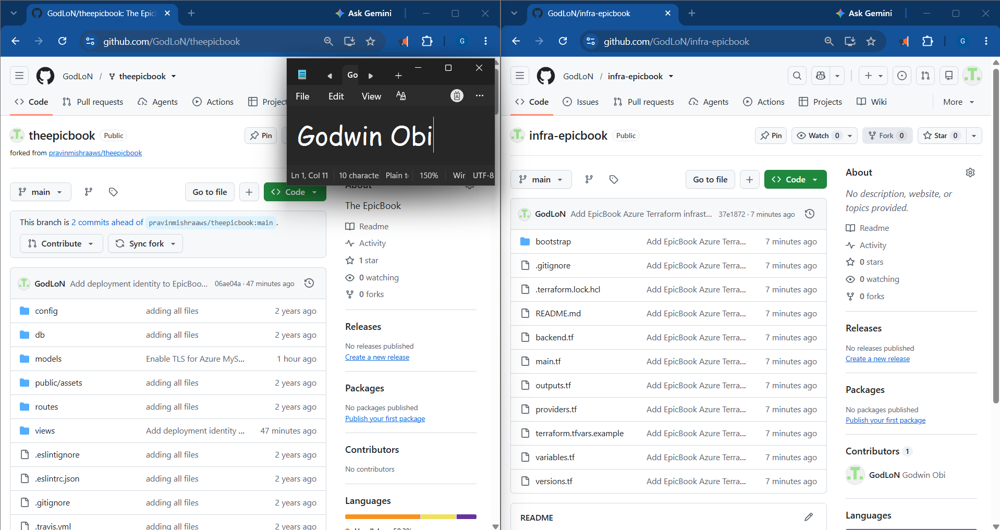
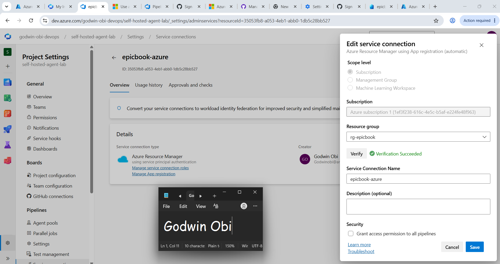
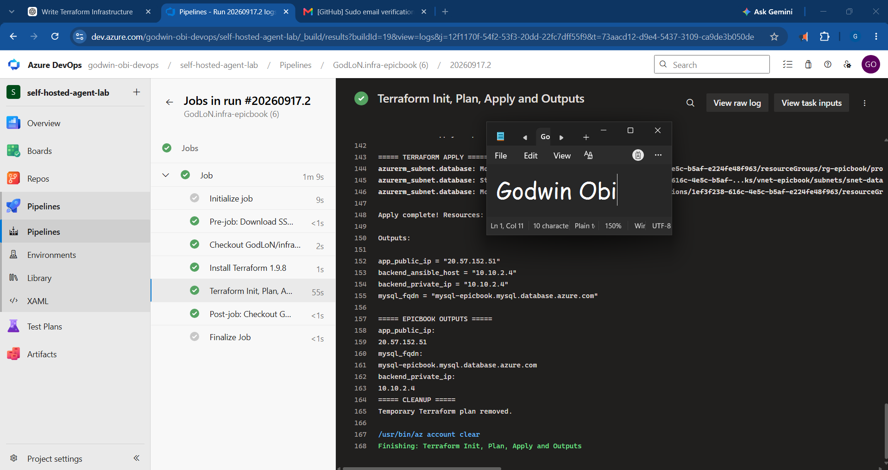
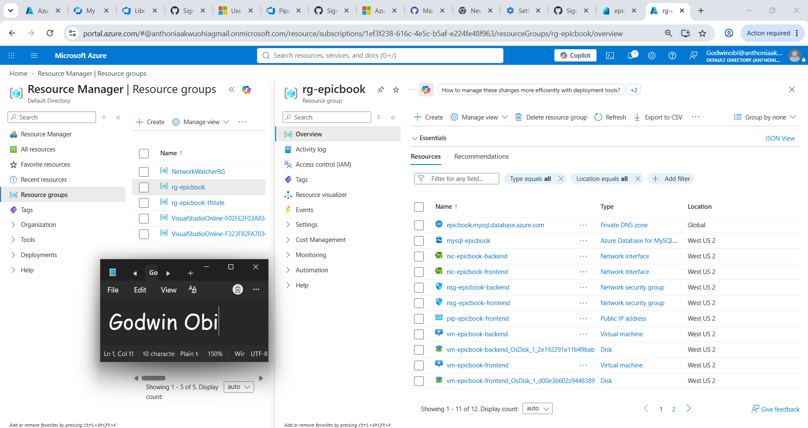
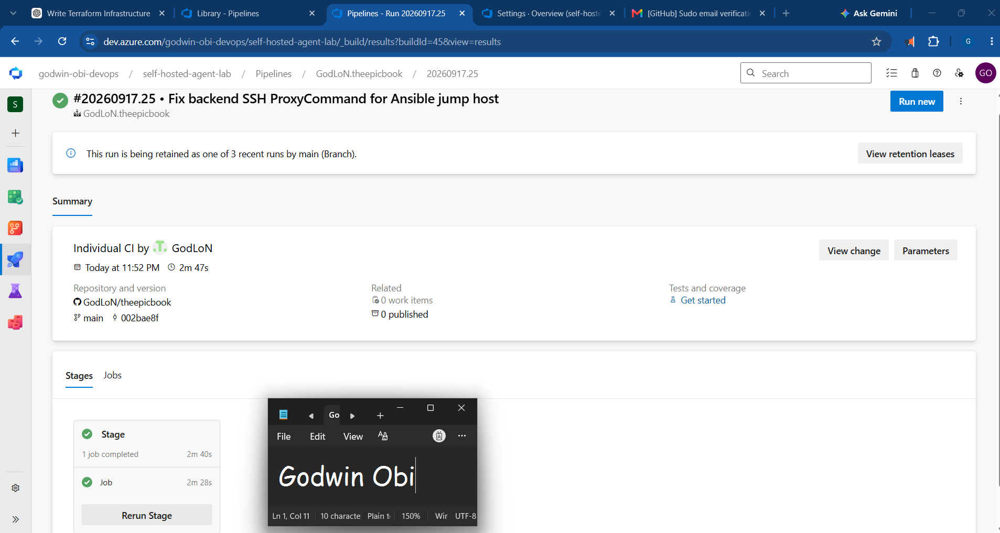
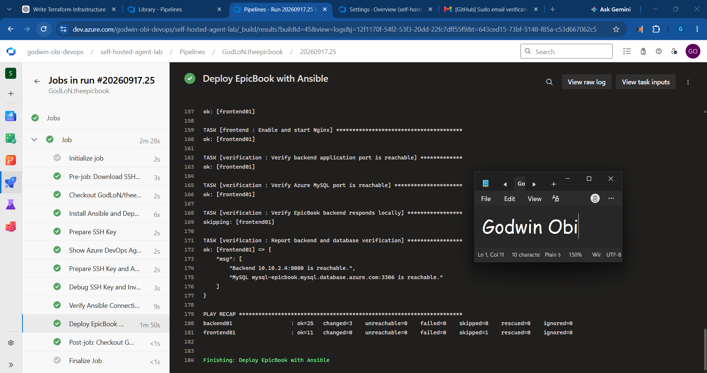
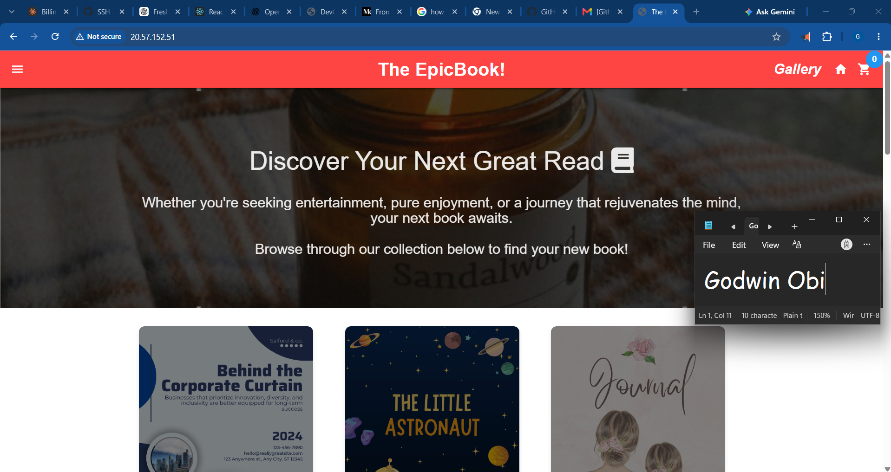
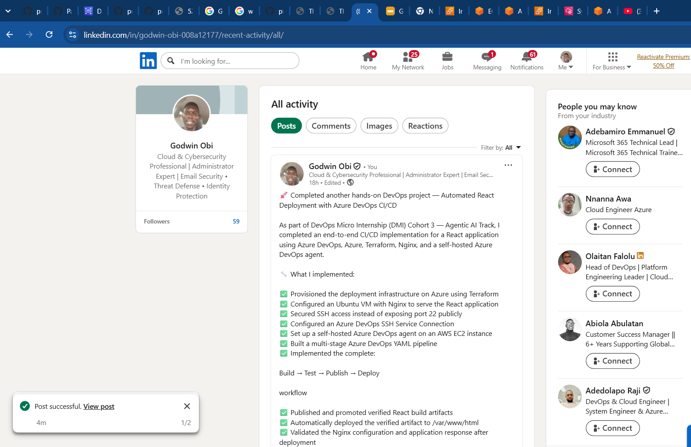

# Assignment 4 — Capstone: Automate the EpicBook Application with Dual Pipelines

Part of the DevOps Micro Internship (DMI) Cohort 3 with Agentic AI

---

## Purpose

In this capstone assignment, you will design a complete DevOps automation workflow for EpicBook across two repositories and two Azure DevOps pipelines: an Infra Pipeline (`infra-epicbook`, Terraform) that provisions the network, frontend/backend VMs, and MySQL database, and an App Pipeline (`theepicbook`, Ansible) that consumes the Terraform outputs, configures the servers, and deploys EpicBook end to end.

---

# Task 1 — Prepare Repositories

## Goal

Prepare `infra-epicbook` (Terraform for network, frontend/backend VMs, MySQL, with `app_public_ip` and `mysql_fqdn` outputs) and `theepicbook` (application code, Ansible roles/playbooks, inventory template, MySQL variable files), keeping infrastructure and application responsibilities separated.

### Evidence

#### Screenshot 1 — Both repositories showing their required files and separation of responsibilities

---

# Task 2 — Create Azure Service Connection

## Goal

Create and validate an Azure Resource Manager SPN service connection (Tenant ID, Subscription ID, Client ID, Client Secret) for the Infra Pipeline.

### Evidence

#### Screenshot 2 — Azure Resource Manager service connection showing successful configuration with secrets hidden

---

# Task 3 — Create Infra Pipeline

## Goal

Create a YAML pipeline for `infra-epicbook` that authenticates via the SPN connection and runs `terraform init`/`plan`/`apply`, producing `app_public_ip` and `mysql_fqdn`.

### Evidence

#### Screenshot 3 — Infra Pipeline run showing `terraform apply` completion and the `app_public_ip` and `mysql_fqdn` outputs

---

#### Screenshot 4 — Azure Portal confirming the provisioned resources

---

# Task 4 — Create App Pipeline

## Goal

Upload the SSH private key to Azure DevOps Secure Files, create a YAML pipeline for `theepicbook` that installs Ansible, downloads the key, manually incorporates the Infra Pipeline's `app_public_ip`/`mysql_fqdn` outputs into the inventory/variables, and runs the playbook to configure the frontend/backend and deploy EpicBook behind Nginx.

### Evidence

#### Screenshot 5 — App Pipeline run summary showing successful completion

---

#### Screenshot 6 — Ansible playbook output showing successful configuration with `failed=0`

---

# Task 5 — Verify End-to-End Workflow

## Goal

Confirm both pipelines succeeded, the EpicBook application loads through the frontend public IP via Nginx, and a backend feature confirms successful MySQL connectivity.

### Evidence

#### Screenshot 7 — Browser displaying the running EpicBook application with the frontend public IP visible

---

### Notes

Record the frontend public application URL and a short issue-and-resolution note, if applicable.

**Frontend Application URL**

The deployed EpicBook frontend application is available at:

`http://20.57.152.51/`

The application was successfully accessed through the public IP address of the frontend virtual machine after completing the infrastructure provisioning and application deployment pipelines.

**Issue and Resolution Notes**

During the deployment process, an issue was encountered with Ansible SSH connectivity to the private backend server.

The backend VM was not directly accessible from the Azure DevOps self-hosted agent because it was located on a private network. The initial Ansible inventory configuration used ProxyJump incorrectly by passing a complete SSH command, which resulted in the error:

>ssh: Could not resolve hostname ssh: Temporary failure in name resolution

The issue was investigated by reviewing the generated Ansible inventory and SSH connection parameters.

The resolution was to replace the incorrect ProxyJump configuration with an SSH ProxyCommand, allowing the Azure DevOps agent to securely connect through the frontend VM acting as a jump host:

>ProxyCommand="ssh -i <private-key> -o IdentitiesOnly=yes -W %h:%p azureadmin@frontend-public-ip"

After the correction:

* SSH authentication using the Azure DevOps Secure File key succeeded
* Ansible successfully connected to both frontend and backend servers
* The playbook completed with:
    failed=0
* The EpicBook application was deployed successfully
* Backend connectivity with MySQL was verified

This troubleshooting process demonstrated the importance of secure SSH routing, infrastructure networking, and automated configuration management in a real-world DevOps deployment workflow.

---

# LinkedIn Post (Required)

## Goal

Publish a LinkedIn post about the completed capstone project, mentioning the two-repository/dual-pipeline model, Terraform + Ansible responsibilities, and one end-to-end verification result, with public/"Anyone" visibility and at least one link or image.

## Evidence

#### LinkedIn Post URL

Paste your LinkedIn post URL here:

`https://www.linkedin.com/posts/godwin-obi-008a12177_devops-azuredevops-cicd-activity-7506261069007306752-deDX?utm_source=share&utm_medium=member_desktop&rcm=ACoAACn5hogBVyHnSR92cyBf5EzFBZEMSepEVPM`

---

#### Screenshot — Published LinkedIn post showing the text and at least one link or image

---

# Submission Instructions

- Add all required screenshots in your submission
- Do not commit or expose the Client Secret, SSH private key, database password, or other credentials

---

# Completion Checklist

- [ ] Task 1: `infra-epicbook` and `theepicbook` repositories prepared with clean separation (Screenshot 1)
- [ ] Task 2: Azure Resource Manager SPN service connection created and validated (Screenshot 2)
- [ ] Task 3: Infra Pipeline provisioned resources and produced outputs (Screenshots 3–4)
- [ ] Task 4: App Pipeline configured servers and deployed EpicBook (Screenshots 5–6)
- [ ] Task 5: End-to-end workflow verified, including MySQL connectivity (Screenshot 7)
- [ ] Frontend URL and issue notes written (Notes)
- [ ] LinkedIn post published and URL submitted
- [ ] No secrets exposed

---

## 📌 About DMI & CloudAdvisory

DevOps Micro Internship (DMI) is a project-based DevOps program run by Pravin Mishra (The CloudAdvisory) focused on real-world execution, systems thinking, and career readiness.

It helps learners build strong DevOps foundations with hands-on experience.

---

## 📌 Resources

- 🌐 DMI Official Website: https://dmi.pravinmishra.com?utm_source=github&utm_medium=readme  
- 🎓 University: https://university.pravinmishra.com?utm_source=github&utm_medium=readme  
- 💬 Discord Community: https://discord.pravinmishra.com?utm_source=github&utm_medium=readme  
- 📝 Blog: https://dmi.pravinmishra.com/blog?utm_source=github&utm_medium=readme  
- ▶️ YouTube Playlist: https://www.youtube.com/playlist?list=PLFeSNDtI4Cho  
- 🔗 Pravin Mishra (LinkedIn): https://www.linkedin.com/in/pravin-mishra-aws-trainer/  
- 🏢 CloudAdvisory (LinkedIn): https://www.linkedin.com/company/thecloudadvisory/

---

*This submission is part of DevOps Micro Internship (DMI) Cohort 3 — Agentic AI Track.*
