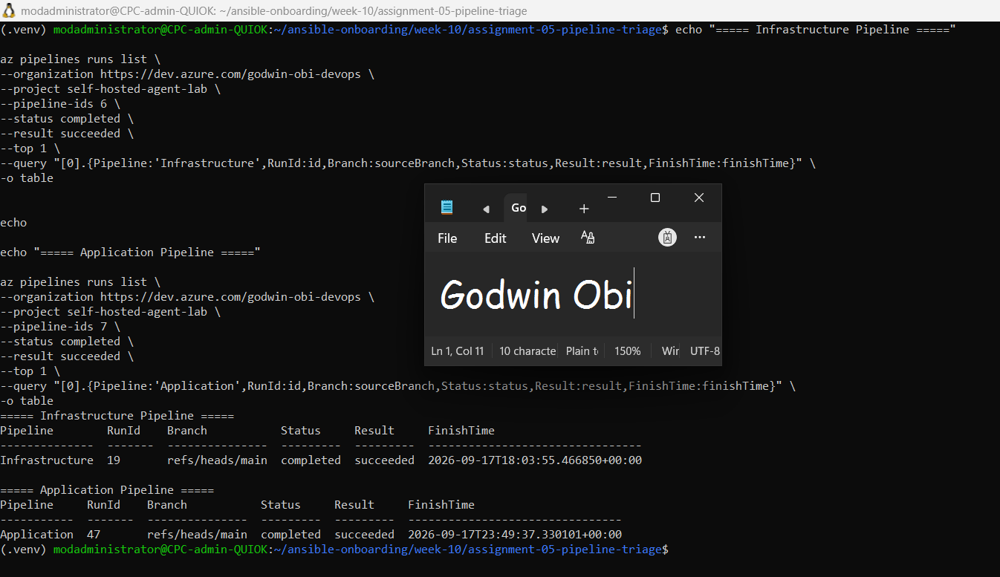
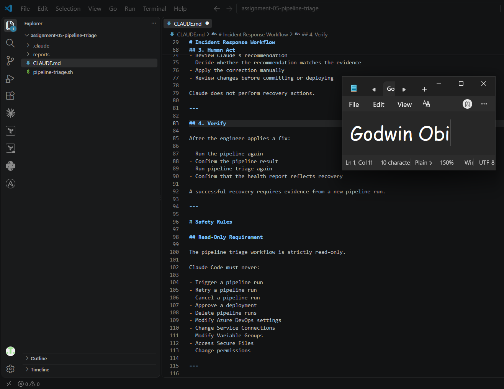
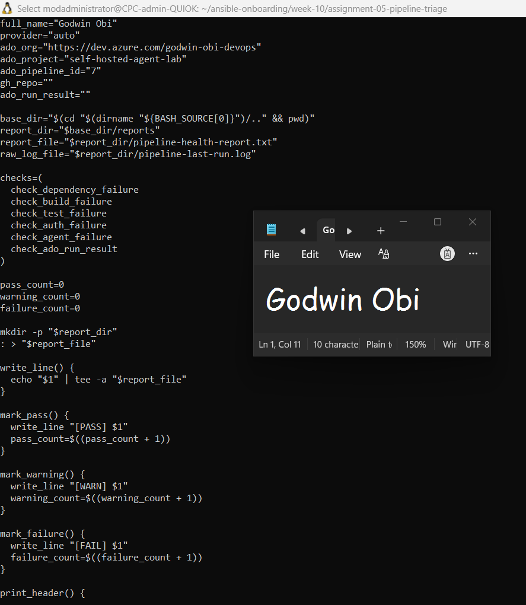
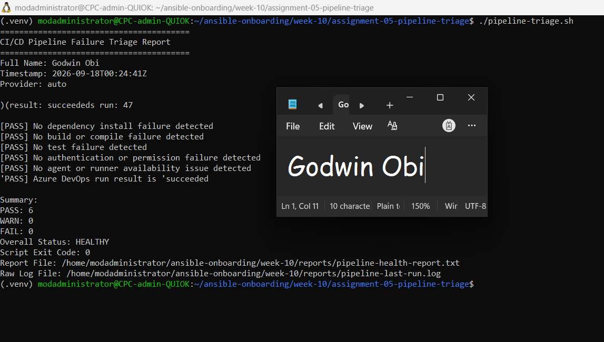
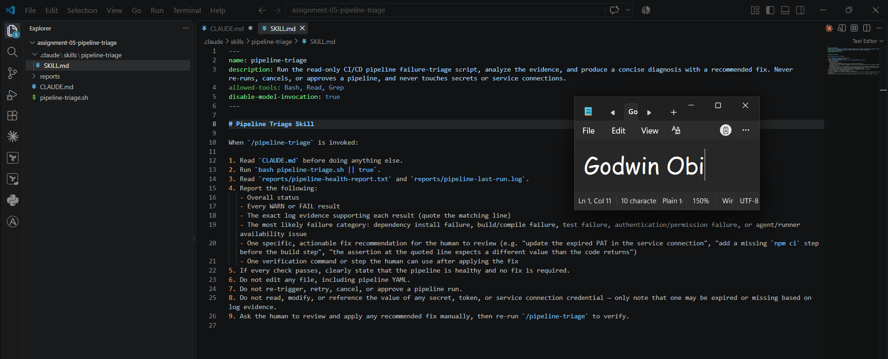
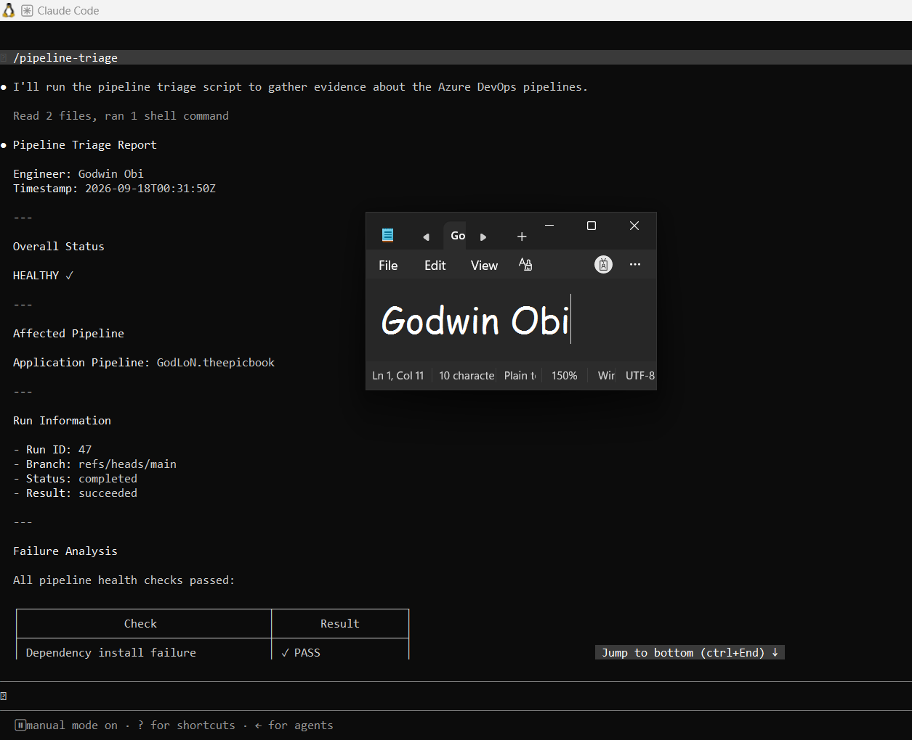
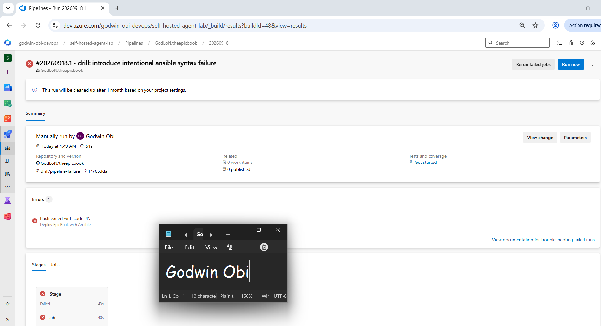
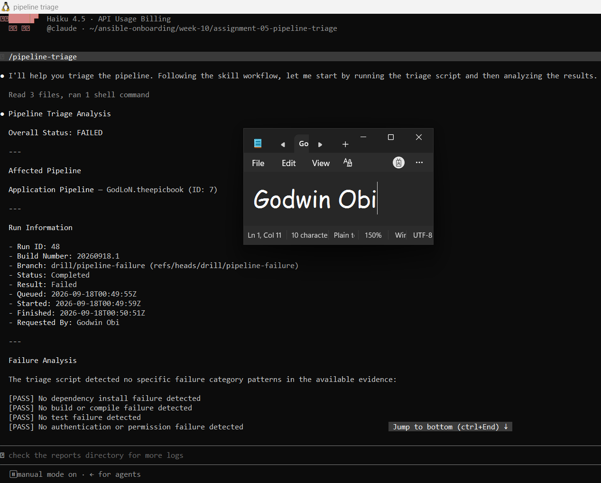
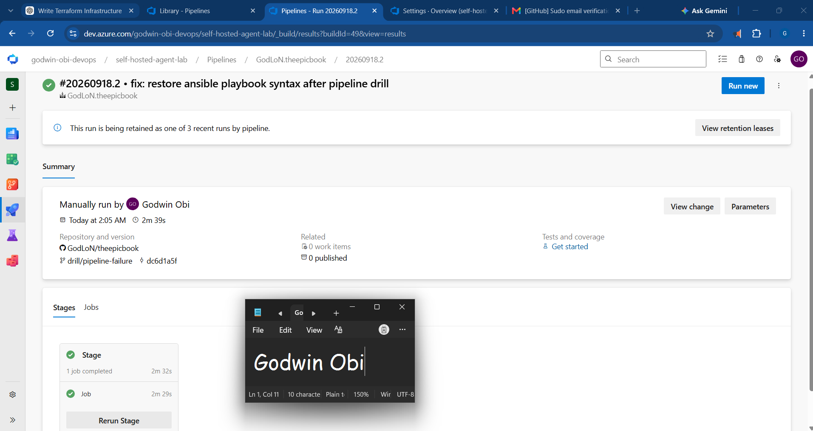
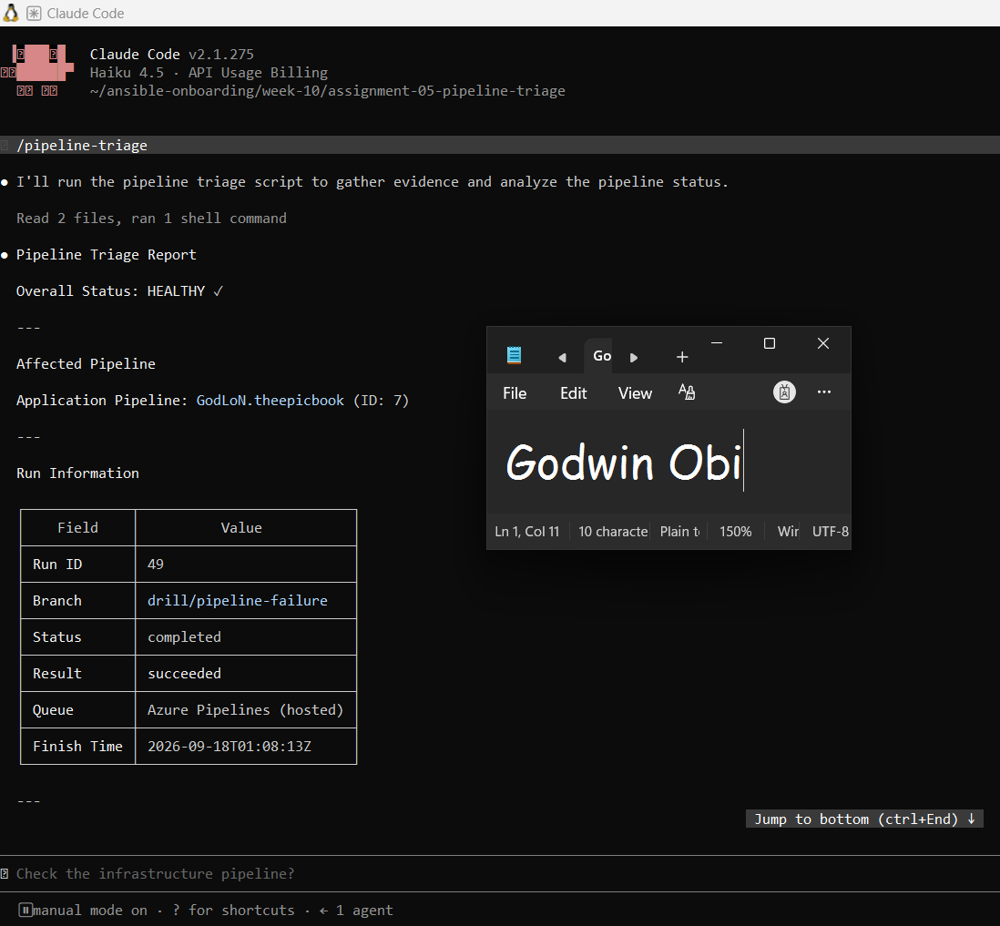

# Assignment 5 — AI-Assisted CI/CD Pipeline Failure Triage

Part of the DevOps Micro Internship (DMI) Cohort 3 with Agentic AI

---

## Purpose

In this assignment, you will build a read-only Bash script that fetches the latest run of your dual-pipeline EpicBook project (Azure DevOps and/or GitHub Actions) and categorizes any failure it finds — dependency, build, test, authentication, or agent/runner availability. You will then connect that script to Claude Code as a reusable `/pipeline-triage` skill, deliberately break your pipeline in a safe and obvious way, use the skill to diagnose the break from evidence alone, fix it yourself, and verify recovery with a second run of the skill.

---

# Task 1 — Confirm the Healthy Baseline and Create the Workspace

## Goal

Confirm the latest run on both Azure DevOps and GitHub Actions currently succeeds, then create the workspace folders for this assignment.

### Evidence

#### Screenshot 1 — Latest run status on Azure DevOps and/or GitHub Actions showing a successful run

---

# Task 2 — Define the Read-Only Workflow in CLAUDE.md

## Goal

Create `CLAUDE.md` describing the pipeline-triage workflow (gather → analyze → human applies the fix → verify) and the safety rules: never re-trigger, retry, cancel, or approve a pipeline run; never modify pipeline YAML; never read or print a secret, token, or service connection credential.

### Evidence

#### Screenshot 2 — `CLAUDE.md` showing the workflow and safety rules

---

# Task 3 — Build the Pipeline Triage Script

## Goal

Build `pipeline-triage.sh`, a read-only Bash script that fetches the latest run's status/log using `az pipelines runs list`/`az pipelines runs show` and/or `gh run list`/`gh run view --log-failed`, and classifies any failure it finds into one of five categories using pattern matching against the log evidence. The script must only ever read run status and logs — it must never trigger, retry, cancel, or approve a run.

### Evidence

#### Screenshot 3 — `pipeline-triage.sh` showing the check functions and their pattern-matching conditionals

---

# Task 4 — Run the Script Against the Healthy Pipeline

## Goal

Run the script against your current, passing pipeline and confirm it produces a clean report with no failure detected.

### Evidence

#### Screenshot 4 — Script output and report showing a healthy result with no failure category triggered

---

# Task 5 — Build and Run the /pipeline-triage Skill

## Goal

Create a Claude Code skill restricted to read-only tools (no `Write`) that runs the script, reads the report, and explains the result with evidence — and confirm it correctly reports the healthy baseline without re-running, cancelling, or modifying anything.

### Evidence

#### Screenshot 5 — `SKILL.md` frontmatter showing the tool restrictions and safety rules

---

#### Screenshot 6 — `/pipeline-triage` output for the healthy pipeline

---

# Task 6 — Deliberately Break the Pipeline and Diagnose It

## Goal

Introduce one safe, obvious, and easily reversible failure (for example, an intentionally wrong test assertion or a typo'd dependency name), push it so the pipeline fails, then run `/pipeline-triage` and confirm it correctly names the failure category, quotes the exact log evidence, and recommends a specific fix — without taking any action itself.

### Evidence

#### Screenshot 7 — The failed pipeline run showing the red/failed status

---

#### Screenshot 8 — `/pipeline-triage` output showing the diagnosed failure category, the quoted log evidence, and the recommended fix

---

# Task 7 — Fix, Push, and Verify Recovery

## Goal

Apply the recommended fix yourself, push it, confirm the pipeline succeeds again on both providers, and re-run `/pipeline-triage` to confirm it now reports a healthy result.

### Evidence

#### Screenshot 9 — The pipeline run succeeding after your fix

---

#### Screenshot 10 — Second `/pipeline-triage` output confirming the pipeline is healthy again

---

### Notes

Explain, in your own words, why the skill was allowed to gather evidence and diagnose the failure but was never allowed to re-trigger the pipeline or apply the fix itself.

The skill was allowed to gather evidence and diagnose the failure because it was designed as a read-only troubleshooting assistant. Its allowed tools were limited to `Bash`, `Read`, and `Grep`, which enabled it to execute the triage script, read pipeline reports and logs, and analyze failure evidence without changing the environment.

The skill was never allowed to re-trigger the pipeline or apply the fix because those actions would modify the system state and could introduce unintended changes. The skill explicitly prohibited editing files, modifying pipeline YAML, accessing secrets, retrying, cancelling, approving, or triggering pipeline runs.

This design keeps the human engineer responsible for reviewing the diagnosis, deciding whether the recommendation is correct, applying the fix manually, and verifying the recovery. The AI assists with evidence gathering and analysis while maintaining proper security, accountability, and change control.

---

# Submission Instructions

Complete all tasks in sequence.

Your submission must include:
- All 10 required screenshots
- Never expose a Personal Access Token, service connection credential, or GitHub token in a screenshot

---

# Completion Checklist

- [ ] Task 1: Healthy baseline confirmed on both providers before starting (Screenshot 1)
- [ ] Task 2: `CLAUDE.md` created with the workflow and safety rules (Screenshot 2)
- [ ] Task 3: `pipeline-triage.sh` built with all five failure-category checks (Screenshot 3)
- [ ] Task 4: Script run against the healthy pipeline showing a clean result (Screenshot 4)
- [ ] Task 5: `/pipeline-triage` skill created and run successfully (Screenshots 5–6)
- [ ] Task 6: Pipeline deliberately broken and correctly diagnosed (Screenshots 7–8)
- [ ] Task 7: Fix applied, pushed, and recovery verified (Screenshots 9–10)
- [ ] Reflection answer written (Notes)
- [ ] No secrets or tokens exposed

---

## 📌 About DMI & CloudAdvisory

DevOps Micro Internship (DMI) is a project-based DevOps program run by Pravin Mishra (The CloudAdvisory) focused on real-world execution, systems thinking, and career readiness.

It helps learners build strong DevOps foundations with hands-on experience.

---

## 📌 Resources

- 🌐 DMI Official Website: https://dmi.pravinmishra.com?utm_source=github&utm_medium=readme  
- 🎓 University: https://university.pravinmishra.com?utm_source=github&utm_medium=readme  
- 💬 Discord Community: https://discord.pravinmishra.com?utm_source=github&utm_medium=readme  
- 📝 Blog: https://dmi.pravinmishra.com/blog?utm_source=github&utm_medium=readme  
- ▶️ YouTube Playlist: https://www.youtube.com/playlist?list=PLFeSNDtI4Cho  
- 🔗 Pravin Mishra (LinkedIn): https://www.linkedin.com/in/pravin-mishra-aws-trainer/  
- 🏢 CloudAdvisory (LinkedIn): https://www.linkedin.com/company/thecloudadvisory/

---

*This submission is part of DevOps Micro Internship (DMI) Cohort 3 — Agentic AI Track.*
