# Assignment 4 — Docker Volumes and Bind Mounts

Part of the DevOps Micro Internship (DMI) with Agentic AI

---

## Purpose

In this assignment, you will use Docker Bind Mounts and Docker Volumes to persist logs and application data outside a container’s lifecycle. You will verify that data remains available after containers are removed and recreated.

---

# Task 1 — Persist Nginx Logs Using a Bind Mount

## Goal

Deploy an Nginx container with a Bind Mount and verify that its log files remain on the VM host after the container is removed.

### Evidence

#### Screenshot 1 — Nginx Image Pull

Add a screenshot of the terminal showing successful completion of:

```bash
docker pull nginx:alpine
```

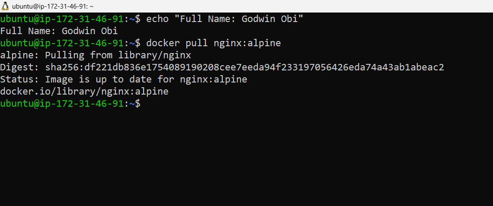

---

#### Screenshot 2 — Host Log Directory

Add a screenshot of the terminal showing the created host directory:

```text
$HOME/nginx-logs
```

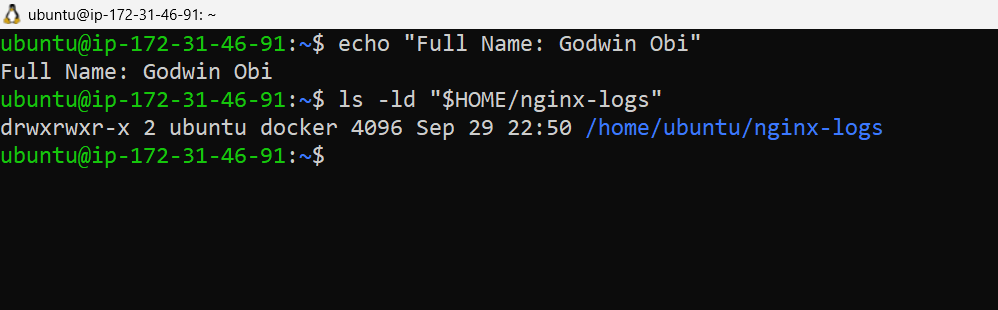

---

#### Screenshot 3 — Running Nginx Container with Port Mapping

Add a screenshot of the terminal showing:

```bash
docker ps
```

The output must show the `myweb` container with:

```text
0.0.0.0:80->80/tcp
```

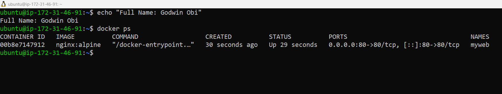

---

#### Screenshot 4 — Nginx Welcome Page

Add a browser screenshot showing the Nginx Welcome Page at:

```text
http://13.58.78.80
```

Ensure that the VM public IP is visible in the address bar. Add your full name as a clear caption directly below the screenshot.

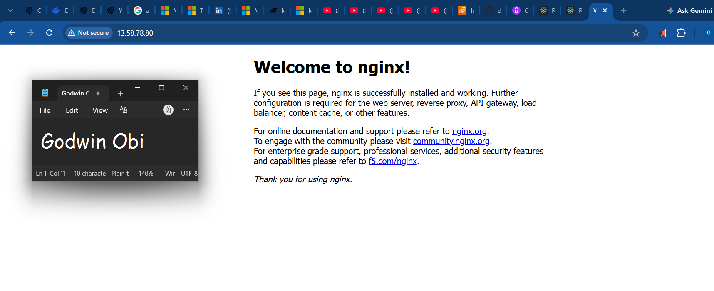

---

#### Screenshot 5 — Bind-Mounted Log Files

Add a screenshot of the terminal showing the host log files and access-log content from:

```text
$HOME/nginx-logs
```

The output must show `access.log`, `error.log`, and an access-log entry created when you opened the Nginx page.


---

#### Screenshot 6 — Nginx Container Removed

Add a screenshot of the terminal showing successful completion of:

```bash
docker stop myweb
docker rm myweb
```

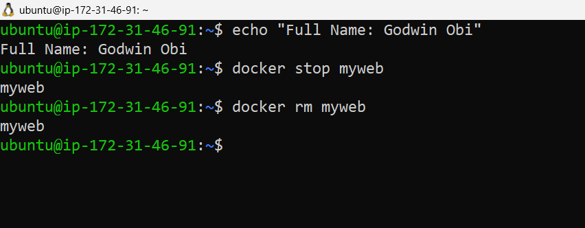

---

#### Screenshot 7 — Logs Persist After Container Removal

Add a screenshot of the terminal showing that `access.log` and `error.log` still exist in:

```text
$HOME/nginx-logs
```

The access log must retain its content after the container has been removed.

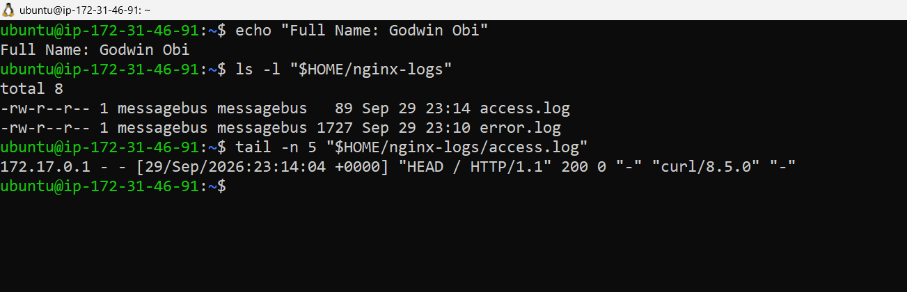

---

# Task 2 — Share Persistent Data Using a Docker Volume

## Goal

Deploy backend and frontend containers that share data through a named Docker Volume. Verify that the data remains after both containers are removed and recreated.

### Evidence

#### Screenshot 8 — Project File Structure

Add a screenshot of the terminal showing the `two-tier-app` project structure, including separate `backend` and `frontend` directories with a `Dockerfile` and `index.js` file in each.

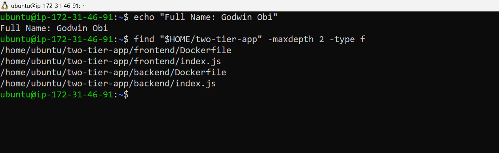

---

#### Screenshot 9 — Custom Docker Network

Add a screenshot of the terminal showing `mynetwork` in:

```bash
docker network ls
```

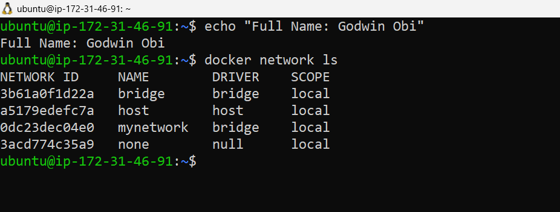

---

#### Screenshot 10 — Docker Volume

Add a screenshot of the terminal showing `shared-data` in:

```bash
docker volume ls
```

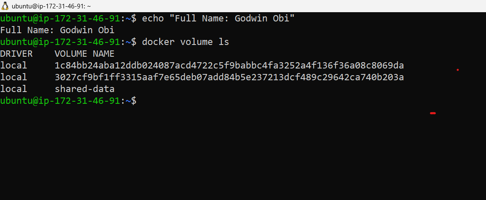

---

#### Screenshot 11 — Backend Dockerfile

Add a screenshot of the terminal showing the completed backend `Dockerfile`.

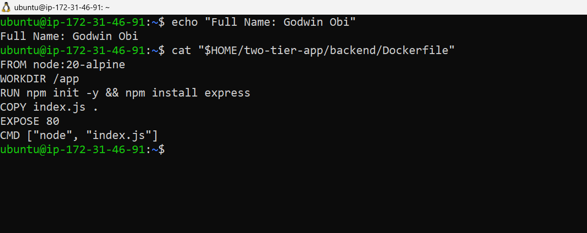

---

#### Screenshot 12 — Backend Image Build

Add a screenshot of the terminal showing successful completion of the `backend-app:latest` image build.

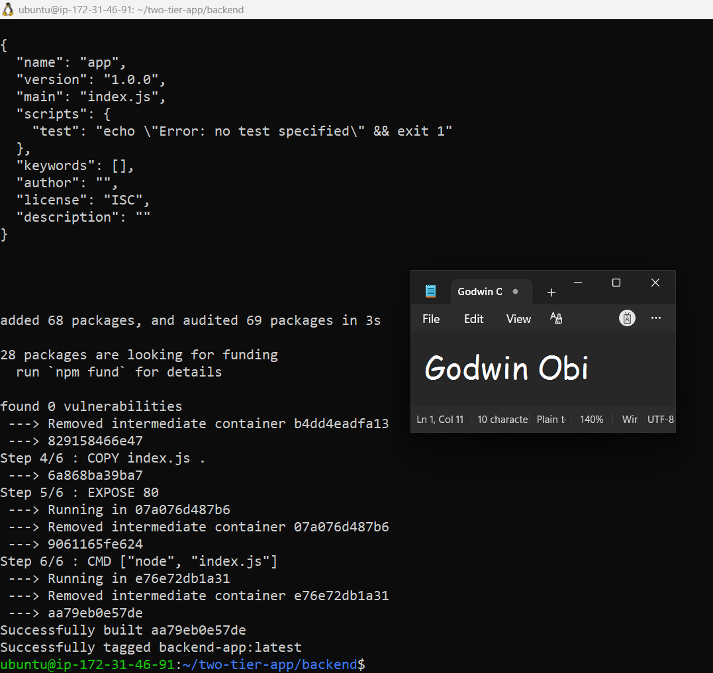

---

#### Screenshot 13 — Running Backend Container

Add a screenshot of the terminal showing:

```bash
docker ps
```

The output must show the running `backend` container.

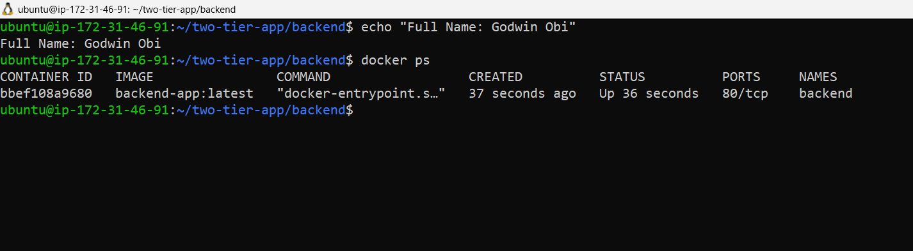

---

#### Screenshot 14 — Frontend Dockerfile

Add a screenshot of the terminal showing the completed frontend `Dockerfile`.

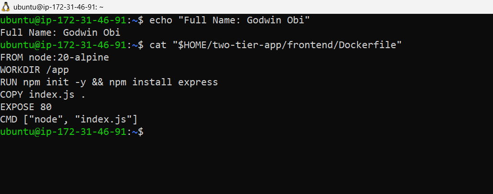

---

#### Screenshot 15 — Frontend Image Build

Add a screenshot of the terminal showing successful completion of the `frontend-app:latest` image build.

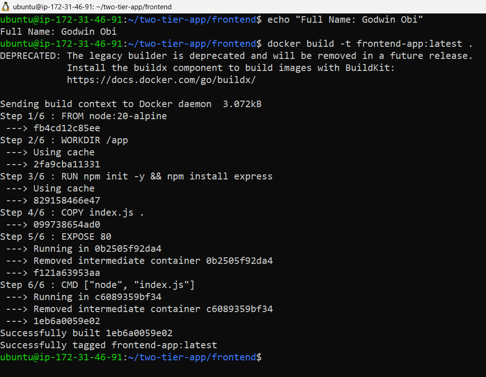

---

#### Screenshot 16 — Running Backend and Frontend Containers

Add a screenshot of the terminal showing:

```bash
docker ps
```

The output must show both `backend` and `frontend` containers running. Only `frontend` must have the published port mapping:

```text
0.0.0.0:80->80/tcp
```

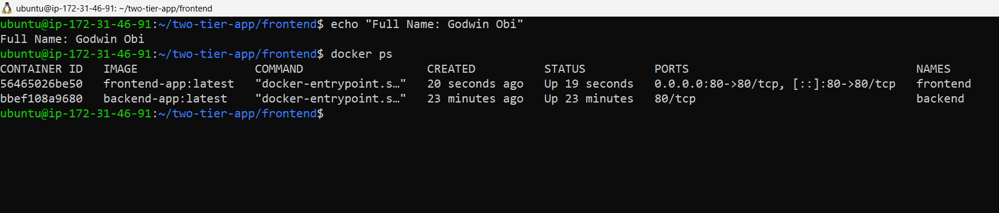

---

#### Screenshot 17 — Backend Write Operation

Add a screenshot of the terminal showing a successful backend write operation to the shared Docker Volume.

The output must include:

```text
Data written: Hello from Backend!
```

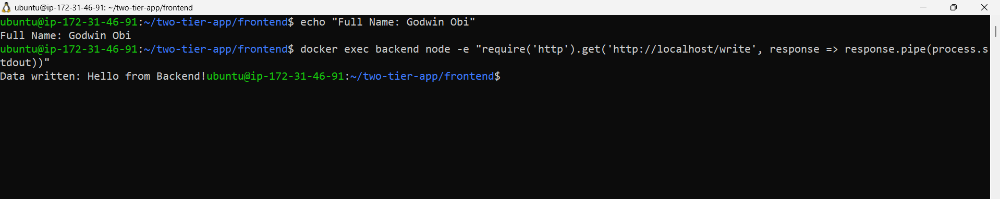

---

#### Screenshot 18 — Frontend Reads Shared Data

Add a browser screenshot showing:

```text
Hello from Backend!
```

Add your full name as a clear caption directly below the screenshot.

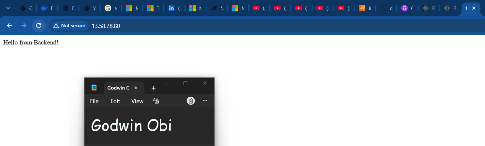

---

#### Screenshot 19 — First Shared-Data Update

Add a browser screenshot showing:

```text
Test Data 1
```

Add your full name as a clear caption directly below the screenshot.

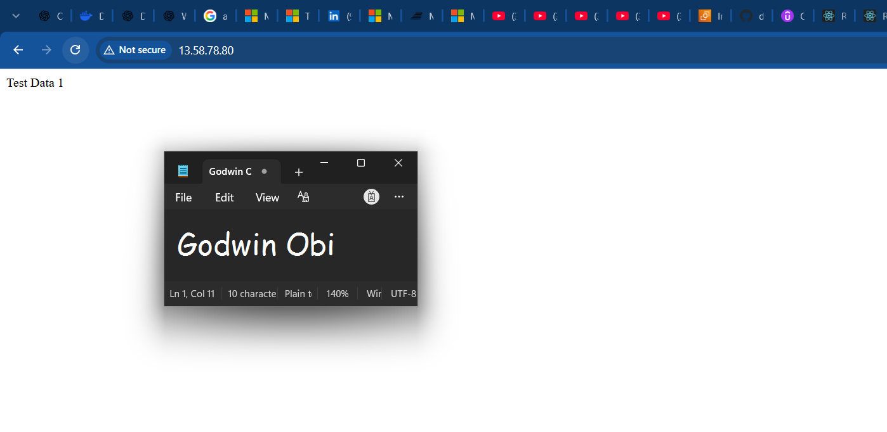

---

#### Screenshot 20 — Second Shared-Data Update

Add a browser screenshot showing:

```text
Test Data 2 - New Update
```

Add your full name as a clear caption directly below the screenshot.

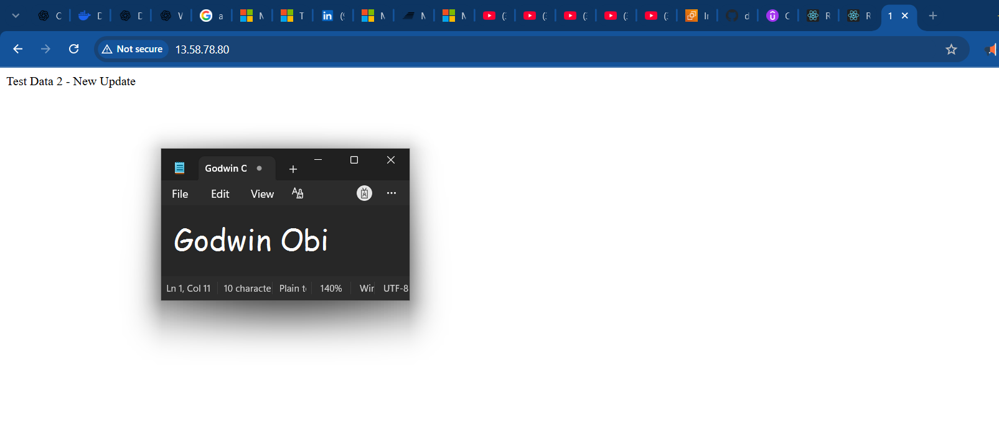

---

#### Screenshot 21 — Container Removal and Recreation

Add a screenshot of the terminal showing the `frontend` and `backend` containers removed and recreated using the same `shared-data` Docker Volume.

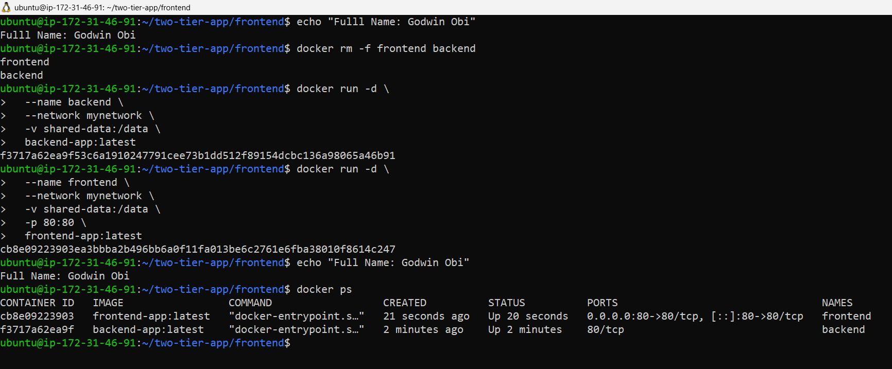

---

#### Screenshot 22 — Data Persists After Recreation

Add a browser screenshot showing:

```text
Test Data 2 - New Update
```

This proves that the `shared-data` Docker Volume outlived both application containers.

Add your full name as a clear caption directly below the screenshot.

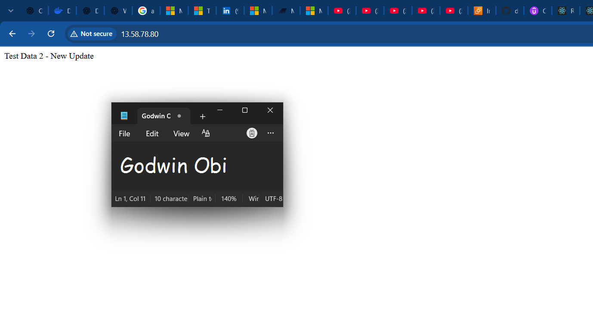

---

# Storage Persistence Notes

Write a short explanation covering:

- The difference between a Bind Mount and a Docker Volume
- How Task 1 proved Bind Mount persistence
- How Task 2 proved Docker Volume persistence
- Why Docker Volumes are commonly used for application data

Write your explanation here.

---

# Public Application URL

**Application URL:** `http://13.58.78.80/`

---

# LinkedIn Requirement

## Goal

Create a LinkedIn post about Docker Volumes and Bind Mounts, including one difference between them, how you verified persistent storage, and your key learning outcomes.

### Evidence

#### LinkedIn Post URL

Paste your LinkedIn post URL here:

`https://www.linkedin.com/posts/godwin-obi-008a12177_devops-docker-cloudengineering-activity-7510956179968278529-9yuW?utm_source=share&utm_medium=member_desktop&rcm=ACoAACn5hogBVyHnSR92cyBf5EzFBZEMSepEVPM`

---

#### LinkedIn Post Screenshot

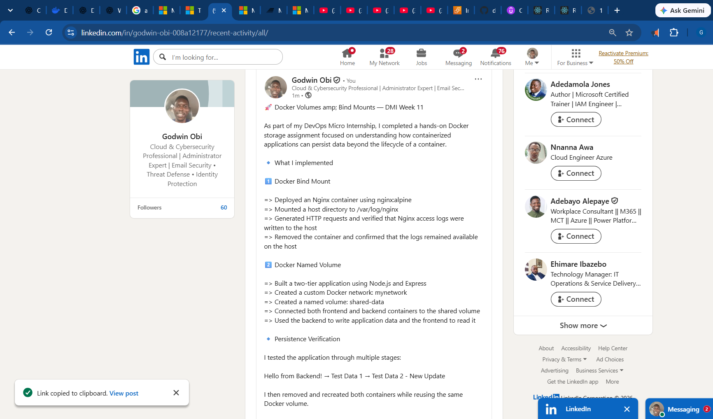

---

# Submission Instructions

- Complete all tasks in sequence.
- Include Screenshots 1–22 exactly as specified.
- Include the Storage Persistence Notes section.
- Include the public application URL.
- Include the LinkedIn post URL and screenshot.
- Ensure that your full name is visible in all terminal screenshots.
- Add your full name as a clear caption below every browser screenshot.
- Do not expose private keys, passwords, access keys, tokens, account IDs, or other sensitive information.

---

# Completion Checklist

- [ ] Nginx image pulled successfully
- [ ] Host log directory created
- [ ] Bind Mount configured successfully
- [ ] Nginx logs remain after container removal
- [ ] Custom Docker network created
- [ ] Docker Volume created
- [ ] Backend Dockerfile and image created
- [ ] Frontend Dockerfile and image created
- [ ] Both containers mount `shared-data`
- [ ] Backend writes data to the Docker Volume
- [ ] Frontend reads the same data from the Docker Volume
- [ ] Updated data appears after browser refresh
- [ ] Data remains after frontend and backend containers are removed and recreated
- [ ] All required screenshots included
- [ ] Storage Persistence Notes completed
- [ ] Public application URL included
- [ ] LinkedIn post URL and screenshot included
- [ ] Full name visible in terminal screenshots
- [ ] Browser screenshots have full-name captions
- [ ] No sensitive information exposed

---

## 📌 About DMI & CloudAdvisory

DevOps Micro Internship (DMI) is a project-based DevOps program run by Pravin Mishra (The CloudAdvisory) focused on real-world execution, systems thinking, and career readiness.

It helps learners build strong DevOps foundations with hands-on experience.

---

## 📌 Resources

- 🌐 DMI Official Website: https://dmi.pravinmishra.com?utm_source=github&utm_medium=readme  
- 🎓 University: https://university.pravinmishra.com?utm_source=github&utm_medium=readme  
- 💬 Discord Community: https://discord.pravinmishra.com?utm_source=github&utm_medium=readme  
- 📝 Blog: https://dmi.pravinmishra.com/blog?utm_source=github&utm_medium=readme  
- ▶️ YouTube Playlist: https://www.youtube.com/playlist?list=PLFeSNDtI4Cho  
- 🔗 Pravin Mishra (LinkedIn): https://www.linkedin.com/in/pravin-mishra-aws-trainer/  
- 🏢 CloudAdvisory (LinkedIn): https://www.linkedin.com/company/thecloudadvisory/

---

*This submission is part of DevOps Micro Internship (DMI) — Agentic AI Track.*
