# Assignment 7 — Capstone: Deploy a Production-Grade Stack for The EpicBook

Part of the DevOps Micro Internship (DMI) with Agentic AI

---

## Purpose

In this assignment, you will deploy the EpicBook application as a production-oriented Docker Compose stack on a cloud VM. You will use optimized container images, isolated networks, health checks, persistent MySQL storage, a selected reverse proxy, logging, backup and restore testing, and reliability procedures.

---

# Task 0 — App Discovery and Architecture

## Goal

Review the EpicBook repository and design the intended application architecture.

### Evidence

#### Screenshot 1 — EpicBook Project Structure

Add a terminal screenshot showing the EpicBook project structure after cloning the repository.

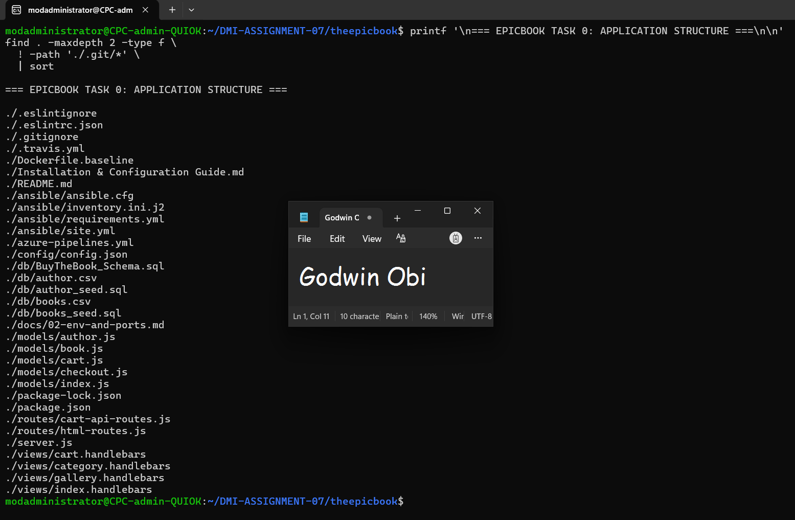

---

#### Screenshot 2 — Architecture Diagram

Add a screenshot of your architecture diagram showing:

- Public user
- Reverse proxy
- Frontend
- Backend
- Database
- Docker networks
- Public and private ports
- Persistent database storage

Add your full name inside the diagram or as a clear caption below it.

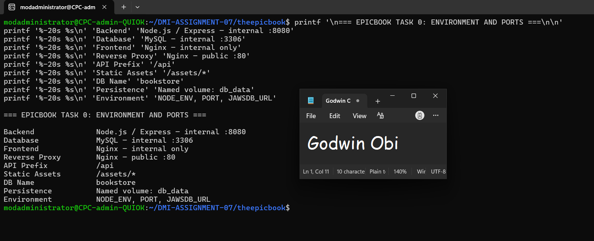

---

#### Screenshot 3 — Environment Variables and Ports Document

Add a screenshot showing the contents of:

```text
docs/02-env-and-ports.md
```

It must document environment-variable names, internal ports, persistent-data details, and the health-check method. Do not expose real credentials or values.

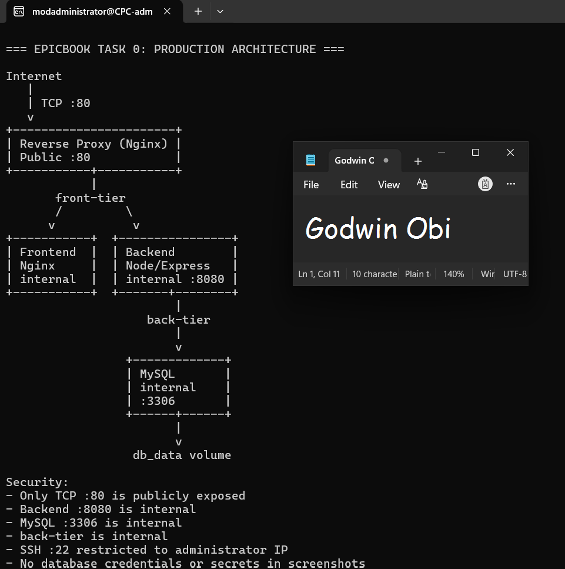

---

# Task 1 — Create Production Docker Images

## Goal

Create optimized production images for the EpicBook backend and frontend.

### Evidence

#### Screenshot 4 — Backend Dockerfile

Add a screenshot showing `backend/Dockerfile`, including:

- Dependency stage
- Minimal runtime stage
- Production startup command
- Internal backend port
- Non-root user configuration

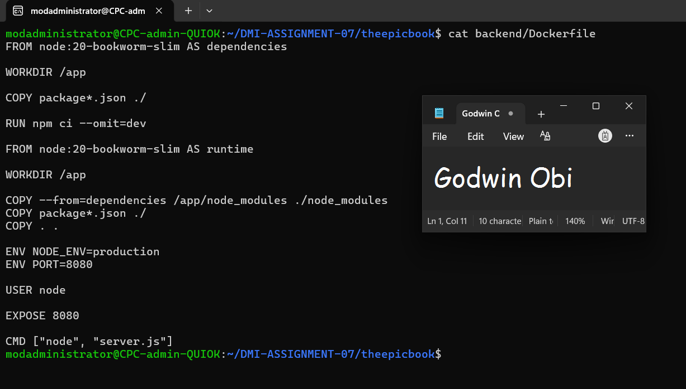

---

#### Screenshot 5 — Frontend Dockerfile

Add a screenshot showing `frontend/Dockerfile`, including:

- Nginx runtime image
- Static frontend files copied to the Nginx web root

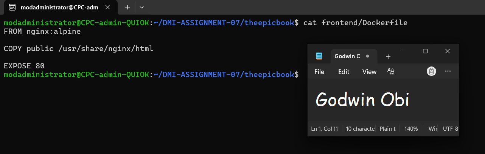

---

#### Screenshot 6 — Docker Ignore Files

Add a screenshot showing both:

```text
backend/.dockerignore
frontend/.dockerignore
```

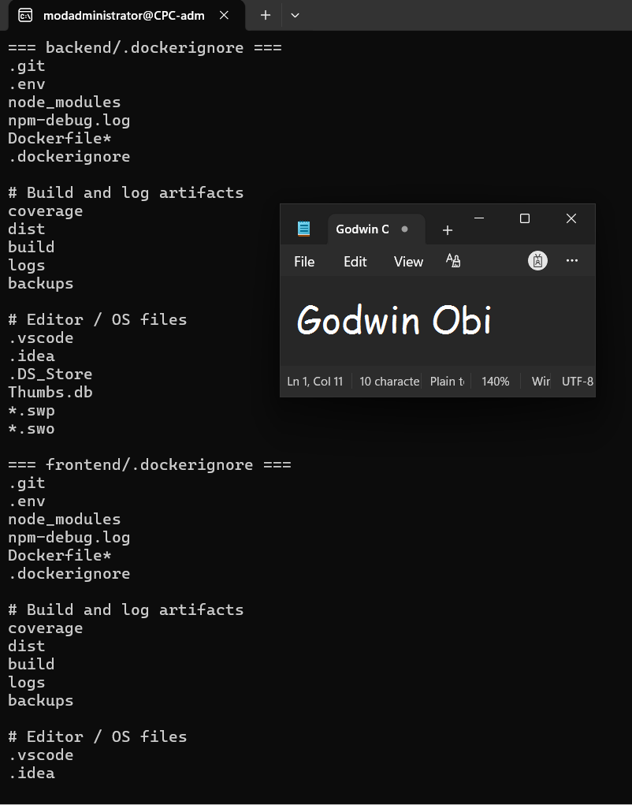

---

#### Screenshot 7 — Docker Image Builds and Size Comparison

Add a terminal screenshot showing successful builds of:

- Baseline backend image
- Optimized backend image
- Frontend image

The screenshot must also show the baseline and optimized backend image-size comparison.

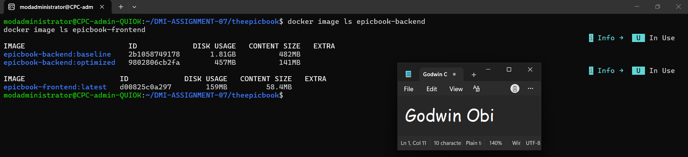

---

#### Screenshot 8 — Backend Running as Non-Root User

Add a terminal screenshot showing the optimized backend container running as a non-root user.

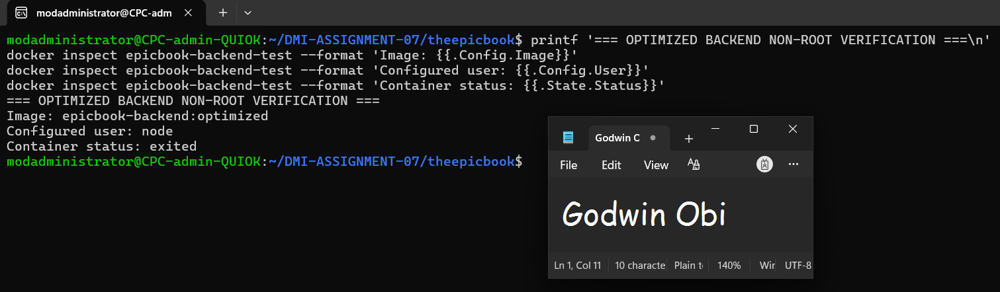

---

### Notes

Write a short note covering:

- Baseline and optimized backend image sizes
- The image-size reduction achieved
- One Docker layer-caching optimization used
- The security benefit of running the backend as a non-root user

The baseline backend image had a content size of 482 MB. The optimized multi-stage backend image was reduced to 141 MB, achieving a reduction of 341 MB (approximately 70.75%).

The Dockerfile uses layer caching by copying `package*.json` and installing dependencies before copying the application source. This allows the dependency layer to be reused when application source files change but the package manifests remain unchanged.

The optimized image uses a separate dependency stage with production-only dependencies (`npm ci --omit=dev`) and a minimal `node:20-bookworm-slim` runtime stage. The backend is configured to run as the non-root `node` user, reducing the potential impact of a container compromise because the application process does not run with root privileges.


---

# Task 2 — Create the Docker Compose Stack and Networks

## Goal

Create one Docker Compose stack containing the reverse proxy, frontend, backend, and MySQL database.

### Evidence

#### Screenshot 9 — Docker Compose Services

Add a screenshot showing `docker-compose.yml` with all four services:

```text
reverse-proxy
frontend
backend
database
```

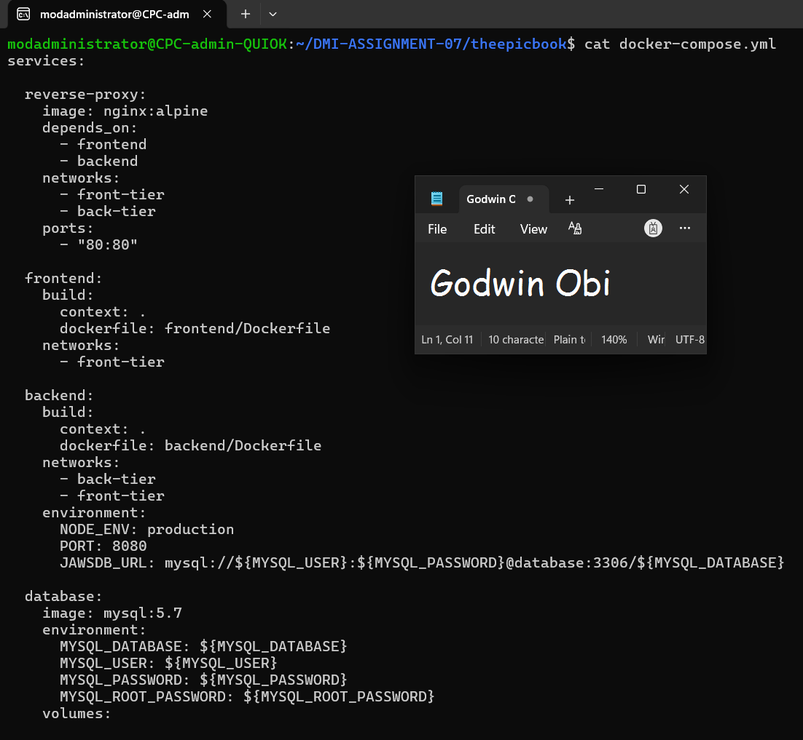

---

#### Screenshot 10 — Networks and Named Volume

Add a screenshot showing:

- `front-tier` network
- `back-tier` network
- `db_data` named volume

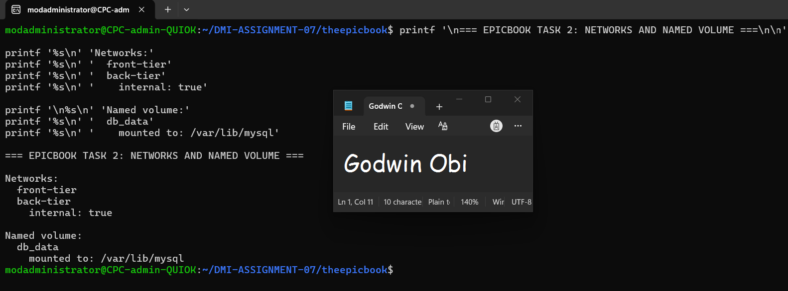

---

#### Screenshot 11 — Docker Compose Validation

Add a terminal screenshot showing successful Docker Compose validation without exposing environment-variable values or secrets.

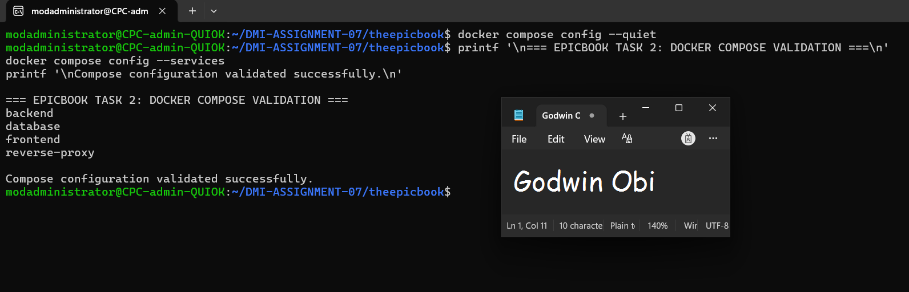

---

# Task 3 — Configure Health Checks and Startup Dependencies

## Goal

Configure health checks and ensure services start only after their dependencies are healthy.

### Evidence

#### Screenshot 12 — Backend Health Endpoint

Add a screenshot showing the backend application configuration for the `/health` endpoint.

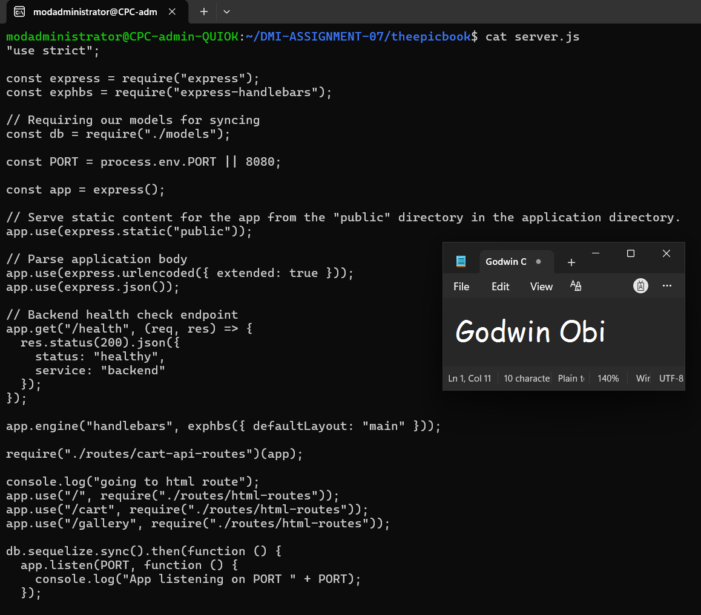

---

#### Screenshot 13 — MySQL and Backend Health Checks

Add a screenshot showing `docker-compose.yml` with health checks for MySQL and the backend.

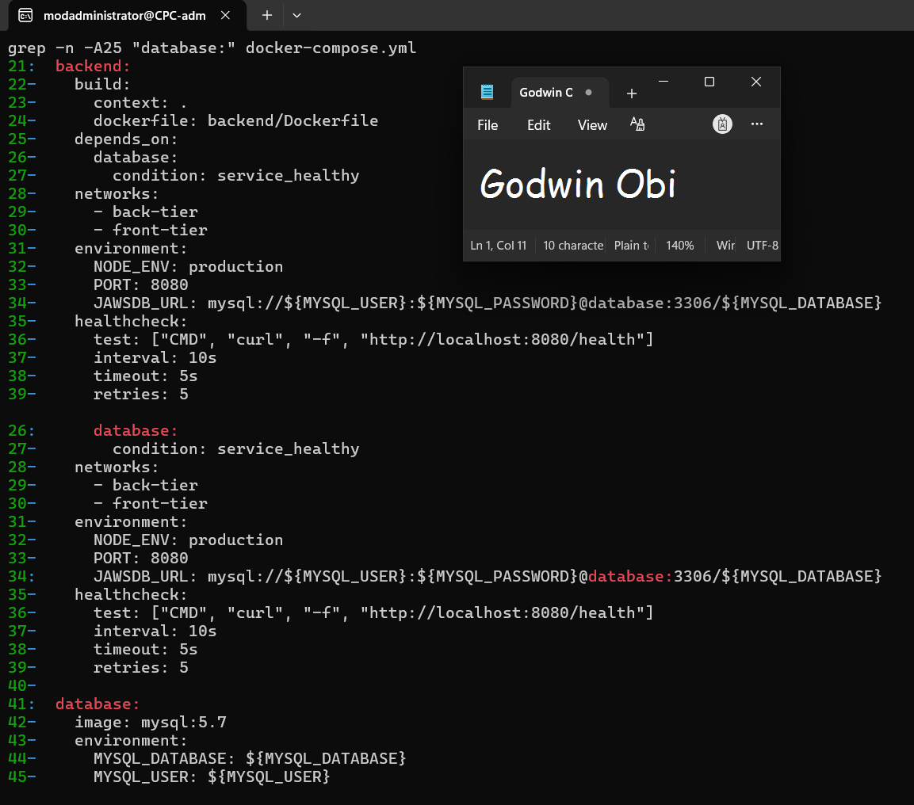

---

#### Screenshot 14 — Frontend and Reverse-Proxy Health Checks

Add a screenshot showing:

- Frontend health check
- Reverse-proxy health check
- `depends_on` conditions using `service_healthy`

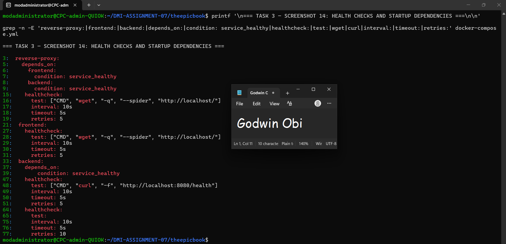

---

#### Screenshot 15 — Running Healthy Services

Add a terminal screenshot showing Docker Compose service status. The database, backend, frontend, and reverse proxy must be running successfully.


---

#### Screenshot 16 — Public Health Endpoint

Add a terminal screenshot showing a successful response from the public application health endpoint through the reverse proxy.

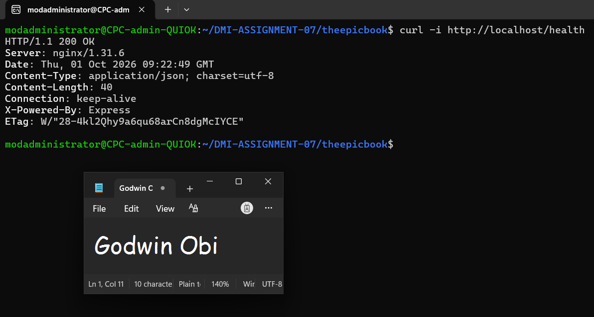

---

#### Screenshot 17 — Health-Check and Startup-Order Document

Add a screenshot showing the contents of:

```text
docs/03-healthchecks-and-depends-on.md
```

Explain the health-check method for each service and the startup dependency order.

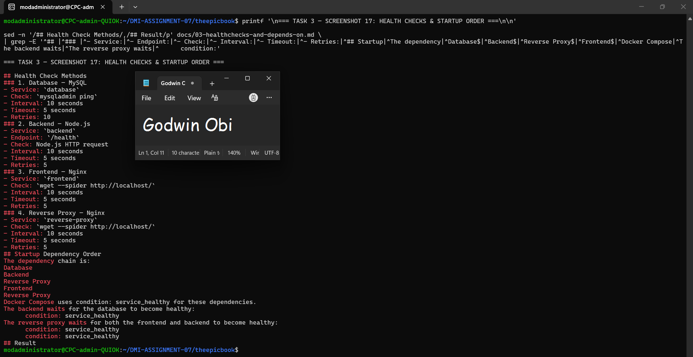

---

# Task 4 — Configure the Reverse Proxy and Same-Origin Routing

## Goal

Use either Nginx or Traefik as the only public entry point for the EpicBook application.

### Evidence

#### Screenshot 18 — Selected Reverse-Proxy Configuration

Add a screenshot showing the configuration for your selected reverse proxy.

It must show routes for:

- Static frontend assets
- Application pages
- API requests
- Health endpoint

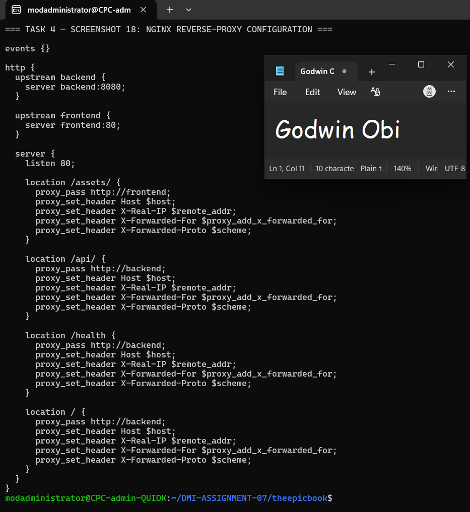

---

#### Screenshot 19 — Only Reverse Proxy Publishes Port 80

Add a screenshot of `docker-compose.yml` showing that only the `reverse-proxy` service publishes port 80.

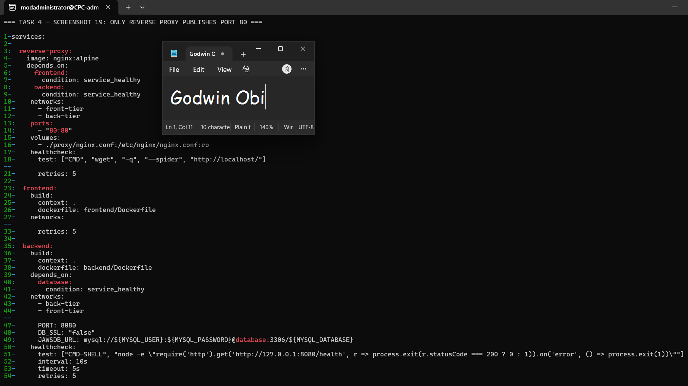

---

#### Screenshot 20 — Reverse-Proxy Route Testing

Add a terminal screenshot showing successful requests through the selected reverse proxy to:

- Application page
- One API endpoint
- One static asset
- Health endpoint

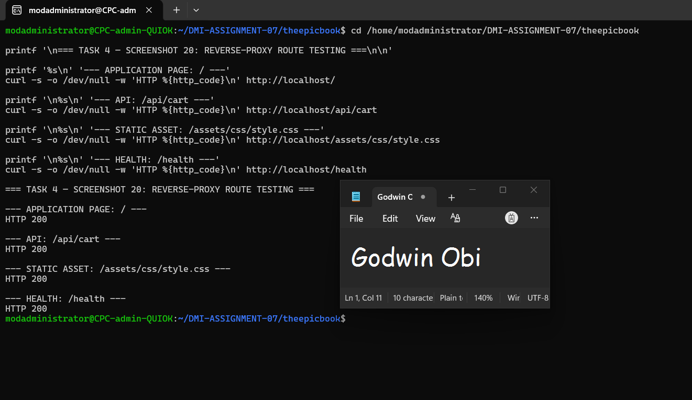

---

#### Screenshot 21 — EpicBook Application Through Public IP

Add a browser screenshot showing the EpicBook application loaded through the VM public IP address.

Add your full name as a clear caption below the screenshot.

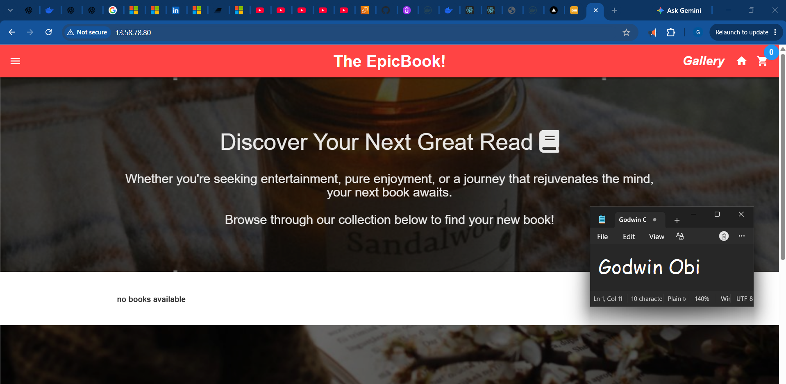

---

#### Screenshot 22 — Proxy Routing and CORS Document

Add a screenshot showing the contents of:

```text
docs/04-proxy-routing-and-cors.md
```

Explain the proxy routes and state whether CORS was required and why.

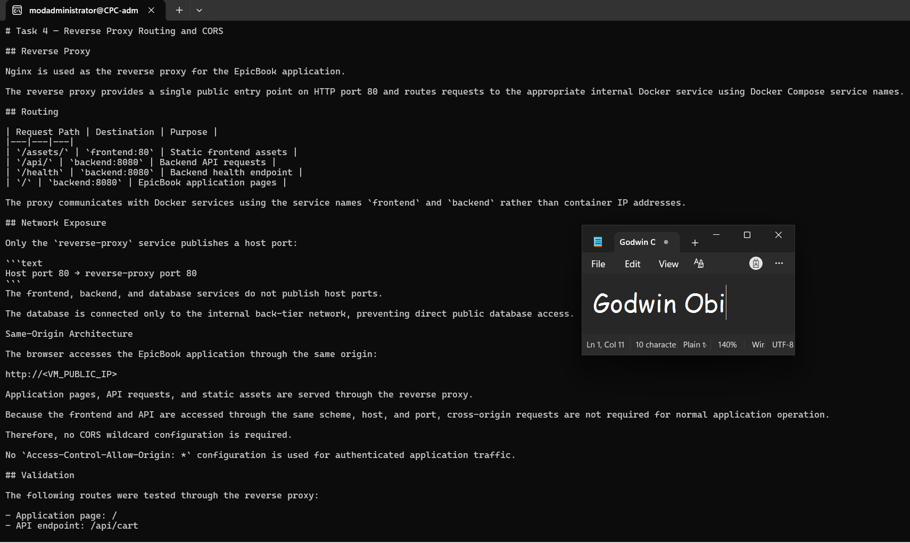

---

# Task 5 — Prove Data Persistence, Backup, and Restore

## Goal

Verify MySQL persistence and perform a controlled backup and restore drill.

### Evidence

#### Screenshot 23 — MySQL Volume Configuration

Add a terminal screenshot showing the `db_data` named volume and its MySQL mount configuration.

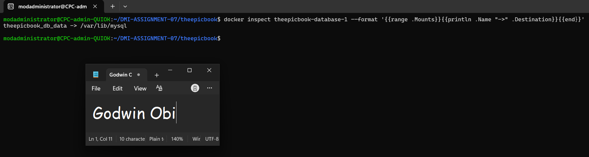

---

#### Screenshot 24 — Test Data Before Backup

Add a terminal screenshot showing the selected test data before the backup and restore drill.

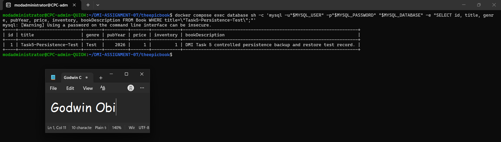

---

#### Screenshot 25 — Successful Backup Creation

Add a terminal screenshot showing successful backup creation and the backup file stored in the host backup directory.

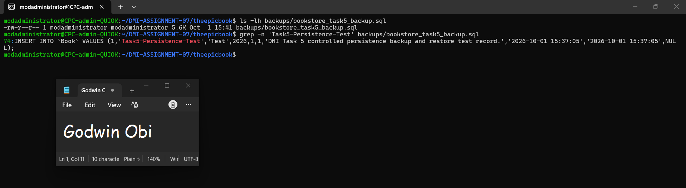

---

#### Screenshot 26 — Controlled Data-Loss Test

Add a terminal screenshot showing that the selected test record was removed during the controlled data-loss test.

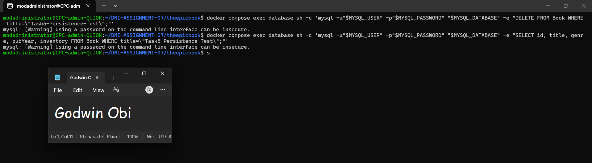

---

#### Screenshot 27 — Restore Verification

Add a terminal screenshot showing successful restore and verification that the deleted test record is available again.

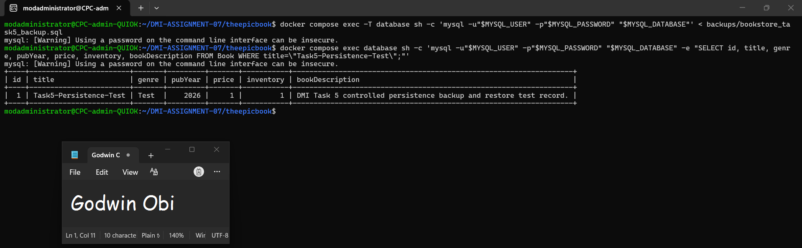

---

#### Screenshot 28 — Persistence After Down/Up Cycle

Add a terminal screenshot showing that database data remains available after a non-destructive Docker Compose down/up cycle.

Do not use `docker compose down -v`.

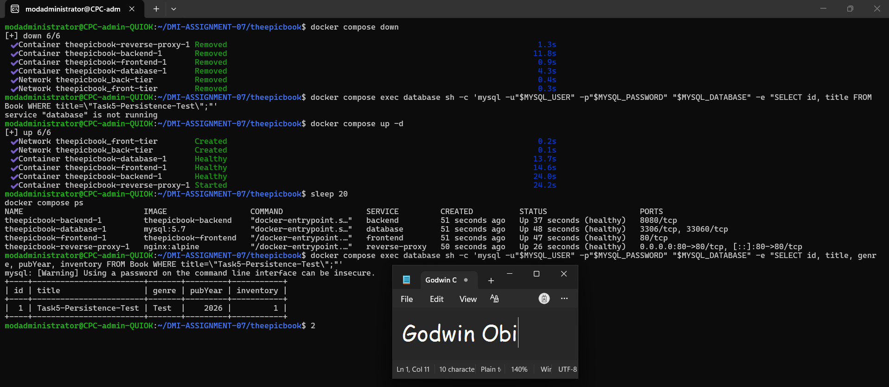

---

#### Screenshot 29 — Persistence and Backup Document

Add a screenshot showing the contents of:

```text
docs/05-persistence-and-backup.md
```

Include the backup plan and restore procedure.

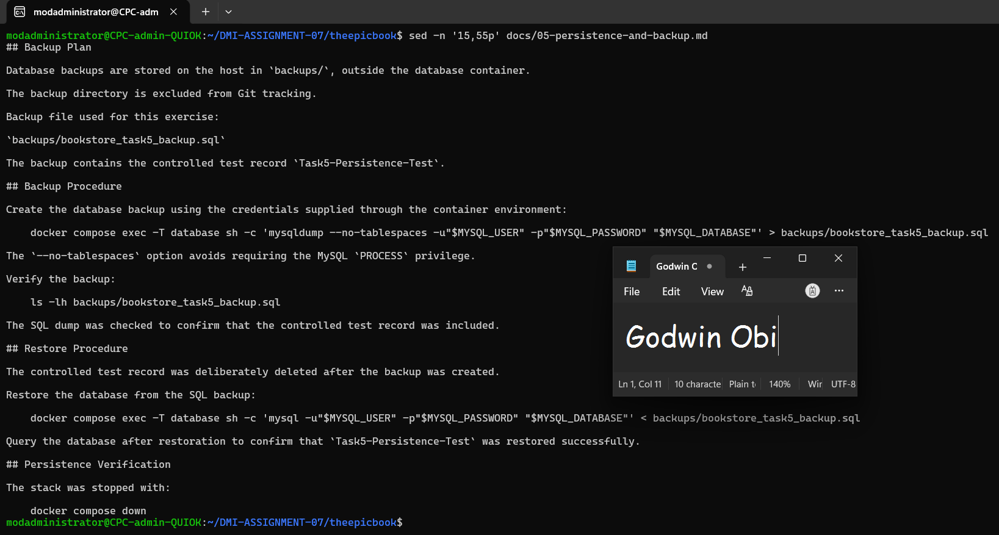

---

# Task 6 — Configure Logging and Observability

## Goal

Configure useful reverse-proxy and backend logs without exposing sensitive information.

### Evidence

#### Screenshot 30 — Logging Configuration

Add a screenshot showing:

- Configuration for the selected reverse proxy
- Proxy log format
- Docker Compose host log-directory bind mount

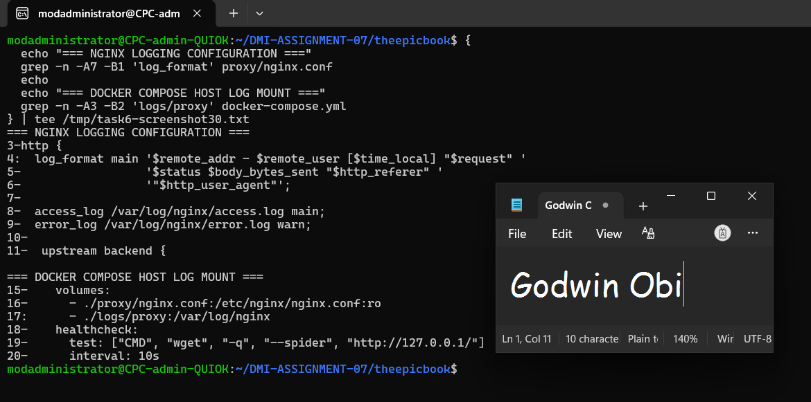

---

#### Screenshot 31 — Persistent Proxy Logs and Backend Logs

Add a terminal screenshot showing:

- Selected reverse-proxy logs available from the host directory after a proxy restart
- Backend logs displayed through Docker Compose

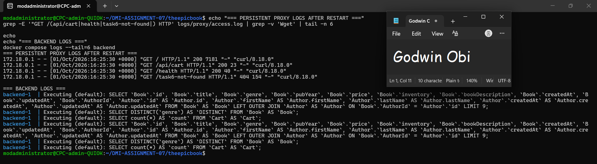

---

### Notes

Write a short note covering:

- The selected reverse proxy
- Host path used for reverse-proxy logs
- How backend logs are viewed
- Whether JSON or standard text logs were used
- Why passwords, tokens, headers, and database connection strings must not appear in logs

**Selected reverse proxy:** Nginx was selected as the reverse proxy for the EpicBook stack.

**Reverse-proxy log path:** Nginx logs are persisted to the host at `logs/proxy/` through a Docker Compose bind mount.

**Backend logs:** Backend logs are viewed using Docker Compose, for example `docker compose logs --tail=6 backend`.

**Log format:** Standard text logs were used for both Nginx access/error logging and backend container output because they are simple to inspect and suitable for this deployment.

**Security:** Passwords, tokens, authentication headers, and database connection strings must not appear in logs because logs may be stored, shared, or accessed by administrators. Exposing these values could disclose credentials or other sensitive information and create an unnecessary security risk.

---

# Task 7 — Deploy and Verify the Stack on a Cloud VM

## Goal

Deploy the completed Docker Compose stack on an AWS or Azure VM and verify public access.

### Evidence

#### Screenshot 32 — VM Public IP and Inbound Rules

Add a cloud-console screenshot showing:

- VM public IP address
- SSH port 22 restricted to your IP address
- HTTP port 80 allowed from Anywhere

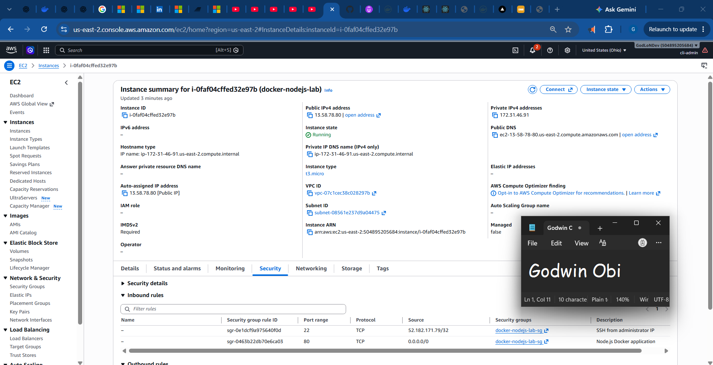

---

#### Screenshot 33 — Cloud VM Stack Verification

Add a VM terminal screenshot showing:

- Docker Compose service status
- Successful public health or API response
- No published database, frontend, or backend ports

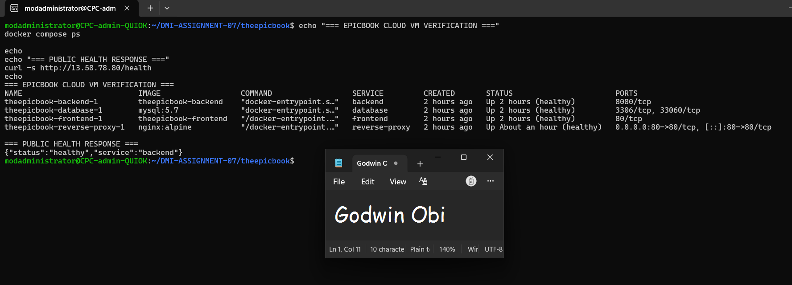

---

#### Screenshot 34 — EpicBook Application on Cloud VM

Add a browser screenshot showing the EpicBook application loaded through the VM public IP address.

Add your full name as a clear caption below the screenshot.

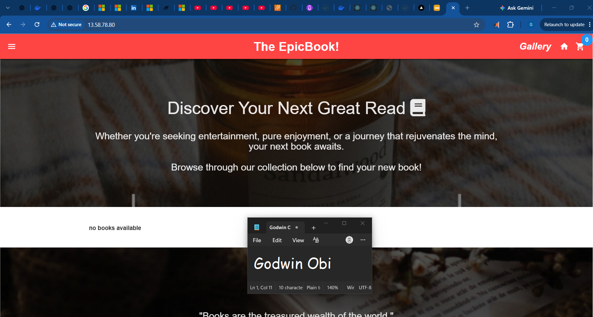

---

### Notes

Write a short note covering:

- Cloud provider used
- VM operating system
- Public port exposed
- Security rules configured
- Confirmation that the application and backend API worked through the reverse proxy

**Cloud provider:** AWS EC2, us-east-2 (Ohio)

**VM OS:** Ubuntu 24.04.5 LTS

**VM public IP:** `13.58.78.80`

**Public port:** HTTP TCP/80 through the Nginx reverse proxy only.

**Security rules:** SSH TCP/22 is restricted to the administrator IP. HTTP TCP/80 is allowed from the internet. Database and backend ports are not exposed through the security group or Docker host port mappings.

**Deployment:** The EpicBook production stack was deployed with Docker Compose. The database, backend, frontend, and reverse-proxy services are healthy.

**Application verification:** The EpicBook application and backend `/health` endpoint were successfully accessed through the VM public IP and reverse proxy.


---

# Task 8 — Automate Deployment with CI/CD (Optional)

## Goal

Optionally automate image build, image push, and deployment through GitHub Actions or Azure Pipelines.

### Optional Evidence

#### Optional Screenshot — Successful CI/CD Pipeline Run

Add a screenshot showing a successful pipeline run with build, image push, deployment, and verification stages.

The EpicBook deployment was successfully completed and verified. The production stack was healthy, the application was accessible through the Nginx reverse proxy, and the deployment was validated after the infrastructure and containers were started.

---

### Optional Notes

Write a short note covering:

- CI/CD platform used
- Image-tagging method
- Registry used
- Deployment trigger
- Manual approval or secret-handling approach

The EpicBook deployment was triggered through Docker Compose after the production stack configuration was prepared. The deployment used the application images, Docker networks, persistent database storage, health checks, and Nginx reverse proxy configuration defined for the stack.

No manual approval gate was required for this assignment. Sensitive configuration was handled through the deployment environment rather than being committed to the repository. The completed deployment was verified by checking container health and confirming that the EpicBook application was accessible through the Nginx reverse proxy.

---

# Task 9 — Perform Reliability Tests and Create an Operations Runbook

## Goal

Test controlled service failures and document safe operating procedures.

### Evidence

#### Screenshot 35 — Backend Failure and Recovery

Add a terminal screenshot showing:

- Backend failure test
- Expected unavailable response through the reverse proxy
- Backend restart
- Successful health-check recovery

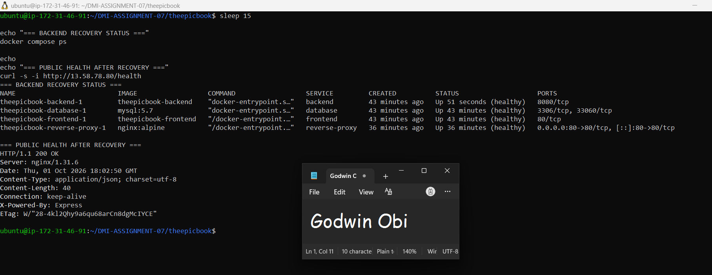

---

#### Screenshot 36 — Database Failure and Recovery

Add a terminal screenshot showing:

- Database outage test
- Failed database-dependent request
- Database restart
- Successful application recovery

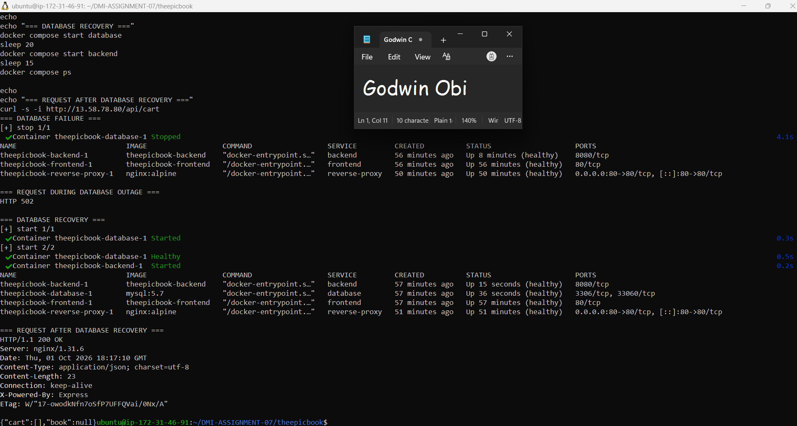

---

### Notes

Write a short operations runbook covering:

- Safe restart procedure for reverse proxy, frontend, backend, and database
- Backup and restore procedure
- Secret-rotation approach
- Database recovery procedure
- What to check when the application returns an error
- Results of backend and database reliability tests

## Operations Runbook

### 1. Safe Restart Procedure

Check service status first:

```
docker compose ps
```

Restart individual services only when required:

```
docker compose restart reverse-proxy
docker compose restart frontend
docker compose restart backend
docker compose restart database
```

After restarting the database, wait for it to become healthy before restarting the backend:

```
docker compose ps
```

For a full stack restart, use:

```
docker compose down
docker compose up -d
```

Do not use `docker compose down -v` during normal operations because it removes the database volume and can cause data loss.

### 2. Backup and Restore Procedure

Create a database backup to the host `backups/` directory:

```
docker compose exec -T database sh -c 'mysqldump --no-tablespaces -u"$MYSQL_USER" -p"$MYSQL_PASSWORD" "$MYSQL_DATABASE"' > backups/bookstore_task5_backup.sql
```

Restore the database when required:

```
docker compose exec -T database sh -c 'mysql -u"$MYSQL_USER" -p"$MYSQL_PASSWORD" "$MYSQL_DATABASE"' < backups/bookstore_task5_backup.sql
```

Verify the application and database after restoration.

### 3. Secret-Rotation Approach

Before rotating database credentials, create and verify a current database backup.

Generate a new strong database password, update the MySQL user password in the database, then update the corresponding value in the VM `.env` file. Restart or recreate the affected application services and verify database connectivity.

The `.env` file must remain local, have restricted permissions, and must never be committed to Git or displayed in screenshots.

### 4. Database Recovery Procedure

Check the database status:

```
docker compose ps database
```

Review database logs if necessary:

```
docker compose logs --tail=100 database
```

Start the database and wait for its health check:

```
docker compose start database
docker compose ps
```

After the database is healthy, start or restart the backend:

```
docker compose start backend
```

Verify:

```
curl -i http://13.58.78.80/health
curl -i http://13.58.78.80/api/cart
```

If data has been lost or corrupted, restore from the most recent verified backup.

### 5. Application Error Troubleshooting

When the application returns an error:

1. Check all service states with `docker compose ps`.
2. Check reverse-proxy, backend, database, and frontend logs.
3. Test the public `/health` endpoint.
4. Test a database-dependent API such as `/api/cart`.
5. Confirm only the reverse proxy exposes port 80.
6. Check the AWS security-group rules if the application is unreachable externally.
7. Check VM resources such as disk space and memory if services repeatedly fail.
8. Do not expose or place passwords, tokens, connection strings, or other secrets in logs or troubleshooting screenshots.

### 6. Reliability Test Results

**Backend failure test:** The backend container was stopped intentionally. The public `/health` endpoint became unavailable through the reverse proxy. After the backend was restarted and became healthy, `/health` returned HTTP 200 with the expected healthy response.

**Database failure test:** The database container was stopped intentionally. A database-dependent `/api/cart` request returned HTTP 502. The database was restarted and became healthy, followed by backend recovery. The application then returned HTTP 200 for `/api/cart`, confirming successful recovery.

---

# Final Public Application URL

**EpicBook URL:** `http://13.58.78.80`

Replace the placeholder with your working public URL.

---

# GitHub Repository URL

**Your Fork or Repository URL:** `https://github.com/GodLoN/theepicbook`

---

# LinkedIn Requirement

## Goal

Create a professional LinkedIn post of 6–10 lines about your EpicBook capstone deployment.

Your post must include:

- The architectural decision that most improved reliability
- Your biggest image-size reduction, with numbers
- Key production-hardening lessons
- A deployment verification image

### Evidence

**LinkedIn Post URL:** `https://www.linkedin.com/posts/godwin-obi-008a12177_devops-aws-docker-share-7511666341138001922-FyNd/?utm_source=share&utm_medium=member_desktop&rcm=ACoAACn5hogBVyHnSR92cyBf5EzFBZEMSepEVPM`

#### LinkedIn Post Screenshot

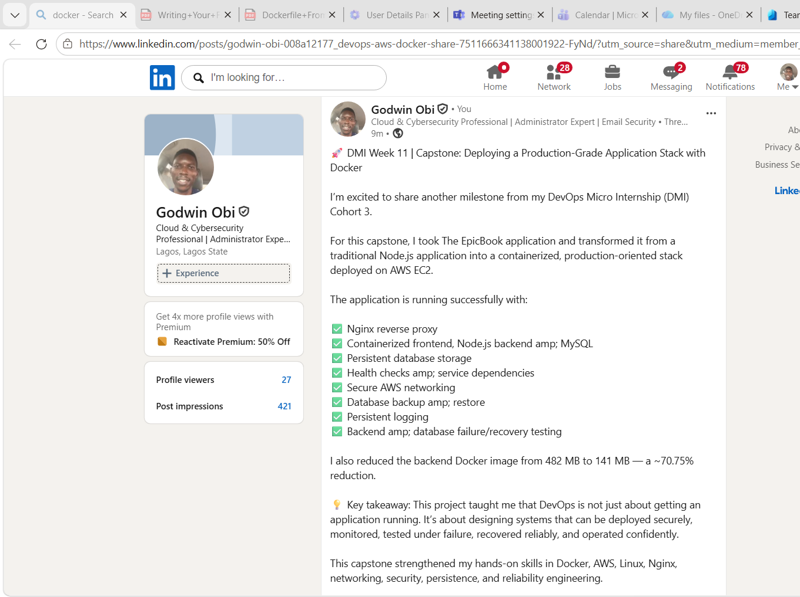

---

# Submission Checklist

- [ ] EpicBook repository reviewed and architecture diagram created
- [ ] Environment variables, ports, persistence, and health-check details documented
- [ ] Backend and frontend production Dockerfiles created
- [ ] Backend runs as a non-root user
- [ ] Docker image-size comparison completed
- [ ] Docker Compose stack includes reverse proxy, frontend, backend, and database
- [ ] `front-tier` and `back-tier` networks configured
- [ ] `db_data` named volume configured
- [ ] MySQL, backend, frontend, and reverse-proxy health checks configured
- [ ] Startup dependencies use `service_healthy`
- [ ] Nginx or Traefik selected as the only public reverse proxy
- [ ] Only reverse-proxy port 80 is publicly published
- [ ] Same-origin routing configured and CORS used only when required
- [ ] Backup, restore, and persistence testing completed
- [ ] Reverse-proxy and backend logs verified
- [ ] Cloud VM deployment verified through the public IP
- [ ] Backend and database reliability tests completed
- [ ] Screenshots 1–36 included
- [ ] Required notes completed
- [ ] LinkedIn post URL and screenshot included
- [ ] Full name visible in required screenshots or captions
- [ ] No passwords, tokens, private keys, account IDs, or other sensitive information exposed

---

## 📌 About DMI & CloudAdvisory

DevOps Micro Internship (DMI) is a project-based DevOps program run by Pravin Mishra (The CloudAdvisory) focused on real-world execution, systems thinking, and career readiness.

It helps learners build strong DevOps foundations with hands-on experience.

---

## 📌 Resources

- 🌐 DMI Official Website: https://dmi.pravinmishra.com?utm_source=github&utm_medium=readme  
- 🎓 University: https://university.pravinmishra.com?utm_source=github&utm_medium=readme  
- 💬 Discord Community: https://discord.pravinmishra.com?utm_source=github&utm_medium=readme  
- 📝 Blog: https://dmi.pravinmishra.com/blog?utm_source=github&utm_medium=readme  
- ▶️ YouTube Playlist: https://www.youtube.com/playlist?list=PLFeSNDtI4Cho  
- 🔗 Pravin Mishra (LinkedIn): https://www.linkedin.com/in/pravin-mishra-aws-trainer/  
- 🏢 CloudAdvisory (LinkedIn): https://www.linkedin.com/company/thecloudadvisory/

---

*This submission is part of DevOps Micro Internship (DMI) — Agentic AI Track.*
